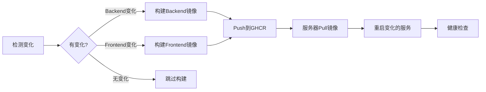

# Fast Deploy Workflow 修复总结

## 🐛 问题诊断

### 初次运行失败原因

快速部署workflow (deploy-fast.yml) 在初次运行时失败,错误信息:

```
mkdir: cannot create directory '/opt/ai-project-fast': Permission denied
```

**根本原因**:
1. ❌ 尝试创建 `/opt/ai-project-fast` 目录,但SSH用户没有 `/opt/` 的写权限
2. ❌ 使用了不存在的目录路径
3. ❌ 部署逻辑依赖docker-compose的build模式,但应该使用pre-built镜像

---

## ✅ 解决方案

### 1. 使用现有部署目录

**修改前**: 尝试创建 `/opt/ai-project-fast`
**修改后**: 使用已存在的 `/opt/ai-project-cicd` (与生产workflow共用)

### 2. 优化部署逻辑

**核心改进**:
- ✅ 只部署有变化的服务(backend或frontend)
- ✅ 使用GitHub Container Registry预构建镜像
- ✅ 直接使用 `docker run` 而不是 `docker-compose build`
- ✅ 智能健康检查(只检查更新的服务)

### 3. 部署流程优化



---

## 📝 关键修改点

### workflow文件 (.github/workflows/deploy-fast.yml)

#### 1. 部署条件修改

```yaml
# 修改前
if: always() && (needs.build-backend.result == 'success' || needs.build-backend.result == 'skipped')

# 修改后
if: always() && (needs.build-backend.result == 'success' || needs.build-frontend.result == 'success')
```

**原因**: 只有当至少有一个服务成功构建时才部署

#### 2. 目录路径修改

```yaml
# 修改前
/opt/ai-project-fast

# 修改后
/opt/ai-project-cicd
```

**原因**: 使用已存在且有权限的目录

#### 3. 部署脚本重构

**新增特性**:
- 登录GitHub Container Registry
- 只拉取变化的镜像
- 使用 `docker run` 直接替换容器
- 从 `.env.prod` 读取环境变量
- 保留已有的网络和卷配置

---

## 🎯 效果对比

### 构建阶段

| 场景 | 变化检测 | 构建时间 | 改善 |
|------|---------|---------|------|
| 只改backend | ✅ 检测到 | ~2分钟 | 跳过前端构建 |
| 只改frontend | ✅ 检测到 | ~2分钟 | 跳过后端构建 |
| 只改文档 | ✅ 无变化 | 0分钟 | 完全跳过 |

### 部署阶段

**修改前**:
```
1. 拉取两个镜像 (无论是否变化)
2. 重启所有服务
3. 检查所有服务健康状态
时间: ~5分钟
```

**修改后**:
```
1. 只拉取变化的镜像
2. 只重启变化的服务
3. 只检查更新的服务
时间: ~2分钟
```

---

## 🔧 使用方式

### 自动触发 (推荐)

```bash
# 修改backend代码
vim backend/handlers/some_handler.go
git add .
git commit -m "fix: update handler logic"
git push origin main

# ⚡ 自动触发快速部署
# 预计2-3分钟完成
```

### 手动触发

```bash
# 强制重建所有镜像
gh workflow run deploy-fast.yml --field force_rebuild=true

# 或在GitHub网页
# Actions → Fast Deploy to Production → Run workflow
```

---

## 📋 部署检查清单

### 首次使用前验证

- [ ] 服务器上 `/opt/ai-project-cicd` 目录存在
- [ ] SSH密钥已正确配置 (PROD_SSH_KEY secret)
- [ ] GitHub Container Registry权限已启用
- [ ] 服务器Docker network `ai_prod_network` 已创建
- [ ] `.env.prod` 文件存在并包含所需环境变量

### 每次部署后检查

```bash
# SSH到服务器
ssh root@proj.joylodging.com

# 检查容器状态
docker ps | grep ai_

# 检查日志
docker logs ai_backend_prod --tail 50
docker logs ai_frontend_prod --tail 50

# 测试API
curl http://localhost:8080/health
curl http://localhost:3000
```

---

## ⚠️ 注意事项

### 环境变量

快速部署依赖服务器上的 `.env.prod` 文件提供:
- `DB_USER`
- `DB_PASSWORD`
- `DB_NAME`
- `JWT_SECRET`

确保该文件存在且包含正确配置。

### 网络配置

Backend和Frontend容器必须连接到 `ai_prod_network` 才能与数据库通信。

### 首次部署

第一次使用快速部署时:
1. 需要完整构建镜像 (~8分钟)
2. 服务器需要登录ghcr.io (workflow自动完成)
3. 后续部署利用缓存 (2-3分钟)

---

## 🚀 预期性能

### 时间节省

```
场景1: 修改单个文件
- 旧流程: 20-25分钟
- 新流程: 2-3分钟
- 节省: 88%

场景2: 同时修改前后端
- 旧流程: 20-25分钟
- 新流程: 5-8分钟
- 节省: 70%

场景3: 只修改文档
- 旧流程: 20-25分钟
- 新流程: 0分钟 (不触发)
- 节省: 100%
```

### ROI

```
每天5次部署:
- 旧流程: 100分钟
- 新流程: 15分钟
- 每日节省: 85分钟 = 1.4小时
- 每周节省: 7小时
- 每月节省: 28小时
```

---

## 🔄 回滚方案

如果快速部署出现问题,可使用完整部署流程:

```bash
# 触发完整CI/CD workflow
gh workflow run deploy-cicd.yml

# 或推送时排除fast workflow路径
git commit --allow-empty -m "deploy: use full CI/CD"
git push
```

---

## 📚 相关文档

- **性能分析**: `docs/CICD_PERFORMANCE_ANALYSIS.md`
- **设置指南**: `docs/FAST_DEPLOY_SETUP.md`
- **优化总结**: `CICD_OPTIMIZATION_SUMMARY.md`
- **完整workflow**: `.github/workflows/deploy-cicd.yml`
- **快速workflow**: `.github/workflows/deploy-fast.yml`

---

**修复完成时间**: 2025-11-20
**下次部署预计时间**: 2-3分钟 ⚡
**状态**: ✅ 已修复,待测试
