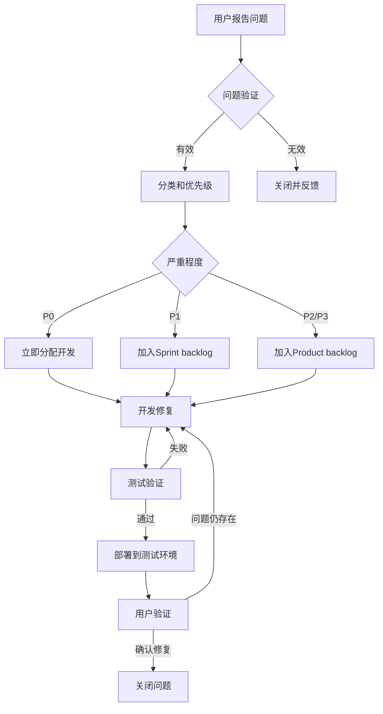

# Android App AI功能用户测试计划

## 概述

本文档定义了Android App AI功能的Beta测试计划，包括测试目标、测试场景、反馈收集方法和问题跟踪流程。

## 测试目标

1. **功能验证**: 确保所有AI功能按预期工作
2. **用户体验**: 收集用户对界面和交互的反馈
3. **性能评估**: 了解实际使用场景下的性能表现
4. **问题发现**: 尽早发现bug和可用性问题
5. **改进建议**: 收集功能改进和新功能需求

## 测试人员招募

### 目标用户群体

#### 核心用户组 (10人)
- **特征**: 项目管理经验3年以上
- **背景**: 熟悉敏捷开发流程
- **设备**: 各种Android设备 (低中高端混合)
- **任务**: 深度测试所有功能

#### 普通用户组 (20人)
- **特征**: 项目管理经验1-3年
- **背景**: 使用过类似工具
- **设备**: 主流Android设备
- **任务**: 日常使用场景测试

#### 新手用户组 (10人)
- **特征**: 首次使用项目管理工具
- **背景**: 无相关经验
- **设备**: 随机
- **任务**: 易用性和学习曲线测试

### 招募渠道
- 内部员工志愿者
- 产品社区论坛
- 社交媒体广告
- 用户推荐计划

## 测试阶段

### 第一阶段: Alpha测试 (1周)
- **参与者**: 5名内部测试人员
- **目标**: 发现基础功能bug
- **重点**: 核心流程可用性

### 第二阶段: 封闭Beta (2周)
- **参与者**: 20名核心用户
- **目标**: 功能完整性测试
- **重点**: 深度使用场景

### 第三阶段: 公开Beta (4周)
- **参与者**: 所有招募用户 (40人)
- **目标**: 大规模真实场景测试
- **重点**: 性能和稳定性

## 测试场景

### 场景1: AI描述生成

#### 测试任务
1. 创建一个新任务
2. 使用AI生成任务描述
3. 尝试不同的长度设置 (短/中/长)
4. 尝试不同的风格 (技术/业务/简洁)
5. 自定义提示词生成
6. 重新生成描述
7. 编辑生成的描述
8. 应用到任务

#### 评估指标
- 生成质量满意度 (1-5分)
- 生成速度满意度 (1-5分)
- 界面易用性 (1-5分)
- 是否会实际使用 (是/否)

#### 反馈问题
- 生成的描述是否准确反映任务需求?
- 三种长度选项是否合理?
- 风格选项是否满足需求?
- 是否需要更多自定义选项?
- 有哪些不满意的地方?

### 场景2: AI子任务生成

#### 测试任务
1. 选择一个复杂任务
2. 使用AI生成子任务
3. 设置子任务数量 (3/5/10)
4. 开启/关闭时间预估
5. 输入自定义提示词
6. 预览生成的子任务
7. 编辑子任务内容
8. 批量创建子任务
9. 删除不需要的子任务

#### 评估指标
- 子任务拆分合理性 (1-5分)
- 时间预估准确性 (1-5分)
- 批量操作效率 (1-5分)
- 整体满意度 (1-5分)

#### 反馈问题
- 子任务拆分是否符合实际工作流程?
- 时间预估是否有参考价值?
- 是否需要调整子任务顺序?
- 批量创建是否方便?
- 有哪些改进建议?

### 场景3: AI文档生成

#### 测试任务
1. 选择文档类型 (技术设计/API/需求)
2. 选择模板
3. 输入文档要求
4. 生成文档
5. 预览文档内容
6. 编辑文档
7. 保存文档
8. 导出文档 (Markdown/PDF/Word)
9. 分享文档链接

#### 评估指标
- 文档质量 (1-5分)
- 模板适用性 (1-5分)
- 编辑便利性 (1-5分)
- 导出功能 (1-5分)
- 整体满意度 (1-5分)

#### 反馈问题
- 生成的文档是否完整?
- 模板选择是否足够?
- 是否需要更多文档类型?
- 编辑功能是否满足需求?
- 导出格式是否齐全?

## 反馈收集方法

### 1. 应用内反馈

#### 快速反馈按钮
```kotlin
// 在每个AI功能完成后显示
FeedbackDialog(
    title = "对这个AI生成的描述满意吗？",
    options = listOf("非常满意", "满意", "一般", "不满意", "非常不满意"),
    onSubmit = { rating, comment ->
        submitFeedback(
            feature = "ai_description",
            rating = rating,
            comment = comment
        )
    }
)
```

#### 详细反馈表单
- 访问路径: 设置 -> 帮助与反馈 -> 提交反馈
- 包含内容:
  - 功能选择 (下拉菜单)
  - 问题类型 (bug/建议/体验)
  - 严重程度 (低/中/高)
  - 详细描述 (文本框)
  - 截图上传 (可选)
  - 日志上传 (可选)

### 2. 问卷调查

#### 每周问卷
- **时间**: 每周五发送
- **方式**: 邮件 + 应用内通知
- **题目数量**: 10题以内
- **用时**: < 5分钟

#### 问卷内容示例
1. 本周使用频率: □ 每天 □ 3-5次 □ 1-2次 □ 未使用
2. 最常用的AI功能: □ 描述生成 □ 子任务生成 □ 文档生成
3. 满意度评分 (1-5): ___
4. 遇到的主要问题: ___________
5. 最喜欢的功能: ___________
6. 最不满意的地方: ___________
7. 功能改进建议: ___________
8. 新功能需求: ___________
9. 是否愿意继续参与测试: □ 是 □ 否
10. 其他意见: ___________

### 3. 用户访谈

#### 深度访谈
- **对象**: 每周选择5名活跃用户
- **方式**: 视频通话/电话
- **时长**: 30-45分钟
- **记录**: 录音 + 文字记录

#### 访谈大纲
1. 使用背景和需求 (5分钟)
2. 功能使用体验 (15分钟)
3. 问题和困惑 (10分钟)
4. 改进建议 (10分钟)
5. 未来期望 (5分钟)

### 4. 使用数据分析

#### Firebase Analytics事件跟踪
```kotlin
// AI描述生成
firebaseAnalytics.logEvent("ai_description_generated") {
    param("length", length)
    param("style", style)
    param("duration_ms", duration)
    param("success", success)
}

// AI子任务生成
firebaseAnalytics.logEvent("ai_subtask_generated") {
    param("count", count)
    param("include_estimates", includeEstimates)
    param("duration_ms", duration)
    param("success", success)
}

// 用户满意度
firebaseAnalytics.logEvent("feature_rating") {
    param("feature", feature)
    param("rating", rating) // 1-5
}
```

#### 关键指标
- **日活跃用户 (DAU)**: 每天使用的用户数
- **周活跃用户 (WAU)**: 每周使用的用户数
- **功能使用率**: 各AI功能的使用次数
- **成功率**: AI生成成功的比例
- **留存率**: 7日留存、30日留存
- **满意度**: 用户评分平均值

## 问题跟踪流程

### Bug报告模板

```markdown
### Bug描述
[清晰描述问题]

### 复现步骤
1. [步骤1]
2. [步骤2]
3. [步骤3]

### 预期行为
[应该发生什么]

### 实际行为
[实际发生了什么]

### 环境信息
- 设备: [型号]
- Android版本: [版本]
- App版本: [版本]
- 网络: [WiFi/4G/3G]

### 截图/日志
[附加截图或日志]

### 严重程度
□ P0 - 阻断功能，需立即修复
□ P1 - 严重影响使用，需尽快修复
□ P2 - 影响体验，可规划修复
□ P3 - 轻微问题，可延后修复

### 影响范围
□ 所有用户
□ 特定设备
□ 特定网络环境
□ 特定操作场景
```

### 问题分类

#### P0 - 紧急问题
- 应用崩溃
- 数据丢失
- 安全漏洞
- 核心功能完全不可用

**处理时效**: 24小时内修复

#### P1 - 高优先级
- 主要功能异常
- 严重性能问题
- 影响大部分用户

**处理时效**: 3天内修复

#### P2 - 中优先级
- 次要功能bug
- UI显示问题
- 优化需求

**处理时效**: 1周内修复

#### P3 - 低优先级
- 文案错误
- 轻微UI问题
- 边缘场景bug

**处理时效**: 按版本规划

### 问题处理流程



## 测试奖励机制

### 参与奖励
- **完成测试**: 每周活跃测试者可获得积分
- **提交反馈**: 每个有效反馈 +10积分
- **发现Bug**: 根据严重程度 +20~100积分
- **深度访谈**: 参与一次 +50积分

### 积分兑换
- 100积分: 应用高级功能体验卡
- 200积分: 纪念品
- 500积分: 现金红包
- 1000积分: 产品终身免费使用

## 测试周报

### 每周发送给测试人员

```markdown
## Beta测试周报 - 第[X]周

### 本周亮点
- [新增功能/修复的主要问题]

### 测试数据
- 活跃测试人员: [X]人
- 提交反馈: [X]条
- 发现Bug: [X]个
- 已修复Bug: [X]个

### 本周修复
- [Bug1 - 描述]
- [Bug2 - 描述]
- [Bug3 - 描述]

### 下周计划
- [计划1]
- [计划2]

### 感谢名单
- [用户1] - 提交了[X]条有效反馈
- [用户2] - 发现了P0级bug
- [用户3] - 参与了深度访谈

### 需要重点测试
- [功能/场景1]
- [功能/场景2]
```

## 测试结束标准

### 发布就绪标准
1. **P0/P1 Bug清零**: 所有紧急和高优问题已修复
2. **功能完整性**: 所有规划功能已实现并测试通过
3. **性能达标**: 响应时间、内存使用符合标准
4. **稳定性**: 7天无严重崩溃
5. **用户满意度**: 平均评分 >= 4.0/5.0
6. **留存率**: 7日留存 >= 60%

### 测试总结报告

```markdown
## Beta测试总结报告

### 测试概况
- 测试周期: [开始日期] - [结束日期]
- 参与人数: [X]人
- 提交反馈: [X]条
- 发现Bug: [X]个
- 修复Bug: [X]个

### 用户反馈统计
- 非常满意: [X]%
- 满意: [X]%
- 一般: [X]%
- 不满意: [X]%
- 非常不满意: [X]%

### 主要问题及修复
1. [问题1] - 修复状态: [已修复/进行中/规划中]
2. [问题2] - 修复状态: [已修复/进行中/规划中]
...

### 功能使用数据
- AI描述生成: [X]次使用，成功率[X]%
- AI子任务生成: [X]次使用，成功率[X]%
- AI文档生成: [X]次使用，成功率[X]%

### 用户建议汇总
- 功能改进: [列表]
- 新功能需求: [列表]
- UI/UX优化: [列表]

### 遗留问题
- [问题1] - 优先级: [P2/P3]
- [问题2] - 优先级: [P2/P3]

### 下一步计划
1. [计划1]
2. [计划2]
3. [计划3]
```

## 持续改进

### 定期回顾
- **每周**: 测试数据分析，问题趋势识别
- **每两周**: 用户满意度调查
- **每月**: 功能使用情况review
- **Beta结束**: 全面总结和经验沉淀

### 长期跟踪
- 发布后继续收集用户反馈
- 监控关键指标变化
- 定期组织用户座谈会
- 建立用户社区

## 总结

通过系统的用户测试，我们可以:
1. 提前发现并修复问题
2. 了解真实用户需求
3. 验证功能设计是否合理
4. 优化用户体验
5. 建立用户信任和口碑

用户测试是产品成功的关键环节，需要认真对待每一条反馈。
