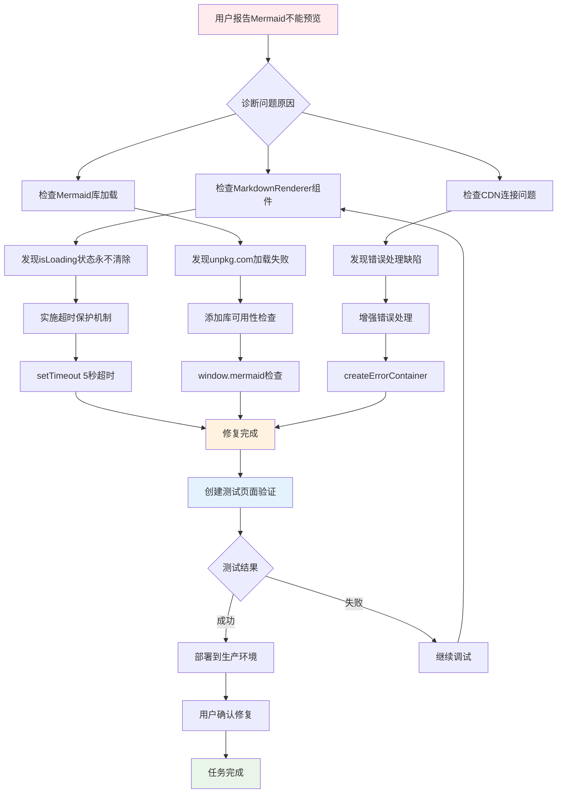
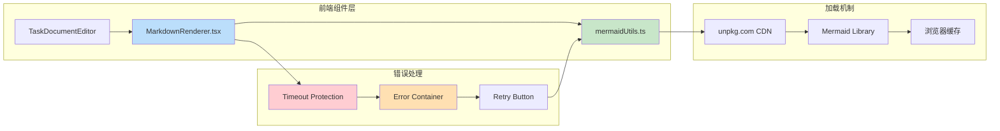
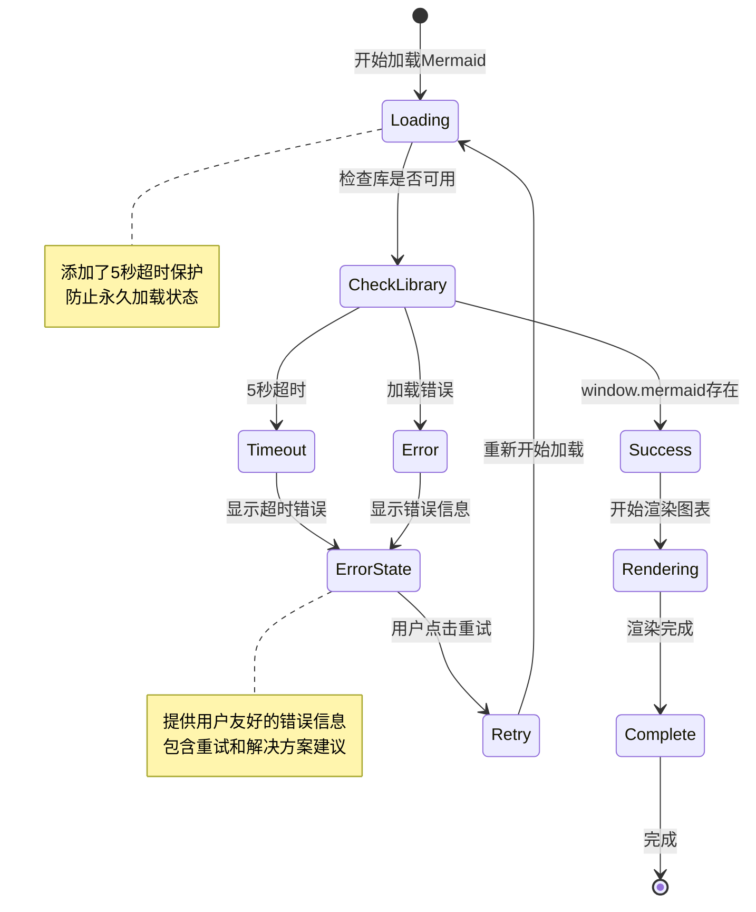
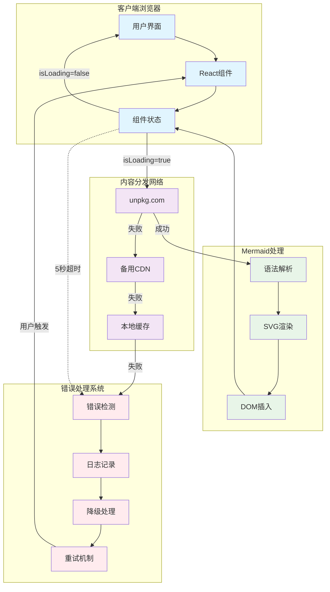
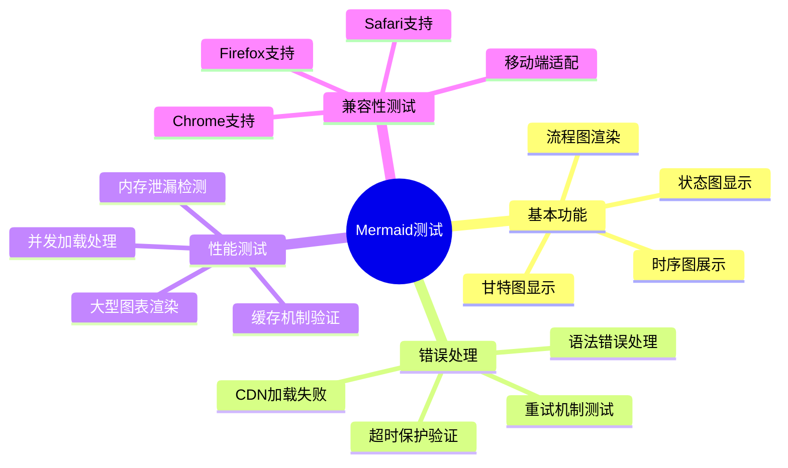

# Mermaid流程图修复测试文档 - 任务631

## Bug修复流程架构图

## Mermaid组件技术架构图

## Bug修复状态机图

## 复杂度测试 - 系统集成图

## 测试用例覆盖图

---

## 测试说明

此文档包含了多种不同复杂度的Mermaid图表类型，用于全面测试修复效果：

1. **流程图(flowchart)**: 展示bug修复的完整流程
2. **系统架构图(graph)**: 展示组件间的关系
3. **状态机图(stateDiagram)**: 展示状态转换逻辑
4. **复杂集成图**: 测试复杂布局和样式渲染
5. **思维导图(mindmap)**: 测试新语法支持

如果这些图表都能正常渲染，说明Mermaid修复已经成功！

**创建时间**: 2025-08-06T06:19:26.027Z
**任务ID**: 631
**优先级**: HIGH
