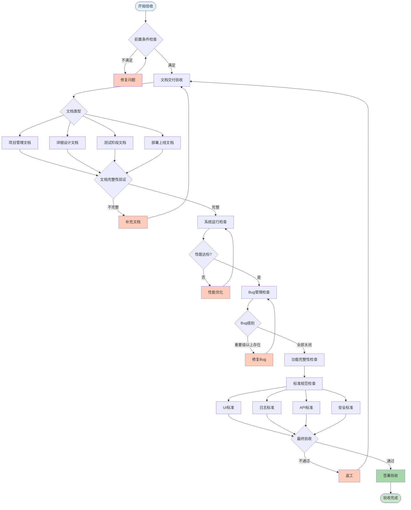
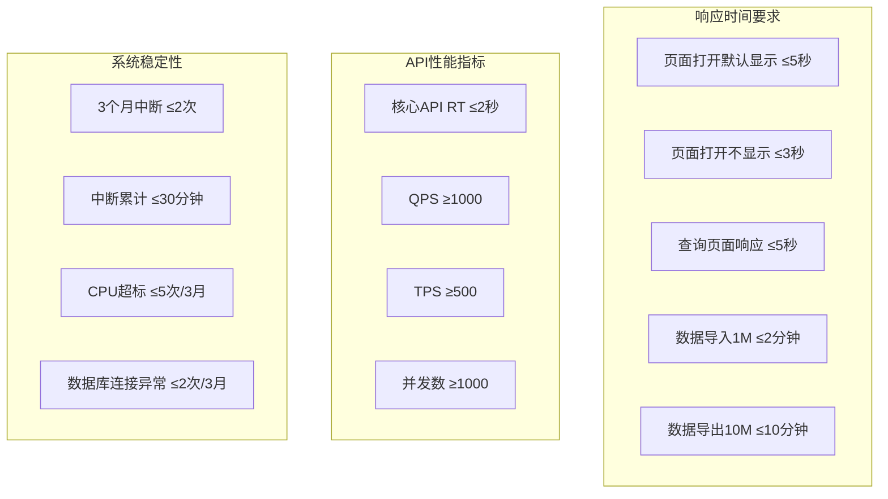
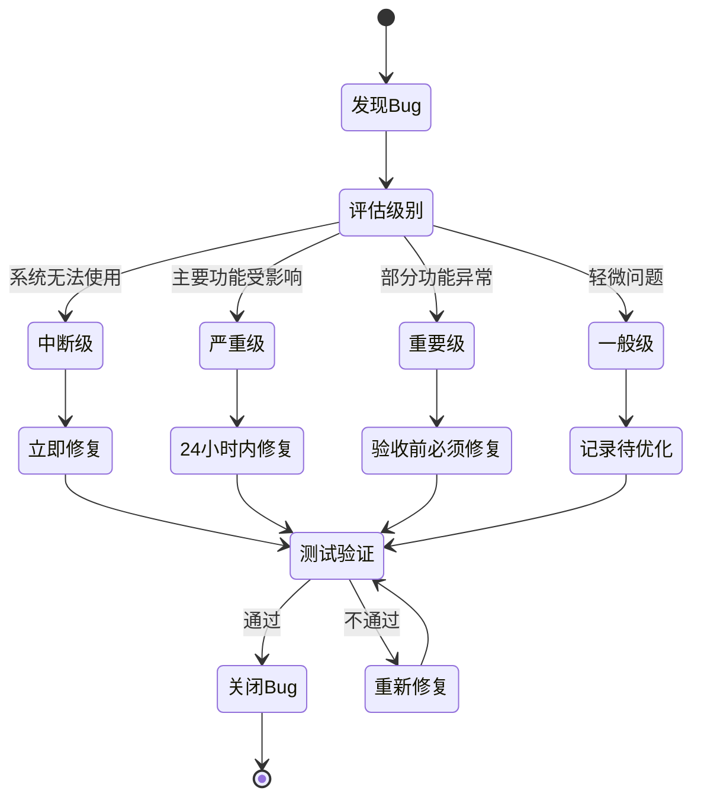
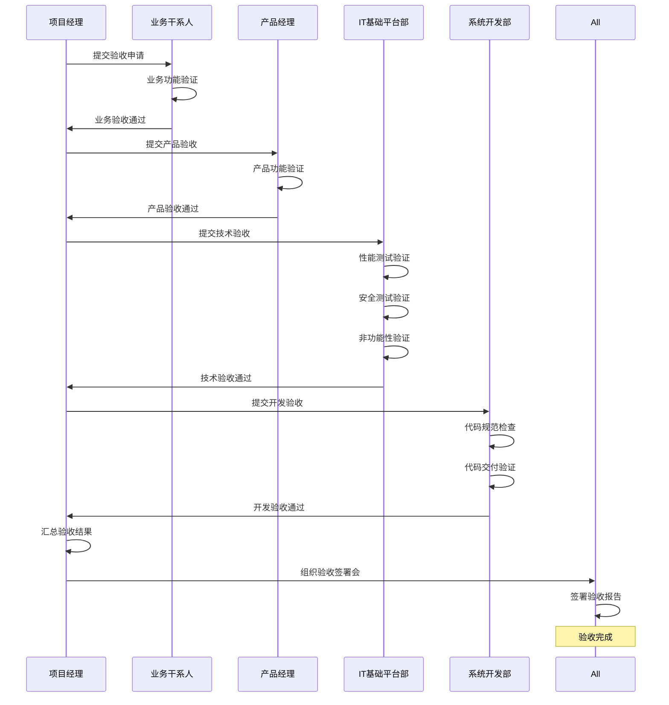
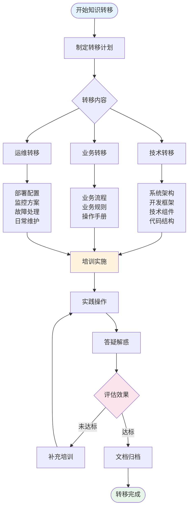
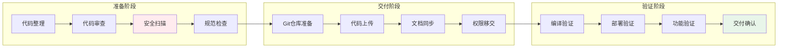
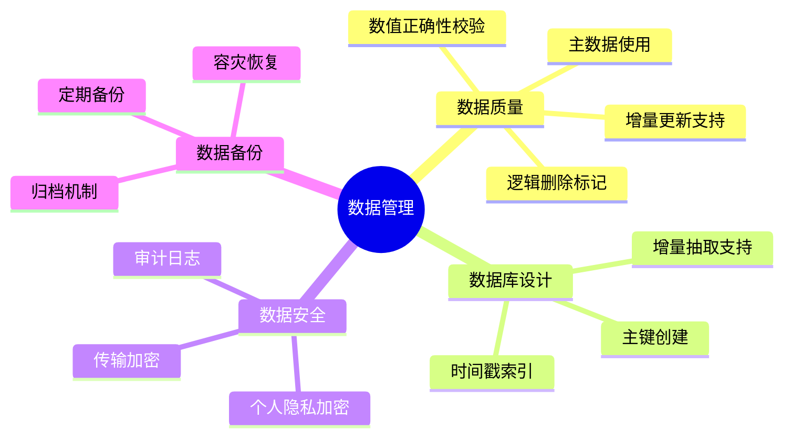

# 李宁团购管理平台验收流程图

## 整体验收流程

```mermaid
graph TB
    Start([开始验收]) --> PreCheck{前置条件检查}
    
    PreCheck -->|不满足| Fix[修复问题]
    Fix --> PreCheck
    
    PreCheck -->|满足| DocCheck[文档交付验收]
    
    DocCheck --> DocTypes{文档类型}
    DocTypes --> PM[项目管理文档]
    DocTypes --> Design[详细设计文档]
    DocTypes --> Test[测试阶段文档]
    DocTypes --> Deploy[部署上线文档]
    
    PM --> DocValidate{文档完整性验证}
    Design --> DocValidate
    Test --> DocValidate
    Deploy --> DocValidate
    
    DocValidate -->|不完整| DocFix[补充文档]
    DocFix --> DocCheck
    
    DocValidate -->|完整| SystemCheck[系统运行检查]
    
    SystemCheck --> Performance{性能达标?}
    Performance -->|否| Optimize[性能优化]
    Optimize --> SystemCheck
    
    Performance -->|是| BugCheck[Bug管理检查]
    
    BugCheck --> BugLevel{Bug级别}
    BugLevel -->|重要级以上存在| BugFix[修复Bug]
    BugFix --> BugCheck
    
    BugLevel -->|全部关闭| FuncCheck[功能完整性检查]
    
    FuncCheck --> Standards[标准规范检查]
    Standards --> UI[UI标准]
    Standards --> Log[日志标准]
    Standards --> API[API标准]
    Standards --> Security[安全标准]
    
    UI --> FinalCheck{最终验收}
    Log --> FinalCheck
    API --> FinalCheck
    Security --> FinalCheck
    
    FinalCheck -->|不通过| Rework[返工]
    Rework --> DocCheck
    
    FinalCheck -->|通过| Sign[签署验收]
    Sign --> End([验收完成])
    
    style Start fill:#e1f5fe
    style End fill:#c8e6c9
    style Fix fill:#ffccbc
    style DocFix fill:#ffccbc
    style Optimize fill:#ffccbc
    style BugFix fill:#ffccbc
    style Rework fill:#ffccbc
    style Sign fill:#a5d6a7
```

## 文档交付流程

```mermaid
graph LR
    subgraph 项目管理阶段
        A1[会议纪要]
    end
    
    subgraph 详细设计阶段
        B1[需求清单] --> B2[原型设计]
        B2 --> B3[系统需求说明书]
    end
    
    subgraph 系统搭建测试阶段
        C1[开发清单] --> C2[数据字典]
        C2 --> C3[测试计划]
        C3 --> C4[单元测试报告]
        C4 --> C5[集成测试报告]
        C5 --> C6[性能测试报告]
        C6 --> C7[安全测试报告]
        C7 --> C8[UAT测试报告]
    end
    
    subgraph 部署上线阶段
        D1[系统配置文档] --> D2[部署文档]
        D2 --> D3[上线报告]
    end
    
    subgraph 验收阶段
        E1[问题追踪报告] --> E2[知识转移]
        E2 --> E3[代码交付]
        E3 --> E4[验收报告]
    end
    
    A1 --> B1
    B3 --> C1
    C8 --> D1
    D3 --> E1
```

## 系统性能验收标准

```mermaid
graph TD
    subgraph 响应时间要求
        RT1[页面打开默认显示 ≤5秒]
        RT2[页面打开不显示 ≤3秒]
        RT3[查询页面响应 ≤5秒]
        RT4[数据导入1M ≤2分钟]
        RT5[数据导出10M ≤10分钟]
    end
    
    subgraph API性能指标
        API1[核心API RT ≤2秒]
        API2[QPS ≥1000]
        API3[TPS ≥500]
        API4[并发数 ≥1000]
    end
    
    subgraph 系统稳定性
        ST1[3个月中断 ≤2次]
        ST2[中断累计 ≤30分钟]
        ST3[CPU超标 ≤5次/3月]
        ST4[数据库连接异常 ≤2次/3月]
    end
```

## Bug级别管理流程

```mermaid
stateDiagram-v2
    [*] --> 发现Bug
    发现Bug --> 评估级别
    
    评估级别 --> 中断级: 系统无法使用
    评估级别 --> 严重级: 主要功能受影响
    评估级别 --> 重要级: 部分功能异常
    评估级别 --> 一般级: 轻微问题
    
    中断级 --> 立即修复
    严重级 --> 24小时内修复
    重要级 --> 验收前必须修复
    一般级 --> 记录待优化
    
    立即修复 --> 测试验证
    24小时内修复 --> 测试验证
    验收前必须修复 --> 测试验证
    记录待优化 --> 测试验证
    
    测试验证 --> 关闭Bug: 通过
    测试验证 --> 重新修复: 不通过
    重新修复 --> 测试验证
    
    关闭Bug --> [*]
```

## 验收签署流程

```mermaid
sequenceDiagram
    participant PM as 项目经理
    participant BU as 业务干系人
    participant PO as 产品经理
    participant IT as IT基础平台部
    participant Dev as 系统开发部
    
    PM->>BU: 提交验收申请
    BU->>BU: 业务功能验证
    BU->>PM: 业务验收通过
    
    PM->>PO: 提交产品验收
    PO->>PO: 产品功能验证
    PO->>PM: 产品验收通过
    
    PM->>IT: 提交技术验收
    IT->>IT: 性能测试验证
    IT->>IT: 安全测试验证
    IT->>IT: 非功能性验证
    IT->>PM: 技术验收通过
    
    PM->>Dev: 提交开发验收
    Dev->>Dev: 代码规范检查
    Dev->>Dev: 代码交付验证
    Dev->>PM: 开发验收通过
    
    PM->>PM: 汇总验收结果
    PM->>All: 组织验收签署会
    All->>All: 签署验收报告
    
    Note over All: 验收完成
```

## 知识转移流程

```mermaid
graph TD
    Start([开始知识转移]) --> Plan[制定转移计划]
    
    Plan --> Content{转移内容}
    
    Content --> Tech[技术转移]
    Content --> Business[业务转移]
    Content --> Ops[运维转移]
    
    Tech --> TechDetail[系统架构<br/>开发框架<br/>技术组件<br/>代码结构]
    Business --> BizDetail[业务流程<br/>业务规则<br/>操作手册]
    Ops --> OpsDetail[部署配置<br/>监控方案<br/>故障处理<br/>日常维护]
    
    TechDetail --> Training[培训实施]
    BizDetail --> Training
    OpsDetail --> Training
    
    Training --> Practice[实践操作]
    Practice --> QA[答疑解惑]
    QA --> Assess{评估效果}
    
    Assess -->|未达标| Supplement[补充培训]
    Supplement --> Practice
    
    Assess -->|达标| Document[文档归档]
    Document --> Complete([转移完成])
    
    style Start fill:#e3f2fd
    style Complete fill:#e8f5e9
    style Training fill:#fff3e0
    style Assess fill:#fce4ec
```

## 代码交付流程

```mermaid
graph LR
    subgraph 准备阶段
        A1[代码整理] --> A2[代码审查]
        A2 --> A3[安全扫描]
        A3 --> A4[规范检查]
    end
    
    subgraph 交付阶段
        B1[Git仓库准备] --> B2[代码上传]
        B2 --> B3[文档同步]
        B3 --> B4[权限移交]
    end
    
    subgraph 验证阶段
        C1[编译验证] --> C2[部署验证]
        C2 --> C3[功能验证]
        C3 --> C4[交付确认]
    end
    
    A4 --> B1
    B4 --> C1
    
    style A3 fill:#ffebee
    style C4 fill:#e8f5e9
```

## 数据管理标准检查

```mermaid
mindmap
  root((数据管理))
    数据质量
      增量更新支持
      数值正确性校验
      主数据使用
      逻辑删除标记
    数据库设计
      主键创建
      时间戳索引
      增量抽取支持
    数据安全
      个人隐私加密
      传输加密
      审计日志
    数据备份
      定期备份
      容灾恢复
      归档机制
```

---

*注：以上流程图涵盖了李宁团购管理平台项目验收的主要环节，可根据实际情况进行调整和细化。*