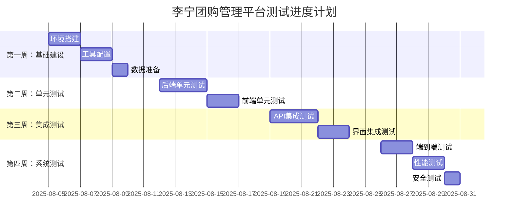

# 李宁团购管理平台一期系统测试计划

**文档版本**: v1.0  
**创建日期**: 2025-08-05  
**项目名称**: 李宁团购管理平台一期  
**文档类型**: 系统测试计划  
**编写人员**: Claude Code  
**审核状态**: 待审核

---

## 📋 1. 项目概述与测试目标

### 1.1 项目背景

李宁团购管理平台是一个综合性的电商供应链管理系统，采用前后端分离架构：

- **前端**: Vue 3 + TypeScript + Ant Design Vue
- **后端**: Go + Gin + GORM + MySQL
- **架构模式**: 领域驱动设计(DDD) + 微服务化模块

### 1.2 测试目标

| 测试目标 | 具体标准 | 验收条件 |
|---------|---------|----------|
| **功能完整性** | 所有核心业务功能正常运行 | 功能测试通过率 ≥ 95% |
| **系统稳定性** | 7×24小时稳定运行 | 系统可用性 ≥ 99.5% |
| **性能指标** | 支持并发用户访问 | 响应时间 ≤ 2秒，并发数 ≥ 1000 |
| **安全合规** | 数据安全和权限控制 | 通过安全漏洞扫描，0高危漏洞 |
| **用户体验** | 界面友好，操作流畅 | 用户操作路径 ≤ 3步 |

### 1.3 测试成功标准

- ✅ 所有P0(阻塞性)缺陷修复完成
- ✅ P1(严重)缺陷修复率 ≥ 90%
- ✅ 核心业务流程端到端测试通过
- ✅ 性能测试指标达到预期
- ✅ 安全测试无高风险漏洞

---

## 🎯 2. 测试范围和边界

### 2.1 测试范围

#### 🔵 核心业务模块 (必测)

**后端业务域:**
```
├── 系统管理域 (SYS)
│   ├── 用户认证与授权 ⭐⭐⭐
│   ├── 角色权限管理 ⭐⭐⭐
│   ├── 菜单配置管理 ⭐⭐
│   └── 系统参数配置 ⭐⭐
├── 订单管理域 (OMS)
│   ├── 销售订单流程 ⭐⭐⭐
│   ├── 订单状态机 ⭐⭐⭐
│   ├── 订单审批流程 ⭐⭐
│   └── 退货订单处理 ⭐⭐
├── 商品管理域 (PMS)
│   ├── SPU/SKU管理 ⭐⭐⭐
│   ├── 商品分类体系 ⭐⭐
│   ├── 库存管理 ⭐⭐⭐
│   └── 价格体系 ⭐⭐
├── 客户管理域 (CMS)
│   ├── 客户信息管理 ⭐⭐
│   ├── 客户类型配置 ⭐⭐
│   └── 客户权限控制 ⭐⭐
└── 财务管理域 (FMS)
    ├── 账户管理 ⭐⭐
    ├── 充值管理 ⭐⭐
    └── 交易记录 ⭐⭐
```
*注: ⭐⭐⭐=高优先级, ⭐⭐=中优先级, ⭐=低优先级*

**前端功能模块:**
```
├── 登录认证系统
│   ├── 用户名密码登录 ⭐⭐⭐
│   ├── 验证码登录 ⭐⭐
│   ├── 图形验证码 ⭐⭐
│   └── 忘记密码 ⭐⭐
├── 管理界面
│   ├── 导航菜单系统 ⭐⭐⭐
│   ├── 数据表格组件 ⭐⭐⭐
│   ├── 表单验证 ⭐⭐⭐
│   └── 文件上传 ⭐⭐
└── 业务页面
    ├── 订单管理页面 ⭐⭐⭐
    ├── 商品管理页面 ⭐⭐⭐
    ├── 客户管理页面 ⭐⭐
    └── 报表页面 ⭐⭐
```

#### 🔵 集成接口 (必测)

- **第三方API集成**: 泛微、酷采、昆胜、致云
- **数据库集成**: MySQL读写操作、事务处理
- **缓存集成**: Redis缓存机制
- **文件存储**: 图片/文档上传下载

### 2.2 测试边界

#### ✅ 包含在测试范围内
- Web前端所有功能页面
- 后端API接口完整性
- 数据库CRUD操作
- 用户权限控制
- 业务流程完整性
- 系统性能表现
- 安全漏洞检测

#### ❌ 不包含在测试范围内
- 第三方系统内部逻辑
- 数据库底层引擎
- 服务器操作系统
- 网络基础设施
- 第三方组件库内部逻辑

---

## 📊 3. 测试策略和方法

### 3.1 测试层次策略

采用"金字塔测试模型"，确保测试覆盖率和效率：

```
        🔺 E2E测试 (10%)
       /   端到端业务流程   \
      /     用户场景测试     \
     🔶🔶🔶 集成测试 (30%) 🔶🔶🔶
    /    API接口测试        \
   /     组件集成测试        \
  🔵🔵🔵🔵 单元测试 (60%) 🔵🔵🔵🔵
 /      函数级别测试         \
/        代码逻辑测试         \
```

### 3.2 测试类型规划

#### 📱 功能测试 (40%)
**测试重点**: 业务功能正确性
**测试方法**: 
- 等价类划分法
- 边界值分析法
- 因果图法
- 正交试验法

**测试场景举例**:
```
用户登录功能测试:
├── 正常场景
│   ├── 正确用户名+密码 → 登录成功
│   ├── 记住密码功能 → 下次自动填充
│   └── 不同角色登录 → 对应权限菜单
├── 异常场景  
│   ├── 错误用户名 → 提示"用户不存在"
│   ├── 错误密码 → 提示"密码错误"
│   ├── 空用户名/密码 → 提示"不能为空"
│   └── 验证码错误 → 提示"验证码错误"
└── 边界场景
    ├── 最大长度用户名/密码
    ├── 特殊字符输入
    └── SQL注入尝试
```

#### ⚡ 性能测试 (20%)
**测试重点**: 系统性能指标
**测试工具**: JMeter + Grafana + Prometheus

**性能指标要求**:
| 指标类别 | 具体指标 | 目标值 | 测试方法 |
|---------|---------|-------|----------|
| **响应时间** | 页面加载时间 | ≤ 2秒 | 负载测试 |
| **吞吐量** | 并发用户数 | ≥ 1000 | 压力测试 |
| **资源使用** | CPU使用率 | ≤ 70% | 监控测试 |
| **资源使用** | 内存使用率 | ≤ 80% | 监控测试 |
| **数据库** | 查询响应时间 | ≤ 500ms | 数据库测试 |

#### 🔒 安全测试 (15%)
**测试重点**: 系统安全漏洞
**测试工具**: OWASP ZAP + Burp Suite

**安全测试清单**:
- [ ] SQL注入漏洞检测
- [ ] XSS跨站脚本攻击
- [ ] CSRF跨站请求伪造
- [ ] 身份验证绕过
- [ ] 权限提升漏洞
- [ ] 敏感信息泄露
- [ ] 文件上传安全
- [ ] 数据传输加密

#### 🔄 兼容性测试 (10%)
**测试重点**: 多环境兼容性

**浏览器兼容性**:
- Chrome 最新版 ✅
- Firefox 最新版 ✅  
- Safari 最新版 ✅
- Edge 最新版 ✅

**设备兼容性**:
- PC端 (1920x1080) ✅
- 平板端 (1024x768) 📋 待确认
- 移动端 (375x667) 📋 待确认

#### 🚀 易用性测试 (10%)
**测试重点**: 用户体验
**测试方法**: 
- 用户任务完成度测试
- 界面一致性检查
- 操作流程优化验证

#### 📈 可靠性测试 (5%)
**测试重点**: 系统稳定性
**测试场景**:
- 7×24小时稳定性测试
- 异常恢复能力测试
- 数据备份恢复测试

---

## 🏗️ 4. 测试环境规划

### 4.1 环境架构图

```
┌─────────────────── 测试环境架构 ───────────────────┐
│                                                   │
│  ┌─────────────┐    ┌─────────────┐               │
│  │   开发环境   │    │   测试环境   │               │
│  │ Development │    │   Testing   │               │
│  └─────────────┘    └─────────────┘               │
│         │                   │                     │
│  ┌─────────────┐    ┌─────────────┐               │
│  │   预发环境   │    │   生产环境   │               │
│  │   Staging   │    │ Production  │               │
│  └─────────────┘    └─────────────┘               │
│                                                   │
└───────────────────────────────────────────────────┘
```

### 4.2 环境配置详情

#### 🔧 开发环境 (Development)
**用途**: 日常开发和基础功能验证
```yaml
前端环境:
  地址: http://localhost:8888
  启动: yarn dev
  特点: 热重载，开发者工具

后端环境:
  地址: http://localhost:8080
  启动: go run cmd/tuangou/main.go
  特点: 实时调试，详细日志

数据库:
  地址: localhost:3306
  数据库: tuangou_dev
  特点: 开发测试数据

缓存:
  地址: localhost:6379
  数据库: db0
  特点: 本地Redis实例
```

#### 🧪 测试环境 (Testing)
**用途**: 功能测试、集成测试、自动化测试
```yaml
前端环境:
  地址: http://test-frontend.internal
  部署: Docker容器
  特点: 接近生产配置

后端环境:
  地址: http://test-api.internal
  部署: Docker容器  
  特点: 完整API功能

数据库:
  地址: test-mysql.internal:3306
  数据库: tuangou_test
  特点: 测试数据集，定期重置

缓存:
  地址: test-redis.internal:6379
  数据库: db1
  特点: 测试缓存策略
```

#### 🚀 预发环境 (Staging)
**用途**: 生产发布前最后验证
```yaml
前端环境:
  地址: https://staging-admin.tuangou.com
  部署: Nginx + SSL
  特点: 生产同等配置

后端环境:
  地址: https://staging-api.tuangou.com  
  部署: 负载均衡
  特点: 生产级性能

数据库:
  地址: staging-mysql.internal:3306
  数据库: tuangou_staging
  特点: 生产数据副本

缓存:
  地址: staging-redis.internal:6379
  数据库: db2
  特点: 生产缓存策略
```

### 4.3 测试数据管理

#### 📊 测试数据类型

**基础数据**:
- 用户账号: 管理员、普通用户、特殊权限用户
- 商品数据: SPU/SKU，价格，库存
- 客户数据: 不同类型客户信息
- 系统配置: 字典、参数、菜单

**业务数据**:
- 订单数据: 不同状态订单
- 库存数据: 入库、出库、调拨记录  
- 财务数据: 账户、交易、充值记录
- 审批数据: 工作流实例

**边界数据**:
- 空值、NULL、极大值、极小值
- 特殊字符、SQL注入字符
- 超长字符串、非法格式数据

#### 🔄 数据刷新策略

```bash
# 每日自动刷新基础数据
0 2 * * * /scripts/refresh_base_data.sh

# 每周刷新完整测试数据
0 2 * * 0 /scripts/refresh_full_data.sh  

# 手动刷新命令
./scripts/manual_refresh.sh --env=test --type=all
```

---

## 📅 5. 测试进度计划

### 5.1 总体时间安排

**项目周期**: 4周 (2025-08-05 ~ 2025-09-01)



### 5.2 详细里程碑

| 里程碑 | 日期 | 关键交付物 | 通过标准 |
|-------|------|----------|----------|
| **M1: 测试准备完成** | 08-09 | 测试环境、工具、数据 | 环境可用，工具正常 |
| **M2: 单元测试完成** | 08-16 | 单元测试报告 | 代码覆盖率 ≥ 80% |
| **M3: 集成测试完成** | 08-23 | 集成测试报告 | API测试通过率 ≥ 95% |
| **M4: 系统测试完成** | 08-30 | 系统测试报告 | 功能测试通过率 ≥ 95% |
| **M5: 测试结论输出** | 09-01 | 最终测试报告 | 满足上线标准 |

### 5.3 每日工作安排

#### 第一周：基础建设期
```
周一 (08-05): 
  - ✅ 启动测试计划编写
  - 📋 环境需求确认  
  - 📋 工具选型调研

周二 (08-06):
  - 📋 测试环境搭建 
  - 📋 Docker配置优化
  - 📋 数据库初始化

周三 (08-07):
  - 📋 自动化工具配置
  - 📋 CI/CD流水线设置
  - 📋 监控告警配置

周四 (08-08):
  - 📋 测试数据准备
  - 📋 基础数据导入
  - 📋 数据刷新脚本

周五 (08-09):
  - 📋 环境验收测试
  - 📋 里程碑M1检查
  - 📋 下周计划制定
```

---

## 👥 6. 测试资源配置

### 6.1 人员配置

#### 👨‍💼 测试团队组织架构

```
测试项目经理 (1人)
    ├── 测试开发工程师 (2人)
    │   ├── 自动化框架开发
    │   ├── 测试工具集成  
    │   └── CI/CD流水线
    ├── 功能测试工程师 (2人)
    │   ├── 业务功能测试
    │   ├── 界面测试
    │   └── 兼容性测试
    ├── 性能测试工程师 (1人)  
    │   ├── 性能脚本开发
    │   ├── 压力测试执行
    │   └── 性能分析优化
    └── 安全测试工程师 (1人)
        ├── 安全漏洞扫描
        ├── 渗透测试
        └── 安全加固建议
```

#### 📋 人员技能要求

**测试项目经理**:
- 5年以上测试管理经验
- 熟悉敏捷开发流程
- 良好的沟通协调能力
- 风险识别和应对能力

**测试开发工程师**:
- 熟练掌握Go/JavaScript编程
- 自动化测试框架经验 (Selenium/Cypress)
- CI/CD工具使用 (Jenkins/GitLab CI)
- Docker容器化技术

**功能测试工程师**:
- 3年以上功能测试经验
- 熟悉Web应用测试
- 测试用例设计能力
- 缺陷跟踪管理经验

**性能测试工程师**:
- JMeter/LoadRunner使用经验
- 性能调优经验
- 监控工具使用 (Grafana/Prometheus)
- 数据库性能分析

**安全测试工程师**:
- OWASP Top 10漏洞熟悉
- 渗透测试工具使用
- 安全编码规范了解
- 合规性测试经验

### 6.2 工具配置

#### 🛠️ 测试工具矩阵

| 测试类型 | 工具名称 | 版本 | 用途说明 |
|---------|---------|------|----------|
| **单元测试** | Go Testing | 1.21+ | Go后端单元测试 |
| **单元测试** | Vitest | 3.2.3 | Vue前端单元测试 |
| **API测试** | Postman/Newman | Latest | API接口测试 |
| **E2E测试** | Cypress | 13.x | 端到端自动化测试 |
| **性能测试** | JMeter | 5.6+ | 负载和压力测试 |
| **安全测试** | OWASP ZAP | 2.14+ | 安全漏洞扫描 |
| **缺陷管理** | Jira | Cloud | 缺陷跟踪管理 |
| **测试管理** | TestRail | Cloud | 测试用例管理 |
| **监控工具** | Grafana | 10.x | 性能监控大盘 |
| **日志分析** | ELK Stack | 8.x | 日志收集分析 |

#### 🔧 工具集成方案

```yaml
# 测试工具链集成配置
testing_pipeline:
  trigger: 
    - push_to_main
    - pull_request
    
  stages:
    - name: "单元测试"
      tools: ["go test", "vitest"] 
      coverage_threshold: 80%
      
    - name: "集成测试"
      tools: ["newman", "cypress"]
      parallel: true
      
    - name: "安全扫描"  
      tools: ["zap-cli", "gosec"]
      fail_on: "high"
      
    - name: "性能测试"
      tools: ["jmeter"]
      condition: "manual"
      
  notifications:
    - slack: "#testing-alerts"
    - email: "test-team@company.com"
```

### 6.3 硬件资源

#### 💻 服务器资源配置

**测试服务器集群**:
```
负载均衡器 (1台):
  - CPU: 4核
  - 内存: 8GB
  - 磁盘: 100GB SSD
  - 用途: 流量分发

应用服务器 (2台):
  - CPU: 8核  
  - 内存: 16GB
  - 磁盘: 200GB SSD
  - 用途: 前后端应用部署

数据库服务器 (1台):
  - CPU: 16核
  - 内存: 32GB  
  - 磁盘: 500GB SSD
  - 用途: MySQL数据库

缓存服务器 (1台):
  - CPU: 4核
  - 内存: 16GB
  - 磁盘: 100GB SSD  
  - 用途: Redis缓存

监控服务器 (1台):
  - CPU: 8核
  - 内存: 16GB
  - 磁盘: 300GB SSD
  - 用途: 监控和日志
```

---

## ⚠️ 7. 风险评估与应对

### 7.1 测试风险识别

#### 🔴 高风险项

| 风险项 | 风险描述 | 影响程度 | 发生概率 | 风险等级 |
|-------|---------|---------|---------|----------|
| **环境不稳定** | 测试环境频繁故障，影响测试执行 | 高 | 中 | 🔴 高 |
| **数据质量差** | 测试数据不完整或错误，影响测试结果 | 高 | 中 | 🔴 高 |
| **人员不足** | 关键测试人员离职或请假 | 中 | 中 | 🟡 中 |
| **进度延期** | 开发延期交付，测试时间压缩 | 高 | 高 | 🔴 高 |

#### 🟡 中风险项

| 风险项 | 风险描述 | 影响程度 | 发生概率 | 风险等级 |
|-------|---------|---------|---------|----------|
| **工具兼容性** | 测试工具与系统兼容性问题 | 中 | 低 | 🟡 中 |
| **需求变更** | 测试过程中需求频繁变更 | 中 | 中 | 🟡 中 |
| **技能差距** | 团队成员技能不匹配 | 中 | 低 | 🟡 中 |

#### 🟢 低风险项

| 风险项 | 风险描述 | 影响程度 | 发生概率 | 风险等级 |
|-------|---------|---------|---------|----------|
| **硬件故障** | 测试服务器硬件故障 | 低 | 低 | 🟢 低 |
| **网络问题** | 网络连接不稳定 | 低 | 低 | 🟢 低 |

### 7.2 风险应对策略

#### 🔴 高风险应对措施

**环境不稳定**:
- **预防措施**: 
  - 部署多套测试环境（主+备）
  - 建立环境监控告警机制
  - 制定环境快速恢复流程
- **应急预案**: 
  - 15分钟内切换到备份环境
  - 启用云端测试环境作为后备
  - 建立环境问题升级机制

**数据质量差**:
- **预防措施**:
  - 建立测试数据标准规范
  - 实施数据质量自动检查
  - 定期刷新和验证测试数据
- **应急预案**:
  - 快速回滚到已知良好数据版本
  - 启用数据模拟服务
  - 手动修复关键数据问题

**进度延期**:
- **预防措施**:
  - 与开发团队建立每日同步机制  
  - 提前识别阻塞问题并升级
  - 准备测试优先级调整方案
- **应急预案**:
  - 调整测试优先级，聚焦核心功能
  - 增加测试资源和工作时间
  - 启用风险驱动的测试策略

#### 🟡 中风险应对措施

**工具兼容性**:
- 提前进行工具兼容性测试
- 准备备选工具方案
- 建立工具问题知识库

**需求变更**:
- 建立需求变更评估流程
- 制定测试用例快速调整机制
- 与产品团队建立密切沟通

**技能差距**:
- 开展针对性技能培训
- 建立内部知识分享机制
- 安排经验丰富的mentor

### 7.3 风险监控机制

#### 📊 风险监控指标

```yaml
风险监控大盘:
  环境稳定性:
    - 环境可用率: ≥ 99%
    - 平均故障恢复时间: ≤ 30分钟
    - 环境性能指标: CPU ≤ 70%, 内存 ≤ 80%
    
  测试进度:
    - 测试用例执行进度: 按计划 ±5%  
    - 缺陷发现率: 预期范围内
    - 里程碑达成率: ≥ 90%
    
  质量指标:
    - 测试通过率: ≥ 95%
    - 自动化覆盖率: ≥ 80%
    - 缺陷修复率: P0 100%, P1 ≥ 90%
    
  团队状态:
    - 团队出勤率: ≥ 95%
    - 技能匹配度: ≥ 80%
    - 团队满意度: ≥ 4.0/5.0
```

#### 🚨 预警机制

**红色预警** (立即处理):
- 环境不可用超过1小时
- 关键功能测试失败率 > 20%
- 核心团队成员无法到岗

**黄色预警** (24小时内处理):
- 环境性能指标异常
- 测试进度落后 > 1天
- 工具故障影响测试执行

**绿色提醒** (常规处理):
- 轻微的环境问题
- 非关键功能测试问题
- 可延期的优化需求

---

## ✅ 8. 验收标准

### 8.1 功能验收标准

#### 🎯 核心功能验收

**用户认证系统**:
- [ ] 用户名密码登录成功率 = 100%
- [ ] 验证码登录功能正常
- [ ] 忘记密码流程完整
- [ ] 登录安全控制有效 (防暴力破解)
- [ ] 会话管理机制正常

**权限管理系统**:
- [ ] 角色权限配置生效
- [ ] 菜单权限控制准确
- [ ] 数据权限隔离有效
- [ ] 权限变更实时生效

**订单管理流程**:
- [ ] 订单创建流程完整
- [ ] 订单状态流转正确
- [ ] 订单审批机制有效
- [ ] 订单查询功能准确
- [ ] 订单导出功能正常

**商品管理功能**:
- [ ] SPU/SKU管理完整
- [ ] 商品分类功能正常
- [ ] 库存管理准确
- [ ] 价格体系生效

#### 📊 性能验收标准

| 性能指标 | 目标值 | 验收条件 | 测试方法 |
|---------|-------|----------|----------|
| **页面响应时间** | ≤ 2秒 | 95%的请求满足要求 | 负载测试 |
| **API响应时间** | ≤ 500ms | 99%的API满足要求 | 接口测试 |
| **并发用户数** | ≥ 1000 | 系统稳定运行 | 压力测试 |
| **数据库查询** | ≤ 100ms | 复杂查询满足要求 | 数据库测试 |
| **系统可用率** | ≥ 99.5% | 24小时稳定性测试 | 可靠性测试 |

#### 🔒 安全验收标准

**漏洞扫描结果**:
- [ ] 高危漏洞数量 = 0
- [ ] 中危漏洞修复率 ≥ 90%
- [ ] 低危漏洞修复率 ≥ 70%

**安全功能验证**:
- [ ] SQL注入防护有效
- [ ] XSS攻击防护有效
- [ ] CSRF防护机制正常
- [ ] 文件上传安全检查
- [ ] 数据传输加密正常
- [ ] 密码强度策略生效

### 8.2 质量验收标准

#### 📈 测试覆盖率

| 测试类型 | 覆盖率要求 | 验收标准 |
|---------|-----------|----------|
| **代码覆盖率** | ≥ 80% | 单元测试覆盖率报告 |
| **功能覆盖率** | ≥ 95% | 功能测试用例执行 |
| **API覆盖率** | = 100% | 所有API接口测试 |
| **业务场景覆盖率** | ≥ 90% | 端到端测试场景 |

#### 🐛 缺陷质量标准

**缺陷修复率**:
- P0 (阻塞性): 100% 修复
- P1 (严重): ≥ 90% 修复  
- P2 (一般): ≥ 80% 修复
- P3 (轻微): ≥ 60% 修复

**缺陷密度**:
- 每千行代码缺陷数 ≤ 2个
- 核心模块缺陷密度 ≤ 1个/千行

#### 📋 文档完整性

**测试文档验收**:
- [ ] 测试计划文档完整
- [ ] 测试用例文档齐全  
- [ ] 测试执行记录完整
- [ ] 缺陷报告规范
- [ ] 测试总结报告完善

### 8.3 验收流程

#### 🔄 验收阶段划分


**第一阶段：内部验收** (测试团队)
- 验收内容: 测试完整性、文档齐全性
- 验收标准: 所有测试用例执行完毕，测试报告完整
- 验收周期: 1天

**第二阶段：技术验收** (开发团队)
- 验收内容: 技术指标达成、代码质量
- 验收标准: 性能指标满足要求，安全漏洞修复
- 验收周期: 2天

**第三阶段：业务验收** (产品团队)  
- 验收内容: 业务功能完整性、用户体验
- 验收标准: 核心业务流程正常，界面友好易用
- 验收周期: 3天

**第四阶段：用户验收** (最终用户)
- 验收内容: 实际业务场景验证
- 验收标准: 用户能够完成日常业务操作
- 验收周期: 5天

**第五阶段：最终验收** (项目组)
- 验收内容: 综合评估，上线决策
- 验收标准: 所有验收标准通过，风险可控
- 验收周期: 1天

#### ✅ 验收通过条件

**系统功能**:
- [ ] 所有P0功能正常运行
- [ ] P1功能满足业务需求
- [ ] 关键业务流程端到端验证通过

**系统性能**:
- [ ] 响应时间满足要求
- [ ] 并发能力达到预期
- [ ] 系统稳定性验证通过

**系统安全**:
- [ ] 安全漏洞修复完成
- [ ] 权限控制机制有效
- [ ] 数据安全措施到位

**质量标准**:
- [ ] 测试覆盖率达标
- [ ] 缺陷修复率达标
- [ ] 文档完整性达标

---

## 📄 附录

### A. 测试用例模板

```
测试用例ID: TC_LOGIN_001
测试用例标题: 用户正常登录功能测试
所属模块: 用户认证
优先级: P0 (高)
前置条件: 系统正常运行，用户账号存在且有效

测试步骤:
1. 打开登录页面
2. 输入正确的用户名
3. 输入正确的密码  
4. 点击登录按钮

预期结果:
1. 登录成功
2. 跳转到系统首页
3. 显示用户信息
4. 显示对应权限菜单

测试数据:
用户名: admin
密码: 123456

备注: 验证正常登录流程的完整性
```

### B. 缺陷报告模板

```
缺陷ID: BUG_20250805_001
缺陷标题: 登录页面验证码显示不正确
发现时间: 2025-08-05 14:30:00
发现人员: 测试工程师
所属模块: 用户认证
优先级: P1 (严重)
严重程度: Major

缺陷描述:
在登录页面多次刷新后，验证码图片无法正常显示，
显示为破损图标，影响用户正常登录。

重现步骤:
1. 打开登录页面
2. 连续点击验证码刷新按钮5次以上
3. 观察验证码显示情况

实际结果:
验证码显示为破损图标，无法看清验证码内容

预期结果:  
验证码应该正常显示，内容清晰可见

环境信息:
浏览器: Chrome 118.0
操作系统: Windows 11
测试环境: http://test-frontend.internal

附件:
screenshot_bug_001.png
```

### C. 风险评估矩阵

```
风险评估矩阵 (影响程度 × 发生概率):

        │  低   │  中   │  高   │
────────┼──────┼──────┼──────┤
   高   │ 🟡中  │ 🔴高  │ 🔴高  │
────────┼──────┼──────┼──────┤  
   中   │ 🟢低  │ 🟡中  │ 🔴高  │
────────┼──────┼──────┼──────┤
   低   │ 🟢低  │ 🟢低  │ 🟡中  │
────────┴──────┴──────┴──────┘
         低     中     高
          发生概率
```

### D. 测试进度跟踪表

| 日期 | 计划任务 | 实际完成 | 进度% | 问题/风险 | 下一步计划 |
|------|---------|---------|-------|-----------|-----------|
| 08-05 | 测试计划编写 | ✅ 已完成 | 100% | 无 | 环境搭建 |
| 08-06 | 环境搭建 | 📋 进行中 | 60% | 服务器资源申请延迟 | 加快资源申请 |
| 08-07 | 工具配置 | ⏳ 待开始 | 0% | 依赖环境搭建完成 | 并行配置可独立工具 |

### E. 联系方式

**项目组联系方式**:
- 测试经理: 张三 (zhangsan@company.com)
- 开发经理: 李四 (lisi@company.com)  
- 产品经理: 王五 (wangwu@company.com)
- 项目经理: 赵六 (zhaoliu@company.com)

**紧急联系电话**:
- 测试团队值班: 400-xxx-xxxx
- 运维团队值班: 400-xxx-xxxx
- 项目组总机: 010-xxxx-xxxx

---

**文档状态**: ✅ 已完成  
**最后更新**: 2025-08-05  
**下次评审**: 2025-08-12  
**文档版本**: v1.0