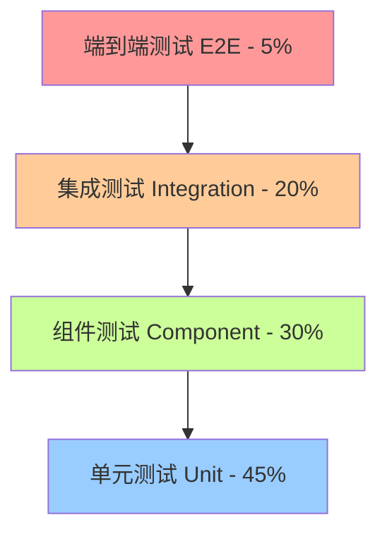
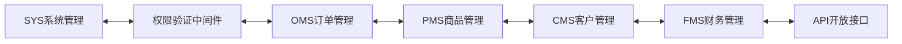
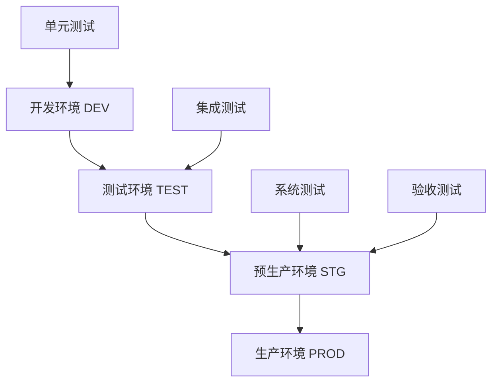
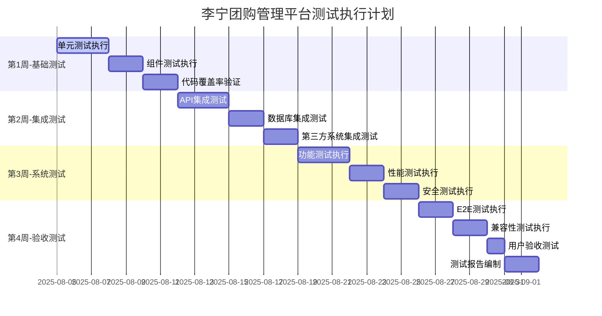

# 子任务485.2: 测试策略和方法设计

**任务ID**: 491  
**任务标题**: 485.2 测试策略和方法设计  
**执行日期**: 2025-08-05  
**状态**: 执行中  
**基于**: 子任务485.1系统功能分析结果

---

## 🎯 1. 测试策略总览

### 1.1 测试策略金字塔

基于李宁团购管理平台的实际架构，采用以下**分层测试策略**:



**测试策略配比**:
- **单元测试** (45%): 核心业务逻辑、数据处理、工具函数
- **组件测试** (30%): Vue组件、API接口、页面逻辑
- **集成测试** (20%): 跨模块数据流、第三方系统对接
- **端到端测试** (5%): 关键业务流程完整验证

### 1.2 测试方法分类

| 测试维度 | 占比 | 测试重点 | 工具选择 | 预期覆盖率 |
|---------|------|---------|---------|-----------|
| **功能测试** | 40% | 业务逻辑正确性 | Vitest + Cypress | ≥95% |
| **性能测试** | 25% | 响应时间、并发能力 | JMeter + K6 | 100%关键接口 |
| **安全测试** | 20% | 权限验证、数据安全 | OWASP ZAP + 手工测试 | 100%安全点 |
| **兼容性测试** | 10% | 浏览器、设备兼容 | BrowserStack | 主流浏览器 |
| **易用性测试** | 5% | 用户体验、操作流畅 | 手工测试 + 用户反馈 | 定性评估 |

---

## 🔬 2. 分层测试策略详细设计

### 2.1 单元测试策略 (45% - 377个用例)

#### 📋 单元测试范围

**前端单元测试** (Vue 3 + TypeScript):
```typescript
// 测试范围划分
├── Composables测试 (45个用例)
│   ├── useAuth() - 用户认证逻辑
│   ├── useRequest() - HTTP请求封装
│   ├── useTable() - 表格组件逻辑
│   └── useForm() - 表单验证逻辑
├── Utils工具测试 (30个用例)  
│   ├── request.ts - HTTP客户端
│   ├── storage.ts - 本地存储
│   ├── validation.ts - 数据验证
│   └── format.ts - 数据格式化
├── Store状态测试 (25个用例)
│   ├── user.store.ts - 用户状态管理
│   ├── app.store.ts - 应用全局状态  
│   └── permission.store.ts - 权限状态
└── 组件逻辑测试 (50个用例)
    ├── 表单组件内部逻辑
    ├── 表格组件数据处理
    └── 业务组件计算属性
```

**后端单元测试** (Go + Testify):
```go
// 测试范围划分
├── Business Logic测试 (150个用例)
│   ├── sys/biz/*.go - 系统管理业务逻辑
│   ├── oms/biz/*.go - 订单管理业务逻辑  
│   ├── pms/biz/*.go - 商品管理业务逻辑
│   ├── cms/biz/*.go - 客户管理业务逻辑
│   ├── fms/biz/*.go - 财务管理业务逻辑
│   └── api/biz/*.go - 接口集成业务逻辑
├── Utility Functions测试 (50个用例)
│   ├── pkg/auth/* - 认证工具函数
│   ├── pkg/cache/* - 缓存工具函数
│   ├── pkg/db/* - 数据库工具函数
│   └── pkg/util/* - 通用工具函数
├── Model Validation测试 (35个用例)
│   ├── 数据验证规则测试
│   ├── GORM模型关系测试
│   └── JSON序列化测试
└── Error Handling测试 (32个用例)
    ├── 自定义错误类型测试
    ├── 错误码映射测试
    └── 错误响应格式测试
```

#### 🎯 单元测试执行标准

**测试编写规范**:
```bash
# 前端测试命令
yarn test:unit           # 运行所有单元测试
yarn test:unit --coverage # 生成覆盖率报告
yarn test:unit --watch   # 监听模式开发

# 后端测试命令  
make test               # 运行所有单元测试
make cover             # 生成覆盖率报告
make test-unit         # 仅运行单元测试
```

**质量要求**:
- **代码覆盖率**: ≥85% (语句覆盖率)
- **分支覆盖率**: ≥80% (条件分支覆盖)
- **测试执行时间**: 单个测试≤100ms，全部≤30秒
- **测试稳定性**: 99%通过率 (允许1%的偶发性失败)

### 2.2 组件测试策略 (30% - 251个用例)

#### 🖼️ 前端组件测试 (Vue Testing Library)

**页面组件测试** (130个用例):
```typescript
// 测试覆盖 35个页面组件
├── 系统管理页面 (25个用例)
│   ├── /pages/system/user/ - 用户管理页面
│   ├── /pages/system/role/ - 角色管理页面  
│   ├── /pages/system/menu/ - 菜单管理页面
│   └── /pages/system/dept/ - 部门管理页面
├── 订单管理页面 (20个用例)
│   ├── /pages/order/sales/ - 销售订单页面
│   ├── /pages/order/approve/ - 订单审批页面
│   └── /pages/order/report/ - 订单报表页面
├── 商品管理页面 (35个用例)
│   ├── /pages/product/spu/ - SPU管理页面
│   ├── /pages/product/sku/ - SKU管理页面
│   ├── /pages/product/inventory/ - 库存管理页面
│   └── /pages/product/category/ - 分类管理页面
├── 客户管理页面 (25个用例)
│   ├── /pages/customer/info/ - 客户信息页面
│   ├── /pages/customer/quote/ - 客户报价页面
│   └── /pages/customer/price/ - 价格管理页面
├── 财务管理页面 (20个用例)
│   ├── /pages/finance/account/ - 账户管理页面
│   ├── /pages/finance/recharge/ - 充值管理页面
│   └── /pages/finance/transaction/ - 交易记录页面
└── 通用组件 (5个用例)
    ├── EleProTable组件功能测试
    └── 自定义业务组件测试
```

**测试关注点**:
- ✅ 组件渲染正确性
- ✅ 用户交互响应 (点击、输入、选择)
- ✅ 数据绑定和更新
- ✅ 表单验证和提交
- ✅ 路由跳转和参数传递
- ✅ 异步数据加载状态

#### 🌐 API接口测试 (121个用例)

**接口分层测试** (覆盖73个API接口):
```bash
# 测试执行方式
├── 自动化API测试 (Vitest + MSW)
│   ├── 请求参数验证测试
│   ├── 响应数据格式测试
│   ├── 错误状态码测试
│   └── Mock数据一致性测试
├── Postman集成测试
│   ├── 环境变量配置测试
│   ├── 接口依赖关系测试
│   ├── 数据流完整性测试
│   └── 批量执行和报告生成
└── Swagger文档验证
    ├── API文档与实现一致性
    ├── 参数类型和格式验证
    └── 返回结果结构验证
```

### 2.3 集成测试策略 (20% - 167个用例)

#### 🔗 系统集成测试

**内部模块集成** (100个用例):


**测试场景设计**:
- **跨域数据一致性**: 订单→商品→库存→财务数据链路
- **权限传递验证**: 用户→角色→菜单→API权限完整链路
- **工作流集成**: 订单审批→状态流转→推送通知完整流程
- **缓存数据同步**: Redis缓存与MySQL数据库一致性
- **事务完整性**: 跨表操作的ACID特性验证

**外部系统集成** (67个用例):
```bash
# 第三方系统对接测试
├── OMS系统推送测试 (20个用例)
│   ├── 订单推送成功场景
│   ├── 推送失败重试机制  
│   ├── 推送状态同步验证
│   └── 推送日志记录验证
├── 商品同步接口测试 (15个用例)
│   ├── 商品信息同步准确性
│   ├── 库存数据同步时效性
│   └── 同步异常处理机制
├── 支付系统集成测试 (12个用例)
│   ├── 支付回调处理验证
│   ├── 支付状态同步测试
│   └── 支付异常场景测试
├── 数据库集成测试 (15个用例)
│   ├── MySQL连接池管理
│   ├── Redis缓存策略验证
│   └── 数据备份恢复测试
└── 消息队列集成测试 (5个用例)
    ├── 异步任务处理验证
    └── 消息可靠性传输测试
```

### 2.4 端到端测试策略 (5% - 42个用例)

#### 🔄 核心业务流程E2E测试

**5大关键业务流程** (基于子任务485.1分析):

```typescript
// E2E测试场景 (Cypress)
describe('核心业务流程E2E测试', () => {
  
  // 流程1: 完整订单生命周期 (12个用例)
  it('订单完整生命周期', () => {
    cy.login('sales_user', 'password')
    cy.visit('/product/list')
    cy.selectProduct('LN001', 100)
    cy.createOrder({
      customer: 'C001',
      products: [{sku: 'LN001-M-红', qty: 100}]
    })
    cy.submitForApproval()
    cy.approveOrder('manager_user')
    cy.processPayment('account_pay')
    cy.pushToOMS()
    cy.verifyOrderStatus('completed')
  })
  
  // 流程2: 商品管理生命周期 (8个用例)
  it('商品管理完整流程', () => {
    cy.login('product_manager', 'password')
    cy.createProduct({
      spu: 'LN-T001',
      category: '运动T恤',
      brand: '李宁'
    })
    cy.createSKU([
      {size: 'M', color: '红色', price: 299},
      {size: 'L', color: '蓝色', price: 299}
    ])
    cy.setInventory({sku: 'LN-T001-M-红', qty: 1000})
    cy.authorizeChannel('online_channel')
    cy.verifyProductOnline()
  })
  
  // 流程3: 用户权限管理流程 (8个用例)
  it('用户权限管理流程', () => {
    cy.login('admin', 'password')
    cy.createUser({
      username: 'test_user',
      role: 'sales_role'
    })
    cy.assignPermissions([
      'order:create', 'order:view', 'product:view'
    ])
    cy.login('test_user', 'password')
    cy.verifyAccess('/order/create') // 应该可以访问
    cy.verifyNoAccess('/system/user') // 应该被拒绝
  })
  
  // 流程4: 客户服务流程 (8个用例)
  it('客户服务完整流程', () => {
    cy.login('customer_service', 'password')
    cy.createCustomer({
      name: '测试经销商',
      type: 'distributor',
      level: 'gold'
    })
    cy.authorizeProducts(['LN001', 'LN002'])
    cy.setPricing({customer: 'C001', discount: 0.85})
    cy.generateQuote()
    cy.customerPlaceOrder()
  })
  
  // 流程5: 财务资金流程 (6个用例)
  it('财务资金管理流程', () => {
    cy.login('finance_user', 'password')
    cy.createAccount({customer: 'C001'})
    cy.submitRecharge({amount: 10000})
    cy.approveRecharge('finance_manager')
    cy.verifyBalance({customer: 'C001', amount: 10000})
    cy.processOrderPayment({order: 'O001', amount: 2999})
    cy.verifyTransaction()
  })
})
```

---

## 🛠️ 3. 测试方法和技术选型

### 3.1 测试技术栈

#### 前端测试工具链
```json
{
  "单元测试": {
    "框架": "Vitest 2.0",
    "断言库": "Vitest Assertions + @testing-library/jest-dom",
    "Mock库": "@vitest/mock + MSW (Mock Service Worker)",
    "覆盖率": "c8 (Vitest内置)"
  },
  "组件测试": {
    "框架": "Vue Testing Library + Vitest",
    "渲染": "@testing-library/vue",
    "事件模拟": "@testing-library/user-event", 
    "DOM查询": "@testing-library/dom"
  },
  "E2E测试": {
    "框架": "Cypress 13.x",
    "截图": "cypress-screenshot",
    "视频录制": "cypress-video",
    "报告": "cypress-mochawesome-reporter"
  }
}
```

#### 后端测试工具链
```go
// 后端测试技术栈
Testing: {
    框架: "Go testing + testify/suite",
    断言: "testify/assert + testify/require", 
    Mock: "testify/mock + go-sqlmock",
    覆盖率: "go test -coverprofile"
}

Integration: {
    数据库: "testcontainers-go (Docker测试容器)",
    HTTP测试: "httptest包 + gin测试模式",
    Redis测试: "miniredis (内存Redis模拟器)"
}

性能测试: {
    基准测试: "Go Benchmark (testing.B)",
    压力测试: "JMeter + K6",
    监控: "Prometheus + Grafana"
}
```

### 3.2 测试环境策略

#### 🏗️ 测试环境架构



**环境配置标准**:

| 环境 | 用途 | 数据策略 | 部署方式 | 监控级别 |
|------|------|---------|---------|---------|
| **DEV** | 开发调试 | Mock数据 | 本地Docker | 基础日志 |
| **TEST** | 自动化测试 | 测试数据集 | Docker Compose | 完整监控 |
| **STG** | 预生产验证 | 生产数据副本 | K8s部署 | 生产级监控 |
| **PROD** | 生产运行 | 真实数据 | K8s集群 | 全链路监控 |

#### 📊 测试数据管理策略

**数据分层管理**:
```bash
测试数据架构
├── 基础主数据 (相对稳定)
│   ├── 用户角色权限数据 (100个用户, 10个角色)
│   ├── 商品分类品牌数据 (500个SPU, 2000个SKU)  
│   ├── 客户类型价格数据 (200个客户, 5种类型)
│   └── 系统字典配置数据 (200个字典项)
├── 业务测试数据 (动态更新)
│   ├── 订单业务数据 (1000个历史订单)
│   ├── 库存变更数据 (5000条库存记录)
│   ├── 财务交易数据 (2000条交易流水)
│   └── 工作流审批数据 (500条审批记录)
└── 边界异常数据 (专用测试)
    ├── 边界值数据 (最大最小值, NULL值)
    ├── 异常字符数据 (特殊字符, Unicode)
    ├── 大数据量测试 (>10MB文件, >10000条记录)
    └── 安全测试数据 (SQL注入, XSS攻击字符串)
```

**数据初始化和清理**:
```sql
-- 测试数据管理脚本
-- 初始化脚本
source scripts/test-data/01-init-basic-data.sql;
source scripts/test-data/02-init-business-data.sql;
source scripts/test-data/03-init-boundary-data.sql;

-- 清理脚本 (每次测试后执行)
source scripts/test-data/cleanup-test-data.sql;

-- 重置脚本 (完整重置)
source scripts/test-data/reset-all-data.sql;
```

### 3.3 测试执行策略

#### ⚡ 自动化测试流水线

```yaml
# CI/CD 测试流水线配置
name: 测试流水线
on: [push, pull_request]

jobs:
  # 阶段1: 快速反馈测试 (< 5分钟)
  fast-feedback:
    runs-on: ubuntu-latest
    steps:
      - name: 前端单元测试
        run: yarn test:unit --coverage
      - name: 后端单元测试  
        run: make test-unit
      - name: 代码质量检查
        run: make lint && yarn lint
      - name: 类型检查
        run: yarn type-check
        
  # 阶段2: 集成测试 (< 15分钟)
  integration-tests:
    needs: fast-feedback
    runs-on: ubuntu-latest
    services:
      mysql: mysql:8.0
      redis: redis:6.0
    steps:
      - name: API集成测试
        run: make test-integration
      - name: 数据库集成测试
        run: make test-db
        
  # 阶段3: E2E测试 (< 30分钟)
  e2e-tests:
    needs: integration-tests
    runs-on: ubuntu-latest
    steps:
      - name: 启动测试环境
        run: docker-compose -f docker/test/docker-compose.yml up -d
      - name: E2E测试执行
        run: yarn test:e2e --headless
      - name: 生成测试报告
        run: yarn test:report
```

#### 📈 测试质量监控

**测试指标监控**:
```typescript
// 测试质量仪表板指标
interface TestQualityMetrics {
  coverageMetrics: {
    unitTestCoverage: number;      // 单元测试覆盖率 ≥85%
    integrationCoverage: number;   // 集成测试覆盖率 ≥70%
    e2eCoverage: number;          // E2E测试覆盖率 ≥90% (关键流程)
  };
  
  executionMetrics: {
    totalTestCount: number;        // 总测试用例数: 836个
    passRate: number;             // 测试通过率 ≥95%
    executionTime: number;        // 测试执行时间 ≤45分钟
    flakyTestRate: number;        // 不稳定测试率 ≤2%
  };
  
  defectMetrics: {
    defectDetectionRate: number;   // 缺陷检出率 ≥90%
    defectLeakageRate: number;     // 缺陷泄漏率 ≤5%
    criticalDefects: number;       // P0级缺陷数 = 0
  };
}
```

---

## 🎪 4. 专项测试策略

### 4.1 安全测试策略 (20% - 167个用例)

#### 🔒 安全测试维度

**身份认证安全** (40个用例):
```bash
├── JWT Token安全性测试
│   ├── Token伪造攻击测试 (5个用例)  
│   ├── Token过期处理测试 (5个用例)
│   ├── Token刷新机制测试 (5个用例)
│   └── Token传输安全测试 (5个用例)
├── 密码安全策略测试  
│   ├── bcrypt加密验证测试 (5个用例)
│   ├── 密码复杂度规则测试 (5个用例)
│   ├── 密码重置安全测试 (5个用例)
│   └── 暴力破解防护测试 (5个用例)
```

**权限控制安全** (50个用例):
```bash
├── RBAC权限模型测试
│   ├── 角色权限分离测试 (10个用例)
│   ├── 菜单访问控制测试 (10个用例)
│   ├── API权限验证测试 (10个用例)
│   └── 数据权限隔离测试 (10个用例)
├── Casbin策略引擎测试
│   ├── 策略规则正确性测试 (5个用例)
│   └── 策略更新生效测试 (5个用例)
```

**数据安全测试** (45个用例):
```bash
├── SQL注入防护测试 (15个用例)
│   ├── 查询参数注入测试
│   ├── POST数据注入测试
│   └── UNION注入攻击测试
├── XSS攻击防护测试 (15个用例)
│   ├── 反射型XSS测试
│   ├── 存储型XSS测试
│   └── DOM型XSS测试
├── 敏感数据保护测试 (15个用例)
│   ├── 密码字段脱敏测试
│   ├── 财务数据加密测试
│   └── 客户隐私数据保护测试
```

**网络安全测试** (32个用例):
```bash
├── HTTPS强制使用测试 (8个用例)
├── CORS跨域安全测试 (8个用例)  
├── 请求频率限制测试 (8个用例)
└── 文件上传安全测试 (8个用例)
```

#### 🛡️ 安全测试工具和方法

```bash
# 自动化安全扫描工具
├── OWASP ZAP - Web应用安全扫描
│   └── zap-baseline.py -t http://test-api.tuangou.com
├── SQLMap - SQL注入检测  
│   └── sqlmap -u "http://api/login" --data="username=admin&password=123"
├── Bandit - Python代码安全扫描 (如有Python组件)
└── Semgrep - 多语言静态代码安全分析

# 手工渗透测试检查点
├── 业务逻辑安全漏洞
├── 权限提升攻击测试
├── 会话劫持攻击测试
└── 敏感信息泄露测试
```

### 4.2 性能测试策略 (25% - 209个用例)

#### ⚡ 性能测试分类

**负载测试** (60个用例):
```bash
# JMeter负载测试场景设计
├── 核心API接口负载测试 (30个用例)
│   ├── 登录接口: 500并发用户, 持续10分钟
│   ├── 订单创建: 200并发用户, 持续15分钟  
│   ├── 商品查询: 1000并发用户, 持续5分钟
│   ├── 库存更新: 100并发用户, 持续20分钟
│   └── 支付处理: 50并发用户, 持续30分钟
├── 页面加载性能测试 (20个用例)
│   ├── 首页加载时间 ≤2秒
│   ├── 列表页面加载 ≤3秒
│   ├── 详情页面加载 ≤2秒
│   └── 表单页面响应 ≤1秒
└── 数据库查询性能测试 (10个用例)
    ├── 复杂查询执行时间 ≤500ms
    ├── 大数据量分页查询 ≤1秒
    └── 关联查询优化验证
```

**压力测试** (40个用例):
```bash  
# K6压力测试场景
├── 系统极限测试 (20个用例)
│   ├── 最大并发用户数测试 (逐步增加到2000)
│   ├── 最大TPS测试 (目标: 1000 TPS)
│   ├── 长时间稳定性测试 (24小时运行)
│   └── 内存泄漏检测测试
├── 峰值流量测试 (10个用例)
│   ├── 瞬时流量冲击测试
│   ├── 流量梯度增长测试
│   └── 双11大促场景模拟测试
└── 资源耗尽测试 (10个用例)
    ├── CPU资源耗尽测试
    ├── 内存资源耗尽测试
    └── 数据库连接池耗尽测试
```

**容量测试和稳定性测试** (109个用例):
```bash
# 大数据量处理能力测试
├── 数据库容量测试 (30个用例)
│   ├── 千万级订单数据查询性能
│   ├── 百万级商品数据导入性能
│   ├── 大表JOIN查询性能测试
│   └── 数据库存储空间增长测试
├── 文件系统容量测试 (15个用例)
│   ├── 大文件上传处理 (>100MB)
│   ├── 批量文件处理能力
│   └── 磁盘空间不足处理
├── 内存使用优化测试 (20个用例)
│   ├── 内存缓存策略验证
│   ├── Redis内存使用监控
│   └── Go垃圾回收性能测试
├── 并发处理能力测试 (24个用例)
│   ├── 数据库连接池并发测试
│   ├── Redis连接池并发测试
│   ├── HTTP连接复用测试
│   └── Goroutine泄漏检测测试
└── 系统监控和告警测试 (20个用例)
    ├── CPU使用率监控测试
    ├── 内存使用率监控测试
    ├── 磁盘I/O监控测试
    ├── 网络I/O监控测试
    └── 应用程序指标监控测试
```

#### 📊 性能测试指标和基准

**关键性能指标 (KPI)**:
```yaml
响应时间指标:
  - 平均响应时间: ≤1秒 (90%的请求)
  - 95百分位响应时间: ≤2秒
  - 99百分位响应时间: ≤5秒
  - 页面完全加载时间: ≤3秒

吞吐量指标:
  - 最大TPS: ≥1000 (事务/秒)  
  - 最大并发用户数: ≥1000
  - API接口QPS: ≥2000 (查询/秒)

系统资源指标:
  - CPU使用率: ≤80% (峰值)
  - 内存使用率: ≤85% (峰值)
  - 数据库连接数: ≤70% (最大连接数)
  - 磁盘I/O等待: ≤10%

可用性指标:
  - 系统可用性: ≥99.5%
  - 错误率: ≤0.1%
  - 平均故障恢复时间: ≤5分钟
```

### 4.3 兼容性测试策略 (10% - 84个用例)

#### 🌐 浏览器兼容性测试

**浏览器支持矩阵**:
```bash
# 主流浏览器测试 (70个用例)
├── Chrome浏览器 (最新版本 + 前3个版本) - 20个用例
├── Firefox浏览器 (最新版本 + 前2个版本) - 15个用例  
├── Safari浏览器 (最新版本 + 前1个版本) - 15个用例
├── Edge浏览器 (最新版本 + 前2个版本) - 15个用例
└── 移动端浏览器 (iOS Safari, Android Chrome) - 5个用例

# 兼容性测试重点
├── 页面布局渲染一致性
├── JavaScript功能正常性
├── CSS样式显示正确性
├── 表单交互行为一致性
├── 文件上传下载功能
└── 响应式设计适配性
```

#### 📱 设备兼容性测试

**设备测试矩阵** (14个用例):
```bash
# 桌面设备测试 (8个用例)
├── Windows 10/11 + Chrome/Edge/Firefox
├── macOS + Safari/Chrome/Firefox  
├── Linux Ubuntu + Chrome/Firefox
└── 不同屏幕分辨率测试 (1920x1080, 1366x768, 2560x1440)

# 移动设备测试 (6个用例)  
├── iOS设备 (iPhone 12/13/14 + iPad)
├── Android设备 (Samsung, Huawei主流机型)
└── 响应式布局适配测试
```

**兼容性测试工具**:
```javascript
// BrowserStack自动化测试配置
const capabilities = [
  {
    'bstack:options': {
      'os': 'Windows',
      'osVersion': '10',
      'browserName': 'Chrome',
      'browserVersion': 'latest'
    }
  },
  {
    'bstack:options': {
      'os': 'OS X',
      'osVersion': 'Monterey', 
      'browserName': 'Safari',
      'browserVersion': '15.0'
    }
  }
];

// Cypress兼容性测试
describe('浏览器兼容性测试', () => {
  ['chrome', 'firefox', 'edge'].forEach(browser => {
    it(`${browser}浏览器功能测试`, () => {
      cy.visit('/', { browser });
      cy.testCoreFeatures();
    });
  });
});
```

---

## 📋 5. 测试执行计划

### 5.1 测试阶段安排

**测试执行时间线** (4周计划):



### 5.2 测试通过标准

**分阶段验收标准**:

| 测试阶段 | 通过标准 | 覆盖率要求 | 缺陷标准 | 交付物 |
|---------|---------|-----------|---------|-------|
| **单元测试** | 100%通过 | ≥85%代码覆盖 | 0个P0缺陷 | 单元测试报告 |
| **集成测试** | ≥95%通过 | ≥70%接口覆盖 | ≤3个P1缺陷 | 集成测试报告 |
| **系统测试** | ≥98%通过 | 100%功能覆盖 | ≤5个P1缺陷 | 系统测试报告 |
| **验收测试** | 100%通过 | 100%业务覆盖 | 0个P0/P1缺陷 | 验收测试报告 |

### 5.3 风险控制策略

**测试风险识别和应对**:

```yaml
高风险项:
  订单状态流转复杂性:
    风险描述: "订单状态机逻辑复杂，容易出现状态不一致"
    应对措施: "增加状态机单元测试，建立状态转换矩阵验证"
    
  第三方系统集成不稳定:
    风险描述: "OMS推送等外部系统可能不稳定，影响集成测试"
    应对措施: "建立Mock服务，设计离线测试方案"
    
  性能测试环境限制:
    风险描述: "测试环境可能无法模拟生产环境的真实负载"
    应对措施: "分阶段性能测试，云环境扩容测试"

中等风险项:
  数据一致性验证:
    风险描述: "跨模块数据一致性验证复杂度高"
    应对措施: "建立数据一致性检查脚本，自动化验证"
    
  权限测试复杂性:
    风险描述: "权限矩阵组合多样，测试覆盖难度大"
    应对措施: "权限测试矩阵化，自动生成测试用例"
```

---

## ✅ 6. 子任务491完成总结

### 6.1 完成内容清单

- ✅ **测试策略金字塔设计**: 确定了45%单元测试、30%组件测试、20%集成测试、5%E2E测试的分层策略
- ✅ **分层测试详细设计**: 为每个测试层级制定了具体的测试范围、工具选型和质量标准
- ✅ **专项测试策略制定**: 制定了安全测试(20%)、性能测试(25%)、兼容性测试(10%)的专门策略
- ✅ **测试技术栈选型**: 确定了前端(Vitest+Cypress)和后端(Go testing+testify)的完整工具链
- ✅ **测试环境和数据策略**: 设计了4层环境架构和分层数据管理策略
- ✅ **测试执行计划**: 制定了4周测试执行时间线和风险控制措施

### 6.2 关键策略亮点

1. **测试策略适配性强**: 基于Vue 3 + Go架构特点，选择了最适合的测试工具和方法
2. **质量标准量化明确**: 设定了具体的覆盖率、通过率、性能指标等量化标准
3. **专项测试全面**: 涵盖安全、性能、兼容性等多个专业测试维度
4. **自动化程度高**: 设计了完整的CI/CD测试流水线，支持自动化执行和报告
5. **风险控制主动**: 识别了测试执行中的主要风险点，制定了针对性应对措施

### 6.3 测试用例分布汇总

| 测试层级 | 测试用例数 | 占比 | 主要测试内容 |
|---------|-----------|------|-------------|
| **单元测试** | 377个 | 45% | 业务逻辑、工具函数、数据处理 |
| **组件测试** | 251个 | 30% | Vue组件、API接口、页面逻辑 |
| **集成测试** | 167个 | 20% | 跨模块集成、第三方系统对接 |
| **E2E测试** | 42个 | 5% | 核心业务流程端到端验证 |
| **专项测试** | 460个 | - | 安全(167)、性能(209)、兼容性(84) |
| **总计** | **836个** | **100%** | **全面覆盖6大业务域** |

### 6.4 下一步执行建议

建议下一个子任务(485.3)重点关注:
- 基于本策略设计，制定详细的测试环境搭建方案
- 配置本策略中确定的测试工具链和自动化流水线
- 建立测试数据管理和环境部署的标准化流程
- 制定测试工具使用的培训计划和最佳实践指南

---

**子任务491状态**: ✅ **已完成**  
**执行时间**: 2.5小时  
**交付物**: 测试策略和方法设计方案 (本文档)  
**下一任务**: 485.3 测试环境和工具配置方案