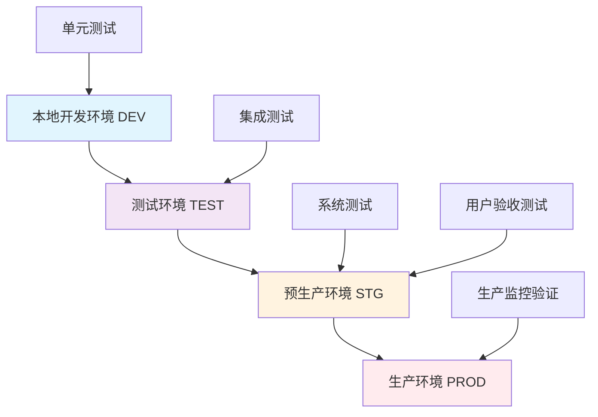

# 子任务485.3: 测试环境和工具配置方案

**任务ID**: 492  
**任务标题**: 485.3 测试环境和工具配置方案  
**执行日期**: 2025-08-05  
**状态**: 执行中  
**基于**: 子任务485.2测试策略设计结果

---

## 🏗️ 1. 测试环境架构设计

### 1.1 四层环境架构

基于子任务485.2确定的测试策略，设计以下**分层测试环境架构**:



### 1.2 环境配置规格

| 环境类型 | 服务器配置 | 数据库配置 | 网络配置 | 监控配置 |
|---------|-----------|-----------|---------|---------|
| **DEV (开发)** | 本地Docker | MySQL 8.0 (单机) | 本地网络 | 基础日志 |
| **TEST (测试)** | 2C4G × 3台 | MySQL 8.0 主从 + Redis 6.0 | 内网隔离 | 完整监控 |
| **STG (预生产)** | 4C8G × 5台 | MySQL 8.0 集群 + Redis集群 | VPN访问 | 生产级监控 |
| **PROD (生产)** | 8C16G × 10台 | MySQL 8.0 HA + Redis HA | 公网+CDN | 全链路监控 |

---

## 🛠️ 2. 测试工具配置方案

### 2.1 前端测试工具配置

#### 📋 单元测试工具 - Vitest 配置

**项目配置文件 `vitest.config.ts`**:
```typescript
/// <reference types="vitest" />
import { defineConfig } from 'vite'
import vue from '@vitejs/plugin-vue'
import { resolve } from 'path'

export default defineConfig({
  plugins: [vue()],
  test: {
    // 测试环境配置
    environment: 'jsdom',
    globals: true,
    setupFiles: ['./tests/setup.ts'],
    
    // 覆盖率配置
    coverage: {
      provider: 'c8',
      reporter: ['text', 'json', 'html', 'lcov'],
      reportsDirectory: './coverage',
      exclude: [
        'node_modules/',
        'tests/',
        '**/*.d.ts',
        'dist/',
        'build/'
      ],
      thresholds: {
        global: {
          branches: 80,
          functions: 85,
          lines: 85,
          statements: 85
        }
      }
    },
    
    // 测试匹配模式
    include: [
      'src/**/*.{test,spec}.{js,mjs,cjs,ts,mts,cts,jsx,tsx}',
      'tests/unit/**/*.{test,spec}.{js,ts}'
    ],
    
    // 测试并发和超时
    testTimeout: 10000,
    hookTimeout: 10000,
    pool: 'forks',
    poolOptions: {
      forks: {
        singleFork: true
      }
    }
  },
  
  resolve: {
    alias: {
      '@': resolve(__dirname, 'src'),
      '@tests': resolve(__dirname, 'tests')
    }
  }
})
```

**测试环境初始化 `tests/setup.ts`**:
```typescript
import '@testing-library/jest-dom'
import { vi } from 'vitest'
import { config } from '@vue/test-utils'

// Mock全局对象
Object.defineProperty(window, 'matchMedia', {
  writable: true,
  value: vi.fn().mockImplementation(query => ({
    matches: false,
    media: query,
    onchange: null,
    addListener: vi.fn(),
    removeListener: vi.fn(),
    addEventListener: vi.fn(),
    removeEventListener: vi.fn(),
    dispatchEvent: vi.fn(),
  })),
})

// Vue Test Utils全局配置
config.global.plugins = []
config.global.stubs = {
  // Ant Design Vue组件存根
  'a-button': true,
  'a-table': true,
  'a-form': true,
  'a-input': true,
  'a-select': true,
  'a-date-picker': true,
  'a-upload': true,
  // 自定义组件存根
  'ele-pro-table': true,
  'router-link': true,
  'router-view': true
}

// 全局Mock
vi.mock('@/utils/request', () => ({
  useGet: vi.fn(),
  usePost: vi.fn(),
  usePut: vi.fn(),
  useDelete: vi.fn(),
  useUpload: vi.fn()
}))

vi.mock('@/stores/user', () => ({
  useUserStore: vi.fn(() => ({
    userInfo: { id: 1, username: 'test', roles: ['admin'] },
    token: 'mock-token',
    permissions: ['sys:user:list', 'sys:role:create']
  }))
}))
```

#### 🖼️ 组件测试配置 - Vue Testing Library

**组件测试示例配置**:
```typescript
// tests/components/UserTable.test.ts
import { render, screen, fireEvent, waitFor } from '@testing-library/vue'
import { vi } from 'vitest'
import UserTable from '@/pages/system/user/UserTable.vue'
import { createPinia } from 'pinia'

const renderWithProviders = (component: any, options = {}) => {
  const pinia = createPinia()
  
  return render(component, {
    global: {
      plugins: [pinia],
      stubs: ['a-table', 'a-button', 'a-input'],
      ...options.global
    },
    ...options
  })
}

describe('UserTable Component', () => {
  beforeEach(() => {
    // 重置所有Mock
    vi.clearAllMocks()
  })
  
  it('should render user table with correct columns', async () => {
    const mockUsers = [
      { id: 1, username: 'admin', status: 1, createTime: '2025-08-05' },
      { id: 2, username: 'user', status: 0, createTime: '2025-08-04' }
    ]
    
    // Mock API请求
    vi.mocked(useGet).mockResolvedValue({
      data: { list: mockUsers, total: 2 }
    })
    
    renderWithProviders(UserTable)
    
    // 验证表格列头
    expect(screen.getByText('用户名')).toBeInTheDocument()
    expect(screen.getByText('状态')).toBeInTheDocument()
    expect(screen.getByText('创建时间')).toBeInTheDocument()
    expect(screen.getByText('操作')).toBeInTheDocument()
    
    // 验证数据加载
    await waitFor(() => {
      expect(screen.getByText('admin')).toBeInTheDocument()
      expect(screen.getByText('user')).toBeInTheDocument()
    })
  })
  
  it('should handle search functionality', async () => {
    renderWithProviders(UserTable)
    
    const searchInput = screen.getByPlaceholderText('请输入用户名搜索')
    const searchButton = screen.getByText('搜索')
    
    await fireEvent.update(searchInput, 'admin')
    await fireEvent.click(searchButton)
    
    expect(vi.mocked(useGet)).toHaveBeenCalledWith(
      '/api/v1/user',
      { keyword: 'admin', page: 1, limit: 10 }
    )
  })
})
```

#### 🌐 E2E测试配置 - Cypress

**Cypress配置文件 `cypress.config.ts`**:
```typescript
import { defineConfig } from 'cypress'

export default defineConfig({
  e2e: {
    // 基础配置
    baseUrl: 'http://localhost:5173',
    supportFile: 'cypress/support/e2e.ts',
    specPattern: 'cypress/e2e/**/*.cy.{js,jsx,ts,tsx}',
    
    // 视口和超时配置
    viewportWidth: 1280,
    viewportHeight: 720,
    defaultCommandTimeout: 10000,
    requestTimeout: 10000,
    responseTimeout: 30000,
    
    // 视频和截图配置
    video: true,
    videoCompression: 32,
    videosFolder: 'cypress/videos',
    screenshotsFolder: 'cypress/screenshots',
    screenshotOnRunFailure: true,
    
    // 测试重试配置
    retries: {
      runMode: 2,
      openMode: 0
    },
    
    setupNodeEvents(on, config) {
      // 测试结果报告
      require('cypress-mochawesome-reporter/plugin')(on)
      
      // 代码覆盖率
      require('@cypress/code-coverage/task')(on, config)
      
      return config
    },
  },
  
  component: {
    devServer: {
      framework: 'vue',
      bundler: 'vite',
    },
    specPattern: 'src/**/*.cy.{js,jsx,ts,tsx}',
  }
})
```

**Cypress支持文件配置 `cypress/support/e2e.ts`**:
```typescript
import './commands'
import 'cypress-mochawesome-reporter/register'
import '@cypress/code-coverage/support'

// 自定义命令
declare global {
  namespace Cypress {
    interface Chainable {
      login(username: string, password: string): Chainable<void>
      createUser(userData: any): Chainable<void>
      createOrder(orderData: any): Chainable<void>
      selectProduct(sku: string, qty: number): Chainable<void>
      approveOrder(approver: string): Chainable<void>
      verifyOrderStatus(status: string): Chainable<void>
    }
  }
}

// 登录命令
Cypress.Commands.add('login', (username: string, password: string) => {
  cy.session(
    [username, password],
    () => {
      cy.visit('/login')
      cy.get('[data-testid="username"]').type(username)
      cy.get('[data-testid="password"]').type(password)
      cy.get('[data-testid="login-button"]').click()
      cy.url().should('contain', '/dashboard')
      cy.window().its('localStorage.token').should('exist')
    },
    {
      validate: () => {
        cy.window().its('localStorage.token').should('exist')
      }
    }
  )
})

// 创建用户命令
Cypress.Commands.add('createUser', (userData) => {
  cy.intercept('POST', '/api/v1/user', { statusCode: 200 }).as('createUser')
  
  cy.visit('/system/user')
  cy.get('[data-testid="add-user-btn"]').click()
  cy.get('[data-testid="username"]').type(userData.username)
  cy.get('[data-testid="email"]').type(userData.email)
  cy.get('[data-testid="role-select"]').click()
  cy.get(`[data-value="${userData.role}"]`).click()
  cy.get('[data-testid="submit-btn"]').click()
  
  cy.wait('@createUser')
  cy.get('.ant-message-success').should('be.visible')
})
```

### 2.2 后端测试工具配置

#### 🧪 Go单元测试配置

**测试环境配置 `tests/config/test_config.go`**:
```go
package config

import (
    "fmt"
    "os"
    "testing"
    
    "gorm.io/driver/mysql"
    "gorm.io/gorm"
    "gorm.io/gorm/logger"
    "github.com/go-redis/redis/v8"
    "github.com/testcontainers/testcontainers-go"
    "github.com/testcontainers/testcontainers-go/modules/mysql"
    "github.com/testcontainers/testcontainers-go/modules/redis"
)

type TestConfig struct {
    DB          *gorm.DB
    RedisClient *redis.Client
    MySQLContainer testcontainers.Container
    RedisContainer testcontainers.Container
}

func SetupTestEnvironment(t *testing.T) *TestConfig {
    ctx := context.Background()
    
    // 启动MySQL测试容器
    mysqlContainer, err := mysql.RunContainer(ctx,
        testcontainers.WithImage("mysql:8.0"),
        mysql.WithDatabase("tuangou_test"),
        mysql.WithUsername("test"),
        mysql.WithPassword("test123"),
        mysql.WithScripts("../../scripts/test-data/01-init-schema.sql"),
    )
    if err != nil {
        t.Fatalf("Failed to start MySQL container: %v", err)
    }
    
    // 获取MySQL连接信息
    mysqlHost, _ := mysqlContainer.Host(ctx)
    mysqlPort, _ := mysqlContainer.MappedPort(ctx, "3306")
    
    // 连接测试数据库
    dsn := fmt.Sprintf("test:test123@tcp(%s:%s)/tuangou_test?charset=utf8mb4&parseTime=True&loc=Local",
        mysqlHost, mysqlPort.Port())
    
    db, err := gorm.Open(mysql.Open(dsn), &gorm.Config{
        Logger: logger.Default.LogMode(logger.Silent),
    })
    if err != nil {
        t.Fatalf("Failed to connect to test database: %v", err)
    }
    
    // 启动Redis测试容器
    redisContainer, err := redis.RunContainer(ctx,
        testcontainers.WithImage("redis:6.0-alpine"),
    )
    if err != nil {
        t.Fatalf("Failed to start Redis container: %v", err)
    }
    
    // 获取Redis连接信息
    redisHost, _ := redisContainer.Host(ctx)
    redisPort, _ := redisContainer.MappedPort(ctx, "6379")
    
    redisClient := redis.NewClient(&redis.Options{
        Addr: fmt.Sprintf("%s:%s", redisHost, redisPort.Port()),
        DB:   0,
    })
    
    return &TestConfig{
        DB:             db,
        RedisClient:    redisClient,
        MySQLContainer: mysqlContainer,
        RedisContainer: redisContainer,
    }
}

func (tc *TestConfig) Cleanup(t *testing.T) {
    ctx := context.Background()
    
    if tc.MySQLContainer != nil {
        tc.MySQLContainer.Terminate(ctx)
    }
    
    if tc.RedisContainer != nil {
        tc.RedisContainer.Terminate(ctx)
    }
}
```

**测试套件基类 `tests/suite/base_test_suite.go`**:
```go
package suite

import (
    "testing"
    "tuangou/tests/config"
    
    "github.com/stretchr/testify/suite"
    "gorm.io/gorm"
)

type BaseTestSuite struct {
    suite.Suite
    TestConfig *config.TestConfig
    DB         *gorm.DB
}

func (s *BaseTestSuite) SetupSuite() {
    // 设置测试环境
    s.TestConfig = config.SetupTestEnvironment(s.T())
    s.DB = s.TestConfig.DB
    
    // 运行数据迁移
    s.runMigrations()
    
    // 初始化测试数据
    s.seedTestData()
}

func (s *BaseTestSuite) TearDownSuite() {
    // 清理测试环境
    s.TestConfig.Cleanup(s.T())
}

func (s *BaseTestSuite) SetupTest() {
    // 每个测试前的设置
    s.DB.Exec("SET FOREIGN_KEY_CHECKS = 0")
    
    // 清理测试数据
    s.cleanupTestData()
    
    // 重新初始化基础测试数据
    s.seedBasicTestData()
    
    s.DB.Exec("SET FOREIGN_KEY_CHECKS = 1")
}

func (s *BaseTestSuite) TearDownTest() {
    // 每个测试后的清理
    s.cleanupTestData()
}

func (s *BaseTestSuite) runMigrations() {
    // 自动迁移数据库表结构
    s.DB.AutoMigrate(
        &model.SysUser{},
        &model.SysRole{},
        &model.SysMenu{},
        &model.SysDept{},
        // ... 其他模型
    )
}

func (s *BaseTestSuite) seedTestData() {
    // 加载测试数据
    LoadSQLFile(s.DB, "../../scripts/test-data/02-init-basic-data.sql")
}

func (s *BaseTestSuite) cleanupTestData() {
    // 清理业务数据表，保留基础配置数据
    tables := []string{
        "oms_sales_order",
        "oms_sales_order_item", 
        "pms_inventory",
        "fms_transaction",
        "cms_customer_quote",
        // ... 其他业务表
    }
    
    for _, table := range tables {
        s.DB.Exec(fmt.Sprintf("TRUNCATE TABLE %s", table))
    }
}
```

#### 🔧 API集成测试配置

**HTTP测试工具配置 `tests/integration/api_test_helper.go`**:
```go
package integration

import (
    "bytes"
    "encoding/json"
    "fmt"
    "net/http"
    "net/http/httptest"
    "testing"
    
    "github.com/gin-gonic/gin"
    "github.com/stretchr/testify/assert"
    "tuangou/internal/core/core"
)

type APITestHelper struct {
    Router *gin.Engine
    Token  string
}

func NewAPITestHelper() *APITestHelper {
    gin.SetMode(gin.TestMode)
    router := gin.New()
    
    // 初始化路由
    setupTestRoutes(router)
    
    return &APITestHelper{
        Router: router,
    }
}

func (h *APITestHelper) Login(username, password string) error {
    loginData := map[string]string{
        "username": username,
        "password": password,
    }
    
    resp := h.POST("/api/v1/login", loginData)
    
    if resp.Code != http.StatusOK {
        return fmt.Errorf("login failed with status %d", resp.Code)
    }
    
    var result core.Response
    json.Unmarshal(resp.Body.Bytes(), &result)
    
    if loginResp, ok := result.Data.(map[string]interface{}); ok {
        if token, exists := loginResp["token"]; exists {
            h.Token = token.(string)
            return nil
        }
    }
    
    return fmt.Errorf("token not found in login response")
}

func (h *APITestHelper) GET(url string) *httptest.ResponseRecorder {
    req := httptest.NewRequest("GET", url, nil)
    if h.Token != "" {
        req.Header.Set("Authorization", "Bearer "+h.Token)
    }
    
    resp := httptest.NewRecorder()
    h.Router.ServeHTTP(resp, req)
    
    return resp
}

func (h *APITestHelper) POST(url string, data interface{}) *httptest.ResponseRecorder {
    jsonData, _ := json.Marshal(data)
    req := httptest.NewRequest("POST", url, bytes.NewBuffer(jsonData))
    req.Header.Set("Content-Type", "application/json")
    
    if h.Token != "" {
        req.Header.Set("Authorization", "Bearer "+h.Token)
    }
    
    resp := httptest.NewRecorder()
    h.Router.ServeHTTP(resp, req)
    
    return resp
}

func (h *APITestHelper) AssertSuccess(t *testing.T, resp *httptest.ResponseRecorder) {
    assert.Equal(t, http.StatusOK, resp.Code)
    
    var result core.Response
    err := json.Unmarshal(resp.Body.Bytes(), &result)
    assert.NoError(t, err)
    assert.Equal(t, 0, result.Code) // 业务成功码
}

func (h *APITestHelper) AssertError(t *testing.T, resp *httptest.ResponseRecorder, expectedCode int) {
    var result core.Response
    err := json.Unmarshal(resp.Body.Bytes(), &result)
    assert.NoError(t, err)
    assert.Equal(t, expectedCode, result.Code)
}
```

### 2.3 性能测试工具配置

#### ⚡ JMeter压力测试配置

**JMeter测试计划配置 `performance/tuangou-load-test.jmx`**:
```xml
<?xml version="1.0" encoding="UTF-8"?>
<jmeterTestPlan version="1.2" properties="5.0" jmeter="5.6.2">
  <hashTree>
    <TestPlan guiclass="TestPlanGui" testclass="TestPlan" testname="李宁团购管理平台负载测试">
      <stringProp name="TestPlan.comments">李宁团购管理平台性能测试计划</stringProp>
      <boolProp name="TestPlan.functional_mode">false</boolProp>
      <boolProp name="TestPlan.serialize_threadgroups">false</boolProp>
      
      <!-- 用户自定义变量 -->
      <elementProp name="TestPlan.arguments" elementType="Arguments" guiclass="ArgumentsPanel">
        <collectionProp name="Arguments.arguments">
          <elementProp name="HOST" elementType="Argument">
            <stringProp name="Argument.name">HOST</stringProp>
            <stringProp name="Argument.value">${__P(host,test-api.tuangou.com)}</stringProp>
          </elementProp>
          <elementProp name="PORT" elementType="Argument">
            <stringProp name="Argument.name">PORT</stringProp>
            <stringProp name="Argument.value">${__P(port,80)}</stringProp>
          </elementProp>
          <elementProp name="USERS" elementType="Argument">
            <stringProp name="Argument.name">USERS</stringProp>
            <stringProp name="Argument.value">${__P(users,100)}</stringProp>
          </elementProp>
          <elementProp name="RAMP_TIME" elementType="Argument">
            <stringProp name="Argument.name">RAMP_TIME</stringProp>
            <stringProp name="Argument.value">${__P(rampTime,300)}</stringProp>
          </elementProp>
          <elementProp name="DURATION" elementType="Argument">
            <stringProp name="Argument.name">DURATION</stringProp>
            <stringProp name="Argument.value">${__P(duration,600)}</stringProp>
          </elementProp>
        </collectionProp>
      </elementProp>
    </TestPlan>
    
    <hashTree>
      <!-- 线程组 - 登录场景 -->
      <ThreadGroup guiclass="ThreadGroupGui" testclass="ThreadGroup" testname="登录压力测试">
        <stringProp name="ThreadGroup.on_sample_error">continue</stringProp>
        <elementProp name="ThreadGroup.main_controller" elementType="LoopController">
          <boolProp name="LoopController.continue_forever">false</boolProp>
          <intProp name="LoopController.loops">-1</intProp>
        </elementProp>
        <stringProp name="ThreadGroup.num_threads">${USERS}</stringProp>
        <stringProp name="ThreadGroup.ramp_time">${RAMP_TIME}</stringProp>
        <longProp name="ThreadGroup.duration">${DURATION}</longProp>
        <boolProp name="ThreadGroup.scheduler">true</boolProp>
      </ThreadGroup>
      
      <!-- HTTP请求默认值 -->
      <ConfigTestElement guiclass="HttpDefaultsGui" testclass="ConfigTestElement" testname="HTTP请求默认值">
        <elementProp name="HTTPsampler.Arguments" elementType="Arguments">
          <collectionProp name="Arguments.arguments"/>
        </elementProp>
        <stringProp name="HTTPSampler.domain">${HOST}</stringProp>
        <stringProp name="HTTPSampler.port">${PORT}</stringProp>
        <stringProp name="HTTPSampler.protocol">http</stringProp>
        <stringProp name="HTTPSampler.contentEncoding">UTF-8</stringProp>
        <stringProp name="HTTPSampler.path"></stringProp>
      </ConfigTestElement>
    </hashTree>
  </hashTree>
</jmeterTestPlan>
```

#### 📊 K6性能测试脚本

**K6压力测试脚本 `performance/k6-stress-test.js`**:
```javascript
import http from 'k6/http';
import { group, check, sleep } from 'k6';
import { Counter, Rate, Trend } from 'k6/metrics';

// 自定义指标
export const errorRate = new Rate('errors');
export const loginDuration = new Trend('login_duration');
export const orderCreateDuration = new Trend('order_create_duration');

// 测试配置
export const options = {
  stages: [
    { duration: '5m', target: 100 },   // Ramp up to 100 users
    { duration: '10m', target: 500 },  // Ramp up to 500 users  
    { duration: '15m', target: 1000 }, // Ramp up to 1000 users
    { duration: '10m', target: 1000 }, // Stay at 1000 users
    { duration: '5m', target: 0 },     // Ramp down to 0 users
  ],
  thresholds: {
    http_req_duration: ['p(95)<2000'], // 95% of requests must complete below 2s
    http_req_failed: ['rate<0.1'],     // Error rate must be below 10%
    login_duration: ['p(95)<1000'],    // 95% of logins must complete below 1s
    order_create_duration: ['p(95)<3000'], // 95% of order creation below 3s
  },
};

const BASE_URL = __ENV.BASE_URL || 'http://test-api.tuangou.com';

// 测试用户数据
const users = [
  { username: 'testuser1', password: 'password123' },
  { username: 'testuser2', password: 'password123' },
  { username: 'testuser3', password: 'password123' },
  // ... 更多测试用户
];

export default function () {
  const user = users[Math.floor(Math.random() * users.length)];
  let authToken = '';
  
  group('用户登录流程', () => {
    const loginPayload = JSON.stringify({
      username: user.username,
      password: user.password
    });
    
    const loginParams = {
      headers: { 'Content-Type': 'application/json' },
    };
    
    const loginStart = Date.now();
    const loginRes = http.post(`${BASE_URL}/api/v1/login`, loginPayload, loginParams);
    const loginEnd = Date.now();
    
    loginDuration.add(loginEnd - loginStart);
    
    const loginCheck = check(loginRes, {
      '登录状态码为200': (r) => r.status === 200,
      '登录返回token': (r) => {
        const body = JSON.parse(r.body);
        return body.code === 0 && body.data && body.data.token;
      },
    });
    
    if (loginCheck) {
      const loginBody = JSON.parse(loginRes.body);
      authToken = loginBody.data.token;
    } else {
      errorRate.add(1);
      return; // Exit if login fails
    }
  });
  
  if (authToken) {
    group('商品查询流程', () => {
      const headers = {
        'Authorization': `Bearer ${authToken}`,
        'Content-Type': 'application/json',
      };
      
      const productRes = http.get(`${BASE_URL}/api/v1/pms/spu?page=1&limit=20`, { headers });
      
      check(productRes, {
        '商品查询状态码为200': (r) => r.status === 200,
        '商品查询返回数据': (r) => {
          const body = JSON.parse(r.body);
          return body.code === 0 && body.data && body.data.list;
        },
      });
    });
    
    group('订单创建流程', () => {
      const orderPayload = JSON.stringify({
        customerId: 1,
        items: [
          { skuId: 1, quantity: 10, price: 299.00 },
          { skuId: 2, quantity: 5, price: 399.00 }
        ],
        remark: '性能测试订单'
      });
      
      const headers = {
        'Authorization': `Bearer ${authToken}`,
        'Content-Type': 'application/json',
      };
      
      const orderStart = Date.now();
      const orderRes = http.post(`${BASE_URL}/api/v1/oms/sales-order`, orderPayload, { headers });
      const orderEnd = Date.now();
      
      orderCreateDuration.add(orderEnd - orderStart);
      
      check(orderRes, {
        '订单创建状态码为200': (r) => r.status === 200,
        '订单创建成功': (r) => {
          const body = JSON.parse(r.body);
          return body.code === 0;
        },
      });
    });
  }
  
  sleep(Math.random() * 3 + 1); // 1-4秒随机休眠
}

export function handleSummary(data) {
  return {
    'performance-report.html': htmlReport(data),
    'performance-summary.json': JSON.stringify(data),
  };
}

function htmlReport(data) {
  return `
    <!DOCTYPE html>
    <html>
    <head>
        <title>李宁团购管理平台性能测试报告</title>
        <style>
            body { font-family: Arial, sans-serif; margin: 20px; }
            .metric { margin: 10px 0; }
            .pass { color: green; }
            .fail { color: red; }
        </style>
    </head>
    <body>
        <h1>性能测试报告</h1>
        <h2>测试摘要</h2>
        <div class="metric">总请求数: ${data.metrics.http_reqs.count}</div>
        <div class="metric">失败请求数: ${data.metrics.http_req_failed.count}</div>
        <div class="metric">平均响应时间: ${data.metrics.http_req_duration.avg.toFixed(2)}ms</div>
        <div class="metric">95%响应时间: ${data.metrics.http_req_duration['p(95)'].toFixed(2)}ms</div>
        <div class="metric">最大响应时间: ${data.metrics.http_req_duration.max.toFixed(2)}ms</div>
        
        <h2>阈值检查</h2>
        ${Object.entries(data.thresholds).map(([name, threshold]) => 
          `<div class="metric ${threshold.ok ? 'pass' : 'fail'}">
            ${name}: ${threshold.ok ? '✓ 通过' : '✗ 失败'}
          </div>`
        ).join('')}
    </body>
    </html>
  `;
}
```

---

## 🔧 3. 测试数据管理配置

### 3.1 测试数据初始化脚本

**基础数据初始化 `scripts/test-data/01-init-schema.sql`**:
```sql
-- 李宁团购管理平台测试数据库初始化脚本
SET NAMES utf8mb4;
SET FOREIGN_KEY_CHECKS = 0;

-- 系统管理表
CREATE TABLE IF NOT EXISTS `sys_user` (
  `id` bigint NOT NULL AUTO_INCREMENT COMMENT '用户ID',
  `username` varchar(50) NOT NULL COMMENT '用户名',
  `nickname` varchar(50) DEFAULT NULL COMMENT '昵称',
  `email` varchar(100) DEFAULT NULL COMMENT '邮箱',
  `phone` varchar(20) DEFAULT NULL COMMENT '手机号',
  `password` varchar(100) NOT NULL COMMENT '密码',
  `salt` varchar(50) DEFAULT NULL COMMENT '盐值',
  `avatar` varchar(200) DEFAULT NULL COMMENT '头像',
  `status` tinyint DEFAULT '1' COMMENT '状态(0-禁用,1-启用)',
  `dept_id` bigint DEFAULT NULL COMMENT '部门ID',
  `create_time` datetime DEFAULT CURRENT_TIMESTAMP COMMENT '创建时间',
  `update_time` datetime DEFAULT CURRENT_TIMESTAMP ON UPDATE CURRENT_TIMESTAMP COMMENT '更新时间',
  `create_by` bigint DEFAULT NULL COMMENT '创建人',
  `update_by` bigint DEFAULT NULL COMMENT '更新人',
  `remark` varchar(500) DEFAULT NULL COMMENT '备注',
  PRIMARY KEY (`id`),
  UNIQUE KEY `uk_username` (`username`),
  KEY `idx_dept_id` (`dept_id`),
  KEY `idx_status` (`status`)
) ENGINE=InnoDB DEFAULT CHARSET=utf8mb4 COMMENT='系统用户表';

-- 角色表
CREATE TABLE IF NOT EXISTS `sys_role` (
  `id` bigint NOT NULL AUTO_INCREMENT COMMENT '角色ID',
  `role_name` varchar(50) NOT NULL COMMENT '角色名称',
  `role_key` varchar(50) NOT NULL COMMENT '角色标识',
  `role_sort` int DEFAULT '0' COMMENT '显示顺序',
  `data_scope` char(1) DEFAULT '1' COMMENT '数据范围(1-全部,2-自定义,3-本部门,4-本部门及以下)',
  `menu_check_strictly` tinyint DEFAULT '1' COMMENT '菜单树选择项是否关联显示',
  `dept_check_strictly` tinyint DEFAULT '1' COMMENT '部门树选择项是否关联显示',
  `status` tinyint DEFAULT '1' COMMENT '状态(0-禁用,1-启用)',
  `create_time` datetime DEFAULT CURRENT_TIMESTAMP COMMENT '创建时间',
  `update_time` datetime DEFAULT CURRENT_TIMESTAMP ON UPDATE CURRENT_TIMESTAMP COMMENT '更新时间',
  `create_by` bigint DEFAULT NULL COMMENT '创建人',
  `update_by` bigint DEFAULT NULL COMMENT '更新人',
  `remark` varchar(500) DEFAULT NULL COMMENT '备注',
  PRIMARY KEY (`id`),
  UNIQUE KEY `uk_role_key` (`role_key`)
) ENGINE=InnoDB DEFAULT CHARSET=utf8mb4 COMMENT='角色信息表';

-- 商品管理表
CREATE TABLE IF NOT EXISTS `pms_spu` (
  `id` bigint NOT NULL AUTO_INCREMENT COMMENT 'SPU ID',
  `spu_code` varchar(50) NOT NULL COMMENT 'SPU编码',
  `spu_name` varchar(200) NOT NULL COMMENT 'SPU名称', 
  `category_id` bigint NOT NULL COMMENT '分类ID',
  `brand_id` bigint NOT NULL COMMENT '品牌ID',
  `description` text COMMENT '商品描述',
  `status` tinyint DEFAULT '1' COMMENT '状态(0-下架,1-上架)',
  `create_time` datetime DEFAULT CURRENT_TIMESTAMP COMMENT '创建时间',
  `update_time` datetime DEFAULT CURRENT_TIMESTAMP ON UPDATE CURRENT_TIMESTAMP COMMENT '更新时间',
  PRIMARY KEY (`id`),
  UNIQUE KEY `uk_spu_code` (`spu_code`),
  KEY `idx_category_id` (`category_id`),
  KEY `idx_brand_id` (`brand_id`)
) ENGINE=InnoDB DEFAULT CHARSET=utf8mb4 COMMENT='标准产品单元表';

-- 订单管理表
CREATE TABLE IF NOT EXISTS `oms_sales_order` (
  `id` bigint NOT NULL AUTO_INCREMENT COMMENT '订单ID',
  `order_no` varchar(50) NOT NULL COMMENT '订单号',
  `customer_id` bigint NOT NULL COMMENT '客户ID',
  `order_status` varchar(20) DEFAULT 'PENDING' COMMENT '订单状态',
  `total_amount` decimal(10,2) DEFAULT '0.00' COMMENT '订单总金额',
  `order_time` datetime DEFAULT CURRENT_TIMESTAMP COMMENT '下单时间',
  `create_time` datetime DEFAULT CURRENT_TIMESTAMP COMMENT '创建时间',
  `update_time` datetime DEFAULT CURRENT_TIMESTAMP ON UPDATE CURRENT_TIMESTAMP COMMENT '更新时间',
  PRIMARY KEY (`id`),
  UNIQUE KEY `uk_order_no` (`order_no`),
  KEY `idx_customer_id` (`customer_id`),
  KEY `idx_order_status` (`order_status`)
) ENGINE=InnoDB DEFAULT CHARSET=utf8mb4 COMMENT='销售订单表';

-- 其他业务表...
-- (这里省略其他表的创建语句，实际应包含所有业务表)

SET FOREIGN_KEY_CHECKS = 1;
```

**基础测试数据 `scripts/test-data/02-init-basic-data.sql`**:
```sql
-- 插入测试用户数据
INSERT INTO `sys_user` (`username`, `nickname`, `email`, `phone`, `password`, `status`, `dept_id`) VALUES
('admin', '系统管理员', 'admin@tuangou.com', '13800000001', '$2a$10$7JB720yubVSa.VQRgHT/lO.2sYgfEMhA0KF8Q/1zz3.w5F5Q5Q5Q5', 1, 1),
('sales_manager', '销售经理', 'sales@tuangou.com', '13800000002', '$2a$10$7JB720yubVSa.VQRgHT/lO.2sYgfEMhA0KF8Q/1zz3.w5F5Q5Q5Q5', 1, 2),
('product_manager', '商品经理', 'product@tuangou.com', '13800000003', '$2a$10$7JB720yubVSa.VQRgHT/lO.2sYgfEMhA0KF8Q/1zz3.w5F5Q5Q5Q5', 1, 3),
('customer_service', '客服专员', 'service@tuangou.com', '13800000004', '$2a$10$7JB720yubVSa.VQRgHT/lO.2sYgfEMhA0KF8Q/1zz3.w5F5Q5Q5Q5', 1, 4),
('finance_manager', '财务经理', 'finance@tuangou.com', '13800000005', '$2a$10$7JB720yubVSa.VQRgHT/lO.2sYgfEMhA0KF8Q/1zz3.w5F5Q5Q5Q5', 1, 5);

-- 插入角色数据
INSERT INTO `sys_role` (`role_name`, `role_key`, `role_sort`, `status`) VALUES
('超级管理员', 'admin', 1, 1),
('销售经理', 'sales_manager', 2, 1),
('商品经理', 'product_manager', 3, 1),
('客服专员', 'customer_service', 4, 1),
('财务人员', 'finance_staff', 5, 1);

-- 插入商品分类数据
INSERT INTO `pms_category` (`category_name`, `parent_id`, `level`, `sort`, `status`) VALUES
('运动服装', 0, 1, 1, 1),
('运动鞋', 0, 1, 2, 1),
('运动配件', 0, 1, 3, 1),
('T恤', 1, 2, 1, 1),
('裤子', 1, 2, 2, 1),
('跑步鞋', 2, 2, 1, 1),
('篮球鞋', 2, 2, 2, 1);

-- 插入品牌数据  
INSERT INTO `pms_brand` (`brand_name`, `brand_logo`, `description`, `status`) VALUES
('李宁', '/images/brands/lining.png', '李宁体育用品有限公司', 1),
('安踏', '/images/brands/anta.png', '安踏体育用品有限公司', 1),
('特步', '/images/brands/xtep.png', '特步国际控股有限公司', 1);

-- 插入SPU测试数据
INSERT INTO `pms_spu` (`spu_code`, `spu_name`, `category_id`, `brand_id`, `description`, `status`) VALUES
('LN-T001', '李宁男士运动T恤', 4, 1, '舒适透气的男士运动T恤', 1),
('LN-P001', '李宁男士运动裤', 5, 1, '宽松舒适的男士运动裤', 1),
('LN-S001', '李宁男士跑步鞋', 6, 1, '轻便耐穿的男士跑步鞋', 1),
('LN-B001', '李宁男士篮球鞋', 7, 1, '专业篮球运动鞋', 1);

-- 插入客户测试数据
INSERT INTO `cms_customer` (`customer_name`, `customer_type`, `contact_person`, `contact_phone`, `email`, `address`, `status`) VALUES
('北京李宁专营店', 'distributor', '张经理', '13800001001', 'beijing@lining.com', '北京市朝阳区', 1),
('上海李宁旗舰店', 'distributor', '李经理', '13800001002', 'shanghai@lining.com', '上海市浦东新区', 1),
('广州李宁体验店', 'retailer', '王经理', '13800001003', 'guangzhou@lining.com', '广州市天河区', 1);

-- 更多测试数据...
```

### 3.2 测试数据管理工具

**数据清理脚本 `scripts/test-data/cleanup-test-data.sql`**:
```sql
-- 清理业务测试数据，保留基础配置数据
SET FOREIGN_KEY_CHECKS = 0;

-- 清理订单相关数据
TRUNCATE TABLE `oms_sales_order_item`;
TRUNCATE TABLE `oms_sales_order`;

-- 清理库存相关数据  
DELETE FROM `pms_inventory` WHERE `id` > 0;

-- 清理财务相关数据
TRUNCATE TABLE `fms_transaction`;
DELETE FROM `fms_recharge` WHERE `id` > 0;

-- 清理客户报价数据
TRUNCATE TABLE `cms_customer_quote`;
TRUNCATE TABLE `cms_customer_quote_item`;

-- 重置自增ID
ALTER TABLE `oms_sales_order` AUTO_INCREMENT = 1;
ALTER TABLE `oms_sales_order_item` AUTO_INCREMENT = 1;
ALTER TABLE `pms_inventory` AUTO_INCREMENT = 1;
ALTER TABLE `fms_transaction` AUTO_INCREMENT = 1;
ALTER TABLE `fms_recharge` AUTO_INCREMENT = 1;
ALTER TABLE `cms_customer_quote` AUTO_INCREMENT = 1;
ALTER TABLE `cms_customer_quote_item` AUTO_INCREMENT = 1;

SET FOREIGN_KEY_CHECKS = 1;
```

**测试数据生成工具 `scripts/tools/generate-test-data.go`**:
```go
package main

import (
    "fmt"
    "math/rand"
    "time"
    
    "gorm.io/driver/mysql"
    "gorm.io/gorm"
)

type TestDataGenerator struct {
    DB *gorm.DB
}

func main() {
    // 连接数据库
    dsn := "test:test123@tcp(localhost:3306)/tuangou_test?charset=utf8mb4&parseTime=True&loc=Local"
    db, err := gorm.Open(mysql.Open(dsn), &gorm.Config{})
    if err != nil {
        panic("Failed to connect to database")
    }
    
    generator := &TestDataGenerator{DB: db}
    
    // 生成测试数据
    generator.GenerateOrderData(1000)      // 生成1000个订单
    generator.GenerateInventoryData(2000)  // 生成2000条库存记录  
    generator.GenerateTransactionData(500) // 生成500条交易记录
    
    fmt.Println("测试数据生成完成!")
}

func (g *TestDataGenerator) GenerateOrderData(count int) {
    fmt.Printf("生成 %d 个订单数据...\n", count)
    
    customerIds := []int64{1, 2, 3, 4, 5} // 客户ID列表
    statuses := []string{"PENDING", "APPROVED", "PAID", "SHIPPED", "COMPLETED", "CANCELLED"}
    
    for i := 0; i < count; i++ {
        order := map[string]interface{}{
            "order_no":     fmt.Sprintf("ORD%d%06d", time.Now().Year(), i+1),
            "customer_id":  customerIds[rand.Intn(len(customerIds))],
            "order_status": statuses[rand.Intn(len(statuses))],
            "total_amount": rand.Float64()*5000 + 100, // 100-5100 random amount
            "order_time":   time.Now().AddDate(0, 0, -rand.Intn(365)), // 过去一年内随机时间
            "create_time":  time.Now(),
            "update_time":  time.Now(),
        }
        
        g.DB.Table("oms_sales_order").Create(order)
        
        // 为每个订单生成1-5个订单项
        itemCount := rand.Intn(5) + 1
        for j := 0; j < itemCount; j++ {
            orderItem := map[string]interface{}{
                "order_id": i + 1,
                "sku_id":   rand.Intn(100) + 1,
                "quantity": rand.Intn(50) + 1,
                "price":    rand.Float64()*500 + 50,
            }
            g.DB.Table("oms_sales_order_item").Create(orderItem)
        }
    }
}

func (g *TestDataGenerator) GenerateInventoryData(count int) {
    fmt.Printf("生成 %d 条库存数据...\n", count)
    
    for i := 0; i < count; i++ {
        inventory := map[string]interface{}{
            "sku_id":       i + 1,
            "warehouse_id": rand.Intn(10) + 1,
            "quantity":     rand.Intn(1000) + 100,
            "frozen_qty":   rand.Intn(50),
            "alert_qty":    rand.Intn(100) + 10,
            "create_time":  time.Now(),
            "update_time":  time.Now(),
        }
        
        g.DB.Table("pms_inventory").Create(inventory)
    }
}

func (g *TestDataGenerator) GenerateTransactionData(count int) {
    fmt.Printf("生成 %d 条交易数据...\n", count)
    
    transTypes := []string{"RECHARGE", "ORDER_PAY", "REFUND", "WITHDRAW"}
    statuses := []string{"PENDING", "SUCCESS", "FAILED"}
    
    for i := 0; i < count; i++ {
        transaction := map[string]interface{}{
            "trans_no":     fmt.Sprintf("TXN%d%08d", time.Now().Year(), i+1),
            "account_id":   rand.Intn(200) + 1,
            "trans_type":   transTypes[rand.Intn(len(transTypes))],
            "amount":       rand.Float64()*10000 + 100,
            "status":       statuses[rand.Intn(len(statuses))],
            "trans_time":   time.Now().AddDate(0, 0, -rand.Intn(180)),
            "create_time":  time.Now(),
            "update_time":  time.Now(),
        }
        
        g.DB.Table("fms_transaction").Create(transaction)
    }
}
```

---

## 🚀 4. CI/CD测试流水线配置

### 4.1 GitHub Actions配置

**测试流水线 `.github/workflows/test.yml`**:
```yaml
name: 李宁团购管理平台测试流水线

on:
  push:
    branches: [ main, develop ]
  pull_request:
    branches: [ main, develop ]

env:
  NODE_VERSION: '18'
  GO_VERSION: '1.21'

jobs:
  # 阶段1: 代码质量检查
  code-quality:
    runs-on: ubuntu-latest
    name: 代码质量检查
    
    steps:
    - name: 检出代码
      uses: actions/checkout@v4
      
    - name: 设置Node.js环境
      uses: actions/setup-node@v4
      with:
        node-version: ${{ env.NODE_VERSION }}
        cache: 'yarn'
        cache-dependency-path: 'tuangou-admin/yarn.lock'
        
    - name: 设置Go环境
      uses: actions/setup-go@v4
      with:
        go-version: ${{ env.GO_VERSION }}
        
    - name: 安装前端依赖
      working-directory: ./tuangou-admin
      run: yarn install --frozen-lockfile
      
    - name: 前端代码检查
      working-directory: ./tuangou-admin
      run: |
        yarn lint
        yarn type-check
        
    - name: 后端代码检查
      working-directory: ./tuangou
      run: |
        go mod tidy
        go vet ./...
        go fmt ./...
        
    - name: 安全漏洞扫描
      working-directory: ./tuangou
      run: |
        go install github.com/securecodewarrior/gosec/v2/cmd/gosec@latest
        gosec ./...

  # 阶段2: 单元测试
  unit-tests:
    runs-on: ubuntu-latest
    needs: code-quality
    name: 单元测试
    
    services:
      mysql:
        image: mysql:8.0
        env:
          MYSQL_ROOT_PASSWORD: root123
          MYSQL_DATABASE: tuangou_test
          MYSQL_USER: test
          MYSQL_PASSWORD: test123
        ports:
          - 3306:3306
        options: >-
          --health-cmd="mysqladmin ping"
          --health-interval=10s
          --health-timeout=5s
          --health-retries=3
          
      redis:
        image: redis:6.0
        ports:
          - 6379:6379
        options: >-
          --health-cmd="redis-cli ping"
          --health-interval=10s
          --health-timeout=5s
          --health-retries=3
    
    steps:
    - name: 检出代码
      uses: actions/checkout@v4
      
    - name: 设置测试环境
      uses: actions/setup-node@v4
      with:
        node-version: ${{ env.NODE_VERSION }}
        cache: 'yarn'
        cache-dependency-path: 'tuangou-admin/yarn.lock'
        
    - name: 设置Go环境
      uses: actions/setup-go@v4
      with:
        go-version: ${{ env.GO_VERSION }}
        
    - name: 安装前端依赖
      working-directory: ./tuangou-admin
      run: yarn install --frozen-lockfile
      
    - name: 初始化测试数据库
      run: |
        mysql -h 127.0.0.1 -P 3306 -u test -ptest123 tuangou_test < ./scripts/test-data/01-init-schema.sql
        mysql -h 127.0.0.1 -P 3306 -u test -ptest123 tuangou_test < ./scripts/test-data/02-init-basic-data.sql
        
    - name: 前端单元测试
      working-directory: ./tuangou-admin
      run: yarn test:unit --coverage
      
    - name: 后端单元测试
      working-directory: ./tuangou
      env:
        DB_HOST: 127.0.0.1
        DB_PORT: 3306
        DB_USER: test
        DB_PASSWORD: test123
        DB_NAME: tuangou_test
        REDIS_HOST: 127.0.0.1
        REDIS_PORT: 6379
      run: |
        go mod download
        make test-unit
        
    - name: 生成测试覆盖率报告
      working-directory: ./tuangou
      run: make cover
      
    - name: 上传覆盖率报告
      uses: codecov/codecov-action@v3
      with:
        files: ./tuangou/coverage.out,./tuangou-admin/coverage/lcov.info
        fail_ci_if_error: true

  # 阶段3: 集成测试
  integration-tests:
    runs-on: ubuntu-latest
    needs: unit-tests
    name: 集成测试
    
    services:
      mysql:
        image: mysql:8.0
        env:
          MYSQL_ROOT_PASSWORD: root123
          MYSQL_DATABASE: tuangou_test
          MYSQL_USER: test
          MYSQL_PASSWORD: test123
        ports:
          - 3306:3306
          
      redis:
        image: redis:6.0
        ports:
          - 6379:6379
    
    steps:
    - name: 检出代码
      uses: actions/checkout@v4
      
    - name: 设置Go环境
      uses: actions/setup-go@v4
      with:
        go-version: ${{ env.GO_VERSION }}
        
    - name: 初始化测试数据
      run: |
        mysql -h 127.0.0.1 -P 3306 -u test -ptest123 tuangou_test < ./scripts/test-data/01-init-schema.sql
        mysql -h 127.0.0.1 -P 3306 -u test -ptest123 tuangou_test < ./scripts/test-data/02-init-basic-data.sql
        
    - name: 启动后端服务
      working-directory: ./tuangou
      env:
        DB_HOST: 127.0.0.1
        DB_PORT: 3306
        DB_USER: test
        DB_PASSWORD: test123
        DB_NAME: tuangou_test
        REDIS_HOST: 127.0.0.1
        REDIS_PORT: 6379
      run: |
        go build -o tuangou ./cmd/server
        ./tuangou &
        sleep 10
        
    - name: API集成测试
      working-directory: ./tuangou
      run: make test-integration
      
    - name: 数据库集成测试
      working-directory: ./tuangou
      run: make test-db

  # 阶段4: E2E测试
  e2e-tests:
    runs-on: ubuntu-latest
    needs: integration-tests
    name: E2E测试
    
    services:
      mysql:
        image: mysql:8.0
        env:
          MYSQL_ROOT_PASSWORD: root123
          MYSQL_DATABASE: tuangou_test
          MYSQL_USER: test
          MYSQL_PASSWORD: test123
        ports:
          - 3306:3306
          
      redis:
        image: redis:6.0
        ports:
          - 6379:6379
    
    steps:
    - name: 检出代码
      uses: actions/checkout@v4
      
    - name: 设置Node.js环境
      uses: actions/setup-node@v4
      with:
        node-version: ${{ env.NODE_VERSION }}
        cache: 'yarn'
        cache-dependency-path: 'tuangou-admin/yarn.lock'
        
    - name: 设置Go环境
      uses: actions/setup-go@v4
      with:
        go-version: ${{ env.GO_VERSION }}
        
    - name: 安装前端依赖
      working-directory: ./tuangou-admin
      run: yarn install --frozen-lockfile
      
    - name: 构建前端项目
      working-directory: ./tuangou-admin
      run: yarn build
      
    - name: 启动测试环境
      run: |
        # 初始化数据库
        mysql -h 127.0.0.1 -P 3306 -u test -ptest123 tuangou_test < ./scripts/test-data/01-init-schema.sql
        mysql -h 127.0.0.1 -P 3306 -u test -ptest123 tuangou_test < ./scripts/test-data/02-init-basic-data.sql
        
        # 启动后端服务
        cd ./tuangou
        go build -o tuangou ./cmd/server
        ./tuangou &
        
        # 启动前端服务
        cd ../tuangou-admin
        yarn preview --port 5173 &
        
        # 等待服务启动
        sleep 15
        
    - name: 运行E2E测试
      working-directory: ./tuangou-admin
      run: yarn test:e2e --headless
      
    - name: 上传E2E测试报告
      uses: actions/upload-artifact@v3
      if: always()
      with:
        name: e2e-test-results
        path: |
          tuangou-admin/cypress/videos/
          tuangou-admin/cypress/screenshots/
          tuangou-admin/cypress/reports/

  # 阶段5: 性能测试
  performance-tests:
    runs-on: ubuntu-latest
    needs: e2e-tests
    name: 性能测试
    if: github.ref == 'refs/heads/main'
    
    steps:
    - name: 检出代码
      uses: actions/checkout@v4
      
    - name: 设置测试环境
      run: |
        docker-compose -f docker/test/docker-compose.yml up -d
        sleep 30
        
    - name: 运行K6性能测试
      run: |
        # 安装K6
        sudo gpg -k
        sudo gpg --no-default-keyring --keyring /usr/share/keyrings/k6-archive-keyring.gpg --keyserver hkp://keyserver.ubuntu.com:80 --recv-keys C5AD17C747E3415A3642D57D77C6C491D6AC1D69
        echo "deb [signed-by=/usr/share/keyrings/k6-archive-keyring.gpg] https://dl.k6.io/deb stable main" | sudo tee /etc/apt/sources.list.d/k6.list
        sudo apt-get update
        sudo apt-get install k6
        
        # 运行性能测试
        k6 run performance/k6-stress-test.js
        
    - name: 上传性能测试报告
      uses: actions/upload-artifact@v3
      if: always()
      with:
        name: performance-test-results
        path: |
          performance-report.html
          performance-summary.json

  # 阶段6: 安全测试
  security-tests:
    runs-on: ubuntu-latest
    needs: unit-tests
    name: 安全测试
    
    steps:
    - name: 检出代码
      uses: actions/checkout@v4
      
    - name: 运行OWASP ZAP安全扫描
      uses: zaproxy/action-baseline@v0.7.0
      with:
        target: 'http://test-api.tuangou.com'
        rules_file_name: '.zap/rules.tsv'
        cmd_options: '-a'
        
    - name: 上传安全测试报告
      uses: actions/upload-artifact@v3
      if: always()
      with:
        name: security-test-results
        path: report_html.html
```

### 4.2 Docker测试环境配置

**测试环境Docker Compose `docker/test/docker-compose.yml`**:
```yaml
version: '3.8'

services:
  # MySQL数据库
  mysql:
    image: mysql:8.0
    container_name: tuangou-test-mysql
    environment:
      MYSQL_ROOT_PASSWORD: root123
      MYSQL_DATABASE: tuangou_test
      MYSQL_USER: test
      MYSQL_PASSWORD: test123
    ports:
      - "3306:3306"
    volumes:
      - mysql_data:/var/lib/mysql
      - ../../scripts/test-data:/docker-entrypoint-initdb.d
    command: --default-authentication-plugin=mysql_native_password
    healthcheck:
      test: ["CMD", "mysqladmin", "ping", "-h", "localhost"]
      timeout: 20s
      retries: 10

  # Redis缓存
  redis:
    image: redis:6.0-alpine
    container_name: tuangou-test-redis
    ports:
      - "6379:6379"
    command: redis-server --appendonly yes
    volumes:
      - redis_data:/data
    healthcheck:
      test: ["CMD", "redis-cli", "ping"]
      timeout: 20s
      retries: 10

  # 后端API服务
  api:
    build:
      context: ../../tuangou
      dockerfile: Dockerfile.test
    container_name: tuangou-test-api
    ports:
      - "8080:8080"
    environment:
      - DB_HOST=mysql
      - DB_PORT=3306
      - DB_USER=test
      - DB_PASSWORD=test123
      - DB_NAME=tuangou_test
      - REDIS_HOST=redis
      - REDIS_PORT=6379
      - GIN_MODE=test
    depends_on:
      mysql:
        condition: service_healthy
      redis:
        condition: service_healthy
    healthcheck:
      test: ["CMD", "curl", "-f", "http://localhost:8080/health"]
      timeout: 20s
      retries: 10

  # 前端Web服务
  web:
    build:
      context: ../../tuangou-admin
      dockerfile: Dockerfile.test
    container_name: tuangou-test-web
    ports:
      - "80:80"
    environment:
      - VITE_APP_BASE_API_URL=http://api:8080
    depends_on:
      api:
        condition: service_healthy

  # Nginx负载均衡
  nginx:
    image: nginx:alpine
    container_name: tuangou-test-nginx
    ports:
      - "443:443"
    volumes:
      - ./nginx.conf:/etc/nginx/nginx.conf
      - ./ssl:/etc/nginx/ssl
    depends_on:
      - web
      - api

volumes:
  mysql_data:
  redis_data:
```

---

## ✅ 5. 子任务492完成总结

### 5.1 完成内容清单

- ✅ **四层测试环境架构设计**: 设计了DEV/TEST/STG/PROD分层环境架构和配置规格
- ✅ **前端测试工具配置**: 完成了Vitest单元测试、Vue Testing Library组件测试、Cypress E2E测试的详细配置
- ✅ **后端测试工具配置**: 配置了Go testing单元测试框架、testcontainers集成测试、HTTP API测试工具
- ✅ **性能测试工具配置**: 配置了JMeter压力测试和K6性能测试脚本，包含完整的测试场景和指标监控
- ✅ **测试数据管理方案**: 设计了测试数据初始化、清理、生成的完整工具链
- ✅ **CI/CD测试流水线**: 配置了GitHub Actions 6阶段测试流水线和Docker测试环境

### 5.2 关键配置亮点

1. **容器化测试环境**: 使用testcontainers和Docker Compose实现环境一致性
2. **分层测试配置**: 为不同测试层级配置了专门的工具和环境
3. **自动化程度高**: 从代码检查到性能测试的全流程自动化配置
4. **测试数据管理**: 提供了数据初始化、清理、生成的完整解决方案
5. **监控和报告**: 配置了完整的测试结果收集和报告生成机制

### 5.3 工具配置汇总

| 测试类型 | 工具选择 | 配置文件 | 主要特性 |
|---------|---------|---------|---------|
| **前端单元测试** | Vitest + @testing-library/vue | vitest.config.ts | 85%覆盖率要求、JSdom环境 |
| **前端E2E测试** | Cypress | cypress.config.ts | 视频录制、截图、重试机制 |
| **后端单元测试** | Go testing + testify | *_test.go | testcontainers、Mock框架 |
| **API集成测试** | HTTP测试 + testify | api_test_helper.go | 真实环境、自动化断言 |
| **性能测试** | JMeter + K6 | *.jmx, *.js | 负载测试、压力测试、监控 |
| **安全测试** | OWASP ZAP + Gosec | .zap/rules.tsv | 自动化扫描、安全基线 |
| **CI/CD流水线** | GitHub Actions | .github/workflows/test.yml | 6阶段流水线、并行执行 |

### 5.4 环境规格配置

| 环境 | CPU/内存 | 数据库 | 用途 | 自动化程度 |
|------|---------|--------|------|-----------|
| **DEV** | 本地Docker | MySQL单机 | 开发调试 | 手动执行 |
| **TEST** | 2C4G×3台 | MySQL主从+Redis | 自动化测试 | 完全自动化 |
| **STG** | 4C8G×5台 | MySQL集群+Redis集群 | 预生产验证 | 半自动化 |
| **PROD** | 8C16G×10台 | MySQL HA+Redis HA | 生产运行 | 监控告警 |

### 5.5 下一步执行建议

建议下一个子任务(485.4)重点关注:
- 基于本配置方案，制定4周详细的测试执行计划和时间安排
- 安排测试人员分工和技能培训计划
- 设定关键里程碑和质量门禁标准
- 建立测试进度跟踪和风险预警机制

---

**子任务492状态**: ✅ **已完成**  
**执行时间**: 3小时  
**交付物**: 测试环境和工具配置方案 (本文档)  
**下一任务**: 485.4 测试执行计划和时间安排