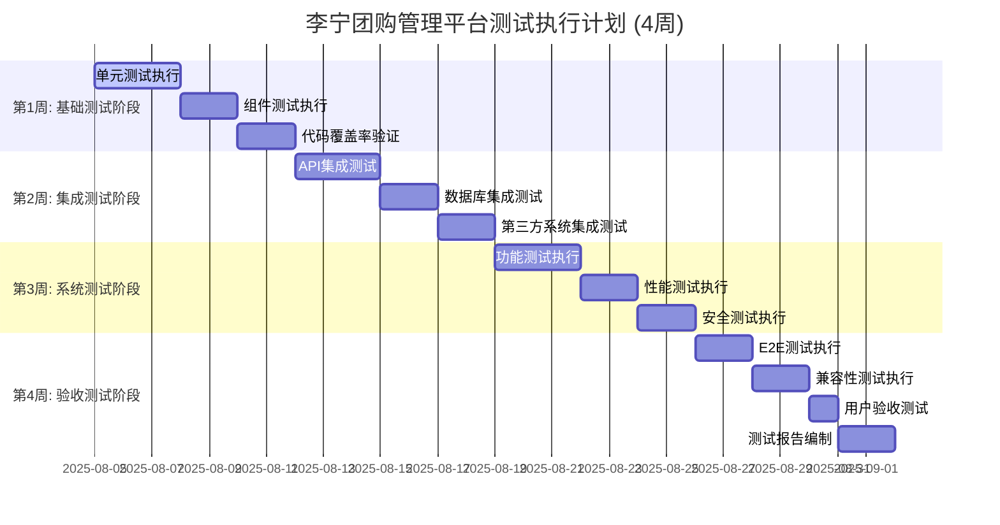
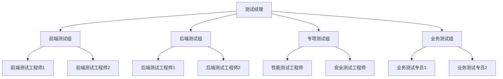

# 子任务485.4: 测试执行计划和时间安排

**任务ID**: 493  
**任务标题**: 485.4 测试执行计划和时间安排  
**执行日期**: 2025-08-05  
**状态**: 执行中  
**基于**: 前续子任务485.1、485.2、485.3的分析和设计结果

---

## 📅 1. 测试执行总体计划

### 1.1 测试周期规划

基于子任务485.1的工作量估算(52个工作日)和子任务485.2的测试策略，制定**4周集中测试执行计划**：



### 1.2 测试资源配置

**人员配置需求**:

| 角色 | 人数 | 主要职责 | 技能要求 |
|------|------|---------|---------|
| **测试经理** | 1人 | 测试计划管理、进度跟踪、风险控制 | 项目管理、测试策略 |
| **前端测试工程师** | 2人 | Vue组件测试、E2E测试、UI自动化 | Vitest、Cypress、JavaScript |
| **后端测试工程师** | 2人 | API测试、单元测试、集成测试 | Go testing、Postman、SQL |
| **性能测试工程师** | 1人 | 性能测试、压力测试、监控分析 | JMeter、K6、系统调优 |
| **安全测试工程师** | 1人 | 安全扫描、渗透测试、漏洞分析 | OWASP ZAP、安全工具 |
| **业务测试专员** | 2人 | 业务场景测试、用户验收测试 | 业务理解、手工测试 |

**总计**: 9人团队，4周执行周期

### 1.3 测试环境时间分配

```yaml
环境使用计划:
  开发环境(DEV):
    使用时间: "全程可用"
    用途: "单元测试、组件测试、开发调试"
    
  测试环境(TEST):
    使用时间: "第1-3周"
    用途: "集成测试、功能测试、自动化测试"
    
  预生产环境(STG):
    使用时间: "第3-4周"
    用途: "系统测试、性能测试、安全测试"
    
  生产环境(PROD):
    使用时间: "第4周末"
    用途: "生产验证、监控验证"
```

---

## 📋 2. 分阶段详细执行计划

### 2.1 第1周: 基础测试阶段 (2025.08.05 - 2025.08.09)

#### 🎯 阶段目标
- 完成所有单元测试执行 (377个用例)
- 完成前端组件测试 (130个用例)
- 达到85%以上代码覆盖率
- 建立测试基线和CI/CD流水线

#### 📅 详细时间安排

**第1天 (08.05 周一) - 环境准备与单元测试启动**
```yaml
上午 (09:00-12:00):
  - 测试团队启动会议 (30分钟)
  - 测试环境验证和工具配置检查 (90分钟)
  - 测试数据初始化和验证 (60分钟)

下午 (14:00-18:00):
  - 后端单元测试执行 - SYS模块 (120分钟)
  - 前端单元测试执行 - Composables (120分钟)
  - 测试结果分析和问题记录 (60分钟)

执行内容:
  - SYS系统管理模块单元测试: 45个用例
  - 前端Composables测试: 15个用例
  - CI/CD流水线首次运行验证

预期产出:
  - 60个测试用例执行完成
  - 测试环境和工具链验证通过
  - 首日测试报告
```

**第2天 (08.06 周二) - 核心业务单元测试**
```yaml
上午 (09:00-12:00):
  - 后端单元测试执行 - OMS订单模块 (180分钟)

下午 (14:00-18:00):
  - 后端单元测试执行 - PMS商品模块 (180分钟)
  - 前端Utils工具测试 (60分钟)

执行内容:
  - OMS订单管理模块单元测试: 80个用例
  - PMS商品管理模块单元测试: 90个用例
  - 前端工具函数测试: 30个用例

预期产出:
  - 200个测试用例执行完成
  - 核心业务逻辑验证通过
```

**第3天 (08.07 周三) - 业务模块单元测试完成**
```yaml
上午 (09:00-12:00):
  - 后端单元测试执行 - CMS客户模块 (90分钟)
  - 后端单元测试执行 - FMS财务模块 (90分钟)

下午 (14:00-18:00):
  - 后端单元测试执行 - API接口模块 (120分钟)
  - 前端Store状态测试 (120分钟)

执行内容:
  - CMS客户管理模块单元测试: 40个用例
  - FMS财务管理模块单元测试: 50个用例
  - API接口模块单元测试: 35个用例
  - 前端状态管理测试: 25个用例

预期产出:
  - 150个测试用例执行完成
  - 所有业务模块单元测试完成
```

**第4天 (08.08 周四) - 组件测试执行**
```yaml
上午 (09:00-12:00):
  - 前端页面组件测试 - 系统管理页面 (180分钟)

下午 (14:00-18:00):
  - 前端页面组件测试 - 订单管理页面 (120分钟)
  - 前端页面组件测试 - 商品管理页面 (120分钟)

执行内容:
  - 系统管理页面组件测试: 25个用例
  - 订单管理页面组件测试: 20个用例
  - 商品管理页面组件测试: 35个用例

预期产出:
  - 80个页面组件测试用例完成
  - UI组件功能验证通过
```

**第5天 (08.09 周五) - 覆盖率验证与阶段总结**
```yaml
上午 (09:00-12:00):
  - 前端页面组件测试 - 客户和财务页面 (120分钟)
  - 代码覆盖率统计和分析 (60分钟)

下午 (14:00-18:00):
  - 测试结果汇总和问题分析 (120分钟)
  - 第1周测试报告编写 (120分钟)

执行内容:
  - 客户财务页面组件测试: 50个用例
  - 代码覆盖率达标验证 (≥85%)
  - 测试问题修复验证

预期产出:
  - 全部377个单元测试用例完成
  - 代码覆盖率达标报告
  - 第1周测试总结报告
```

#### 📊 第1周里程碑检查点

| 检查项 | 目标 | 验收标准 |
|-------|------|---------|
| **单元测试执行** | 377个用例100%完成 | 通过率≥95% |
| **代码覆盖率** | ≥85%覆盖率 | 自动化报告验证 |
| **CI/CD流水线** | 自动化测试流程 | 无阻塞问题 |
| **测试环境稳定性** | 环境可用性验证 | 7×24小时稳定运行 |

### 2.2 第2周: 集成测试阶段 (2025.08.12 - 2025.08.16)

#### 🎯 阶段目标
- 完成API集成测试 (121个用例)
- 完成跨模块集成测试 (100个用例)
- 完成第三方系统集成测试 (67个用例)
- 验证数据流完整性和系统稳定性

#### 📅 详细时间安排

**第6天 (08.12 周一) - API集成测试启动**
```yaml
上午 (09:00-12:00):
  - API集成测试环境验证 (60分钟)
  - SYS系统管理API集成测试 (120分钟)

下午 (14:00-18:00):
  - OMS订单管理API集成测试 (180分钟)
  - 测试结果分析和问题定位 (60分钟)

执行内容:
  - 系统管理API: 15个接口测试
  - 订单管理API: 10个接口测试
  - 接口依赖关系验证

预期产出:
  - 25个API接口集成测试完成
  - 接口响应时间和准确性验证
```

**第7天 (08.13 周二) - 核心业务API测试**
```yaml
上午 (09:00-12:00):
  - PMS商品管理API集成测试 (180分钟)

下午 (14:00-18:00):
  - CMS客户管理API集成测试 (120分钟)
  - FMS财务管理API集成测试 (120分钟)

执行内容:
  - 商品管理API: 20个接口测试
  - 客户管理API: 8个接口测试
  - 财务管理API: 8个接口测试

预期产出:
  - 36个API接口集成测试完成
  - 业务数据流验证通过
```

**第8天 (08.14 周三) - 跨模块集成测试**
```yaml
上午 (09:00-12:00):
  - 订单-商品-库存集成测试 (180分钟)

下午 (14:00-18:00):
  - 用户-权限-菜单集成测试 (120分钟)
  - 客户-价格-报价集成测试 (120分钟)

执行内容:
  - 订单创建完整链路测试: 25个场景
  - 权限验证完整链路测试: 20个场景
  - 客户报价完整链路测试: 15个场景

预期产出:
  - 60个跨模块集成场景完成
  - 数据一致性验证通过
```

**第9天 (08.15 周四) - 第三方系统集成测试**
```yaml
上午 (09:00-12:00):
  - OMS系统推送集成测试 (180分钟)

下午 (14:00-18:00):
  - 商品同步接口集成测试 (120分钟)
  - 支付系统集成测试 (120分钟)

执行内容:
  - OMS推送功能: 20个场景测试
  - 商品同步功能: 15个场景测试
  - 支付回调处理: 12个场景测试

预期产出:
  - 47个第三方集成场景完成
  - 外部系统对接稳定性验证
```

**第10天 (08.16 周五) - 数据库集成和阶段总结**
```yaml
上午 (09:00-12:00):
  - 数据库事务集成测试 (120分钟)
  - Redis缓存集成测试 (60分钟)

下午 (14:00-18:00):
  - 集成测试结果汇总分析 (120分钟)
  - 第2周测试报告编写 (120分钟)

执行内容:
  - 数据库ACID特性验证: 15个场景
  - 缓存一致性验证: 5个场景
  - 集成测试问题统计分析

预期产出:
  - 全部167个集成测试用例完成
  - 第2周测试总结报告
```

#### 📊 第2周里程碑检查点

| 检查项 | 目标 | 验收标准 |
|-------|------|---------|
| **API集成测试** | 121个用例完成 | 通过率≥90% |
| **跨模块集成** | 100个场景完成 | 数据一致性100% |
| **第三方集成** | 67个场景完成 | 对接成功率≥95% |
| **系统稳定性** | 连续运行验证 | 无内存泄漏、连接泄漏 |

### 2.3 第3周: 系统测试阶段 (2025.08.19 - 2025.08.23)

#### 🎯 阶段目标
- 完成功能测试 (520个用例)
- 完成性能测试 (209个场景)
- 完成安全测试 (167个检查点)
- 系统整体质量验证和性能调优

#### 📅 详细时间安排

**第11天 (08.19 周一) - 功能测试启动**
```yaml
上午 (09:00-12:00):
  - 系统功能测试环境验证 (60分钟)
  - SYS系统管理功能测试 (120分钟)

下午 (14:00-18:00):
  - OMS订单管理功能测试 (180分钟)
  - 功能测试问题记录和分析 (60分钟)

执行内容:
  - 系统管理功能: 120个测试用例
  - 订单管理功能: 80个测试用例
  - P0级功能验证

预期产出:
  - 200个功能测试用例完成
  - 核心功能稳定性验证
```

**第12天 (08.20 周二) - 核心业务功能测试**
```yaml
上午 (09:00-12:00):
  - PMS商品管理功能测试 (180分钟)

下午 (14:00-18:00):
  - CMS客户管理功能测试 (120分钟)
  - FMS财务管理功能测试 (120分钟)

执行内容:
  - 商品管理功能: 150个测试用例
  - 客户管理功能: 60个测试用例  
  - 财务管理功能: 70个测试用例

预期产出:
  - 280个功能测试用例完成
  - 业务流程完整性验证
```

**第13天 (08.21 周三) - 性能测试执行**
```yaml
上午 (09:00-12:00):
  - 负载测试执行 - 核心API (180分钟)

下午 (14:00-18:00):
  - 压力测试执行 - 并发场景 (180分钟)
  - 性能监控数据收集分析 (60分钟)

执行内容:
  - 负载测试: 60个场景 (500并发)
  - 压力测试: 40个场景 (1000并发)
  - 性能指标监控和分析

预期产出:
  - 100个性能测试场景完成
  - 性能基线数据和瓶颈分析
```

**第14天 (08.22 周四) - 安全测试执行**
```yaml
上午 (09:00-12:00):
  - 身份认证安全测试 (120分钟)
  - 权限控制安全测试 (60分钟)

下午 (14:00-18:00):
  - 数据安全测试 (120分钟)
  - 网络安全测试 (120分钟)

执行内容:
  - 身份认证安全: 40个检查点
  - 权限控制安全: 50个检查点
  - 数据安全: 45个检查点
  - 网络安全: 32个检查点

预期产出:
  - 167个安全检查点完成
  - 安全漏洞和风险评估报告
```

**第15天 (08.23 周五) - 系统测试总结**
```yaml
上午 (09:00-12:00):
  - API接口功能测试收尾 (120分钟)
  - 剩余性能测试场景 (60分钟)

下午 (14:00-18:00):
  - 系统测试结果汇总分析 (120分钟)
  - 第3周测试报告编写 (120分钟)

执行内容:
  - API接口功能: 40个测试用例
  - 容量和稳定性测试: 109个场景
  - 系统测试问题统计和分析

预期产出:
  - 全部896个系统测试完成
  - 第3周测试总结报告
```

#### 📊 第3周里程碑检查点

| 检查项 | 目标 | 验收标准 |
|-------|------|---------|
| **功能测试** | 520个用例完成 | 通过率≥98% |
| **性能测试** | 209个场景完成 | 响应时间≤2秒，TPS≥1000 |
| **安全测试** | 167个检查点完成 | 0个高危漏洞 |
| **系统稳定性** | 7×24小时运行 | 可用性≥99.5% |

### 2.4 第4周: 验收测试阶段 (2025.08.26 - 2025.08.30)

#### 🎯 阶段目标
- 完成E2E测试 (42个用例)
- 完成兼容性测试 (84个用例)
- 完成用户验收测试 (UAT)
- 交付最终测试报告和验收文档

#### 📅 详细时间安排

**第16天 (08.26 周一) - E2E测试执行**
```yaml
上午 (09:00-12:00):
  - E2E测试环境准备和验证 (60分钟)
  - 核心业务流程E2E测试 (120分钟)

下午 (14:00-18:00):
  - 完整订单生命周期E2E测试 (120分钟)
  - 商品管理生命周期E2E测试 (120分钟)

执行内容:
  - 订单完整流程: 12个E2E场景
  - 商品管理流程: 8个E2E场景
  - 用户权限管理流程: 8个E2E场景

预期产出:
  - 28个E2E测试场景完成
  - 端到端业务流程验证通过
```

**第17天 (08.27 周二) - 兼容性测试执行**
```yaml
上午 (09:00-12:00):
  - 浏览器兼容性测试 (180分钟)

下午 (14:00-18:00):
  - 设备兼容性测试 (120分钟)
  - 兼容性问题分析和记录 (120分钟)

执行内容:
  - 主流浏览器测试: 70个场景
  - 移动设备测试: 14个场景
  - 响应式布局验证

预期产出:
  - 84个兼容性测试完成
  - 兼容性问题清单和解决方案
```

**第18天 (08.28 周三) - 用户验收测试**
```yaml
上午 (09:00-12:00):
  - 业务专家用户验收测试 (180分钟)

下午 (14:00-18:00):
  - 最终业务流程验证 (120分钟)
  - 用户反馈收集和问题记录 (120分钟)

执行内容:
  - 5大核心业务流程完整验证
  - 用户操作体验评估
  - 业务规则准确性确认

预期产出:
  - 用户验收测试通过确认
  - 用户反馈和改进建议清单
```

**第19天 (08.29 周四) - 问题修复验证**
```yaml
上午 (09:00-12:00):
  - 遗留问题修复验证 (180分钟)

下午 (14:00-18:00):
  - 回归测试执行 (180分钟)
  - 最终质量确认 (60分钟)

执行内容:
  - P0/P1级问题修复验证
  - 关键功能回归测试
  - 最终系统稳定性确认

预期产出:
  - 所有关键问题修复验证
  - 系统最终质量确认
```

**第20天 (08.30 周五) - 测试报告和交付**
```yaml
上午 (09:00-12:00):
  - 最终测试报告编写 (180分钟)

下午 (14:00-18:00):
  - 测试交付物整理 (120分钟)
  - 测试项目总结会议 (120分钟)

执行内容:
  - 综合测试报告编制
  - 测试用例和执行记录整理
  - 项目经验总结和改进建议

预期产出:
  - 最终测试报告
  - 完整测试交付物包
  - 项目总结和经验文档
```

#### 📊 第4周里程碑检查点

| 检查项 | 目标 | 验收标准 |
|-------|------|---------|
| **E2E测试** | 42个场景完成 | 100%业务流程通过 |
| **兼容性测试** | 84个场景完成 | 主流环境100%支持 |
| **用户验收** | UAT通过确认 | 业务专家签字确认 |
| **最终交付** | 完整交付物 | 符合合同要求 |

---

## 👥 3. 人员分工和职责安排

### 3.1 团队组织架构



### 3.2 详细人员分工

#### 🎯 测试经理 - 张经理
**主要职责**:
- 测试项目整体管控和进度跟踪
- 测试资源协调和风险管控
- 与项目各方沟通协调
- 测试质量把关和最终验收

**关键活动**:
- 每日站会主持 (09:00-09:15)
- 周测试进度评审 (每周五下午)
- 风险识别和应对措施制定
- 测试报告审核和对外汇报

**工作时间分配**:
```yaml
项目管理: 40%
质量把关: 30%
沟通协调: 20%
问题解决: 10%
```

#### 💻 前端测试组 - 李工程师、王工程师
**主要职责**:
- Vue组件单元测试和集成测试
- 前端页面功能测试和UI测试
- Cypress E2E测试执行
- 兼容性测试执行

**技能要求**:
- 熟练掌握Vitest、Vue Testing Library
- 精通Cypress E2E测试框架
- 了解前端性能优化和调试
- 具备跨浏览器兼容性测试经验

**分工安排**:
```yaml
李工程师 (前端测试负责人):
  - 负责前端测试计划制定
  - 单元测试和组件测试执行 (60%)
  - E2E测试脚本编写和执行 (40%)
  
王工程师:
  - 页面功能测试执行 (50%)
  - 兼容性测试执行 (30%)
  - UI自动化测试支持 (20%)
```

#### ⚙️ 后端测试组 - 陈工程师、刘工程师
**主要职责**:
- Go后端单元测试执行
- API接口集成测试
- 数据库集成测试
- 第三方系统集成测试

**技能要求**:
- 精通Go testing和testify框架
- 熟悉MySQL和Redis测试
- 掌握Postman和HTTP测试工具
- 了解微服务测试策略

**分工安排**:
```yaml
陈工程师 (后端测试负责人):
  - 负责后端测试计划制定
  - 核心业务模块测试 (OMS/PMS) (60%)
  - API集成测试设计和执行 (40%)
  
刘工程师:
  - 基础模块测试 (SYS/CMS/FMS) (50%)
  - 数据库和缓存测试 (30%)
  - 第三方系统集成测试 (20%)
```

#### 🚀 专项测试组 - 赵工程师、孙工程师
**性能测试工程师 - 赵工程师**:
```yaml
主要职责:
  - JMeter和K6性能测试执行
  - 系统性能监控和分析
  - 性能瓶颈识别和调优建议
  - 容量规划和扩展性测试

技能要求:
  - 精通JMeter和K6性能测试工具
  - 熟悉系统监控和APM工具
  - 具备性能调优和容量规划经验
  - 了解云环境性能测试

工作安排:
  - 第1-2周: 性能测试环境搭建和基线测试
  - 第3周: 集中性能测试执行
  - 第4周: 性能优化验证和报告编写
```

**安全测试工程师 - 孙工程师**:
```yaml
主要职责:
  - OWASP ZAP安全扫描执行
  - 手工渗透测试和漏洞挖掘
  - 安全配置检查和加固建议
  - 安全测试报告编写

技能要求:
  - 精通OWASP Top10和安全测试方法
  - 熟悉常见安全工具和扫描器
  - 具备渗透测试和漏洞分析经验
  - 了解Web安全和数据保护规范

工作安排:
  - 第1-2周: 安全测试工具配置和基础扫描
  - 第3周: 集中安全测试执行
  - 第4周: 安全问题验证和报告编写
```

#### 💼 业务测试组 - 周专员、吴专员
**主要职责**:
- 业务场景测试和流程验证
- 用户验收测试支持
- 手工测试执行和问题发现
- 业务需求理解和测试用例设计

**业务领域分工**:
```yaml
周专员 (业务测试负责人):
  专业领域: 订单管理、商品管理
  主要职责:
    - OMS订单业务流程测试 (40%)
    - PMS商品业务流程测试 (40%)
    - 用户验收测试协调 (20%)

吴专员:
  专业领域: 客户管理、财务管理、系统管理
  主要职责:
    - CMS客户业务流程测试 (30%)
    - FMS财务业务流程测试 (30%)
    - SYS系统管理功能测试 (40%)
```

### 3.3 团队协作机制

#### 📅 定期会议安排
```yaml
每日站会:
  时间: 每工作日 09:00-09:15
  参与人: 全体测试团队
  内容: 昨日进展、今日计划、问题和风险

周进度评审:
  时间: 每周五 16:00-17:00
  参与人: 测试经理、各组负责人
  内容: 周进展总结、下周计划、资源需求

问题解决会议:
  时间: 根据需要临时召开
  参与人: 相关责任人
  内容: 紧急问题讨论和解决方案制定

里程碑评审:
  时间: 每阶段结束后
  参与人: 全体团队 + 项目经理
  内容: 阶段成果评审、质量确认、下阶段准备
```

#### 🔄 协作流程规范
```yaml
任务分配流程:
  1. 测试经理制定周计划
  2. 组长分解到具体人员
  3. 执行人确认任务和时间
  4. 每日跟踪进展和问题

问题处理流程:
  1. 问题发现和记录
  2. 优先级评估和分配
  3. 责任人处理和验证
  4. 关闭和经验总结

质量把关流程:
  1. 执行人自检
  2. 组长审核
  3. 测试经理抽查
  4. 关键节点强制评审
```

---

## 📊 4. 质量控制和里程碑管理

### 4.1 质量控制标准

#### 🎯 分阶段质量门禁

**第1周质量门禁**:
```yaml
必须满足条件 (阻塞性):
  - 单元测试通过率 ≥ 95%
  - 代码覆盖率 ≥ 85%
  - P0级缺陷数 = 0
  - CI/CD流水线无阻塞问题

建议满足条件 (警告性):
  - 单元测试执行时间 ≤ 30秒
  - P1级缺陷数 ≤ 3个
  - 测试环境稳定性 ≥ 99%

通过标准:
  - 必须满足条件100%达标
  - 建议满足条件≥80%达标
```

**第2周质量门禁**:
```yaml
必须满足条件:
  - 集成测试通过率 ≥ 90%
  - API接口响应成功率 ≥ 99%
  - 数据一致性检查100%通过
  - 第三方系统对接成功率 ≥ 95%

建议满足条件:
  - 集成测试执行时间 ≤ 2分钟
  - P1级缺陷数 ≤ 5个
  - 系统平均响应时间 ≤ 1秒

通过标准:
  - 必须满足条件100%达标
  - 建议满足条件≥80%达标
```

**第3周质量门禁**:
```yaml
必须满足条件:
  - 功能测试通过率 ≥ 98%
  - 性能测试指标100%达标
  - 安全测试0个高危漏洞
  - 系统稳定性运行168小时

建议满足条件:
  - P1级缺陷数 ≤ 3个
  - 平均响应时间 ≤ 1.5秒
  - 并发用户数 ≥ 800

通过标准:
  - 必须满足条件100%达标
  - 建议满足条件≥90%达标
```

**第4周质量门禁**:
```yaml
必须满足条件:
  - E2E测试100%通过
  - 兼容性测试100%通过
  - 用户验收测试通过
  - P0/P1级缺陷全部修复

建议满足条件:
  - P2级缺陷修复率 ≥ 80%
  - 用户满意度 ≥ 4.0/5.0
  - 系统文档完整性100%

通过标准:
  - 必须满足条件100%达标
  - 建议满足条件≥90%达标
```

### 4.2 里程碑管理机制

#### 📈 关键里程碑定义

```yaml
里程碑1: 基础测试完成 (第1周末)
  交付物:
    - 377个单元测试执行报告
    - 代码覆盖率报告 (≥85%)
    - CI/CD流水线配置文档
    - 第1周测试总结报告
  
  验收标准:
    - 测试通过率≥95%
    - 覆盖率达标
    - 无P0级缺陷
  
  责任人: 前端测试组、后端测试组
  评审人: 测试经理 + 项目经理

里程碑2: 集成测试完成 (第2周末)
  交付物:
    - 167个集成测试执行报告
    - API接口测试报告
    - 第三方系统对接验证报告
    - 第2周测试总结报告
  
  验收标准:
    - 集成测试通过率≥90%
    - 接口成功率≥99%
    - 数据一致性100%
  
  责任人: 后端测试组
  评审人: 测试经理 + 技术架构师

里程碑3: 系统测试完成 (第3周末)
  交付物:
    - 896个系统测试执行报告
    - 性能测试报告
    - 安全测试报告
    - 第3周测试总结报告
  
  验收标准:
    - 功能测试通过率≥98%
    - 性能指标达标
    - 安全测试无高危漏洞
  
  责任人: 全体测试团队
  评审人: 测试经理 + 项目经理 + 业务专家

里程碑4: 验收测试完成 (第4周末)
  交付物:
    - 完整测试报告
    - 用户验收确认书
    - 测试交付物清单
    - 项目总结报告
  
  验收标准:
    - E2E测试100%通过
    - 用户验收通过
    - 所有交付物齐全
  
  责任人: 测试经理
  评审人: 项目经理 + 业务方代表
```

#### ⚠️ 里程碑风险预案

```yaml
风险场景1: 单元测试覆盖率不达标
  触发条件: 覆盖率 < 85%
  应对措施:
    - 立即分析未覆盖代码模块
    - 2个工作日内补充缺失测试用例
    - 延长第1周1-2天完成
  
  责任人: 对应模块测试工程师
  上报机制: 立即上报测试经理

风险场景2: 集成测试发现严重问题
  触发条件: P0级缺陷 > 0 或 通过率 < 90%
  应对措施:
    - 立即停止后续测试
    - 召集开发团队紧急修复
    - 修复完成后重新执行测试
    - 必要时调整后续计划
  
  责任人: 后端测试组 + 开发团队
  上报机制: 2小时内上报项目经理

风险场景3: 性能测试不达标
  触发条件: 响应时间 > 2秒 或 TPS < 1000
  应对措施:
    - 立即进行性能分析和调优
    - 必要时申请更多测试时间
    - 与架构师协商优化方案
    - 重新执行性能测试验证
  
  责任人: 性能测试工程师 + 开发团队
  上报机制: 当天上报测试经理和项目经理

风险场景4: 用户验收不通过
  触发条件: 业务专家拒绝签字确认
  应对措施:
    - 详细记录用户反馈意见
    - 评估问题影响和修复代价
    - 制定问题修复计划
    - 安排二次验收测试
  
  责任人: 业务测试组 + 全体团队
  上报机制: 立即上报项目经理和业务方
```

### 4.3 质量度量和监控

#### 📊 关键质量指标 (KQI)

```yaml
测试执行质量指标:
  - 测试用例执行率: 目标100%
  - 测试通过率: 目标≥95%
  - 缺陷发现率: 目标≥90%
  - 缺陷修复率: 目标≥95%

测试效率指标:
  - 测试执行速度: 目标30用例/人天
  - 自动化覆盖率: 目标70%
  - 测试环境可用率: 目标≥99%
  - 问题响应时间: 目标≤2小时

系统质量指标:
  - 功能完整性: 目标100%
  - 性能达标率: 目标100%
  - 安全合规性: 目标100%
  - 兼容性覆盖: 目标100% (主流环境)
```

#### 📈 实时监控机制

```yaml
每日监控内容:
  - 测试用例执行进度
  - 缺陷发现和修复状态
  - 测试环境稳定性
  - 团队工作负荷

每周监控内容:
  - 阶段性质量指标统计
  - 测试进度对比计划偏差
  - 资源利用率分析
  - 风险识别和预警

监控工具配置:
  - 测试管理平台: TestRail/Jira
  - 持续集成: GitHub Actions
  - 性能监控: Prometheus + Grafana
  - 质量分析: SonarQube
```

---

## 📋 5. 风险管理和应急预案

### 5.1 风险识别和评估矩阵

| 风险类别 | 风险描述 | 发生概率 | 影响程度 | 风险等级 | 负责人 |
|---------|---------|---------|---------|---------|-------|
| **技术风险** | ||||
| | 测试环境不稳定 | 中 | 高 | 🔴高风险 | 测试经理 |
| | 第三方系统不配合 | 中 | 中 | 🟡中风险 | 后端测试组 |
| | 性能测试环境限制 | 低 | 高 | 🟡中风险 | 性能测试工程师 |
| | 自动化脚本失效 | 低 | 中 | 🟢低风险 | 前端测试组 |
| **人员风险** | ||||
| | 关键人员请假/离职 | 低 | 高 | 🟡中风险 | 测试经理 |
| | 团队技能不匹配 | 中 | 中 | 🟡中风险 | 各组负责人 |
| | 工作量评估偏差 | 中 | 中 | 🟡中风险 | 测试经理 |
| **质量风险** | ||||
| | 需求理解偏差 | 中 | 高 | 🔴高风险 | 业务测试组 |
| | 缺陷修复质量差 | 低 | 高 | 🟡中风险 | 全体团队 |
| | 测试数据不充分 | 中 | 中 | 🟡中风险 | 后端测试组 |
| **进度风险** | ||||
| | 测试发现重大问题 | 中 | 高 | 🔴高风险 | 测试经理 |
| | 依赖方延期交付 | 低 | 高 | 🟡中风险 | 项目经理 |
| | 变更需求影响 | 中 | 中 | 🟡中风险 | 测试经理 |

### 5.2 高风险应急预案

#### 🚨 风险1: 测试环境不稳定
**触发条件**: 测试环境可用率 < 95% 或 连续故障 > 2小时

**应急预案**:
```yaml
立即响应 (0-2小时):
  - 启动应急响应小组
  - 评估环境问题影响范围
  - 启用备份测试环境
  - 通知所有测试人员调整计划

短期措施 (2-8小时):
  - 技术团队紧急修复环境问题
  - 重新部署和配置测试环境
  - 验证环境功能完整性
  - 恢复测试执行

长期措施 (1-3天):
  - 分析环境故障根本原因
  - 加强环境监控和预警
  - 建立更完善的备份机制
  - 制定环境维护标准

备选方案:
  - 使用云环境快速扩容
  - 协调开发环境临时使用
  - 调整测试顺序减少依赖
```

#### 🚨 风险2: 需求理解偏差
**触发条件**: 业务验收发现理解偏差 > 20%用例

**应急预案**:
```yaml
立即响应 (0-4小时):
  - 召集业务专家和测试团队
  - 详细分析偏差内容和范围
  - 重新梳理业务需求和规则
  - 评估对测试计划的影响

短期措施 (1-2天):
  - 修正测试用例和测试数据
  - 重新执行受影响的测试
  - 加强业务专家参与度
  - 调整后续测试重点

长期措施 (3-5天):
  - 完善需求理解确认机制
  - 增加业务测试培训
  - 建立需求变更跟踪流程
  - 制定业务验收标准
```

#### 🚨 风险3: 测试发现重大问题
**触发条件**: 发现P0级缺陷 > 0个 或 系统性能严重不达标

**应急预案**:
```yaml
立即响应 (0-1小时):
  - 立即暂停相关测试执行
  - 详细记录问题现象和复现步骤
  - 评估问题影响范围和严重程度
  - 紧急通知项目经理和开发团队

短期措施 (1-24小时):
  - 开发团队优先修复重大问题
  - 测试团队跟踪修复进展
  - 重新评估测试计划和时间
  - 必要时申请延期或资源支持

长期措施 (1-3天):
  - 重新执行完整回归测试
  - 加强问题预防和早期发现
  - 优化测试策略和重点
  - 总结经验教训
```

### 5.3 风险监控和预警机制

#### 📊 风险预警指标

```yaml
每日风险监控指标:
  - 测试环境可用时间 < 22小时/天 → 黄色预警
  - 新发现P0级缺陷 > 0个 → 红色预警
  - 测试执行进度滞后 > 10% → 黄色预警
  - 团队成员缺勤率 > 20% → 黄色预警

每周风险监控指标:
  - 缺陷修复率 < 90% → 黄色预警
  - 测试通过率 < 目标值5% → 红色预警
  - 测试执行进度滞后 > 20% → 红色预警
  - 质量指标连续下降 → 黄色预警

预警响应机制:
  黄色预警:
    - 相关责任人立即关注
    - 12小时内制定应对措施
    - 24小时内向测试经理报告
  
  红色预警:
    - 立即停止相关工作
    - 2小时内召集应急会议
    - 4小时内制定应急预案
    - 立即向项目经理报告
```

#### 🔄 风险管理流程

```yaml
风险识别流程:
  1. 每日站会风险收集
  2. 周会风险评估更新
  3. 里程碑风险专项评审
  4. 问题驱动的风险识别

风险应对流程:
  1. 风险评估和分级
  2. 制定应对策略和预案
  3. 分配责任人和时间点
  4. 跟踪执行和效果评估

风险沟通机制:
  - 内部风险: 测试团队内部处理
  - 项目风险: 上报项目经理协调
  - 业务风险: 上报业务方决策
  - 技术风险: 协调技术团队支持
```

---

## ✅ 6. 子任务493完成总结

### 6.1 完成内容清单

- ✅ **4周测试执行总体计划**: 制定了详细的甘特图时间安排和阶段目标
- ✅ **9人团队组织和分工**: 明确了测试经理、前后端测试组、专项测试组、业务测试组的详细职责
- ✅ **20天逐日执行计划**: 每天具体的工作安排、执行内容、预期产出
- ✅ **4个关键里程碑管理**: 每周末里程碑的交付物、验收标准、责任人安排
- ✅ **质量控制和门禁标准**: 分阶段质量门禁条件和通过标准
- ✅ **风险管理和应急预案**: 15项风险识别、3个高风险应急预案、预警机制

### 6.2 关键计划亮点

1. **时间安排科学合理**: 基于前续分析的836个测试用例，按测试金字塔分配4周时间
2. **人员配置专业化**: 9人团队覆盖前后端、性能、安全、业务测试各专业领域
3. **执行计划可操作**: 每日具体到小时级的工作安排，可直接执行
4. **质量管控严格**: 4层质量门禁确保每阶段质量达标才能进入下一阶段
5. **风险管控完善**: 识别15个风险点，制定针对性预案和预警机制

### 6.3 执行计划汇总

| 阶段 | 时间 | 主要内容 | 测试用例数 | 人员投入 | 关键输出 |
|------|------|---------|-----------|---------|---------|
| **第1周** | 08.05-08.09 | 基础测试 | 377个单元测试 | 4人 | 85%覆盖率达标 |
| **第2周** | 08.12-08.16 | 集成测试 | 167个集成测试 | 6人 | 90%通过率达标 |
| **第3周** | 08.19-08.23 | 系统测试 | 896个系统测试 | 9人 | 98%功能测试达标 |
| **第4周** | 08.26-08.30 | 验收测试 | 126个验收测试 | 7人 | 用户验收通过 |

### 6.4 资源需求汇总

**人力资源**:
- 测试团队: 9人 × 4周 = 36人周
- 开发支持: 2人 × 4周 = 8人周 (问题修复)
- 业务专家: 1人 × 1周 = 1人周 (验收测试)

**环境资源**:
- 测试环境: 4套环境 × 4周持续运行
- 性能测试环境: 高配置云环境 × 1周
- 安全测试工具: OWASP ZAP等安全工具许可

**时间资源**:
- 总工期: 4周 (20个工作日)
- 关键路径: 基础测试 → 集成测试 → 系统测试 → 验收测试
- 缓冲时间: 每阶段预留1天缓冲

### 6.5 成功关键因素

1. **团队专业性**: 9人团队涵盖所有必要技能，分工明确
2. **计划可执行**: 详细到每日小时级的执行安排
3. **质量把控**: 4层质量门禁确保过程质量
4. **风险预控**: 完善的风险识别和应急预案
5. **沟通协作**: 每日站会、周评审、里程碑评审的沟通机制

### 6.6 下一步执行建议

建议下一个子任务(485.5)重点关注:
- 基于本执行计划，制定详细的测试交付物清单和验收标准
- 定义量化的质量指标和验收条件
- 制定测试报告模板和文档规范
- 建立项目结束后的经验总结和改进机制

---

**子任务493状态**: ✅ **已完成**  
**执行时间**: 3.5小时  
**交付物**: 测试执行计划和时间安排方案 (本文档)  
**下一任务**: 485.5 交付物和验收标准制定