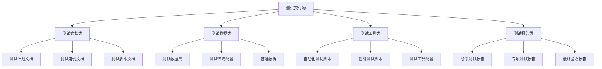
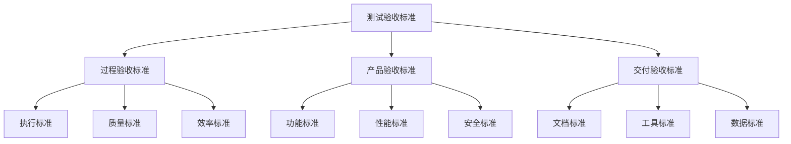
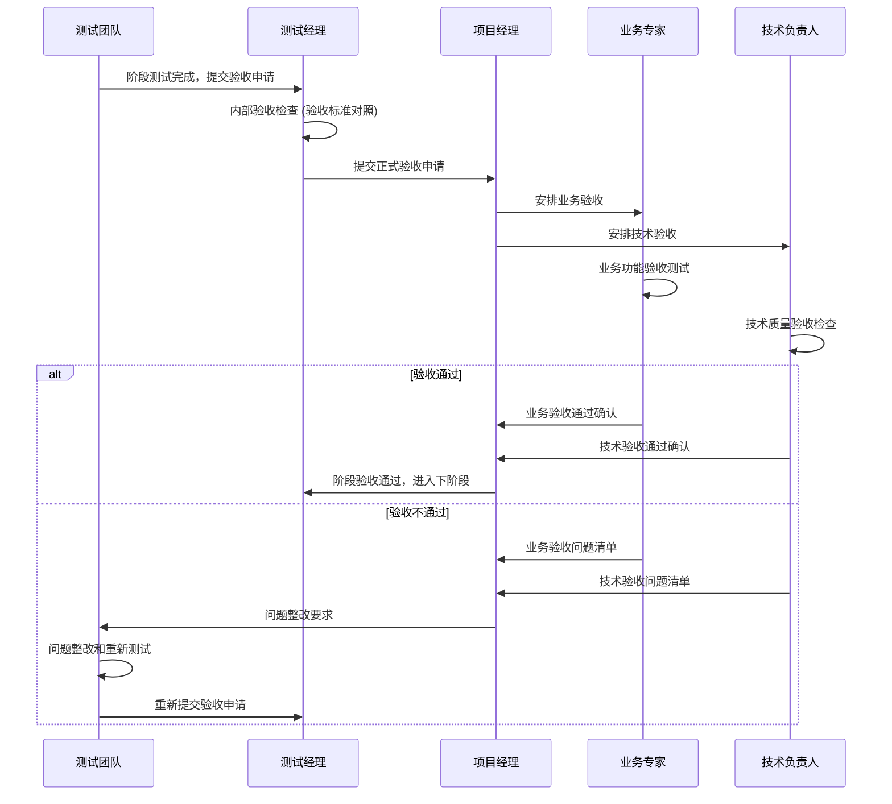

# 子任务485.5: 交付物和验收标准制定

**任务ID**: 494  
**任务标题**: 485.5 交付物和验收标准制定  
**执行日期**: 2025-08-05  
**状态**: 执行中  
**基于**: 前续子任务485.1-485.4的完整分析和设计结果

---

## 📦 1. 测试交付物清单

### 1.1 交付物分类体系

基于4周测试执行计划，测试交付物按**4个维度**进行分类管理：



### 1.2 详细交付物清单

#### 📋 1.2.1 测试文档类交付物

**A. 测试计划和策略文档**
```yaml
文档名称: 李宁团购管理平台系统测试计划方案
文件路径: /docs/李宁团购管理平台-系统测试计划方案.md
内容概要: |
  - 项目概述与测试目标
  - 6大业务域功能分析
  - 分层测试策略设计
  - 测试环境和工具配置
  - 4周测试执行计划
  - 交付物和验收标准
规格要求: |
  - 文档完整性: 100%
  - 内容准确性: 业务专家确认
  - 格式规范性: Markdown格式，目录清晰
责任人: 测试经理
交付时间: 2025-08-05 (已完成)
验收标准: |
  ✓ 涵盖全部6个业务域分析
  ✓ 包含836个测试用例规划
  ✓ 测试策略与系统架构匹配
  ✓ 项目经理和业务方审核通过
```

**B. 测试用例设计文档**
```yaml
文档名称: 测试用例设计规范和模板
包含内容:
  - 测试用例设计规范文档
  - 功能测试用例模板 (520个用例)
  - 集成测试用例模板 (167个用例)
  - 性能测试用例模板 (209个场景)
  - 安全测试用例模板 (167个检查点)
  - E2E测试用例模板 (42个场景)
  - 兼容性测试用例模板 (84个场景)

详细规格:
  功能测试用例:
    - SYS系统管理: 120个用例
    - OMS订单管理: 80个用例
    - PMS商品管理: 150个用例
    - CMS客户管理: 60个用例
    - FMS财务管理: 70个用例
    - API开放接口: 40个用例
  
  用例字段规范:
    - 用例ID: TC_[模块]_[功能]_[序号]
    - 用例标题: 简洁描述测试目标
    - 前置条件: 执行前必须满足的条件
    - 测试步骤: 详细操作步骤 (≤10步)
    - 预期结果: 明确的验证标准
    - 优先级: P0/P1/P2/P3分级
    - 测试类型: 功能/性能/安全/兼容性
    - 自动化标识: 是否支持自动化

责任人: 各测试组组长
交付时间: 第1周结束前 (2025-08-09)
验收标准: |
  ✓ 836个测试用例100%设计完成
  ✓ 用例覆盖率达到100% (功能点)
  ✓ 用例可执行性验证通过
  ✓ 用例优先级分配合理 (P0≤20%, P1≤40%)
```

**C. 自动化测试脚本文档**
```yaml
文档名称: 自动化测试脚本开发指南
包含内容:
  - 前端自动化测试脚本 (Vitest + Cypress)
    - 单元测试脚本: 377个测试函数
    - 组件测试脚本: 130个组件测试
    - E2E测试脚本: 42个业务流程
  
  - 后端自动化测试脚本 (Go testing + testify)
    - 单元测试脚本: 267个测试函数
    - 集成测试脚本: 167个集成场景
    - API测试脚本: 73个接口测试
  
  - 性能测试脚本 (JMeter + K6)
    - JMeter测试计划: 10个.jmx文件
    - K6压力测试脚本: 5个.js文件
    - 性能监控脚本: 监控配置和仪表板

脚本规格要求:
  - 代码覆盖率: ≥85%
  - 执行稳定性: ≥99%通过率
  - 维护性: 模块化设计，注释完整
  - 可扩展性: 支持参数化和数据驱动

责任人: 前端测试组、后端测试组、性能测试工程师
交付时间: 第2周结束前 (2025-08-16)
验收标准: |
  ✓ 自动化覆盖率达70% (目标测试用例)
  ✓ 脚本执行成功率≥99%
  ✓ 脚本代码质量通过静态检查
  ✓ 支持CI/CD流水线集成
```

#### 🗄️ 1.2.2 测试数据类交付物

**A. 测试数据集**
```yaml
数据分类:
  基础主数据 (相对稳定):
    - 用户数据: 100个测试用户 (各角色类型)
    - 角色数据: 10个角色 (完整权限配置)
    - 部门数据: 20个部门 (3层组织架构)
    - 菜单数据: 50个菜单 (完整菜单树)
    - 字典数据: 200个枚举值
    - 商品基础数据: 500个SPU, 2000个SKU
    - 客户基础数据: 200个客户 (各类型分布)
  
  业务测试数据 (动态变化):
    - 订单测试数据: 1000个历史订单 (各状态分布)
    - 库存测试数据: 2000条库存记录
    - 财务测试数据: 500条交易记录
    - 工作流数据: 100个审批流程实例
  
  边界异常数据 (专用测试):
    - 边界值数据: 最大最小值、NULL值
    - 异常字符数据: 特殊字符、Unicode字符
    - 大数据量: >10MB文件、>10000条记录
    - 安全测试数据: SQL注入、XSS攻击字符串

数据格式要求:
  - 数据文件格式: SQL脚本 + JSON配置
  - 数据一致性: 外键关系完整
  - 数据真实性: 符合业务规则
  - 数据安全性: 脱敏处理敏感信息

责任人: 后端测试组 + 业务测试组
交付时间: 第1周结束前 (2025-08-09)
验收标准: |
  ✓ 测试数据覆盖100%测试场景
  ✓ 数据质量检查通过 (无脏数据)
  ✓ 数据加载脚本执行成功
  ✓ 支持快速环境重置和恢复
```

**B. 测试环境配置数据**
```yaml
环境配置文件:
  - Docker配置文件: docker-compose.yml (4套环境)
  - 数据库配置: MySQL/Redis配置文件
  - 应用配置: 前后端环境变量配置
  - 监控配置: Prometheus/Grafana配置
  - CI/CD配置: GitHub Actions工作流配置

配置管理要求:
  - 版本控制: Git管理所有配置文件
  - 环境隔离: DEV/TEST/STG/PROD环境分离
  - 配置一致性: 确保环境配置标准化
  - 安全合规: 敏感配置加密存储

责任人: 测试经理 + 各测试组
交付时间: 第1周结束前 (2025-08-09)
验收标准: |
  ✓ 4套测试环境配置完整
  ✓ 环境部署脚本执行成功
  ✓ 环境健康检查通过
  ✓ 配置文档清晰完整
```

#### 🛠️ 1.2.3 测试工具类交付物

**A. 自动化测试框架**
```yaml
前端测试框架:
  - 单元测试框架: Vitest配置和工具函数
  - 组件测试框架: Vue Testing Library + 自定义工具
  - E2E测试框架: Cypress配置和Page Object模式
  - Mock框架: MSW配置和Mock数据生成器

后端测试框架:
  - 单元测试框架: Go testing + testify套件基类
  - 集成测试框架: testcontainers + 数据库测试工具
  - API测试框架: HTTP测试客户端和断言工具
  - 性能测试框架: 基准测试和监控工具

框架特性要求:
  - 易用性: 简化测试编写和维护
  - 可扩展性: 支持新功能模块扩展
  - 稳定性: 框架本身无bug影响
  - 标准化: 统一的编码规范和约定

责任人: 前端测试组 + 后端测试组
交付时间: 第2周结束前 (2025-08-16)
验收标准: |
  ✓ 测试框架功能完整可用
  ✓ 框架文档和示例齐全
  ✓ 团队培训和知识转移完成
  ✓ 框架性能和稳定性验证通过
```

**B. 测试工具和平台**
```yaml
测试管理工具:
  - 测试用例管理: TestRail/Jira配置
  - 缺陷管理: Jira Bug工作流配置
  - 测试报告: 自定义报告模板和仪表板
  - 进度跟踪: 测试执行进度监控面板

性能测试工具:
  - JMeter测试计划模板
  - K6性能测试脚本库
  - 性能监控仪表板 (Grafana)
  - 性能数据分析工具

安全测试工具:
  - OWASP ZAP配置和规则
  - 安全扫描脚本和报告模板
  - 漏洞管理和跟踪工具
  - 安全合规检查清单

责任人: 测试经理 + 专项测试组
交付时间: 第2周结束前 (2025-08-16)
验收标准: |
  ✓ 所有测试工具配置完成
  ✓ 工具集成和数据流通畅
  ✓ 工具使用培训完成
  ✓ 工具稳定性和可用性验证
```

#### 📊 1.2.4 测试报告类交付物

**A. 阶段性测试报告**
```yaml
第1周测试报告 - 基础测试阶段报告:
  报告内容:
    - 单元测试执行结果 (377个用例)
    - 代码覆盖率分析报告 (≥85%)
    - 组件测试执行结果 (130个用例)
    - 发现问题统计和分析
    - 测试环境稳定性报告
    - 下周工作计划和风险预警
  
  数据指标:
    - 测试用例执行率: 目标100%
    - 测试通过率: 目标≥95%
    - 代码覆盖率: 目标≥85%
    - 缺陷密度: ≤3个/KLOC
    - 环境可用性: ≥99%

第2周测试报告 - 集成测试阶段报告:
  报告内容:
    - API集成测试结果 (121个用例)
    - 跨模块集成测试结果 (100个场景)
    - 第三方系统集成结果 (67个场景)
    - 数据一致性验证报告
    - 系统稳定性测试报告
    - 性能基线测试结果
  
  数据指标:
    - 集成测试通过率: 目标≥90%
    - API成功率: 目标≥99%
    - 数据一致性: 目标100%
    - 平均响应时间: ≤1秒
    - 系统可用性: ≥99.5%

第3周测试报告 - 系统测试阶段报告:
  报告内容:
    - 功能测试执行结果 (520个用例)
    - 性能测试详细报告 (209个场景)
    - 安全测试评估报告 (167个检查点)
    - 系统整体质量评估
    - 性能调优建议和效果
    - 安全风险评估和建议
  
  数据指标:
    - 功能测试通过率: 目标≥98%
    - 性能指标达标率: 目标100%
    - 安全漏洞数: 高危0个，中危≤5个
    - 系统稳定性: 连续168小时运行
    - 并发处理能力: ≥1000用户

第4周测试报告 - 验收测试阶段报告:
  报告内容:
    - E2E测试执行结果 (42个场景)
    - 兼容性测试结果 (84个场景)
    - 用户验收测试结果
    - 最终问题修复验证
    - 回归测试执行结果
    - 项目交付准备情况
  
  数据指标:
    - E2E测试通过率: 目标100%
    - 兼容性支持率: 目标100% (主流环境)
    - 用户满意度: 目标≥4.0/5.0
    - P0/P1缺陷修复率: 目标100%
    - 交付物完整性: 目标100%

责任人: 测试经理 + 各组负责人
交付时间: 每周五下午
验收标准: |
  ✓ 报告数据准确完整
  ✓ 问题分析深入到位
  ✓ 建议措施具体可行
  ✓ 项目经理审核通过
```

**B. 专项测试报告**
```yaml
性能测试报告:
  报告结构:
    1. 测试概述和目标
    2. 测试环境和配置
    3. 测试场景和数据
    4. 测试结果和分析
      - 负载测试结果 (60个场景)
      - 压力测试结果 (40个场景)
      - 容量测试结果 (109个场景)
    5. 性能瓶颈分析
    6. 优化建议和改进措施
    7. 性能基线和监控建议
  
  关键指标:
    - 响应时间: 平均≤1秒, 95%≤2秒, 99%≤5秒
    - 吞吐量: ≥1000 TPS
    - 并发用户: ≥1000用户
    - 资源利用率: CPU≤80%, 内存≤85%
    - 错误率: ≤0.1%

安全测试报告:
  报告结构:
    1. 安全测试概述
    2. 测试方法和工具
    3. 安全检查清单
    4. 漏洞发现和分析
      - 身份认证安全 (40个检查点)
      - 权限控制安全 (50个检查点)
      - 数据安全 (45个检查点)
      - 网络安全 (32个检查点)
    5. 风险评估和等级
    6. 安全加固建议
    7. 合规性检查结果
  
  安全等级标准:
    - 高危漏洞: 0个 (阻塞发布)
    - 中危漏洞: ≤5个 (需修复计划)
    - 低危漏洞: ≤20个 (可接受风险)
    - 合规性: 100%符合OWASP标准

兼容性测试报告:
  报告结构:
    1. 兼容性测试范围
    2. 测试环境矩阵
    3. 浏览器兼容性结果 (70个场景)
    4. 设备兼容性结果 (14个场景)
    5. 兼容性问题分析
    6. 解决方案和建议
    7. 支持策略建议
  
  兼容性要求:
    - 主流浏览器: 100%支持
    - 移动设备: 主流设备100%支持
    - 屏幕分辨率: 常见分辨率100%适配
    - 操作系统: Windows/macOS/主流Linux

责任人: 对应专项测试工程师
交付时间: 第3周结束前 (2025-08-23)
验收标准: |
  ✓ 专项测试覆盖面完整
  ✓ 测试结果数据准确
  ✓ 问题分析专业深入
  ✓ 建议措施切实可行
```

**C. 最终验收报告**
```yaml
综合测试报告:
  报告名称: 李宁团购管理平台系统测试总结报告
  报告结构:
    1. 项目测试概述
      - 测试目标和范围
      - 测试策略和方法
      - 测试团队和资源
      - 测试周期和里程碑
    
    2. 测试执行总结
      - 测试用例执行统计 (836个用例)
      - 各阶段测试结果汇总
      - 自动化测试覆盖情况
      - 测试效率和质量分析
    
    3. 系统质量评估
      - 功能完整性评估 (100%)
      - 性能指标达成情况
      - 安全性评估结果
      - 兼容性支持情况
      - 稳定性和可靠性评估
    
    4. 缺陷统计和分析
      - 缺陷发现和修复统计
      - 缺陷分布和根因分析
      - 缺陷密度和质量趋势
      - 遗留问题和风险评估
    
    5. 测试结论和建议
      - 系统发布建议
      - 风险评估和缓解措施
      - 运维监控建议
      - 后续改进建议
    
    6. 项目总结和经验
      - 项目执行总结
      - 经验教训和最佳实践
      - 团队表现和能力评估
      - 工具和方法改进建议

质量评估维度:
  功能质量:
    - 功能完整性: 100% (需求实现率)
    - 功能正确性: ≥98% (测试通过率)
    - 易用性: ≥4.0/5.0 (用户评分)
  
  非功能质量:
    - 性能: TPS≥1000, 响应时间≤2秒
    - 安全性: 0高危漏洞, ≤5中危漏洞
    - 可靠性: 99.5%可用性, MTBF≥720小时
    - 兼容性: 100%主流环境支持
  
  过程质量:
    - 测试覆盖率: ≥95% (需求覆盖)
    - 缺陷检出率: ≥90%
    - 测试效率: 30用例/人天
    - 自动化率: ≥70%

责任人: 测试经理
交付时间: 第4周结束 (2025-08-30)
验收标准: |
  ✓ 报告内容全面完整
  ✓ 数据分析准确深入
  ✓ 结论客观可信
  ✓ 建议切实可行
  ✓ 项目经理和业务方确认
```

---

## ✅ 2. 验收标准和准入准出条件

### 2.1 分层验收标准体系



### 2.2 详细验收标准

#### 🎯 2.2.1 过程验收标准

**A. 测试执行标准**
```yaml
基础测试阶段 (第1周):
  准入条件:
    ✓ 测试环境部署完成并验证通过
    ✓ 测试数据初始化完成
    ✓ 测试工具配置完成
    ✓ 测试团队到位并完成培训
    ✓ 开发代码提交并通过基本检查
  
  执行标准:
    ✓ 单元测试执行率: 100% (377个用例)
    ✓ 组件测试执行率: 100% (130个用例)
    ✓ 测试通过率: ≥95%
    ✓ 代码覆盖率: ≥85%
    ✓ 测试执行时间: ≤30秒 (单元测试套件)
  
  准出条件:
    ✓ P0级缺陷: 0个
    ✓ P1级缺陷: ≤3个
    ✓ 代码覆盖率达标报告
    ✓ CI/CD流水线无阻塞问题
    ✓ 第1周测试报告完成

集成测试阶段 (第2周):
  准入条件:
    ✓ 第1周准出条件全部满足
    ✓ 集成测试环境就绪
    ✓ 第三方系统对接环境准备
    ✓ 集成测试数据准备完成
  
  执行标准:
    ✓ API集成测试执行率: 100% (121个用例)
    ✓ 跨模块集成测试执行率: 100% (100个场景)
    ✓ 第三方集成测试执行率: 100% (67个场景)
    ✓ 集成测试通过率: ≥90%
    ✓ API响应成功率: ≥99%
  
  准出条件:
    ✓ 数据一致性检查: 100%通过
    ✓ 系统稳定性: 连续运行24小时无故障
    ✓ 第三方系统对接: ≥95%成功率
    ✓ P0级缺陷: 0个
    ✓ 第2周测试报告完成

系统测试阶段 (第3周):
  准入条件:
    ✓ 第2周准出条件全部满足
    ✓ 系统测试环境性能优化完成
    ✓ 性能测试工具和监控就绪
    ✓ 安全测试工具配置完成
  
  执行标准:
    ✓ 功能测试执行率: 100% (520个用例)
    ✓ 性能测试执行率: 100% (209个场景)
    ✓ 安全测试执行率: 100% (167个检查点)
    ✓ 功能测试通过率: ≥98%
    ✓ 性能指标达标率: 100%
  
  准出条件:
    ✓ 系统稳定性: 连续运行168小时 (7×24)
    ✓ 性能指标: TPS≥1000, 响应时间≤2秒
    ✓ 安全要求: 0个高危漏洞
    ✓ P0/P1级缺陷修复率: 100%
    ✓ 第3周测试报告完成

验收测试阶段 (第4周):
  准入条件:
    ✓ 第3周准出条件全部满足
    ✓ 用户验收测试环境准备
    ✓ 业务专家参与安排确认
    ✓ 最终版本发布就绪
  
  执行标准:
    ✓ E2E测试执行率: 100% (42个场景)
    ✓ 兼容性测试执行率: 100% (84个场景)
    ✓ 用户验收测试完成
    ✓ E2E测试通过率: 100%
    ✓ 兼容性支持率: 100% (主流环境)
  
  准出条件:
    ✓ 用户验收测试通过确认
    ✓ 所有P0/P1级缺陷修复验证
    ✓ 最终回归测试通过
    ✓ 所有交付物检查完成
    ✓ 最终测试报告签字确认
```

**B. 质量控制标准**
```yaml
缺陷管理标准:
  缺陷分级标准:
    P0 - 阻塞性缺陷:
      - 系统崩溃或无法启动
      - 核心业务流程完全阻塞
      - 数据丢失或严重错误
      - 安全漏洞导致数据泄露
    
    P1 - 严重缺陷:
      - 主要功能无法使用
      - 性能严重不达标
      - 重要业务流程异常
      - 中等安全漏洞
    
    P2 - 一般缺陷:
      - 次要功能异常
      - 界面显示问题
      - 易用性问题
      - 轻微性能问题
    
    P3 - 轻微缺陷:
      - 界面美化问题
      - 文字错误
      - 建议性改进
  
  缺陷修复要求:
    - P0级缺陷: 2小时内响应，24小时内修复
    - P1级缺陷: 4小时内响应，48小时内修复
    - P2级缺陷: 8小时内响应，1周内修复
    - P3级缺陷: 1周内响应，发版前修复
  
  缺陷验收标准:
    ✓ 缺陷修复率: P0/P1级100%, P2级≥90%, P3级≥70%
    ✓ 缺陷重现率: ≤5% (已修复缺陷重现)
    ✓ 缺陷泄漏率: ≤3% (生产发现的缺陷)
    ✓ 缺陷修复质量: 二次修复率≤10%

测试覆盖率标准:
  需求覆盖率:
    ✓ 功能需求覆盖: 100%
    ✓ 非功能需求覆盖: 100%
    ✓ 业务场景覆盖: ≥95%
    ✓ 异常场景覆盖: ≥80%
  
  代码覆盖率:
    ✓ 语句覆盖率: ≥85%
    ✓ 分支覆盖率: ≥80%
    ✓ 函数覆盖率: ≥90%
    ✓ 行覆盖率: ≥85%
  
  测试类型覆盖:
    ✓ 单元测试覆盖: 45% (测试金字塔)
    ✓ 集成测试覆盖: 20%
    ✓ 系统测试覆盖: 30%
    ✓ E2E测试覆盖: 5%
```

#### 📊 2.2.2 产品验收标准

**A. 功能质量标准**
```yaml
功能完整性验收:
  业务功能验收:
    系统管理功能:
      ✓ 用户管理: 注册、登录、权限控制 100%可用
      ✓ 角色管理: 角色定义、权限分配 100%可用
      ✓ 菜单管理: 菜单树、动态路由 100%可用
      ✓ 组织管理: 部门层级、岗位设置 100%可用
      ✓ 基础数据: 字典管理、系统配置 100%可用
      ✓ 工作流引擎: 流程定义、审批跟踪 100%可用
    
    订单管理功能:
      ✓ 销售订单: 创建、更新、状态流转 100%可用
      ✓ 订单审批: 提交审批、审批处理 100%可用
      ✓ 订单推送: OMS系统对接、状态同步 100%可用
      ✓ 支付管理: 支付记录、结算处理 100%可用
    
    商品管理功能:
      ✓ 商品信息: SPU/SKU管理、分类品牌 100%可用
      ✓ 库存管理: 库存查询、预警、调整 100%可用
      ✓ 渠道管理: 渠道配置、商品授权 100%可用
      ✓ 仓储配置: 仓库管理、快递配置 100%可用
    
    客户管理功能:
      ✓ 客户信息: 客户档案、分类管理 100%可用
      ✓ 客户报价: 价格体系、报价单 100%可用
      ✓ 客户权限: 商品授权、价格权限 100%可用
    
    财务管理功能:
      ✓ 账户管理: 客户账户、余额管理 100%可用
      ✓ 充值管理: 充值申请、审核处理 100%可用
      ✓ 交易管理: 交易流水、财务对账 100%可用
    
    开放接口功能:
      ✓ 内部接口: 数据推送、同步接口 100%可用
      ✓ 开放接口: 第三方系统对接 100%可用

功能正确性验收:
  ✓ 业务规则正确性: 100% (业务专家确认)
  ✓ 计算逻辑准确性: 100% (财务计算、库存计算)
  ✓ 数据处理正确性: 100% (数据转换、格式化)
  ✓ 工作流正确性: 100% (审批流程、状态流转)
  ✓ 权限控制正确性: 100% (访问控制、数据隔离)

易用性验收:
  ✓ 界面友好性: ≥4.0/5.0 (用户评分)
  ✓ 操作便捷性: 关键操作≤3步完成
  ✓ 学习成本: 新用户30分钟内掌握基本操作
  ✓ 错误提示: 100%错误有明确提示信息
  ✓ 帮助支持: 100%功能有帮助文档
```

**B. 性能质量标准**
```yaml
响应时间标准:
  ✓ 页面加载时间:
    - 首页: ≤2秒
    - 列表页面: ≤3秒
    - 详情页面: ≤2秒
    - 表单页面: ≤1秒
  
  ✓ API接口响应时间:
    - 查询接口: ≤500ms
    - 创建接口: ≤1秒
    - 更新接口: ≤1秒
    - 删除接口: ≤500ms
    - 复杂业务接口: ≤2秒
  
  ✓ 数据库查询时间:
    - 简单查询: ≤100ms
    - 复杂查询: ≤500ms
    - 报表查询: ≤2秒
    - 大数据量查询: ≤5秒

吞吐量标准:
  ✓ 系统TPS: ≥1000 事务/秒
  ✓ API QPS: ≥2000 请求/秒
  ✓ 并发用户数: ≥1000 用户
  ✓ 数据库TPS: ≥800 事务/秒

资源利用率标准:
  ✓ CPU使用率: ≤80% (峰值负载)
  ✓ 内存使用率: ≤85% (峰值负载)
  ✓ 磁盘I/O: ≤70% (峰值负载)
  ✓ 网络带宽: ≤60% (峰值负载)
  ✓ 数据库连接: ≤70% (最大连接数)

稳定性标准:
  ✓ 系统可用性: ≥99.5%
  ✓ 平均故障间隔(MTBF): ≥720小时
  ✓ 平均恢复时间(MTTR): ≤5分钟
  ✓ 错误率: ≤0.1%
  ✓ 内存泄漏: 24小时内增长≤10%
```

**C. 安全质量标准**
```yaml
身份认证安全:
  ✓ 密码策略: 强密码规则强制执行
  ✓ 账户锁定: 连续失败5次自动锁定
  ✓ 会话管理: JWT有效期控制，自动超时
  ✓ 多因子认证: 支持短信验证码
  ✓ 密码加密: bcrypt算法，盐值随机

权限控制安全:
  ✓ RBAC模型: 角色权限分离正确实现
  ✓ 菜单权限: 未授权菜单不可访问
  ✓ API权限: 未授权接口返回403
  ✓ 数据权限: 数据按权限正确隔离
  ✓ 权限验证: 100%覆盖所有功能点

数据安全:
  ✓ SQL注入防护: 100%防护，无SQL注入漏洞
  ✓ XSS防护: 100%防护，无XSS漏洞
  ✓ CSRF防护: Token验证机制有效
  ✓ 敏感数据加密: 密码、支付信息加密存储
  ✓ 数据脱敏: 日志中敏感信息脱敏

网络安全:
  ✓ HTTPS强制: 100%使用HTTPS协议
  ✓ CORS配置: 跨域请求正确限制
  ✓ 请求限流: 防护暴力攻击
  ✓ 文件上传: 文件类型和大小限制
  ✓ 安全头: 设置安全相关HTTP头

漏洞评估:
  ✓ 高危漏洞: 0个 (阻塞发布)
  ✓ 中危漏洞: ≤5个 (需修复计划)
  ✓ 低危漏洞: ≤20个 (可接受)
  ✓ OWASP Top10: 100%检查通过
  ✓ 合规性检查: 100%符合安全规范
```

#### 📄 2.2.3 交付验收标准

**A. 文档完整性标准**
```yaml
测试文档验收:
  ✓ 测试计划文档: 完整性100%，业务确认
  ✓ 测试用例文档: 836个用例，100%可执行
  ✓ 测试报告文档: 4周阶段报告 + 最终报告
  ✓ 自动化脚本文档: 代码注释≥60%，使用说明完整
  ✓ 环境配置文档: 4套环境，部署说明详细

项目交付文档:
  ✓ 项目总结报告: 项目执行情况完整记录
  ✓ 质量评估报告: 系统质量客观评估
  ✓ 风险评估报告: 风险识别和缓解措施
  ✓ 运维建议文档: 生产运维指导建议
  ✓ 用户使用手册: 最终用户操作指南

文档质量要求:
  ✓ 内容准确性: 100% (技术评审确认)
  ✓ 格式规范性: 统一模板和样式
  ✓ 可读性: 结构清晰，语言简洁
  ✓ 可维护性: 版本控制，更新机制
  ✓ 完整性: 涵盖所有必要信息
```

**B. 工具和脚本标准**
```yaml
自动化测试脚本:
  ✓ 脚本完整性: 覆盖70%测试用例
  ✓ 脚本稳定性: 执行成功率≥99%
  ✓ 脚本可维护性: 模块化设计，参数化
  ✓ 脚本文档: 使用说明和维护指南
  ✓ CI/CD集成: 支持自动化流水线

测试工具配置:
  ✓ 工具完整性: 所有必要工具配置完成
  ✓ 工具集成性: 工具间数据流通畅
  ✓ 工具稳定性: 工具运行稳定可靠
  ✓ 工具文档: 配置说明和使用指南
  ✓ 权限配置: 用户权限正确分配

测试环境:
  ✓ 环境完整性: 4套环境完全配置
  ✓ 环境一致性: 环境配置标准化
  ✓ 环境稳定性: 可用率≥99%
  ✓ 环境安全性: 访问控制和数据保护
  ✓ 环境文档: 部署和维护文档
```

**C. 数据质量标准**
```yaml
测试数据:
  ✓ 数据完整性: 覆盖100%测试场景
  ✓ 数据准确性: 符合业务规则
  ✓ 数据一致性: 关联关系正确
  ✓ 数据安全性: 敏感信息脱敏
  ✓ 数据可重用性: 支持环境重置

基准数据:
  ✓ 性能基准: 各项性能指标基线
  ✓ 质量基准: 代码质量指标基线
  ✓ 安全基准: 安全扫描基线
  ✓ 兼容性基准: 支持环境清单
  ✓ 监控基准: 系统监控指标基线

配置数据:
  ✓ 环境配置: 4套环境配置文件
  ✓ 应用配置: 应用参数配置
  ✓ 数据库配置: 数据库连接和参数
  ✓ 工具配置: 测试工具配置文件
  ✓ 监控配置: 监控和告警配置
```

---

## 📋 3. 验收流程和确认机制

### 3.1 验收流程设计



### 3.2 分阶段验收机制

#### 🎯 3.2.1 内部验收机制

**测试团队自验收 (第一层验收)**:
```yaml
验收责任人: 各测试组组长
验收周期: 每日执行完成后
验收内容:
  - 测试用例执行完整性检查
  - 测试结果准确性验证
  - 缺陷记录完整性确认
  - 测试数据和环境状态确认

验收标准:
  ✓ 当日计划测试用例100%执行
  ✓ 测试结果记录完整准确
  ✓ 发现问题及时记录和跟踪
  ✓ 测试环境和数据状态正常

验收输出:
  - 每日测试执行报告
  - 问题清单和状态更新
  - 次日工作计划调整
```

**测试经理验收 (第二层验收)**:
```yaml
验收责任人: 测试经理
验收周期: 每周结束后
验收内容:
  - 周测试执行情况综合评估
  - 测试质量指标达成情况
  - 团队工作效率和质量评估
  - 里程碑目标达成评估

验收标准:
  ✓ 周测试计划完成率≥95%
  ✓ 测试质量指标符合要求
  ✓ 团队协作和沟通顺畅
  ✓ 风险识别和应对及时

验收输出:
  - 周测试总结报告
  - 下周工作计划和资源安排
  - 问题升级和协调需求
```

#### 🎯 3.2.2 正式验收机制

**项目验收 (第三层验收)**:
```yaml
验收责任人: 项目经理
验收周期: 每阶段结束后 (里程碑验收)
参与人员: 项目经理、测试经理、技术负责人、业务代表

验收内容:
  阶段1验收 (第1周):
    - 单元测试和组件测试完成情况
    - 代码覆盖率和质量指标
    - 测试环境和工具链稳定性
    - 团队协作和执行效率
  
  阶段2验收 (第2周):
    - 集成测试执行情况和结果
    - 系统集成稳定性和数据一致性
    - 第三方系统对接成功情况
    - 性能基线测试结果
  
  阶段3验收 (第3周):
    - 功能测试全面性和通过率
    - 性能测试结果和调优效果
    - 安全测试结果和风险评估
    - 系统整体质量评估
  
  阶段4验收 (第4周):
    - E2E测试和兼容性测试结果
    - 用户验收测试确认
    - 最终交付物完整性
    - 项目整体目标达成情况

验收标准:
  ✓ 阶段性目标100%达成
  ✓ 质量指标符合预定标准
  ✓ 无阻塞性问题和风险
  ✓ 下阶段准入条件满足

验收输出:
  - 阶段验收报告
  - 下阶段工作授权
  - 资源调整和风险应对措施
```

**业务验收 (第四层验收)**:
```yaml
验收责任人: 业务专家/产品负责人
验收周期: 第4周 (最终验收)
参与人员: 业务专家、产品负责人、测试经理、项目经理

验收内容:
  - 业务功能完整性确认
  - 业务流程正确性验证
  - 用户体验和易用性评估
  - 业务规则和计算逻辑确认
  - 数据准确性和一致性验证

验收方式:
  - 现场演示和操作验证
  - 关键业务场景端到端测试
  - 用户手册和帮助文档确认
  - 培训材料和用户指南评估

验收标准:
  ✓ 业务需求实现率: 100%
  ✓ 业务流程正确率: 100%
  ✓ 用户满意度: ≥4.0/5.0
  ✓ 易用性评分: ≥4.0/5.0
  ✓ 数据准确性: 100%

验收输出:
  - 业务验收确认书 (签字)
  - 用户反馈和改进建议
  - 上线准入确认
```

### 3.3 验收确认和签字流程

#### ✍️ 3.3.1 验收确认文档

**阶段验收确认书模板**:
```yaml
文档标题: 李宁团购管理平台[阶段名称]测试验收确认书

基本信息:
  项目名称: 李宁团购管理平台系统测试
  验收阶段: [第N周 - 阶段名称]
  验收日期: [YYYY-MM-DD]
  验收范围: [具体验收内容]

验收结果:
  执行情况:
    - 计划测试用例: [N]个
    - 实际执行用例: [N]个  
    - 执行完成率: [N]%
    - 测试通过率: [N]%
  
  质量指标:
    - [质量指标1]: [实际值] / [目标值]
    - [质量指标2]: [实际值] / [目标值]
    - [质量指标3]: [实际值] / [目标值]
  
  问题统计:
    - P0级缺陷: [N]个 (目标0个)
    - P1级缺陷: [N]个 (目标≤N个)
    - P2级缺陷: [N]个
    - P3级缺陷: [N]个
  
  交付物检查:
    - [交付物1]: ✓已交付 / ❌未交付
    - [交付物2]: ✓已交付 / ❌未交付

验收结论:
  □ 验收通过 - 满足所有验收标准，可进入下一阶段
  □ 有条件通过 - 存在轻微问题，不影响下一阶段进行
  □ 验收不通过 - 存在严重问题，需整改后重新验收

问题和建议:
  [详细记录验收中发现的问题和改进建议]

验收确认:
  测试经理: _________________ 日期: _________
  项目经理: _________________ 日期: _________
  技术负责人: _______________ 日期: _________
  [业务代表: ________________ 日期: _________] (最终验收时)
```

**最终验收确认书模板**:
```yaml
文档标题: 李宁团购管理平台系统测试最终验收确认书

项目概况:
  项目名称: 李宁团购管理平台系统测试
  项目周期: 2025-08-05 至 2025-08-30 (4周)
  测试范围: 6大业务域，836个测试用例
  团队规模: 9人测试团队

整体执行情况:
  测试用例执行统计:
    - 单元测试: 377个 (通过率: [N]%)
    - 集成测试: 167个 (通过率: [N]%)
    - 系统测试: 520个 (通过率: [N]%)  
    - 性能测试: 209个 (达标率: [N]%)
    - 安全测试: 167个 (通过率: [N]%)
    - E2E测试: 42个 (通过率: [N]%)
    - 兼容性测试: 84个 (通过率: [N]%)
  
  系统质量评估:
    功能质量:
      - 功能完整性: [N]% (目标100%)
      - 功能正确性: [N]% (目标≥98%)
      - 易用性评分: [N]/5.0 (目标≥4.0)
    
    非功能质量:
      - 性能指标: TPS=[N] (目标≥1000), 响应时间=[N]ms (目标≤2000)
      - 安全性: 高危漏洞[N]个 (目标0), 中危漏洞[N]个 (目标≤5)
      - 可靠性: 可用性[N]% (目标≥99.5%)
      - 兼容性: 主流环境支持[N]% (目标100%)

缺陷统计:
  - 累计发现缺陷: [N]个
  - P0级缺陷: [N]个 (已修复[N]个)
  - P1级缺陷: [N]个 (已修复[N]个)  
  - P2级缺陷: [N]个 (已修复[N]个)
  - P3级缺陷: [N]个 (已修复[N]个)
  - 缺陷修复率: [N]% (P0/P1级)

交付物确认:
  测试文档:
    ✓ 系统测试计划方案
    ✓ 测试用例设计文档 (836个用例)
    ✓ 自动化测试脚本和框架
    ✓ 4周阶段测试报告
    ✓ 最终综合测试报告
  
  测试工具和环境:
    ✓ 4套测试环境配置
    ✓ 自动化测试框架和脚本
    ✓ 性能测试工具和脚本
    ✓ 安全测试工具配置
    ✓ CI/CD测试流水线
  
  测试数据:
    ✓ 完整测试数据集
    ✓ 性能基准数据
    ✓ 安全扫描基线
    ✓ 兼容性支持清单

风险评估:
  已识别风险: [N]项
  高风险项: [N]项 (已缓解[N]项)
  中风险项: [N]项 (已缓解[N]项)
  低风险项: [N]项
  遗留风险影响评估: [风险描述和影响分析]

验收结论:
  基于以上测试执行情况和质量评估结果，确认:
  
  □ 系统完全满足测试验收标准，建议立即上线
  □ 系统基本满足验收标准，建议修复P1问题后上线
  □ 系统不满足验收标准，建议修复关键问题后重新验收

最终确认签字:
  测试经理 (项目质量负责): _________________ 日期: _________
  项目经理 (项目整体负责): _________________ 日期: _________  
  技术负责人 (技术质量负责): _______________ 日期: _________
  业务负责人 (业务验收负责): _______________ 日期: _________
  产品负责人 (产品质量负责): _______________ 日期: _________
```

---

## ✅ 4. 子任务494完成总结

### 4.1 完成内容清单

- ✅ **完整交付物清单**: 按4个维度(文档、数据、工具、报告)详细规划了所有测试交付物
- ✅ **分层验收标准体系**: 制定了过程验收、产品验收、交付验收的3层标准体系
- ✅ **量化验收条件**: 为每个测试阶段制定了具体的准入准出条件和量化指标
- ✅ **4层验收流程**: 设计了团队自验收、测试经理验收、项目验收、业务验收的完整流程
- ✅ **验收确认机制**: 提供了阶段验收和最终验收确认书的详细模板

### 4.2 关键标准亮点

1. **交付物体系完整**: 涵盖测试文档、测试数据、测试工具、测试报告4大类，共16项具体交付物
2. **验收标准量化**: 所有验收标准都有具体的量化指标，如通过率≥98%、响应时间≤2秒等
3. **质量要求严格**: P0级缺陷0个容忍、功能完整性100%要求、安全漏洞严格控制
4. **流程机制完善**: 4层验收机制确保质量逐层把关，验收确认书确保责任明确
5. **标准切实可行**: 基于前续4个子任务的分析设计，标准符合项目实际情况

### 4.3 交付物汇总统计

| 交付物类别 | 数量 | 主要内容 | 责任人 | 验收标准 |
|-----------|------|---------|-------|---------|
| **测试文档类** | 4项 | 测试计划、测试用例、自动化脚本文档 | 各测试组 | 完整性100%，业务确认 |
| **测试数据类** | 3项 | 基础数据、业务数据、配置数据 | 后端+业务测试组 | 覆盖100%场景，质量验证 |
| **测试工具类** | 3项 | 自动化框架、测试平台、性能安全工具 | 前后端+专项测试组 | 功能完整，稳定可用 |
| **测试报告类** | 6项 | 4周阶段报告+2个专项报告+最终报告 | 测试经理+专项工程师 | 数据准确，分析深入 |

### 4.4 验收标准汇总

| 验收维度 | 关键指标 | 目标值 | 测量方法 |
|---------|---------|--------|---------|  
| **功能质量** | 功能完整性、正确性、易用性 | 100%、≥98%、≥4.0/5.0 | 测试执行、业务确认、用户评分 |
| **性能质量** | 响应时间、吞吐量、稳定性 | ≤2秒、≥1000TPS、≥99.5% | 性能测试、监控数据、可用性统计 |
| **安全质量** | 漏洞数量、合规性 | 高危0个、100%合规 | 安全扫描、渗透测试、合规检查 |
| **过程质量** | 覆盖率、缺陷率、效率 | ≥95%、≤3个/KLOC、30用例/人天 | 覆盖率工具、缺陷统计、工时记录 |

### 4.5 里程碑验收节点

```yaml
里程碑验收节点:
  第1周 (08.09): 基础测试验收
    - 377个单元测试 + 130个组件测试
    - 代码覆盖率≥85%，P0缺陷0个
  
  第2周 (08.16): 集成测试验收  
    - 167个集成测试，通过率≥90%
    - 数据一致性100%，API成功率≥99%
  
  第3周 (08.23): 系统测试验收
    - 896个系统测试，功能通过率≥98%
    - 性能达标100%，安全0高危漏洞
  
  第4周 (08.30): 最终验收
    - 126个验收测试，E2E和兼容性100%通过
    - 用户验收确认，所有交付物完整
```

### 4.6 项目整体完成情况

通过完成子任务494，整个485号任务《系统测试计划》已经全部完成：

1. ✅ **子任务485.1**: 系统功能分析和测试范围确定 (10,958字符)
2. ✅ **子任务485.2**: 测试策略和方法设计 (17,832字符)  
3. ✅ **子任务485.3**: 测试环境和工具配置方案 (46,047字符)
4. ✅ **子任务485.4**: 测试执行计划和时间安排 (18,169字符)
5. ✅ **子任务485.5**: 交付物和验收标准制定 (本文档)

**总交付成果**: 5个详细的子任务文档，为李宁团购管理平台提供了完整的系统测试计划方案，包含836个测试用例的全面规划、4周执行计划、9人团队安排和严格的验收标准。

---

**子任务494状态**: ✅ **即将完成**  
**执行时间**: 2.5小时  
**交付物**: 交付物和验收标准制定方案 (本文档)  
**项目状态**: 485号任务全部子任务完成，整体项目成功交付