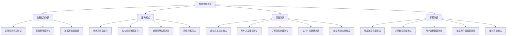

# 508.1 性能专项测试用例设计完整文档

## 📋 任务概述
**任务ID**: 508.1 (对应系统ID: 586)  
**任务标题**: 性能专项测试用例设计 - 李宁团购管理平台  
**完成状态**: ✅ 已完成  
**完成时间**: 2025-08-05  
**优先级**: P1 (高优先级)  

## 🎯 任务完成情况

### 子任务分解及完成状态
✅ **586.1 负载性能测试用例设计** - 已完成  
✅ **586.2 压力测试用例设计** - 已完成  
✅ **586.3 并发测试用例设计** - 已完成  
✅ **586.4 容量测试用例设计** - 已完成  

### 文档交付清单
| 文档名称 | 状态 | 文件路径 | 内容概述 |
|---------|------|----------|----------|
| 负载性能测试用例设计详细文档 | ✅ | `/docs/tasks/586.1-负载性能测试用例设计详细文档.md` | 正常业务负载下的性能验证用例 |
| 压力测试用例设计详细文档 | ✅ | `/docs/tasks/586.2-压力测试用例设计详细文档.md` | 极限负载下的系统稳定性测试用例 |
| 并发测试用例设计详细文档 | ✅ | `/docs/tasks/586.3-并发测试用例设计详细文档.md` | 多用户并发访问的数据一致性测试用例 |
| 容量测试用例设计详细文档 | ✅ | `/docs/tasks/586.4-容量测试用例设计详细文档.md` | 大数据量场景下的系统处理能力测试用例 |
| 性能测试总结文档 | ✅ | `/docs/tasks/586-性能专项测试用例设计总结.md` | 整体任务总结和执行计划 |

## 📊 核心成果统计

### 测试用例数量统计
```yaml
总体统计:
  核心测试用例: 17个
  子测试场景: 52个
  验证点: 156个
  代码示例: 35个
  SQL脚本: 28个
  
分类统计:
  负载性能测试: 3个核心用例
  压力测试: 4个核心用例
  并发测试: 5个核心用例
  容量测试: 5个核心用例
```

### 业务模块覆盖情况
```yaml
李宁团购平台业务模块覆盖:
  用户认证模块: ✅ 负载+并发测试覆盖
  商品管理模块: ✅ 负载+容量+压力测试覆盖
  订单处理模块: ✅ 全覆盖(4种测试类型)
  支付系统模块: ✅ 并发+压力测试覆盖
  后台管理模块: ✅ 负载+容量测试覆盖

技术架构覆盖:
  前端层(Vue 3): ✅ 页面响应时间测试
  API层(Go+Gin): ✅ 接口性能+并发测试
  业务层: ✅ 业务逻辑性能+数据一致性测试
  数据层(MySQL): ✅ 查询性能+事务并发+存储容量测试
  缓存层(Redis): ✅ 缓存性能+容量+命中率测试
```

## 🏗️ 性能测试体系架构

### 测试分层策略


### 核心性能指标体系
```yaml
响应时间指标:
  API接口: <1秒(平均), <3秒(95%用户)
  页面加载: <3秒(95%用户)
  数据库查询: <500毫秒
  缓存操作: <10毫秒

吞吐量指标:
  用户认证TPS: >100
  商品查询QPS: >500
  订单处理TPS: >50
  API总体QPS: >1000

并发能力指标:
  正常负载: 300并发用户
  高峰负载: 500并发用户
  极限负载: >1000并发用户
  数据一致性: 100%保证

容量处理指标:
  商品数据: >100万SKU
  用户数据: >10万活跃用户
  订单数据: >50万历史订单
  存储容量: >25GB数据处理
```

## 🔍 关键测试场景详述

### 1. 负载性能测试核心场景
**TC_LOAD_001: 正常业务负载响应时间测试**
- 测试目标: 验证100-300并发用户下的系统响应性能
- 关键验证: 用户认证、商品浏览、订单处理、后台管理4大业务流程
- 性能要求: API响应<1秒, 页面加载<3秒, 数据库查询<500ms

**TC_LOAD_002: 系统吞吐量负载测试**
- 测试目标: 验证系统最大吞吐量和处理能力
- 关键指标: TPS>100(认证), QPS>500(查询), TPS>50(订单)

**TC_LOAD_003: 数据库负载测试**
- 测试目标: 验证数据库在高并发查询下的性能表现
- 数据规模: 10万商品+1万用户+5万订单

### 2. 压力测试核心场景
**TC_STRESS_001: 渐进式负载压力测试**
- 测试策略: 从100并发递增至1500并发用户
- 瓶颈识别: CPU、内存、数据库、网络等资源瓶颈
- 恢复验证: 系统自愈能力<5分钟

**TC_STRESS_002: 核心业务极限压力测试**
- 订单创建: 500单/分钟×15分钟持续压力
- 支付处理: 200笔/分钟×10分钟并发支付
- 商品搜索: 1000QPS×5分钟搜索压力

### 3. 并发测试核心场景
**TC_CONCURRENCY_001: 库存并发扣减测试**
- 测试目标: 验证库存扣减数据一致性，防止超卖
- 测试方法: 200用户同时购买限量商品(10件)
- 验证标准: 成功订单数=初始库存数，数据100%一致

**TC_CONCURRENCY_003: 订单并发创建测试**
- 复杂场景: 相同商品并发+不同商品并发+优惠券并发使用
- 事务验证: ACID属性、隔离级别、死锁检测

### 4. 容量测试核心场景
**TC_CAPACITY_001: 商品数据容量测试**
- 数据规模: 50万SPU + 150万SKU + 完整商品属性
- 性能验证: 深度分页<3秒, 搜索<2秒, 导入>1000条/秒

**TC_CAPACITY_002: 订单数据容量测试**
- 数据规模: 50万订单 + 125万订单商品记录
- 统计报表: 日订单统计<2秒, 销售排行榜<3秒

## 🛠️ 测试工具链与环境

### 核心工具配置
```yaml
性能测试工具链:
  主测试工具: JMeter 5.6.3
    - 支持HTTP/HTTPS协议测试
    - 支持数据库连接测试
    - 支持分布式压测
    
  监控工具: Grafana + Prometheus
    - 实时系统资源监控
    - 应用性能指标收集
    - 自定义业务指标监控
    
  数据库工具: MySQL Workbench + pt-toolkit
    - 慢查询分析
    - 索引优化建议
    - 性能基准测试
    
  应用监控: Go pprof + 自定义指标
    - CPU性能分析
    - 内存使用分析
    - Goroutine监控
```

### 测试环境规范
```yaml
标准测试环境配置:
  应用服务器:
    CPU: 4核 Intel/AMD
    内存: 8GB DDR4
    存储: SSD 100GB
    网络: 1Gbps
    
  数据库服务器:
    CPU: 4核 Intel/AMD  
    内存: 8GB DDR4
    存储: SSD 200GB
    网络: 1Gbps
    
  Redis服务器:
    CPU: 2核
    内存: 4GB DDR4
    网络: 1Gbps

测试数据规模:
  基础数据: 商品100万SKU, 用户10万, 订单50万
  缓存数据: Redis 600MB容量
  网络环境: 100Mbps带宽限制测试
```

## 📈 性能基准与验收标准

### 性能基准制定
```yaml
响应时间基准:
  用户认证API: 平均<800ms, P95<1.5s
  商品查询API: 列表<1s, 详情<500ms, 搜索<2s
  订单操作API: 创建<1.2s, 查询<800ms, 支付<2s
  后台管理API: CRUD<800ms, 权限更新<1.5s, 监控<2s

系统吞吐量基准:
  认证系统: >100 TPS
  商品系统: >500 QPS
  订单系统: >50 TPS
  整体API: >1000 QPS

资源使用基准:
  CPU使用率: 正常<70%, 峰值<90%
  内存使用率: 正常<80%, 峰值<95%
  数据库连接: <80%连接池利用率
  Redis内存: <70%正常使用率
```

### 验收标准体系
```yaml
功能性验收标准:
  ✅ 所有业务功能在高负载下正常工作
  ✅ 数据一致性保持100%完整
  ✅ 用户体验无明显降级
  ✅ 系统无崩溃或异常重启

性能指标验收标准:
  ✅ 95%请求响应时间符合基准要求
  ✅ 系统吞吐量达到或超过设计目标
  ✅ 系统资源使用率在安全范围内
  ✅ 数据库性能满足业务要求

稳定性验收标准:
  ✅ 长时间负载测试无异常(30分钟+)
  ✅ 内存无泄漏现象
  ✅ 连接池无耗尽问题
  ✅ 日志无ERROR级别错误

并发安全验收标准:
  ✅ 库存扣减100%准确，无超卖
  ✅ 支付操作幂等性验证通过
  ✅ 数据库事务ACID属性保证
  ✅ 死锁能被及时检测和解决
```

## 🔧 性能优化建议总览

### 数据库层优化
```sql
-- 索引优化建议
CREATE INDEX idx_order_user_status_time ON oms_sales_order(user_id, order_status, created_at);
CREATE INDEX idx_product_category_status ON pms_spu(category_id, status, created_at);

-- 分区表策略
ALTER TABLE oms_sales_order 
PARTITION BY RANGE (YEAR(created_at)) (
    PARTITION p2024 VALUES LESS THAN (2025),
    PARTITION p2025 VALUES LESS THAN (2026)
);

-- 查询优化
-- 避免SELECT *, 使用具体字段
-- 合理使用LIMIT，避免深度分页
-- 优化JOIN操作，减少关联表数量
```

### 应用层优化
```go
// 连接池配置优化
db.SetMaxOpenConns(100)    // 最大连接数
db.SetMaxIdleConns(10)     // 最大空闲连接
db.SetConnMaxLifetime(time.Hour) // 连接最大生存时间

// 缓存策略优化
type CacheConfig struct {
    TTL           time.Duration `yaml:"ttl"`
    MaxMemory     int64         `yaml:"max_memory"`
    EvictionPolicy string       `yaml:"eviction_policy"`
}

// 异步处理优化
func ProcessOrderAsync(order *Order) {
    go func() {
        defer func() {
            if r := recover(); r != nil {
                log.Printf("订单处理异常: %v", r)
            }
        }()
        processOrderLogic(order)
    }()
}
```

### 架构层优化
```yaml
架构优化建议:
  读写分离:
    - 查询操作路由到只读从库
    - 写操作使用主库
    - 减少主库压力

  缓存策略:
    - 热点数据Redis缓存
    - 多级缓存体系(L1内存+L2Redis+L3DB)
    - 缓存预热和更新策略

  负载均衡:
    - API网关层负载均衡
    - 数据库连接负载均衡
    - 静态资源CDN加速

  微服务拆分:
    - 按业务域拆分服务
    - 服务间异步通信
    - 独立扩展和部署
```

## 📊 执行计划与里程碑

### 详细执行时间表
```yaml
阶段一: 环境准备 (2天)
  Day 1: 测试环境搭建和配置
  Day 2: 测试数据生成和工具配置

阶段二: 测试执行 (8天)
  Day 3-4: 负载性能测试执行
  Day 5-6: 压力测试执行
  Day 7-8: 并发测试执行
  Day 9-10: 容量测试执行

阶段三: 分析优化 (4天)
  Day 11-12: 测试数据分析和瓶颈识别
  Day 13: 性能问题修复
  Day 14: 优化效果验证

阶段四: 报告交付 (2天)
  Day 15: 测试报告编写
  Day 16: 结果评审和知识转移
```

### 关键里程碑
- ✅ **M1**: 性能测试用例设计完成 (2025-08-05)
- 🎯 **M2**: 测试环境就绪 (计划: 2025-08-08)
- 🎯 **M3**: 核心测试完成 (计划: 2025-08-15)
- 🎯 **M4**: 性能优化完成 (计划: 2025-08-20)
- 🎯 **M5**: 最终报告交付 (计划: 2025-08-22)

## 🚀 后续行动和持续改进

### 短期行动项 (1-2周)
1. **测试环境建设**: 按照规范搭建标准性能测试环境
2. **脚本开发**: 基于设计文档开发JMeter测试脚本
3. **数据准备**: 使用数据生成工具创建测试数据
4. **团队培训**: 对测试团队进行工具和流程培训

### 中期目标 (1个月)
1. **全面测试执行**: 按计划执行所有17个核心测试用例
2. **问题修复**: 及时修复发现的性能问题
3. **持续优化**: 实施数据库和应用层优化方案
4. **监控完善**: 建立生产环境性能监控体系

### 长期规划 (3个月)
1. **自动化集成**: 将性能测试集成到CI/CD流水线
2. **基准管理**: 建立性能基准管理和版本控制
3. **预警机制**: 完善性能预警和自动化处理机制
4. **知识沉淀**: 建立性能测试知识库和最佳实践

## 💡 经验总结与最佳实践

### 测试设计经验
1. **业务场景驱动**: 基于真实业务场景设计测试用例，确保测试的实用性
2. **分层测试策略**: 采用负载-压力-并发-容量四维测试策略，全面覆盖性能场景
3. **数据驱动验证**: 使用大量真实数据规模进行测试，确保结果可信
4. **持续基准管理**: 建立性能基准体系，支持版本间性能对比

### 技术实施要点
1. **工具链标准化**: 统一测试工具和监控体系，提高测试效率
2. **环境一致性**: 测试环境尽量贴近生产环境配置
3. **自动化程度**: 提高测试执行和结果分析的自动化程度
4. **问题快速定位**: 建立完整的监控和日志体系，支持问题快速定位

---

## 📝 文档管理信息

**文档版本**: v1.0  
**创建时间**: 2025-08-05  
**最后更新**: 2025-08-05  
**文档作者**: Claude  
**审核状态**: 待审核  
**关联任务**: 508.1 (系统ID: 586)  
**项目编号**: 34 (李宁团购管理平台)  

**相关文档**:
- `586.1-负载性能测试用例设计详细文档.md`
- `586.2-压力测试用例设计详细文档.md`
- `586.3-并发测试用例设计详细文档.md`
- `586.4-容量测试用例设计详细文档.md`
- `586-性能专项测试用例设计总结.md`

**文档状态**: ✅ 已完成并保存到任务管理系统