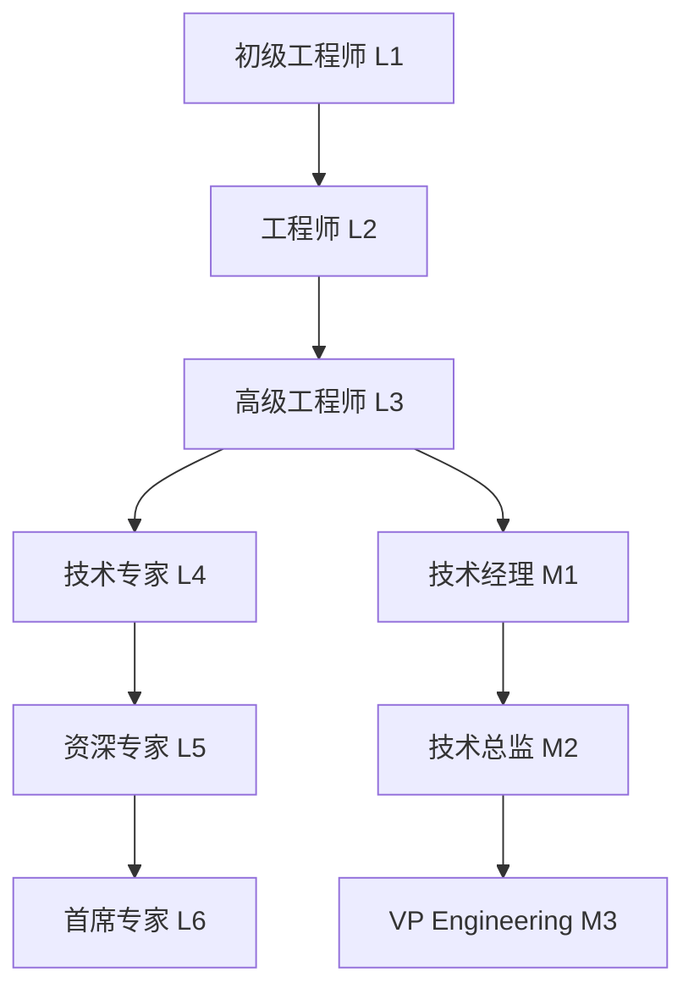
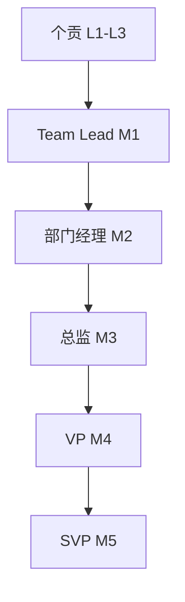

# 企业岗位管理系统设计方案

**文件**: `enterprise_position_management_system.md`  
**作者**: Claude AI  
**创建时间**: 2025-09-04  
**任务**: #1211 - 设计岗位管理系统  
**版本**: v1.0  

## 1. 系统概述

### 1.1 设计目标

设计一个完整的企业岗位管理系统，支持企业管理员创建、管理和维护组织内的岗位体系，包括岗位分类、能力要求、薪酬管理和晋升路径。

### 1.2 核心功能

- **岗位分类管理**: 多维度岗位分类体系
- **岗位能力模型**: 技能要求和胜任力模型  
- **薪酬体系管理**: 岗位薪酬等级和范围
- **晋升路径设计**: 职业发展通道规划
- **岗位配置管理**: 人员配置和编制管理

### 1.3 基于现有架构

基于任务#1210中设计的企业组织架构基础，扩展岗位管理功能：

- 复用 `company_positions` 表结构
- 扩展岗位属性和管理功能
- 集成权限和数据隔离机制

## 2. 岗位分类体系设计

### 2.1 多维度分类模型

```sql
-- 岗位分类维度扩展
CREATE TABLE position_categories (
    id SERIAL PRIMARY KEY,
    company_id INTEGER NOT NULL REFERENCES companies(id),
    category_type VARCHAR(50) NOT NULL, -- function, level, family, track
    category_code VARCHAR(50) NOT NULL,
    category_name VARCHAR(100) NOT NULL,
    parent_category_id INTEGER REFERENCES position_categories(id),
    description TEXT,
    sort_order INTEGER DEFAULT 0,
    is_active BOOLEAN DEFAULT TRUE,
    created_at TIMESTAMPTZ DEFAULT CURRENT_TIMESTAMP,
    
    UNIQUE(company_id, category_type, category_code)
);
```

### 2.2 岗位分类维度

#### 2.2.1 职能分类 (Function Category)
```json
{
  "技术类": ["软件开发", "系统架构", "运维", "测试", "安全"],
  "产品类": ["产品经理", "产品设计", "用户研究", "数据分析"],  
  "市场类": ["市场营销", "品牌推广", "商务拓展", "客户成功"],
  "销售类": ["直销", "渠道销售", "客户管理", "售前支持"],
  "职能类": ["人力资源", "财务", "法务", "行政", "采购"],
  "管理类": ["团队管理", "项目管理", "运营管理", "战略规划"]
}
```

#### 2.2.2 级别分类 (Level Category)  
```json
{
  "初级": {"code": "L1", "range": "L1-L2", "description": "入门级别"},
  "中级": {"code": "L2", "range": "L3-L5", "description": "专业级别"}, 
  "高级": {"code": "L3", "range": "L6-L8", "description": "专家级别"},
  "资深": {"code": "L4", "range": "L9-L10", "description": "资深专家"},
  "管理": {"code": "M1", "range": "M1-M5", "description": "管理序列"}
}
```

#### 2.2.3 职族分类 (Career Family)
```json
{
  "技术序列": ["软件工程师", "架构师", "技术专家", "技术总监"],
  "产品序列": ["产品专员", "产品经理", "高级产品", "产品总监"],
  "管理序列": ["团队Leader", "部门经理", "总监", "VP"]
}
```

### 2.3 岗位分类关联表

```sql
-- 岗位与分类关联
CREATE TABLE position_category_mappings (
    id SERIAL PRIMARY KEY,
    position_id INTEGER NOT NULL REFERENCES company_positions(id),
    category_id INTEGER NOT NULL REFERENCES position_categories(id),
    is_primary BOOLEAN DEFAULT FALSE,
    created_at TIMESTAMPTZ DEFAULT CURRENT_TIMESTAMP,
    
    UNIQUE(position_id, category_id)
);
```

## 3. 岗位能力要求模型

### 3.1 能力框架设计

```sql
-- 能力模型定义
CREATE TABLE competency_models (
    id SERIAL PRIMARY KEY,
    company_id INTEGER NOT NULL REFERENCES companies(id),
    model_name VARCHAR(100) NOT NULL,
    model_type VARCHAR(50) NOT NULL, -- technical, behavioral, leadership
    description TEXT,
    is_active BOOLEAN DEFAULT TRUE,
    created_at TIMESTAMPTZ DEFAULT CURRENT_TIMESTAMP,
    
    UNIQUE(company_id, model_name)
);

-- 能力项定义
CREATE TABLE competencies (
    id SERIAL PRIMARY KEY,
    company_id INTEGER NOT NULL REFERENCES companies(id),
    competency_code VARCHAR(50) NOT NULL,
    competency_name VARCHAR(100) NOT NULL,
    competency_type VARCHAR(50) NOT NULL, -- skill, knowledge, behavior
    category VARCHAR(100), -- 技能分类
    description TEXT,
    proficiency_levels JSONB, -- 熟练度级别定义
    assessment_criteria TEXT,
    is_active BOOLEAN DEFAULT TRUE,
    created_at TIMESTAMPTZ DEFAULT CURRENT_TIMESTAMP,
    
    UNIQUE(company_id, competency_code)
);

-- 岗位能力要求
CREATE TABLE position_competency_requirements (
    id SERIAL PRIMARY KEY,
    position_id INTEGER NOT NULL REFERENCES company_positions(id),
    competency_id INTEGER NOT NULL REFERENCES competencies(id),
    required_level INTEGER NOT NULL, -- 要求等级 1-5
    is_mandatory BOOLEAN DEFAULT TRUE, -- 是否必需
    weight DECIMAL(3,2) DEFAULT 1.0, -- 权重
    assessment_method VARCHAR(50), -- 评估方式
    created_at TIMESTAMPTZ DEFAULT CURRENT_TIMESTAMP,
    
    UNIQUE(position_id, competency_id)
);
```

### 3.2 技能能力库

#### 3.2.1 技术技能 (Technical Skills)
```json
{
  "编程语言": {
    "Java": {"levels": ["基础", "熟练", "精通", "专家", "大师"]},
    "Python": {"levels": ["基础", "熟练", "精通", "专家", "大师"]},
    "Go": {"levels": ["基础", "熟练", "精通", "专家", "大师"]}
  },
  "框架技术": {
    "Spring": {"levels": ["了解", "使用", "熟练", "深入", "架构"]},
    "React": {"levels": ["了解", "使用", "熟练", "深入", "架构"]}
  },
  "数据库技术": {
    "MySQL": {"levels": ["基础", "优化", "架构", "专家", "DBA"]},
    "PostgreSQL": {"levels": ["基础", "优化", "架构", "专家", "DBA"]}
  }
}
```

#### 3.2.2 软技能 (Soft Skills)
```json
{
  "沟通协作": {
    "团队协作": {"levels": ["基础", "主动", "引导", "促进", "领导"]},
    "跨部门沟通": {"levels": ["基础", "有效", "主导", "协调", "桥梁"]},
    "客户沟通": {"levels": ["基础", "专业", "顾问", "trusted", "战略"]}
  },
  "问题解决": {
    "分析能力": {"levels": ["识别", "分析", "设计", "优化", "创新"]},
    "决策能力": {"levels": ["参与", "建议", "决定", "领导", "战略"]}
  }
}
```

### 3.3 能力评估体系

```sql
-- 员工能力评估记录
CREATE TABLE employee_competency_assessments (
    id SERIAL PRIMARY KEY,
    company_user_id INTEGER NOT NULL REFERENCES company_users(id),
    competency_id INTEGER NOT NULL REFERENCES competencies(id),
    current_level INTEGER NOT NULL,
    target_level INTEGER,
    assessment_date DATE DEFAULT CURRENT_DATE,
    assessor_id INTEGER REFERENCES company_users(id),
    assessment_method VARCHAR(50),
    evidence TEXT,
    improvement_plan TEXT,
    next_review_date DATE,
    created_at TIMESTAMPTZ DEFAULT CURRENT_TIMESTAMP
);
```

## 4. 岗位薪酬体系设计

### 4.1 薪酬等级体系

```sql
-- 薪酬等级定义
CREATE TABLE salary_grades (
    id SERIAL PRIMARY KEY,
    company_id INTEGER NOT NULL REFERENCES companies(id),
    grade_code VARCHAR(20) NOT NULL,
    grade_name VARCHAR(50) NOT NULL,
    grade_level INTEGER NOT NULL,
    min_salary DECIMAL(12,2) NOT NULL,
    mid_salary DECIMAL(12,2) NOT NULL,
    max_salary DECIMAL(12,2) NOT NULL,
    currency_code VARCHAR(10) DEFAULT 'CNY',
    effective_date DATE DEFAULT CURRENT_DATE,
    expiry_date DATE,
    is_active BOOLEAN DEFAULT TRUE,
    created_at TIMESTAMPTZ DEFAULT CURRENT_TIMESTAMP,
    
    UNIQUE(company_id, grade_code, effective_date)
);

-- 岗位薪酬配置
CREATE TABLE position_salary_configs (
    id SERIAL PRIMARY KEY,
    position_id INTEGER NOT NULL REFERENCES company_positions(id),
    salary_grade_id INTEGER NOT NULL REFERENCES salary_grades(id),
    base_salary_min DECIMAL(12,2),
    base_salary_max DECIMAL(12,2),
    variable_pay_percentage DECIMAL(5,2), -- 浮动薪酬比例
    bonus_eligible BOOLEAN DEFAULT TRUE,
    equity_eligible BOOLEAN DEFAULT FALSE,
    benefits_package VARCHAR(100),
    effective_date DATE DEFAULT CURRENT_DATE,
    created_at TIMESTAMPTZ DEFAULT CURRENT_TIMESTAMP
);
```

### 4.2 薪酬组成结构

```json
{
  "基本薪酬": {
    "基本工资": "固定月薪",
    "岗位津贴": "岗位特殊津贴",
    "技能津贴": "技能认证津贴"
  },
  "浮动薪酬": {
    "绩效奖金": "基于绩效的奖金",
    "项目奖金": "项目完成奖金",
    "年终奖金": "年度绩效奖金"
  },
  "长期激励": {
    "股权激励": "股票期权/RSU",
    "利润分享": "公司利润分享",
    "留任奖金": "长期留任激励"
  },
  "福利待遇": {
    "社会保险": "五险一金",
    "商业保险": "补充医疗保险",
    "假期福利": "年假、病假等",
    "其他福利": "餐补、交通、培训等"
  }
}
```

### 4.3 薪酬调整机制

```sql
-- 薪酬调整记录
CREATE TABLE salary_adjustment_history (
    id SERIAL PRIMARY KEY,
    company_user_id INTEGER NOT NULL REFERENCES company_users(id),
    position_id INTEGER NOT NULL REFERENCES company_positions(id),
    adjustment_type VARCHAR(50) NOT NULL, -- promotion, merit, market, demotion
    old_salary DECIMAL(12,2),
    new_salary DECIMAL(12,2),
    adjustment_amount DECIMAL(12,2),
    adjustment_percentage DECIMAL(5,2),
    effective_date DATE NOT NULL,
    reason TEXT,
    approved_by INTEGER REFERENCES company_users(id),
    created_at TIMESTAMPTZ DEFAULT CURRENT_TIMESTAMP
);
```

## 5. 岗位晋升路径设计

### 5.1 职业发展通道

```sql
-- 职业发展通道定义
CREATE TABLE career_paths (
    id SERIAL PRIMARY KEY,
    company_id INTEGER NOT NULL REFERENCES companies(id),
    path_name VARCHAR(100) NOT NULL,
    path_type VARCHAR(50) NOT NULL, -- technical, management, specialist
    description TEXT,
    is_active BOOLEAN DEFAULT TRUE,
    created_at TIMESTAMPTZ DEFAULT CURRENT_TIMESTAMP,
    
    UNIQUE(company_id, path_name)
);

-- 晋升路径配置
CREATE TABLE position_career_progressions (
    id SERIAL PRIMARY KEY,
    career_path_id INTEGER NOT NULL REFERENCES career_paths(id),
    from_position_id INTEGER NOT NULL REFERENCES company_positions(id),
    to_position_id INTEGER NOT NULL REFERENCES company_positions(id),
    progression_type VARCHAR(50) NOT NULL, -- promotion, lateral, demotion
    min_tenure_months INTEGER, -- 最短任职月数
    required_performance_rating DECIMAL(3,2), -- 要求绩效评分
    required_competencies INTEGER[], -- 必需能力ID数组
    additional_requirements TEXT,
    approval_process TEXT,
    is_active BOOLEAN DEFAULT TRUE,
    created_at TIMESTAMPTZ DEFAULT CURRENT_TIMESTAMP,
    
    UNIQUE(from_position_id, to_position_id)
);
```

### 5.2 发展通道设计

#### 5.2.1 技术发展通道


#### 5.2.2 管理发展通道


### 5.3 晋升评估机制

```sql
-- 晋升申请流程
CREATE TABLE promotion_applications (
    id SERIAL PRIMARY KEY,
    company_user_id INTEGER NOT NULL REFERENCES company_users(id),
    current_position_id INTEGER NOT NULL REFERENCES company_positions(id),
    target_position_id INTEGER NOT NULL REFERENCES company_positions(id),
    application_date DATE DEFAULT CURRENT_DATE,
    status VARCHAR(20) DEFAULT 'pending', -- pending, reviewing, approved, rejected
    manager_recommendation TEXT,
    hr_assessment TEXT,
    competency_gap_analysis JSONB,
    development_plan TEXT,
    target_effective_date DATE,
    decision_date DATE,
    decision_reason TEXT,
    created_by INTEGER REFERENCES company_users(id),
    created_at TIMESTAMPTZ DEFAULT CURRENT_TIMESTAMP
);
```

## 6. 前端界面设计

### 6.1 岗位管理主界面

```typescript
// 岗位管理页面组件
interface PositionManagementPageProps {}

export const PositionManagementPage: React.FC<PositionManagementPageProps> = () => {
  const [selectedTab, setSelectedTab] = useState('positions');
  
  return (
    <PageContainer 
      title="岗位管理"
      extra={[
        <Button key="create" type="primary" icon={<PlusOutlined />}>
          创建岗位
        </Button>
      ]}
    >
      <Tabs activeKey={selectedTab} onChange={setSelectedTab}>
        <TabPane tab="岗位管理" key="positions">
          <PositionListManager />
        </TabPane>
        <TabPane tab="岗位分类" key="categories">
          <PositionCategoryManager />
        </TabPane>
        <TabPane tab="能力模型" key="competencies">
          <CompetencyModelManager />
        </TabPane>
        <TabPane tab="薪酬体系" key="salary">
          <SalarySystemManager />
        </TabPane>
        <TabPane tab="晋升路径" key="career">
          <CareerPathManager />
        </TabPane>
      </Tabs>
    </PageContainer>
  );
};
```

### 6.2 岗位详情配置界面

```typescript
interface PositionDetailFormProps {
  position?: Position;
  onSave: (position: PositionFormData) => void;
}

export const PositionDetailForm: React.FC<PositionDetailFormProps> = ({
  position,
  onSave
}) => {
  const [form] = Form.useForm();

  return (
    <Form form={form} layout="vertical" onFinish={onSave}>
      <Row gutter={16}>
        <Col span={12}>
          <Form.Item label="岗位名称" name="position_name" rules={[{required: true}]}>
            <Input placeholder="请输入岗位名称" />
          </Form.Item>
        </Col>
        <Col span={12}>
          <Form.Item label="岗位编码" name="position_code" rules={[{required: true}]}>
            <Input placeholder="请输入岗位编码" />
          </Form.Item>
        </Col>
      </Row>
      
      <Row gutter={16}>
        <Col span={8}>
          <Form.Item label="岗位分类" name="position_category">
            <Select placeholder="选择岗位分类">
              <Option value="technical">技术类</Option>
              <Option value="product">产品类</Option>
              <Option value="management">管理类</Option>
            </Select>
          </Form.Item>
        </Col>
        <Col span={8}>
          <Form.Item label="岗位级别" name="position_level">
            <Select placeholder="选择岗位级别">
              <Option value={1}>L1 - 初级</Option>
              <Option value={2}>L2 - 中级</Option>
              <Option value={3}>L3 - 高级</Option>
            </Select>
          </Form.Item>
        </Col>
        <Col span={8}>
          <Form.Item label="薪酬等级" name="salary_grade">
            <Select placeholder="选择薪酬等级">
              <Option value="G1">G1 (8K-15K)</Option>
              <Option value="G2">G2 (15K-25K)</Option>
              <Option value="G3">G3 (25K-40K)</Option>
            </Select>
          </Form.Item>
        </Col>
      </Row>

      <Form.Item label="岗位职责" name="description">
        <TextArea rows={4} placeholder="请输入岗位职责描述" />
      </Form.Item>

      <CompetencyRequirements />
      <SalaryConfiguration />
      <CareerPathConfiguration />
      
      <Form.Item>
        <Space>
          <Button type="primary" htmlType="submit">保存</Button>
          <Button>取消</Button>
        </Space>
      </Form.Item>
    </Form>
  );
};
```

## 7. 后端API设计

### 7.1 岗位管理API

```go
// 岗位管理API路由
func SetupPositionRoutes(r *gin.RouterGroup, deps *Dependencies) {
    positions := r.Group("/positions")
    positions.Use(authMiddleware, companyIsolationMiddleware)
    {
        // 岗位CRUD
        positions.GET("", positionController.ListPositions)
        positions.POST("", positionController.CreatePosition) 
        positions.GET("/:id", positionController.GetPosition)
        positions.PUT("/:id", positionController.UpdatePosition)
        positions.DELETE("/:id", positionController.DeletePosition)
        
        // 岗位分类管理
        positions.GET("/categories", positionController.ListCategories)
        positions.POST("/categories", positionController.CreateCategory)
        
        // 岗位能力要求
        positions.GET("/:id/competencies", positionController.GetPositionCompetencies)
        positions.PUT("/:id/competencies", positionController.UpdatePositionCompetencies)
        
        // 岗位薪酬配置
        positions.GET("/:id/salary", positionController.GetPositionSalary)
        positions.PUT("/:id/salary", positionController.UpdatePositionSalary)
        
        // 晋升路径
        positions.GET("/:id/career-paths", positionController.GetCareerPaths)
        positions.POST("/:id/career-paths", positionController.CreateCareerPath)
    }
}
```

### 7.2 数据模型定义

```go
// 岗位详细信息结构
type PositionDetail struct {
    Position
    Categories        []PositionCategory           `json:"categories"`
    CompetencyReqs   []PositionCompetencyReq      `json:"competency_requirements"`
    SalaryConfig     *PositionSalaryConfig        `json:"salary_config"`
    CareerPaths      []CareerPathOption           `json:"career_paths"`
    EmployeeCount    int                          `json:"employee_count"`
    ReportingChain   []Position                   `json:"reporting_chain"`
}

// 岗位分类结构
type PositionCategory struct {
    ID           int    `json:"id"`
    CategoryType string `json:"category_type"`
    CategoryCode string `json:"category_code"`
    CategoryName string `json:"category_name"`
    Description  string `json:"description"`
}

// 能力要求结构
type PositionCompetencyReq struct {
    CompetencyID    int     `json:"competency_id"`
    CompetencyName  string  `json:"competency_name"`
    RequiredLevel   int     `json:"required_level"`
    IsMandatory     bool    `json:"is_mandatory"`
    Weight          float64 `json:"weight"`
    AssessMethod    string  `json:"assessment_method"`
}
```

## 8. 数据库扩展设计

### 8.1 现有表结构增强

```sql
-- 增强 company_positions 表
ALTER TABLE company_positions ADD COLUMN IF NOT EXISTS
competency_profile_id INTEGER REFERENCES competency_models(id);

ALTER TABLE company_positions ADD COLUMN IF NOT EXISTS
career_path_id INTEGER REFERENCES career_paths(id);

ALTER TABLE company_positions ADD COLUMN IF NOT EXISTS
salary_grade_id INTEGER REFERENCES salary_grades(id);

-- 添加岗位状态管理
ALTER TABLE company_positions ADD COLUMN IF NOT EXISTS
position_status VARCHAR(20) DEFAULT 'active';
-- active, inactive, draft, archived

-- 添加岗位版本管理  
ALTER TABLE company_positions ADD COLUMN IF NOT EXISTS
version INTEGER DEFAULT 1;

ALTER TABLE company_positions ADD COLUMN IF NOT EXISTS
effective_date DATE DEFAULT CURRENT_DATE;
```

### 8.2 统计视图增强

```sql
-- 岗位综合统计视图
CREATE OR REPLACE VIEW position_comprehensive_stats AS
SELECT 
    p.id,
    p.company_id,
    p.position_name,
    p.position_code,
    p.position_level,
    p.position_category,
    -- 人员统计
    COUNT(DISTINCT ea.company_user_id) as current_employees,
    p.max_employee_count,
    CASE 
        WHEN p.max_employee_count > 0 
        THEN COUNT(DISTINCT ea.company_user_id)::FLOAT / p.max_employee_count * 100 
        ELSE 0 
    END as occupancy_rate,
    
    -- 薪酬统计
    sg.grade_name as salary_grade,
    sg.min_salary,
    sg.max_salary,
    COALESCE(AVG(ea.salary), 0) as avg_current_salary,
    
    -- 能力统计
    COUNT(DISTINCT pcr.competency_id) as required_competencies,
    COUNT(DISTINCT CASE WHEN pcr.is_mandatory THEN pcr.competency_id END) as mandatory_competencies,
    
    -- 发展路径
    COUNT(DISTINCT pcp_from.to_position_id) as promotion_options,
    COUNT(DISTINCT pcp_to.from_position_id) as entry_paths,
    
    p.is_active,
    p.created_at,
    p.updated_at

FROM company_positions p
LEFT JOIN employee_assignments ea ON p.id = ea.position_id AND ea.employment_status = 'active'
LEFT JOIN salary_grades sg ON p.salary_grade_id = sg.id
LEFT JOIN position_competency_requirements pcr ON p.id = pcr.position_id
LEFT JOIN position_career_progressions pcp_from ON p.id = pcp_from.from_position_id
LEFT JOIN position_career_progressions pcp_to ON p.id = pcp_to.to_position_id
GROUP BY p.id, p.company_id, p.position_name, p.position_code, 
         p.position_level, p.position_category, p.max_employee_count,
         sg.grade_name, sg.min_salary, sg.max_salary, p.is_active, 
         p.created_at, p.updated_at;
```

## 9. 权限和安全设计

### 9.1 岗位管理权限

```go
// 岗位管理权限定义
const (
    PermPositionCreate     = "position.create"
    PermPositionRead       = "position.read"
    PermPositionUpdate     = "position.update"
    PermPositionDelete     = "position.delete"
    PermPositionManage     = "position.manage"
    
    PermSalaryView         = "position.salary.view"
    PermSalaryManage       = "position.salary.manage"
    
    PermCareerPathView     = "position.career.view"
    PermCareerPathManage   = "position.career.manage"
    
    PermCompetencyView     = "position.competency.view"
    PermCompetencyManage   = "position.competency.manage"
)

// 权限检查中间件
func PositionPermissionMiddleware(requiredPerm string) gin.HandlerFunc {
    return func(c *gin.Context) {
        user := getCurrentUser(c)
        
        if !checkPermission(user, requiredPerm, user.CompanyID) {
            c.JSON(http.StatusForbidden, ErrorResponse{
                Error: "权限不足",
                Code:  "INSUFFICIENT_PERMISSION",
            })
            c.Abort()
            return
        }
        
        c.Next()
    }
}
```

### 9.2 数据隔离机制

```go
// 公司级数据隔离
func CompanyIsolationMiddleware() gin.HandlerFunc {
    return func(c *gin.Context) {
        user := getCurrentUser(c)
        
        // 在查询中自动添加公司ID过滤
        c.Set("company_filter", fmt.Sprintf("company_id = %d", user.CompanyID))
        c.Set("company_id", user.CompanyID)
        
        c.Next()
    }
}

// 查询时自动应用公司过滤
func (s *PositionService) ListPositions(companyID int, filter PositionFilter) ([]Position, error) {
    query := `
        SELECT p.*, pc.category_name, sg.grade_name
        FROM company_positions p
        LEFT JOIN position_categories pc ON p.position_category = pc.category_code
        LEFT JOIN salary_grades sg ON p.salary_grade_id = sg.id
        WHERE p.company_id = $1
    `
    
    args := []interface{}{companyID}
    
    if filter.PositionCategory != "" {
        query += " AND p.position_category = $" + strconv.Itoa(len(args)+1)
        args = append(args, filter.PositionCategory)
    }
    
    // 执行查询...
    return positions, nil
}
```

## 10. 部署和配置

### 10.1 数据库迁移

```sql
-- 创建岗位管理扩展表
-- migration: 100_create_position_management_system.sql

BEGIN;

-- 创建所有新表
\i position_categories.sql
\i competency_models.sql  
\i competencies.sql
\i position_competency_requirements.sql
\i salary_grades.sql
\i position_salary_configs.sql
\i career_paths.sql
\i position_career_progressions.sql
\i employee_competency_assessments.sql
\i salary_adjustment_history.sql
\i promotion_applications.sql

-- 增强现有表
\i enhance_company_positions.sql

-- 创建视图和函数
\i position_views.sql
\i position_functions.sql

-- 创建索引
\i position_indexes.sql

-- 插入基础数据
\i position_seed_data.sql

COMMIT;
```

### 10.2 环境配置

```yaml
# config/position_management.yaml
position_management:
  competency_levels:
    max_level: 5
    default_level: 1
    
  salary_system:
    currency: "CNY"
    adjustment_cycle: "annual"
    max_adjustment_percentage: 30
    
  career_development:
    min_tenure_months: 6
    max_promotion_levels: 2
    require_manager_approval: true
    
  assessment:
    competency_review_cycle: "quarterly"
    performance_threshold: 3.0
    auto_promotion_enabled: false
```

## 11. 测试策略

### 11.1 单元测试

```go
func TestPositionService_CreatePosition(t *testing.T) {
    tests := []struct {
        name    string
        input   CreatePositionRequest
        want    *Position
        wantErr bool
    }{
        {
            name: "成功创建技术岗位",
            input: CreatePositionRequest{
                PositionName: "高级Java工程师",
                PositionCode: "SEN_JAVA_ENG",
                PositionCategory: "technical",
                PositionLevel: 3,
                CompanyID: 1,
            },
            want: &Position{
                PositionName: "高级Java工程师",
                PositionCode: "SEN_JAVA_ENG",
                PositionLevel: 3,
            },
            wantErr: false,
        },
        // 更多测试用例...
    }
    
    for _, tt := range tests {
        t.Run(tt.name, func(t *testing.T) {
            got, err := positionService.CreatePosition(tt.input)
            if (err != nil) != tt.wantErr {
                t.Errorf("CreatePosition() error = %v, wantErr %v", err, tt.wantErr)
                return
            }
            assert.Equal(t, tt.want.PositionName, got.PositionName)
        })
    }
}
```

### 11.2 集成测试

```go
func TestPositionManagement_Integration(t *testing.T) {
    // 创建测试数据库
    db := setupTestDB()
    defer teardownTestDB(db)
    
    // 测试完整岗位管理流程
    t.Run("完整岗位管理流程", func(t *testing.T) {
        // 1. 创建岗位分类
        category := createTestCategory(t, db)
        
        // 2. 创建能力模型
        competency := createTestCompetency(t, db)
        
        // 3. 创建薪酬等级
        salaryGrade := createTestSalaryGrade(t, db)
        
        // 4. 创建岗位
        position := createTestPosition(t, db, category.ID, salaryGrade.ID)
        
        // 5. 配置岗位能力要求
        setupPositionCompetencies(t, db, position.ID, competency.ID)
        
        // 6. 创建晋升路径
        createCareerPath(t, db, position.ID)
        
        // 7. 验证完整配置
        validatePositionConfiguration(t, db, position.ID)
    })
}
```

## 12. 监控和性能

### 12.1 关键指标监控

```go
// 岗位管理监控指标
type PositionMetrics struct {
    TotalPositions       int `json:"total_positions"`
    ActivePositions      int `json:"active_positions"`
    VacantPositions      int `json:"vacant_positions"`
    OverstaffedPositions int `json:"overstaffed_positions"`
    
    CompetencyGaps       int     `json:"competency_gaps"`
    PromotionReadiness   int     `json:"promotion_ready_employees"`
    AvgSalaryByLevel     []int   `json:"avg_salary_by_level"`
    TurnoverByPosition   float64 `json:"turnover_by_position"`
}

func (s *PositionService) GetMetrics(companyID int) (*PositionMetrics, error) {
    // 收集各项指标数据
    metrics := &PositionMetrics{}
    
    // 岗位统计
    metrics.TotalPositions = s.countPositions(companyID, "")
    metrics.ActivePositions = s.countPositions(companyID, "active")
    
    // 人员配置统计  
    metrics.VacantPositions = s.countVacantPositions(companyID)
    metrics.OverstaffedPositions = s.countOverstaffedPositions(companyID)
    
    // 能力和发展统计
    metrics.CompetencyGaps = s.countCompetencyGaps(companyID)
    metrics.PromotionReadiness = s.countPromotionReadyEmployees(companyID)
    
    return metrics, nil
}
```

### 12.2 性能优化

```sql
-- 关键查询索引优化
CREATE INDEX CONCURRENTLY idx_positions_company_category_level 
ON company_positions(company_id, position_category, position_level);

CREATE INDEX CONCURRENTLY idx_position_competencies_position 
ON position_competency_requirements(position_id) INCLUDE (competency_id, required_level);

CREATE INDEX CONCURRENTLY idx_employee_assignments_position_status 
ON employee_assignments(position_id, employment_status) INCLUDE (company_user_id);

-- 分区表设计（用于历史数据）
CREATE TABLE salary_adjustment_history_2024 PARTITION OF salary_adjustment_history 
FOR VALUES FROM ('2024-01-01') TO ('2025-01-01');
```

## 13. 总结

### 13.1 核心成果

本设计方案提供了完整的企业岗位管理系统架构，包括：

1. **多维度岗位分类体系** - 支持职能、级别、职族等多维度分类
2. **能力要求模型** - 技术技能和软技能的全面评估体系  
3. **薪酬管理体系** - 完整的薪酬等级和调整机制
4. **职业发展路径** - 技术和管理双通道发展设计
5. **权限安全机制** - 基于RBAC的细粒度权限控制
6. **性能优化方案** - 数据库索引和查询优化策略

### 13.2 技术特点

- **企业级架构** - 支持多租户数据隔离
- **模块化设计** - 各功能模块独立可扩展
- **标准化接口** - RESTful API和标准数据模型  
- **安全性保证** - 完整的权限控制和审计机制
- **高性能设计** - 优化的数据库设计和查询策略

### 13.3 实施建议

1. **分阶段实施** - 建议按模块逐步实施，先核心功能后扩展功能
2. **数据迁移** - 制定详细的数据迁移计划和回滚策略
3. **用户培训** - 为企业管理员提供完整的使用培训
4. **持续优化** - 建立反馈机制持续优化用户体验

该设计方案为企业提供了现代化的岗位管理解决方案，支持企业人力资源的科学化、标准化管理。