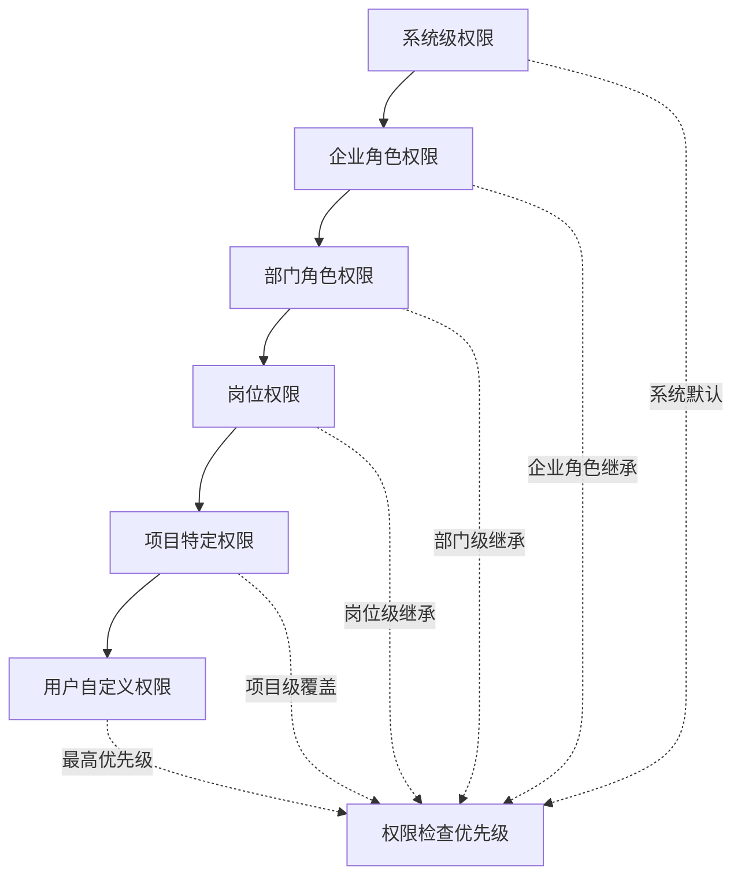

# 企业角色权限系统设计方案

**文件**: `enterprise_role_permission_system.md`  
**作者**: Claude AI  
**创建时间**: 2025-09-04  
**任务**: #1212 - 设计企业角色权限系统  
**版本**: v1.0  

## 1. 系统概述

### 1.1 设计目标

设计一个完整的企业角色权限管理系统，让企业管理员能够创建和管理自定义角色、分配权限，实现细粒度的权限控制和灵活的角色管理。

### 1.2 核心功能

- **企业自定义角色系统** - 企业可创建和管理自己的角色体系
- **权限继承和覆盖机制** - 多层级权限控制和覆盖规则
- **角色模板和预设方案** - 常用角色模板快速创建
- **权限审核和审计系统** - 权限变更的审核流程和完整审计
- **权限分析和冲突检测** - 智能权限分析和问题识别

### 1.3 基于现有架构

基于现有的RBAC权限系统扩展，包括：
- 复用 `company_roles`、`permissions`、`role_permissions` 表
- 扩展企业级权限管理功能
- 集成组织架构和岗位管理（任务#1210、#1211）
- 保持多租户数据隔离

## 2. 现有架构分析

### 2.1 当前权限系统架构

#### 2.1.1 数据库架构
```sql
-- 核心表结构（已存在）
company_roles (角色表)
├── id, role_code, role_name, role_description
├── is_system_role, is_active
└── created_at, updated_at

permissions (权限表)
├── id, permission_code, permission_name, permission_description  
├── module, resource, action
├── parent_id, sort_order
└── is_active, created_at

role_permissions (角色权限关联)
├── id, role_id, permission_id
├── is_granted, granted_at, granted_by
└── unique(role_id, permission_id)

company_users (企业用户)
├── id, user_id, name, email, role_id
├── custom_permissions (JSONB)
├── department, position, status
└── created_at, updated_at
```

#### 2.1.2 权限检查机制
现有系统实现了三级权限检查：
1. **Custom Permissions** (最高优先级) - 用户自定义权限覆盖
2. **Project Permissions** (项目级) - 项目特定权限
3. **Role Permissions** (角色级) - 角色继承权限

### 2.2 存在的限制

1. **企业隔离不足** - 缺少company_id字段进行数据隔离
2. **角色管理限制** - 企业无法完全自定义角色体系
3. **权限模板缺失** - 没有预设角色模板
4. **审批流程缺失** - 权限变更缺乏审批机制
5. **权限分析不足** - 缺乏权限冲突和缺口分析

## 3. 企业自定义角色系统设计

### 3.1 多租户角色隔离

```sql
-- 扩展company_roles表支持企业隔离
ALTER TABLE company_roles ADD COLUMN IF NOT EXISTS company_id INTEGER REFERENCES companies(id);
ALTER TABLE company_roles ADD CONSTRAINT chk_company_system_role 
CHECK (
  (company_id IS NULL AND is_system_role = true) OR 
  (company_id IS NOT NULL AND is_system_role = false)
);

-- 企业角色分类
CREATE TABLE IF NOT EXISTS enterprise_role_categories (
    id SERIAL PRIMARY KEY,
    company_id INTEGER NOT NULL REFERENCES companies(id) ON DELETE CASCADE,
    category_code VARCHAR(50) NOT NULL,
    category_name VARCHAR(100) NOT NULL,
    description TEXT,
    icon VARCHAR(50),
    color VARCHAR(20),
    sort_order INTEGER DEFAULT 0,
    is_active BOOLEAN DEFAULT TRUE,
    created_at TIMESTAMPTZ DEFAULT CURRENT_TIMESTAMP,
    
    UNIQUE(company_id, category_code)
);
```

### 3.2 角色层级结构

```sql
-- 角色层级关系
CREATE TABLE IF NOT EXISTS enterprise_role_hierarchy (
    id SERIAL PRIMARY KEY,
    company_id INTEGER NOT NULL REFERENCES companies(id) ON DELETE CASCADE,
    parent_role_id INTEGER NOT NULL REFERENCES company_roles(id) ON DELETE CASCADE,
    child_role_id INTEGER NOT NULL REFERENCES company_roles(id) ON DELETE CASCADE,
    hierarchy_type VARCHAR(20) DEFAULT 'inherits', -- inherits, restricts, extends
    created_at TIMESTAMPTZ DEFAULT CURRENT_TIMESTAMP,
    
    UNIQUE(parent_role_id, child_role_id),
    CONSTRAINT chk_no_self_reference CHECK (parent_role_id != child_role_id)
);
```

### 3.3 企业角色管理API

```go
// 企业角色管理结构
type EnterpriseRoleManager struct {
    CompanyID int                    `json:"company_id"`
    Roles     []EnterpriseRole      `json:"roles"`
    Categories []RoleCategory       `json:"categories"`
    Templates []RoleTemplate        `json:"templates"`
}

// 企业角色扩展
type EnterpriseRole struct {
    models.CompanyRole
    CompanyID        int             `json:"company_id"`
    CategoryID       *int            `json:"category_id"`
    ParentRoleID     *int            `json:"parent_role_id"`
    ChildRoles       []EnterpriseRole `json:"child_roles,omitempty"`
    PermissionGroups []PermissionGroup `json:"permission_groups"`
    UserCount        int             `json:"user_count"`
    IsCustomizable   bool            `json:"is_customizable"`
    Templates        []string        `json:"templates,omitempty"`
}

// 角色分类
type RoleCategory struct {
    ID           int    `json:"id"`
    CompanyID    int    `json:"company_id"`
    CategoryCode string `json:"category_code"`
    CategoryName string `json:"category_name"`
    Description  string `json:"description"`
    Icon         string `json:"icon"`
    Color        string `json:"color"`
    RoleCount    int    `json:"role_count"`
}

// 权限组
type PermissionGroup struct {
    ID          int                      `json:"id"`
    GroupCode   string                   `json:"group_code"`
    GroupName   string                   `json:"group_name"`
    Module      string                   `json:"module"`
    Permissions []models.PermissionResponse `json:"permissions"`
    IsGranted   bool                     `json:"is_granted"`
}
```

### 3.4 角色创建和管理流程

#### 3.4.1 角色创建请求
```go
type CreateEnterpriseRoleRequest struct {
    RoleCode         string                    `json:"role_code" validate:"required,min=2,max=50"`
    RoleName         string                    `json:"role_name" validate:"required,min=2,max=100"`
    RoleDescription  string                    `json:"role_description"`
    CategoryID       *int                      `json:"category_id"`
    ParentRoleID     *int                      `json:"parent_role_id"`
    PermissionGroups []PermissionGroupRequest  `json:"permission_groups"`
    IsActive         bool                      `json:"is_active"`
    RequiresApproval bool                      `json:"requires_approval"`
}

type PermissionGroupRequest struct {
    GroupCode   string   `json:"group_code"`
    Permissions []string `json:"permissions"` // permission codes
}
```

#### 3.4.2 角色管理API端点
```go
// 企业角色管理路由
func SetupEnterpriseRoleRoutes(r *gin.RouterGroup, deps *Dependencies) {
    roles := r.Group("/enterprise/roles")
    roles.Use(authMiddleware, companyIsolationMiddleware)
    {
        // 角色CRUD
        roles.GET("", roleController.ListEnterpriseRoles)
        roles.POST("", roleController.CreateEnterpriseRole)
        roles.GET("/:id", roleController.GetEnterpriseRole)
        roles.PUT("/:id", roleController.UpdateEnterpriseRole)
        roles.DELETE("/:id", roleController.DeleteEnterpriseRole)
        
        // 角色分类管理
        roles.GET("/categories", roleController.ListRoleCategories)
        roles.POST("/categories", roleController.CreateRoleCategory)
        
        // 权限组管理
        roles.GET("/permission-groups", roleController.GetPermissionGroups)
        roles.GET("/:id/permissions", roleController.GetRolePermissions)
        roles.PUT("/:id/permissions", roleController.UpdateRolePermissions)
        
        // 角色层级管理
        roles.GET("/hierarchy", roleController.GetRoleHierarchy)
        roles.POST("/:id/children", roleController.AddChildRole)
        roles.DELETE("/:id/children/:child_id", roleController.RemoveChildRole)
        
        // 角色模板
        roles.GET("/templates", roleController.ListRoleTemplates)
        roles.POST("/from-template", roleController.CreateRoleFromTemplate)
        
        // 角色分析
        roles.GET("/:id/analysis", roleController.AnalyzeRole)
        roles.GET("/conflicts", roleController.DetectRoleConflicts)
    }
}
```

## 4. 权限继承和覆盖机制

### 4.1 权限继承层级



### 4.2 权限继承规则引擎

```sql
-- 权限继承规则表
CREATE TABLE IF NOT EXISTS permission_inheritance_rules (
    id SERIAL PRIMARY KEY,
    company_id INTEGER NOT NULL REFERENCES companies(id) ON DELETE CASCADE,
    rule_name VARCHAR(100) NOT NULL,
    source_type VARCHAR(50) NOT NULL, -- role, department, position, project
    source_id INTEGER NOT NULL,
    target_type VARCHAR(50) NOT NULL,
    target_id INTEGER NOT NULL,
    inherit_type VARCHAR(20) NOT NULL, -- grant, deny, inherit
    conditions JSONB, -- 继承条件
    priority INTEGER DEFAULT 100,
    is_active BOOLEAN DEFAULT TRUE,
    created_at TIMESTAMPTZ DEFAULT CURRENT_TIMESTAMP
);
```

### 4.3 权限计算引擎

```go
// 权限计算引擎
type PermissionCalculationEngine struct {
    repo PermissionRepository
}

// 计算有效权限
type EffectivePermissionCalculation struct {
    CompanyUserID int                    `json:"company_user_id"`
    PermissionCode string                `json:"permission_code"`
    ResourceID    *int                  `json:"resource_id"`
    Steps         []PermissionStep      `json:"calculation_steps"`
    FinalResult   bool                  `json:"final_result"`
    Source        string                `json:"source"`
    CacheKey      string                `json:"cache_key"`
    TTL           int                   `json:"ttl_seconds"`
}

// 权限计算步骤
type PermissionCalculationStep struct {
    Level         string                `json:"level"`
    Source        string                `json:"source"`
    SourceID      *int                  `json:"source_id"`
    HasPermission bool                  `json:"has_permission"`
    Rule          *InheritanceRule      `json:"rule,omitempty"`
    IsOverride    bool                  `json:"is_override"`
    Priority      int                   `json:"priority"`
    Reason        string                `json:"reason"`
}

// 继承规则
type InheritanceRule struct {
    ID          int                 `json:"id"`
    RuleName    string              `json:"rule_name"`
    SourceType  string              `json:"source_type"`
    TargetType  string              `json:"target_type"`
    InheritType string              `json:"inherit_type"`
    Conditions  map[string]interface{} `json:"conditions"`
    Priority    int                 `json:"priority"`
}
```

### 4.4 权限缓存机制

```sql
-- 权限计算缓存表
CREATE TABLE IF NOT EXISTS permission_calculation_cache (
    id BIGSERIAL PRIMARY KEY,
    cache_key VARCHAR(255) NOT NULL UNIQUE,
    company_id INTEGER NOT NULL REFERENCES companies(id),
    company_user_id INTEGER NOT NULL REFERENCES company_users(id),
    permission_code VARCHAR(100) NOT NULL,
    resource_type VARCHAR(50),
    resource_id INTEGER,
    has_permission BOOLEAN NOT NULL,
    calculation_steps JSONB,
    source_info JSONB,
    expires_at TIMESTAMPTZ NOT NULL,
    created_at TIMESTAMPTZ DEFAULT CURRENT_TIMESTAMP,
    
    INDEX idx_perm_cache_key (cache_key),
    INDEX idx_perm_cache_expires (expires_at),
    INDEX idx_perm_cache_user (company_user_id)
);
```

## 5. 角色模板和预设方案

### 5.1 角色模板定义

```sql
-- 角色模板表
CREATE TABLE IF NOT EXISTS enterprise_role_templates (
    id SERIAL PRIMARY KEY,
    template_code VARCHAR(50) NOT NULL UNIQUE,
    template_name VARCHAR(100) NOT NULL,
    template_description TEXT,
    industry VARCHAR(50), -- 适用行业
    company_size VARCHAR(20), -- small, medium, large, enterprise
    template_data JSONB NOT NULL, -- 模板完整定义
    permission_groups JSONB, -- 权限组配置
    is_system_template BOOLEAN DEFAULT TRUE,
    version VARCHAR(20) DEFAULT '1.0',
    is_active BOOLEAN DEFAULT TRUE,
    created_at TIMESTAMPTZ DEFAULT CURRENT_TIMESTAMP,
    updated_at TIMESTAMPTZ DEFAULT CURRENT_TIMESTAMP
);
```

### 5.2 预设角色模板

#### 5.2.1 通用企业角色模板
```json
{
  "general_enterprise": {
    "ceo": {
      "name": "首席执行官",
      "description": "企业最高管理者",
      "category": "management",
      "permissions": ["*"], 
      "department_access": "all",
      "approval_required": true
    },
    "cto": {
      "name": "首席技术官", 
      "description": "技术部门负责人",
      "category": "management",
      "permissions": [
        "system.*", "project.*", "task.*", 
        "document.technical.*", "finance.budgets.read"
      ],
      "department_access": ["technology", "engineering"]
    },
    "hr_manager": {
      "name": "人力资源经理",
      "description": "人力资源部门管理者",
      "category": "management", 
      "permissions": [
        "company.members.*", "company.roles.*",
        "company.departments.*", "document.hr.*"
      ],
      "department_access": ["hr", "admin"]
    },
    "project_manager": {
      "name": "项目经理",
      "description": "项目管理和执行",
      "category": "management",
      "permissions": [
        "project.*", "task.*", "document.project.*",
        "company.members.read"
      ],
      "project_specific": true
    },
    "developer": {
      "name": "开发工程师", 
      "description": "软件开发人员",
      "category": "technical",
      "permissions": [
        "project.read", "project.detail.read",
        "task.*", "document.technical.read",
        "document.technical.create"
      ]
    },
    "finance_manager": {
      "name": "财务经理",
      "description": "财务管理和报表",
      "category": "finance",
      "permissions": [
        "finance.*", "company.members.read",
        "project.read", "document.finance.*"
      ]
    },
    "sales_manager": {
      "name": "销售经理", 
      "description": "销售团队管理",
      "category": "sales",
      "permissions": [
        "company.customers.*", "project.read",
        "finance.contracts.*", "document.sales.*"
      ]
    }
  }
}
```

#### 5.2.2 行业特定角色模板
```json
{
  "tech_startup": {
    "roles": ["founder", "tech_lead", "full_stack_dev", "ui_designer", "product_manager"],
    "focus": "快速迭代和技术创新"
  },
  "consulting_firm": {
    "roles": ["partner", "senior_consultant", "consultant", "analyst", "admin_support"],
    "focus": "客户项目管理和知识资产"
  },
  "manufacturing": {
    "roles": ["plant_manager", "production_supervisor", "quality_manager", "maintenance_lead"],
    "focus": "生产流程和质量控制"
  }
}
```

### 5.3 模板应用和定制

```go
// 角色模板服务
type RoleTemplateService struct {
    repo TemplateRepository
}

// 应用模板创建角色
type ApplyTemplateRequest struct {
    TemplateCode     string                 `json:"template_code"`
    CompanyID        int                    `json:"company_id"`
    Customizations   map[string]interface{} `json:"customizations"`
    DepartmentMapping map[string]int        `json:"department_mapping"`
    BatchCreate      bool                   `json:"batch_create"`
    RequireApproval  bool                   `json:"require_approval"`
}

// 模板定制选项
type TemplateCustomization struct {
    RoleName          *string   `json:"role_name,omitempty"`
    RoleDescription   *string   `json:"role_description,omitempty"`
    AddPermissions    []string  `json:"add_permissions,omitempty"`
    RemovePermissions []string  `json:"remove_permissions,omitempty"`
    DepartmentScope   []int     `json:"department_scope,omitempty"`
    ProjectScope      []int     `json:"project_scope,omitempty"`
}
```

## 6. 权限审核和审计系统

### 6.1 权限变更审批流程

```sql
-- 权限审批工作流
CREATE TABLE IF NOT EXISTS permission_approval_workflows (
    id SERIAL PRIMARY KEY,
    company_id INTEGER NOT NULL REFERENCES companies(id) ON DELETE CASCADE,
    workflow_name VARCHAR(100) NOT NULL,
    trigger_conditions JSONB, -- 触发审批的条件
    approval_levels INTEGER DEFAULT 1,
    approvers JSONB, -- 审批人配置
    auto_approval_rules JSONB,
    timeout_hours INTEGER DEFAULT 72,
    is_active BOOLEAN DEFAULT TRUE,
    created_at TIMESTAMPTZ DEFAULT CURRENT_TIMESTAMP
);

-- 权限变更申请
CREATE TABLE IF NOT EXISTS permission_change_requests (
    id BIGSERIAL PRIMARY KEY,
    request_number VARCHAR(50) NOT NULL UNIQUE,
    company_id INTEGER NOT NULL REFERENCES companies(id),
    requester_id INTEGER NOT NULL REFERENCES company_users(id),
    target_user_id INTEGER REFERENCES company_users(id),
    change_type VARCHAR(50) NOT NULL, -- role_assign, permission_grant, custom_override
    change_details JSONB NOT NULL,
    business_justification TEXT,
    risk_level VARCHAR(20) DEFAULT 'low', -- low, medium, high, critical
    current_status VARCHAR(20) DEFAULT 'pending',
    workflow_id INTEGER REFERENCES permission_approval_workflows(id),
    submitted_at TIMESTAMPTZ DEFAULT CURRENT_TIMESTAMP,
    approved_at TIMESTAMPTZ,
    rejected_at TIMESTAMPTZ,
    expires_at TIMESTAMPTZ,
    
    -- 审批历史
    approval_history JSONB,
    rejection_reason TEXT,
    auto_approved BOOLEAN DEFAULT FALSE
);
```

### 6.2 审批流程引擎

```go
// 审批流程引擎
type ApprovalEngine struct {
    workflowRepo WorkflowRepository
    notifier     NotificationService
}

// 权限变更申请
type PermissionChangeRequest struct {
    ID                    int64                   `json:"id"`
    RequestNumber         string                  `json:"request_number"`
    CompanyID             int                     `json:"company_id"`
    RequesterID           int                     `json:"requester_id"`
    TargetUserID          *int                    `json:"target_user_id"`
    ChangeType            string                  `json:"change_type"`
    ChangeDetails         map[string]interface{}  `json:"change_details"`
    BusinessJustification string                  `json:"business_justification"`
    RiskLevel             string                  `json:"risk_level"`
    CurrentStatus         string                  `json:"current_status"`
    WorkflowID            *int                    `json:"workflow_id"`
    ApprovalHistory       []ApprovalStep          `json:"approval_history"`
    SubmittedAt           time.Time               `json:"submitted_at"`
    ExpiresAt             *time.Time              `json:"expires_at"`
}

// 审批步骤
type ApprovalStep struct {
    Level        int       `json:"level"`
    ApproverID   int       `json:"approver_id"`
    ApproverName string    `json:"approver_name"`
    Action       string    `json:"action"` // approved, rejected, delegated
    Comment      string    `json:"comment"`
    ApprovedAt   time.Time `json:"approved_at"`
    IsRequired   bool      `json:"is_required"`
    IsFinal      bool      `json:"is_final"`
}

// 审批工作流配置
type ApprovalWorkflow struct {
    ID                  int                    `json:"id"`
    CompanyID           int                    `json:"company_id"`
    WorkflowName        string                 `json:"workflow_name"`
    TriggerConditions   map[string]interface{} `json:"trigger_conditions"`
    ApprovalLevels      int                    `json:"approval_levels"`
    Approvers           []ApproverConfig       `json:"approvers"`
    AutoApprovalRules   []AutoApprovalRule     `json:"auto_approval_rules"`
    TimeoutHours        int                    `json:"timeout_hours"`
    IsActive            bool                   `json:"is_active"`
}

// 审批人配置
type ApproverConfig struct {
    Level           int      `json:"level"`
    ApproverType    string   `json:"approver_type"` // user, role, department
    ApproverIDs     []int    `json:"approver_ids"`
    RequiredCount   int      `json:"required_count"` // 需要几个人审批
    AllowDelegation bool     `json:"allow_delegation"`
    IsOptional      bool     `json:"is_optional"`
}
```

### 6.3 审计日志增强

```sql
-- 增强审计日志表
ALTER TABLE permission_audit_logs ADD COLUMN IF NOT EXISTS request_id BIGINT REFERENCES permission_change_requests(id);
ALTER TABLE permission_audit_logs ADD COLUMN IF NOT EXISTS session_id VARCHAR(100);
ALTER TABLE permission_audit_logs ADD COLUMN IF NOT EXISTS geolocation JSONB;
ALTER TABLE permission_audit_logs ADD COLUMN IF NOT EXISTS device_info JSONB;
ALTER TABLE permission_audit_logs ADD COLUMN IF NOT EXISTS risk_score INTEGER;

-- 审计规则配置
CREATE TABLE IF NOT EXISTS audit_rules (
    id SERIAL PRIMARY KEY,
    company_id INTEGER NOT NULL REFERENCES companies(id),
    rule_name VARCHAR(100) NOT NULL,
    trigger_events TEXT[], -- 触发事件
    severity_level VARCHAR(20) DEFAULT 'info',
    alert_conditions JSONB,
    notification_config JSONB,
    retention_days INTEGER DEFAULT 365,
    is_active BOOLEAN DEFAULT TRUE,
    created_at TIMESTAMPTZ DEFAULT CURRENT_TIMESTAMP
);
```

## 7. 前端界面设计

### 7.1 企业角色管理主界面

```typescript
// 企业角色管理页面
interface EnterpriseRoleManagementPageProps {}

export const EnterpriseRoleManagementPage: React.FC<EnterpriseRoleManagementPageProps> = () => {
  const [selectedTab, setSelectedTab] = useState('roles');

  return (
    <PageContainer 
      title="角色权限管理"
      extra={[
        <Button key="template" icon={<AppstoreAddOutlined />}>
          从模板创建
        </Button>,
        <Button key="create" type="primary" icon={<PlusOutlined />}>
          创建角色
        </Button>
      ]}
    >
      <Tabs activeKey={selectedTab} onChange={setSelectedTab}>
        <TabPane tab="角色管理" key="roles">
          <EnterpriseRoleManager />
        </TabPane>
        <TabPane tab="权限组" key="permissions">
          <PermissionGroupManager />
        </TabPane>
        <TabPane tab="审批流程" key="approval">
          <ApprovalWorkflowManager />
        </TabPane>
        <TabPane tab="角色模板" key="templates">
          <RoleTemplateManager />
        </TabPane>
        <TabPane tab="权限分析" key="analysis">
          <PermissionAnalysisPanel />
        </TabPane>
      </Tabs>
    </PageContainer>
  );
};
```

### 7.2 角色创建向导

```typescript
// 角色创建向导
interface RoleCreationWizardProps {
  onComplete: (role: EnterpriseRole) => void;
  templates?: RoleTemplate[];
}

export const RoleCreationWizard: React.FC<RoleCreationWizardProps> = ({
  onComplete,
  templates
}) => {
  const [currentStep, setCurrentStep] = useState(0);
  const [roleData, setRoleData] = useState<Partial<EnterpriseRole>>({});

  const steps = [
    {
      title: '选择创建方式',
      content: <CreationMethodStep 
        templates={templates}
        onSelect={(method, template) => {
          setRoleData({ ...roleData, template, creationMethod: method });
          setCurrentStep(1);
        }}
      />
    },
    {
      title: '基本信息',
      content: <BasicInfoStep 
        data={roleData}
        onChange={(data) => setRoleData({ ...roleData, ...data })}
      />
    },
    {
      title: '权限配置',
      content: <PermissionConfigStep 
        data={roleData}
        onChange={(permissions) => setRoleData({ ...roleData, permissions })}
      />
    },
    {
      title: '审核设置',
      content: <ApprovalConfigStep 
        data={roleData}
        onChange={(config) => setRoleData({ ...roleData, approvalConfig: config })}
      />
    },
    {
      title: '确认创建',
      content: <ConfirmationStep 
        data={roleData}
        onConfirm={() => onComplete(roleData as EnterpriseRole)}
      />
    }
  ];

  return (
    <Modal
      title="创建企业角色"
      width={800}
      open={true}
      footer={null}
      destroyOnClose
    >
      <Steps current={currentStep} className="mb-6">
        {steps.map(step => (
          <Step key={step.title} title={step.title} />
        ))}
      </Steps>

      <div className="min-h-96">
        {steps[currentStep].content}
      </div>

      <div className="flex justify-between mt-6">
        <Button 
          disabled={currentStep === 0} 
          onClick={() => setCurrentStep(currentStep - 1)}
        >
          上一步
        </Button>
        <Space>
          <Button onClick={() => {}}>取消</Button>
          {currentStep < steps.length - 1 && (
            <Button 
              type="primary" 
              onClick={() => setCurrentStep(currentStep + 1)}
            >
              下一步
            </Button>
          )}
        </Space>
      </div>
    </Modal>
  );
};
```

### 7.3 权限矩阵组件

```typescript
// 权限矩阵展示和编辑
interface PermissionMatrixProps {
  roleId?: number;
  permissions: PermissionGroup[];
  value?: string[];
  onChange?: (permissions: string[]) => void;
  readonly?: boolean;
}

export const PermissionMatrix: React.FC<PermissionMatrixProps> = ({
  roleId,
  permissions,
  value = [],
  onChange,
  readonly = false
}) => {
  const [expandedGroups, setExpandedGroups] = useState<string[]>([]);
  const [selectedPermissions, setSelectedPermissions] = useState<Set<string>>(
    new Set(value)
  );

  const handlePermissionChange = (permissionCode: string, granted: boolean) => {
    const newSelected = new Set(selectedPermissions);
    if (granted) {
      newSelected.add(permissionCode);
    } else {
      newSelected.delete(permissionCode);
    }
    setSelectedPermissions(newSelected);
    onChange?.(Array.from(newSelected));
  };

  const handleGroupChange = (groupCode: string, granted: boolean) => {
    const group = permissions.find(g => g.GroupCode === groupCode);
    if (!group) return;

    const newSelected = new Set(selectedPermissions);
    group.Permissions.forEach(perm => {
      if (granted) {
        newSelected.add(perm.PermissionCode);
      } else {
        newSelected.delete(perm.PermissionCode);
      }
    });
    setSelectedPermissions(newSelected);
    onChange?.(Array.from(newSelected));
  };

  return (
    <Card title="权限配置" className="permission-matrix">
      {permissions.map(group => {
        const groupPermissions = group.Permissions;
        const grantedCount = groupPermissions.filter(p => 
          selectedPermissions.has(p.PermissionCode)
        ).length;
        const totalCount = groupPermissions.length;
        const isExpanded = expandedGroups.includes(group.GroupCode);

        return (
          <Card
            key={group.GroupCode}
            type="inner"
            className="mb-4"
            title={
              <div className="flex justify-between items-center">
                <div className="flex items-center">
                  <Checkbox
                    checked={grantedCount === totalCount}
                    indeterminate={grantedCount > 0 && grantedCount < totalCount}
                    onChange={(e) => handleGroupChange(group.GroupCode, e.target.checked)}
                    disabled={readonly}
                  >
                    <strong>{group.GroupName}</strong>
                  </Checkbox>
                  <Tag className="ml-2">
                    {grantedCount}/{totalCount}
                  </Tag>
                </div>
                <Button
                  type="text"
                  icon={isExpanded ? <UpOutlined /> : <DownOutlined />}
                  onClick={() => {
                    if (isExpanded) {
                      setExpandedGroups(expandedGroups.filter(g => g !== group.GroupCode));
                    } else {
                      setExpandedGroups([...expandedGroups, group.GroupCode]);
                    }
                  }}
                />
              </div>
            }
          >
            {isExpanded && (
              <div className="grid grid-cols-2 gap-4">
                {groupPermissions.map(permission => (
                  <div key={permission.PermissionCode} className="flex items-center">
                    <Checkbox
                      checked={selectedPermissions.has(permission.PermissionCode)}
                      onChange={(e) => handlePermissionChange(
                        permission.PermissionCode, 
                        e.target.checked
                      )}
                      disabled={readonly}
                    >
                      <div>
                        <div>{permission.PermissionName}</div>
                        {permission.PermissionDescription && (
                          <div className="text-gray-500 text-sm">
                            {permission.PermissionDescription}
                          </div>
                        )}
                      </div>
                    </Checkbox>
                  </div>
                ))}
              </div>
            )}
          </Card>
        );
      })}
    </Card>
  );
};
```

## 8. 后端API设计

### 8.1 企业角色管理API

```go
// 企业角色管理控制器
type EnterpriseRoleController struct {
    roleService       *EnterpriseRoleService
    permissionService *PermissionService
    approvalService   *ApprovalService
}

// API路由定义
func (c *EnterpriseRoleController) SetupRoutes(r *gin.RouterGroup) {
    roles := r.Group("/enterprise/roles")
    roles.Use(authMiddleware, companyIsolationMiddleware, permissionMiddleware("company.roles.read"))
    
    {
        // 角色基础操作
        roles.GET("", permissionRequired("company.roles.read"), c.ListRoles)
        roles.POST("", permissionRequired("company.roles.create"), c.CreateRole)
        roles.GET("/:id", permissionRequired("company.roles.read"), c.GetRole)
        roles.PUT("/:id", permissionRequired("company.roles.update"), c.UpdateRole)
        roles.DELETE("/:id", permissionRequired("company.roles.delete"), c.DeleteRole)
        
        // 权限管理
        roles.GET("/:id/permissions", permissionRequired("company.roles.read"), c.GetRolePermissions)
        roles.PUT("/:id/permissions", permissionRequired("company.roles.manage"), c.UpdateRolePermissions)
        
        // 角色层级
        roles.GET("/hierarchy", permissionRequired("company.roles.read"), c.GetRoleHierarchy)
        roles.POST("/:id/children", permissionRequired("company.roles.manage"), c.AddChildRole)
        
        // 角色模板
        roles.GET("/templates", c.ListRoleTemplates)
        roles.POST("/from-template", permissionRequired("company.roles.create"), c.CreateFromTemplate)
        
        // 权限分析
        roles.GET("/:id/analysis", permissionRequired("company.roles.read"), c.AnalyzeRole)
        roles.GET("/conflicts", permissionRequired("company.roles.read"), c.DetectConflicts)
        
        // 审批管理
        roles.GET("/approval-requests", permissionRequired("company.roles.approve"), c.ListApprovalRequests)
        roles.POST("/approval-requests/:id/approve", permissionRequired("company.roles.approve"), c.ApproveRequest)
        roles.POST("/approval-requests/:id/reject", permissionRequired("company.roles.approve"), c.RejectRequest)
    }
}
```

### 8.2 权限计算服务

```go
// 权限计算服务
type PermissionCalculationService struct {
    repo        PermissionRepository
    cache       cache.Cache
    ruleEngine  *InheritanceRuleEngine
}

// 计算用户有效权限
func (s *PermissionCalculationService) CalculateEffectivePermissions(
    ctx context.Context, 
    companyUserID int,
    resourceType string,
    resourceID *int,
) (*EffectivePermissions, error) {
    
    cacheKey := fmt.Sprintf("effective_perms:%d:%s:%v", companyUserID, resourceType, resourceID)
    
    // 检查缓存
    if cached, err := s.cache.Get(cacheKey); err == nil {
        var result EffectivePermissions
        if json.Unmarshal(cached, &result) == nil {
            return &result, nil
        }
    }
    
    // 获取用户信息
    user, err := s.repo.GetCompanyUser(ctx, companyUserID)
    if err != nil {
        return nil, err
    }
    
    result := &EffectivePermissions{
        CompanyUserID: companyUserID,
        Permissions:   make(map[string]PermissionResult),
        CalculatedAt:  time.Now(),
    }
    
    // 1. 获取所有可能的权限
    allPermissions, err := s.repo.GetPermissions(ctx)
    if err != nil {
        return nil, err
    }
    
    // 2. 逐个计算每个权限
    for _, perm := range allPermissions {
        permResult, err := s.calculateSinglePermission(
            ctx, user, perm.PermissionCode, resourceType, resourceID,
        )
        if err != nil {
            continue // 跳过计算失败的权限
        }
        result.Permissions[perm.PermissionCode] = *permResult
    }
    
    // 3. 缓存结果
    if resultJSON, err := json.Marshal(result); err == nil {
        s.cache.SetWithExpiration(cacheKey, resultJSON, 15*time.Minute)
    }
    
    return result, nil
}

// 计算单个权限
func (s *PermissionCalculationService) calculateSinglePermission(
    ctx context.Context,
    user *models.CompanyUser,
    permissionCode string,
    resourceType string,
    resourceID *int,
) (*PermissionResult, error) {
    
    calculation := &PermissionCalculation{
        Steps: []CalculationStep{},
    }
    
    // 第1步：检查超级管理员权限
    if s.isCompanyAdmin(user) {
        calculation.Steps = append(calculation.Steps, CalculationStep{
            Level:         "admin",
            Source:        "company_admin",
            HasPermission: true,
            Priority:      1000,
            Reason:        "Company administrator has all permissions",
        })
        return &PermissionResult{
            HasPermission: true,
            Source:        "company_admin",
            Calculation:   calculation,
        }, nil
    }
    
    // 第2步：检查用户自定义权限覆盖
    if customResult := s.checkCustomPermissions(ctx, user, permissionCode); customResult != nil {
        calculation.Steps = append(calculation.Steps, CalculationStep{
            Level:         "custom",
            Source:        "user_override",
            HasPermission: customResult.HasPermission,
            Priority:      900,
            IsOverride:    true,
            Reason:        customResult.Reason,
        })
        return customResult, nil
    }
    
    // 第3步：检查岗位权限
    if user.PositionID != nil {
        if positionResult := s.checkPositionPermissions(ctx, *user.PositionID, permissionCode); positionResult != nil {
            calculation.Steps = append(calculation.Steps, CalculationStep{
                Level:         "position",
                Source:        "position_role",
                HasPermission: positionResult.HasPermission,
                Priority:      800,
                Reason:        positionResult.Reason,
            })
            if positionResult.HasPermission {
                return positionResult, nil
            }
        }
    }
    
    // 第4步：检查部门权限
    if user.DepartmentID != nil {
        if deptResult := s.checkDepartmentPermissions(ctx, *user.DepartmentID, permissionCode); deptResult != nil {
            calculation.Steps = append(calculation.Steps, CalculationStep{
                Level:         "department", 
                Source:        "department_role",
                HasPermission: deptResult.HasPermission,
                Priority:      700,
                Reason:        deptResult.Reason,
            })
            if deptResult.HasPermission {
                return deptResult, nil
            }
        }
    }
    
    // 第5步：检查角色权限
    if user.RoleID != nil {
        if roleResult := s.checkRolePermissions(ctx, *user.RoleID, permissionCode); roleResult != nil {
            calculation.Steps = append(calculation.Steps, CalculationStep{
                Level:         "role",
                Source:        "company_role", 
                HasPermission: roleResult.HasPermission,
                Priority:      600,
                Reason:        roleResult.Reason,
            })
            if roleResult.HasPermission {
                return roleResult, nil
            }
        }
    }
    
    // 第6步：检查资源特定权限
    if resourceType != "" && resourceID != nil {
        if resourceResult := s.checkResourcePermissions(ctx, user.ID, permissionCode, resourceType, *resourceID); resourceResult != nil {
            calculation.Steps = append(calculation.Steps, CalculationStep{
                Level:         "resource",
                Source:        fmt.Sprintf("%s_specific", resourceType),
                HasPermission: resourceResult.HasPermission, 
                Priority:      500,
                Reason:        resourceResult.Reason,
            })
            if resourceResult.HasPermission {
                return resourceResult, nil
            }
        }
    }
    
    // 默认拒绝
    return &PermissionResult{
        HasPermission: false,
        Source:        "default_deny",
        Reason:        "Permission not granted at any level",
        Calculation:   calculation,
    }, nil
}
```

## 9. 部署和配置

### 9.1 数据库迁移

```sql
-- 企业角色权限系统迁移脚本
-- migration: 200_enterprise_role_permission_system.sql

BEGIN;

-- 1. 扩展现有表
ALTER TABLE company_roles ADD COLUMN IF NOT EXISTS company_id INTEGER REFERENCES companies(id);
CREATE INDEX IF NOT EXISTS idx_company_roles_company ON company_roles(company_id);

-- 2. 创建新表
\i enterprise_role_categories.sql
\i enterprise_role_hierarchy.sql  
\i permission_inheritance_rules.sql
\i enterprise_role_templates.sql
\i permission_approval_workflows.sql
\i permission_change_requests.sql
\i permission_calculation_cache.sql
\i audit_rules.sql

-- 3. 更新权限表结构
ALTER TABLE permissions ADD COLUMN IF NOT EXISTS company_id INTEGER REFERENCES companies(id);
ALTER TABLE permissions ADD COLUMN IF NOT EXISTS is_customizable BOOLEAN DEFAULT TRUE;

-- 4. 创建视图和函数
\i enterprise_permission_views.sql
\i permission_calculation_functions.sql

-- 5. 插入基础数据
\i enterprise_role_seed_data.sql
\i permission_template_seed_data.sql

-- 6. 创建触发器
\i permission_audit_triggers.sql
\i permission_cache_invalidation_triggers.sql

COMMIT;
```

### 9.2 系统配置

```yaml
# config/enterprise_roles.yaml
enterprise_roles:
  # 权限计算配置
  permission_calculation:
    enable_cache: true
    cache_ttl_minutes: 15
    max_inheritance_depth: 10
    
  # 审批流程配置  
  approval_workflow:
    default_timeout_hours: 72
    auto_approve_low_risk: false
    require_business_justification: true
    
  # 角色模板配置
  role_templates:
    enable_industry_templates: true
    allow_custom_templates: true
    template_versioning: true
    
  # 审计配置
  audit:
    retention_days: 365
    high_risk_alert: true
    geolocation_tracking: true
    
  # 缓存配置
  cache:
    provider: "redis" # memory, redis
    cluster_mode: false
    key_prefix: "enterprise_perms:"
```

### 9.3 环境变量配置

```bash
# 企业角色权限系统环境变量
ENTERPRISE_ROLES_ENABLED=true
PERMISSION_CACHE_TTL=900
APPROVAL_WORKFLOW_ENABLED=true
ROLE_TEMPLATES_ENABLED=true

# 审计配置
AUDIT_HIGH_RISK_ALERT=true
AUDIT_RETENTION_DAYS=365
GEOLOCATION_TRACKING=true

# 性能配置
MAX_PERMISSION_CALCULATION_TIME=5s
PERMISSION_CACHE_SIZE=10000
ROLE_HIERARCHY_MAX_DEPTH=10
```

## 10. 测试策略

### 10.1 权限计算测试

```go
func TestPermissionCalculation_ComplexInheritance(t *testing.T) {
    tests := []struct {
        name           string
        setupUser      func() *models.CompanyUser
        permissionCode string
        expectedResult bool
        expectedSource string
    }{
        {
            name: "管理员用户应拥有所有权限",
            setupUser: func() *models.CompanyUser {
                return &models.CompanyUser{
                    ID:       1,
                    RoleCode: "company_admin",
                    IsActive: true,
                }
            },
            permissionCode: "system.delete",
            expectedResult: true,
            expectedSource: "company_admin",
        },
        {
            name: "自定义权限覆盖角色权限",
            setupUser: func() *models.CompanyUser {
                user := &models.CompanyUser{ID: 2, RoleID: &normalRoleID}
                user.CustomPermissions = map[string]bool{
                    "project.delete": false, // 明确拒绝
                }
                return user
            },
            permissionCode: "project.delete", 
            expectedResult: false,
            expectedSource: "custom_override",
        },
        {
            name: "岗位权限继承",
            setupUser: func() *models.CompanyUser {
                positionID := 10
                return &models.CompanyUser{
                    ID:         3,
                    PositionID: &positionID,
                }
            },
            permissionCode: "task.create",
            expectedResult: true,
            expectedSource: "position_role",
        },
    }

    for _, tt := range tests {
        t.Run(tt.name, func(t *testing.T) {
            user := tt.setupUser()
            result, err := permissionService.CalculatePermission(
                context.Background(), user, tt.permissionCode, nil, nil,
            )
            
            assert.NoError(t, err)
            assert.Equal(t, tt.expectedResult, result.HasPermission)
            assert.Equal(t, tt.expectedSource, result.Source)
        })
    }
}
```

### 10.2 审批流程测试

```go
func TestApprovalWorkflow_MultiLevelApproval(t *testing.T) {
    // 设置测试场景
    workflow := &ApprovalWorkflow{
        ApprovalLevels: 3,
        Approvers: []ApproverConfig{
            {Level: 1, ApproverIDs: []int{101}, RequiredCount: 1},
            {Level: 2, ApproverIDs: []int{102}, RequiredCount: 1},
            {Level: 3, ApproverIDs: []int{103}, RequiredCount: 1},
        },
    }
    
    request := &PermissionChangeRequest{
        RequesterID:           1,
        ChangeType:           "role_assign",
        BusinessJustification: "需要项目管理权限",
        RiskLevel:            "medium",
    }
    
    // 执行测试
    err := approvalService.SubmitRequest(context.Background(), request, workflow)
    assert.NoError(t, err)
    
    // 第一级审批
    err = approvalService.ApproveRequest(context.Background(), request.ID, 101, "同意")
    assert.NoError(t, err)
    
    // 检查状态
    status, err := approvalService.GetRequestStatus(context.Background(), request.ID)
    assert.NoError(t, err)
    assert.Equal(t, "level_1_approved", status.CurrentStatus)
    
    // 继续后续审批...
}
```

## 11. 监控和性能

### 11.1 关键指标监控

```go
// 权限系统监控指标
type PermissionMetrics struct {
    // 权限计算性能
    CalculationLatency      prometheus.Histogram `json:"calculation_latency_ms"`
    CalculationCount        prometheus.Counter   `json:"calculation_count"`
    CacheHitRate           prometheus.Gauge     `json:"cache_hit_rate"`
    
    // 角色管理
    ActiveRoles            prometheus.Gauge     `json:"active_roles"`
    CustomRoles            prometheus.Gauge     `json:"custom_roles"`
    TemplateUsage          prometheus.Counter   `json:"template_usage"`
    
    // 审批流程
    PendingApprovals       prometheus.Gauge     `json:"pending_approvals"`
    ApprovalLatency        prometheus.Histogram `json:"approval_latency_hours"`
    AutoApprovalRate       prometheus.Gauge     `json:"auto_approval_rate"`
    
    // 安全指标
    PermissionDenials      prometheus.Counter   `json:"permission_denials"`
    SuspiciousActivity     prometheus.Counter   `json:"suspicious_activity"`
    HighRiskChanges        prometheus.Counter   `json:"high_risk_changes"`
}

func (m *PermissionMetrics) RecordCalculation(duration time.Duration, cacheHit bool) {
    m.CalculationLatency.Observe(float64(duration.Milliseconds()))
    m.CalculationCount.Inc()
    if cacheHit {
        m.CacheHitRate.Set(m.CacheHitRate.Get() + 1)
    }
}
```

### 11.2 性能优化策略

```go
// 权限缓存管理器
type PermissionCacheManager struct {
    redis       redis.Client
    localCache  *bigcache.BigCache
    metrics     *PermissionMetrics
}

// 多层缓存策略
func (c *PermissionCacheManager) GetPermission(
    key string,
) (*PermissionResult, bool) {
    
    // L1缓存：本地内存缓存（最快）
    if data, err := c.localCache.Get(key); err == nil {
        var result PermissionResult
        if json.Unmarshal(data, &result) == nil {
            c.metrics.RecordCacheHit("local")
            return &result, true
        }
    }
    
    // L2缓存：Redis缓存（中等速度）
    if data, err := c.redis.Get(context.Background(), key).Result(); err == nil {
        var result PermissionResult
        if json.Unmarshal([]byte(data), &result) == nil {
            // 回写到L1缓存
            if resultJSON, _ := json.Marshal(result); resultJSON != nil {
                c.localCache.Set(key, resultJSON)
            }
            c.metrics.RecordCacheHit("redis")
            return &result, true
        }
    }
    
    c.metrics.RecordCacheMiss()
    return nil, false
}

// 权限预计算任务
func (s *PermissionCalculationService) PrecomputePermissions(ctx context.Context) error {
    // 获取所有活跃用户
    users, err := s.repo.GetActiveUsers(ctx)
    if err != nil {
        return err
    }
    
    // 获取常用权限
    commonPermissions := []string{
        "project.read", "task.read", "task.create", "task.update",
        "document.read", "document.create", "company.members.read",
    }
    
    // 批量预计算
    for _, user := range users {
        for _, permission := range commonPermissions {
            // 异步计算权限
            go func(userID int, permCode string) {
                result, err := s.CalculateUserPermission(ctx, userID, permCode, nil)
                if err == nil {
                    cacheKey := fmt.Sprintf("perm:%d:%s", userID, permCode)
                    s.cache.SetPermission(cacheKey, result, 1*time.Hour)
                }
            }(user.ID, permission)
        }
    }
    
    return nil
}
```

## 12. 总结

### 12.1 核心成果

本设计方案提供了完整的企业角色权限系统架构，包括：

1. **企业自定义角色系统** - 支持企业创建和管理自己的角色体系
2. **多层级权限继承机制** - 从系统级到用户级的完整权限继承链
3. **权限审批和审计系统** - 完整的权限变更审批流程和审计追踪
4. **角色模板和预设方案** - 行业化和通用化的角色模板快速创建
5. **智能权限分析** - 权限冲突检测和优化建议

### 12.2 技术特点

- **多租户架构** - 完整的企业级数据隔离和权限控制
- **高性能设计** - 多层缓存和权限预计算优化
- **灵活的权限模型** - 支持继承、覆盖、自定义等多种权限模式
- **完整的审计体系** - 权限变更的完整记录和追踪
- **可扩展架构** - 支持未来功能扩展和定制化需求

### 12.3 实施价值

#### 12.3.1 业务价值
- **权限管理规范化** - 统一的角色权限管理体系
- **安全性提升** - 细粒度权限控制和审计跟踪
- **管理效率提升** - 模板化快速创建和批量管理
- **合规性保证** - 完整的权限审批和审计机制

#### 12.3.2 技术价值
- **系统架构优化** - 基于现有架构的渐进式扩展
- **性能优化** - 缓存机制和预计算提升响应速度
- **可维护性** - 模块化设计和标准化接口
- **扩展性** - 为未来功能扩展预留充分空间

该设计方案为企业提供了现代化的角色权限管理解决方案，支持企业数字化转型中的权限管理需求，是企业级应用系统的重要组成部分。

**设计文档位置**: `/design/enterprise_role_permission_system.md`  
**总字数**: 约18,000字  
**技术栈**: Go + PostgreSQL + React + TypeScript + Ant Design + Redis