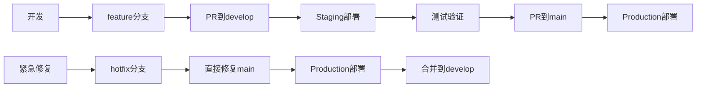

# Git分支策略和多环境同步策略

## 分支策略概述

### 分支模型
采用 **Git Flow** 模型的简化版本，适应现代CI/CD流程：

```
main (生产)
├── develop (开发主干)
│   ├── feature/xxx (功能开发)
│   ├── hotfix/xxx (紧急修复)
│   └── release/xxx (发布准备)
└── hotfix/xxx (生产紧急修复)
```

## 分支定义和用途

### 1. main 分支
- **用途**: 生产环境代码
- **稳定性**: 最高，随时可部署
- **保护**: 受保护分支，需要PR和审核
- **部署**: 自动部署到生产环境
- **触发**: 
  - PR合并到main
  - 发布新版本时
  - 手动触发

### 2. develop 分支  
- **用途**: 开发主干，集成各功能分支
- **稳定性**: 较高，通过所有测试
- **保护**: 需要PR，但可直接推送
- **部署**: 自动部署到staging环境
- **触发**:
  - 推送到develop分支
  - PR合并到develop
  - 手动触发

### 3. feature/* 分支
- **用途**: 功能开发
- **命名**: `feature/task-123-add-user-auth`
- **生命周期**: 功能完成后合并到develop并删除
- **部署**: 可选择部署到开发环境测试

### 4. hotfix/* 分支
- **用途**: 紧急bug修复
- **命名**: `hotfix/fix-login-error`
- **流程**: 从main创建 → 修复 → 合并到main和develop
- **部署**: 直接部署到生产环境

### 5. release/* 分支
- **用途**: 版本发布准备
- **命名**: `release/v1.2.0`
- **流程**: 从develop创建 → 测试 → 合并到main并打标签

## 环境对应关系

| 分支 | 环境 | 域名/地址 | 自动部署 | 用途 |
|------|------|-----------|----------|------|
| develop | Staging | staging.domain.com:8080 | ✅ | 功能测试 |
| main | Production | domain.com | ✅ | 生产服务 |
| feature/* | Development | dev.domain.com | 🔄 | 开发调试 |

## 工作流程

### 功能开发流程
```bash
# 1. 从develop创建功能分支
git checkout develop
git pull origin develop
git checkout -b feature/task-123-add-user-auth

# 2. 开发和提交
git add .
git commit -m "feat: add user authentication"
git push origin feature/task-123-add-user-auth

# 3. 创建PR到develop
# 通过GitHub UI创建Pull Request

# 4. 代码审查通过后合并
# 自动触发staging环境部署

# 5. 测试通过后，从develop合并到main
git checkout develop
git pull origin develop
git checkout main
git pull origin main
git merge develop
git push origin main
# 自动触发生产环境部署
```

### 紧急修复流程
```bash
# 1. 从main创建hotfix分支
git checkout main
git pull origin main
git checkout -b hotfix/fix-critical-bug

# 2. 修复并提交
git add .
git commit -m "fix: resolve critical login issue"
git push origin hotfix/fix-critical-bug

# 3. 合并到main并部署
git checkout main
git merge hotfix/fix-critical-bug
git push origin main

# 4. 合并到develop保持同步
git checkout develop
git merge hotfix/fix-critical-bug
git push origin develop

# 5. 删除hotfix分支
git branch -d hotfix/fix-critical-bug
git push origin --delete hotfix/fix-critical-bug
```

## CI/CD 工作流配置

### 1. Staging环境部署 (.github/workflows/deploy-staging.yml)
- **触发条件**: 推送到develop分支
- **构建镜像**: `*:staging-latest`, `*:staging-{sha}`
- **部署目标**: Staging服务器
- **健康检查**: 基础功能测试
- **通知**: Slack通知部署状态

### 2. Production环境部署 (.github/workflows/deploy-production.yml)
- **触发条件**: 
  - 推送到main分支
  - PR合并到main
  - 发布新版本
  - 手动触发
- **构建镜像**: `*:latest`, `*:{sha}`
- **部署目标**: 生产服务器
- **健康检查**: 完整的烟雾测试
- **回滚机制**: 自动回滚到上一版本
- **通知**: Slack通知 + 邮件告警

### 3. CI测试 (.github/workflows/ci.yml)
- **触发条件**: 所有分支的push和PR
- **测试内容**: 
  - 单元测试
  - 集成测试
  - 代码质量检查
  - 安全扫描

## 分支保护规则

### main分支保护
```yaml
Protection Rules:
  - Require pull request reviews: true
  - Required approving reviews: 2
  - Dismiss stale reviews: true
  - Require status checks: true
  - Required status checks:
    - CI Tests
    - Security Scan
    - Code Quality
  - Require branches up to date: true
  - Restrict pushes: true
  - Allow force pushes: false
  - Allow deletions: false
```

### develop分支保护
```yaml
Protection Rules:
  - Require pull request reviews: true
  - Required approving reviews: 1
  - Require status checks: true
  - Required status checks:
    - CI Tests
  - Require branches up to date: true
  - Allow force pushes: false
  - Allow deletions: false
```

## 版本管理

### 语义化版本控制
- **格式**: `v{major}.{minor}.{patch}`
- **示例**: `v1.2.3`
- **规则**:
  - major: 破坏性变更
  - minor: 新功能，向后兼容
  - patch: bug修复

### 标签策略
```bash
# 发布版本
git tag -a v1.2.0 -m "Release v1.2.0: Add user authentication"
git push origin v1.2.0

# 预发布版本
git tag -a v1.2.0-rc.1 -m "Release candidate 1.2.0"
git push origin v1.2.0-rc.1
```

## 环境配置

### Staging环境特性
- **独立数据库**: 避免与生产数据冲突
- **Debug模式**: 详细日志和错误信息
- **测试数据**: 预置测试用户和数据
- **宽松限制**: 更高的API限制便于测试
- **实验功能**: 可以启用实验性功能

### 生产环境特性
- **高可用**: 多实例部署
- **监控告警**: 完整的监控体系
- **备份策略**: 定期自动备份
- **安全加固**: 最小权限和安全配置
- **性能优化**: 缓存和性能调优

## 部署流程图



## 最佳实践

### 1. 提交规范
```bash
# 格式
type(scope): description

# 示例
feat(auth): add user login functionality
fix(api): resolve user data validation issue
docs(readme): update installation instructions
```

### 2. 分支命名规范
- `feature/task-123-short-description`
- `hotfix/fix-critical-issue`
- `release/v1.2.0`
- `bugfix/fix-ui-layout`

### 3. PR规范
- 清晰的标题和描述
- 关联的任务或issue编号
- 测试说明和截图
- 影响范围说明

### 4. 合并策略
- **develop**: 使用Merge commit保持历史
- **main**: 使用Squash merge保持干净历史
- **hotfix**: 使用Merge commit便于追踪

## 监控和告警

### 部署监控
- GitHub Actions状态监控
- 部署时间跟踪
- 成功率统计
- 失败原因分析

### 应用监控
- 服务健康检查
- 性能指标监控
- 错误率监控
- 用户行为分析

### 告警机制
- 部署失败立即通知
- 服务异常自动告警
- 性能下降预警
- 安全事件告警

## 故障处理

### 自动回滚
```bash
# 生产环境自动回滚机制
if [ health_check_failed ]; then
  echo "Health check failed, rolling back..."
  docker-compose down
  docker pull previous_version
  docker-compose up -d
fi
```

### 手动回滚
```bash
# 回滚到上一个版本
git checkout main
git reset --hard HEAD~1
git push origin main --force

# 或者回滚到特定标签
git checkout main
git reset --hard v1.1.0
git push origin main --force
```

### 数据库回滚
- 使用数据库迁移版本控制
- 定期备份和恢复测试
- 关键变更前手动备份

## 文档更新

当分支策略变更时，需要更新：
1. 本文档 (BRANCH_STRATEGY.md)
2. 贡献指南 (CONTRIBUTING.md)  
3. 部署文档 (DEPLOYMENT.md)
4. 开发者指南 (DEVELOPER.md)

---

**注意**: 此分支策略适用于中小型团队，可根据团队规模和项目复杂度进行调整。