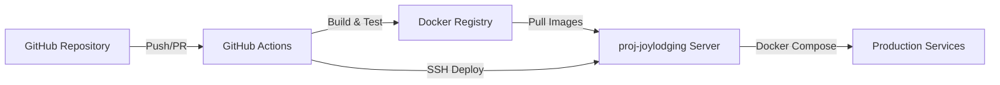

# CI/CD 部署方案 - proj-joylodging 服务器

## 项目概述

本方案为 new-ai-proj 项目设计一套完整的 CI/CD 流水线，实现自动化构建、测试和部署到 proj-joylodging 服务器。

### 技术栈
- **前端**: React + TypeScript
- **后端**: Go + Gin
- **数据库**: PostgreSQL 16
- **容器化**: Docker + Docker Compose
- **CI/CD**: GitHub Actions
- **部署方式**: Docker Registry + SSH 部署

## 部署架构设计



## 环境规划

### 分支策略
- `main` - 生产环境分支
- `develop` - 开发环境分支
- `feature/*` - 功能开发分支
- `hotfix/*` - 紧急修复分支

### 部署环境
- **开发环境**: develop 分支自动部署
- **预发布环境**: staging 分支手动部署
- **生产环境**: main 分支手动批准后部署

## CI/CD 流水线设计

### 1. 持续集成（CI）流程

#### 阶段一：代码质量检查
- ESLint/Prettier 代码规范检查
- Go fmt/vet 代码格式检查
- 单元测试执行
- 测试覆盖率报告

#### 阶段二：构建与打包
- 前端构建（npm build）
- 后端构建（go build）
- Docker 镜像构建
- 镜像版本标签管理

#### 阶段三：安全扫描
- 依赖漏洞扫描
- Docker 镜像安全扫描
- 代码安全审计

### 2. 持续部署（CD）流程

#### 阶段一：镜像推送
- 推送到 Docker Hub 或私有 Registry
- 镜像版本管理
- 清理旧版本镜像

#### 阶段二：服务部署
- SSH 连接到目标服务器
- 拉取最新镜像
- 使用 Docker Compose 更新服务
- 健康检查验证

#### 阶段三：部署后验证
- 服务健康检查
- 烟雾测试
- 部署通知

## GitHub Actions 工作流配置

### 主工作流文件结构
```yaml
.github/
├── workflows/
│   ├── ci.yml              # CI 流程
│   ├── cd-develop.yml      # 开发环境自动部署
│   ├── cd-production.yml   # 生产环境部署
│   └── release.yml         # 版本发布流程
├── actions/
│   ├── build-frontend/     # 前端构建 Action
│   ├── build-backend/      # 后端构建 Action
│   └── deploy-docker/      # Docker 部署 Action
└── scripts/
    ├── test.sh             # 测试脚本
    └── deploy.sh           # 部署脚本
```

## 服务器准备

### proj-joylodging 服务器配置要求
1. **系统要求**
   - Ubuntu 20.04+ 或 CentOS 8+
   - 最小 4GB RAM, 40GB 存储空间
   - Docker 20.10+ 和 Docker Compose 2.0+

2. **网络配置**
   - 开放端口：80, 443, 22, 5432, 8080
   - 配置防火墙规则
   - SSL 证书配置

3. **用户权限**
   - 创建部署专用用户
   - 配置 SSH 密钥认证
   - Docker 组权限设置

## 环境变量和密钥管理

### GitHub Secrets 配置
```
# 服务器连接
SERVER_HOST: proj-joylodging 服务器 IP
SERVER_USER: 部署用户名
SERVER_SSH_KEY: SSH 私钥

# Docker Registry
DOCKER_REGISTRY: docker.io
DOCKER_USERNAME: Docker Hub 用户名
DOCKER_PASSWORD: Docker Hub 密码

# 应用配置
DB_PASSWORD: 生产数据库密码
JWT_SECRET: JWT 密钥
API_KEYS: 第三方 API 密钥
```

### 服务器环境变量
```bash
# /home/deploy/new-ai-proj/.env.production
DB_HOST=postgres
DB_PORT=5432
DB_NAME=ai_project_prod
DB_USER=prod_user
DB_PASSWORD=${SECRET_DB_PASSWORD}
JWT_SECRET=${SECRET_JWT_SECRET}
GIN_MODE=release
LOG_LEVEL=info
```

## 部署脚本设计

### 自动化部署脚本功能
1. **预部署检查**
   - 服务器资源检查
   - Docker 服务状态
   - 必要目录权限

2. **部署执行**
   - 备份当前版本
   - 拉取新镜像
   - 更新配置文件
   - 滚动更新服务

3. **部署验证**
   - 健康检查
   - 服务可用性测试
   - 错误日志检查

4. **回滚机制**
   - 保留最近 3 个版本
   - 一键回滚到上一版本
   - 数据库迁移回滚

## 监控和告警

### 部署监控
- GitHub Actions 状态监控
- 部署成功率统计
- 部署时长分析

### 应用监控
- 服务健康状态
- 资源使用情况
- 错误日志告警

### 通知渠道
- Slack/钉钉通知
- 邮件通知
- GitHub Issues 自动创建

## 安全最佳实践

1. **密钥管理**
   - 使用 GitHub Secrets 存储敏感信息
   - 定期轮换密钥
   - 最小权限原则

2. **镜像安全**
   - 使用官方基础镜像
   - 定期更新依赖
   - 漏洞扫描集成

3. **网络安全**
   - HTTPS 强制启用
   - 防火墙规则配置
   - DDoS 防护

## 实施计划

### 第一阶段：基础设施准备（1-2天）
- [ ] 服务器环境配置
- [ ] Docker 和 Docker Compose 安装
- [ ] 创建部署用户和配置 SSH
- [ ] 安装监控工具

### 第二阶段：CI 流程实现（2-3天）
- [ ] 创建 GitHub Actions 工作流
- [ ] 配置代码质量检查
- [ ] 实现自动化测试
- [ ] Docker 镜像构建流程

### 第三阶段：CD 流程实现（2-3天）
- [ ] 配置 Docker Registry
- [ ] 实现自动部署脚本
- [ ] 配置环境变量管理
- [ ] 实现健康检查

### 第四阶段：优化和监控（1-2天）
- [ ] 配置监控和告警
- [ ] 优化部署速度
- [ ] 文档完善
- [ ] 团队培训

## 维护计划

### 日常维护
- 监控部署状态
- 定期更新依赖
- 清理旧镜像和日志

### 定期审查
- 月度部署统计分析
- 季度安全审计
- 年度架构评估

## 故障处理流程

1. **部署失败**
   - 自动回滚到上一版本
   - 发送告警通知
   - 保留失败日志

2. **服务异常**
   - 自动重启服务
   - 切换到备用实例
   - 通知运维人员

3. **紧急回滚**
   - 使用回滚脚本
   - 恢复数据库快照
   - 验证服务状态

## 成本估算

### 基础设施成本
- 服务器：4核8G配置
- 带宽：10Mbps
- 存储：100GB SSD
- 备份存储：50GB

### 工具成本
- GitHub Actions：免费层够用
- Docker Hub：免费层够用
- 监控工具：开源方案

## 下一步行动

1. **确认服务器访问权限**
   - 获取 proj-joylodging 服务器 SSH 访问
   - 确认服务器配置满足要求

2. **创建 GitHub Actions 工作流**
   - 从简单的 CI 流程开始
   - 逐步添加 CD 功能

3. **测试部署流程**
   - 在测试环境验证
   - 收集反馈并优化

4. **正式上线**
   - 制定上线计划
   - 准备回滚方案
   - 监控首次部署
