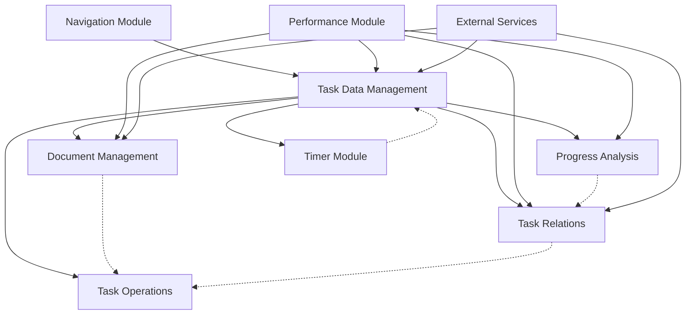

# TaskDetailPageNew.tsx 功能模块识别与分类

## 📊 文件概览
- **文件路径**: `/frontend/src/pages/TaskDetailPageNew.tsx`
- **代码行数**: 2305行
- **主要功能**: 任务详情页面的完整实现
- **技术栈**: React, TypeScript, Ant Design, React Router

## 🎯 核心功能模块识别

### 1. 页面导航与路由模块 (Navigation Module)
**代码位置**: Lines 55, 139-140, 209-218
**职责**:
- URL参数解析 (projectId, taskId)
- Tab路由管理 (通过URL query参数)
- 面包屑导航生成
- 页面跳转控制

**关键组件/函数**:
- `useParams`, `useNavigate`, `useLocation`
- `getActiveTabFromURL()`
- 面包屑导航构建逻辑

**依赖关系**:
- React Router (外部依赖)
- UIState (内部状态)

### 2. 任务数据管理模块 (Task Data Management)
**代码位置**: Lines 163-179, 433-517
**职责**:
- 任务基本信息加载
- 任务状态管理
- 任务更新与持久化
- 错误处理

**关键组件/函数**:
- `useTaskDetailState()` - 状态管理Hook
- `loadTask()` - 主要加载函数
- `taskAPIOptimizer` - API优化器
- 智能缓存集成 (Lines 221-244)

**依赖关系**:
- TaskService (服务层)
- useSmartCache (缓存Hook)
- API优化器

### 3. 文档管理模块 (Document Management)
**代码位置**: Lines 394-430
**职责**:
- 文档存在性检查
- 文档数量统计
- 文档加载状态管理
- 文档编辑器集成

**关键组件/函数**:
- `checkDocumentExistsForTask()`
- `checkDocumentExists()`
- `TaskDocumentEditor` (Line 77)
- `TaskDocumentWidget` (Line 79)
- `LazyUnifiedTaskDocumentArea` (Line 105)

**依赖关系**:
- documentService
- DocumentState

### 4. 任务关系管理模块 (Task Relations)
**代码位置**: Lines 569-611
**职责**:
- 子任务管理
- 父任务信息
- 兄弟任务管理
- 任务层级结构展示

**关键组件/函数**:
- `TaskDetailDescendantsTreeV2` (Line 57)
- `TaskRelationsPanel` (Line 85)
- 关系数据加载逻辑

**依赖关系**:
- TaskService.getTaskChildren()
- RelationState

### 5. 任务操作控制模块 (Task Operations)
**代码位置**: Lines 659-1256 (基于grep结果推断的handle函数位置)
**职责**:
- 任务编辑
- 任务删除
- 任务归档/取消归档
- 批量操作
- 任务状态切换

**关键组件/函数**:
- `handleEditTask()`
- `handleDeleteTask()`
- `handleArchiveTask()`
- `handleBulkImportSubtasks()`
- `TaskModal` (Line 68)
- `TaskArchiveModal` (Line 69)

**依赖关系**:
- TaskService (API层)
- Modal组件
- 消息通知系统

### 6. 进度分析与统计模块 (Progress Analysis)
**代码位置**: Lines 269-314, 476-491
**职责**:
- 完成度统计
- 进度可视化
- 效率分析
- 时间线展示

**关键组件/函数**:
- `refreshCompletionStats()`
- `TaskCompletionStats` 接口 (Lines 112-118)
- `TaskProgressBar` (Line 92)
- `TaskTimeline` (Line 70)
- 完成度计算逻辑

**依赖关系**:
- CompletionState
- 子任务数据

### 7. 计时器模块 (Timer Module)
**代码位置**: Lines 75-76, 203
**职责**:
- 任务计时功能
- 计时器状态管理
- 时间记录与统计

**关键组件/函数**:
- `MVPTaskDetailTimer` (Line 75)
- `useTimer()` Hook (Line 76)
- `refreshTimer()` (Line 203)

**依赖关系**:
- TimerContext
- 全局计时器状态

### 8. 性能优化与监控模块 (Performance Module)
**代码位置**: Lines 94-100, 143, 182-199
**职责**:
- 内存管理
- 性能监控
- 缓存策略
- 渲染优化

**关键组件/函数**:
- `useMemoryManager()` (Line 146)
- `useComponentPerformanceMonitor()` (Line 143)
- `useRenderTracker()` (Lines 182-185)
- `taskDetailPerformanceMonitor` (Line 98)
- `PerformanceDashboard` (Line 100)

**依赖关系**:
- 性能监控工具
- 缓存系统

## 🔄 数据流向分析

### 主要数据流
```
URL参数 → loadTask() → TaskService → API
    ↓
智能缓存系统
    ↓
useTaskDetailState (中心状态管理)
    ↓
├── TaskState → 任务基础信息展示
├── DocumentState → 文档管理组件
├── RelationState → 关系展示组件
├── CompletionState → 进度分析组件
├── UIState → UI组件状态
├── HistoryState → 时间线组件
└── ProjectState → 项目信息展示
```

### 状态更新流
```
用户操作 → handleXxx函数 → API调用
    ↓
成功响应
    ↓
更新本地状态 (updateXxxState)
    ↓
智能缓存失效
    ↓
UI重新渲染
```

## 📦 模块依赖关系图



## 🔍 关键问题识别

### 1. 代码复杂度问题
- 文件过长（2305行），维护困难
- 多个功能模块耦合在一个组件中
- 状态管理复杂，有8个不同的状态分支

### 2. 性能问题
- 初始加载需要多个API调用
- 大量使用useEffect可能导致不必要的重渲染
- 缓存策略虽然存在但分散在各处

### 3. 可维护性问题
- 业务逻辑与UI逻辑混合
- 缺少清晰的模块边界
- 错误处理分散且不一致

### 4. 可测试性问题
- 组件过大难以单元测试
- 依赖过多外部服务
- 状态更新逻辑复杂

## ✅ 模块化建议

### 高优先级拆分
1. **任务数据管理模块** - 核心功能，影响所有其他模块
2. **任务操作控制模块** - 用户交互频繁，需要独立维护
3. **文档管理模块** - 功能相对独立，易于拆分

### 中优先级拆分
4. **任务关系管理模块** - 有一定复杂度，但相对独立
5. **进度分析与统计模块** - 可以作为独立的分析组件
6. **计时器模块** - 已经部分独立，需要进一步抽象

### 低优先级优化
7. **页面导航与路由模块** - 相对简单，可后期优化
8. **性能优化与监控模块** - 横切关注点，需要整体考虑

## 📋 下一步行动计划

1. **创建模块接口定义文档**
2. **设计新的组件架构图**
3. **定义Context和Hooks结构**
4. **制定分阶段重构计划**

---

*文档创建时间: 2025-09-28*
*分析师: Claude Code Assistant*