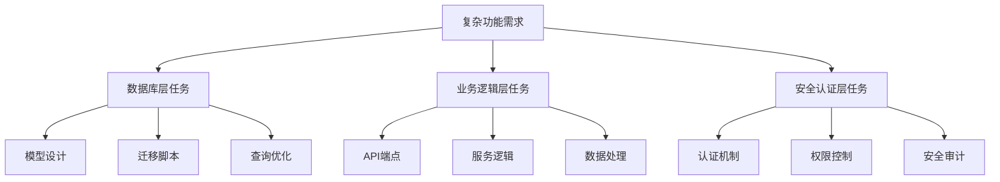
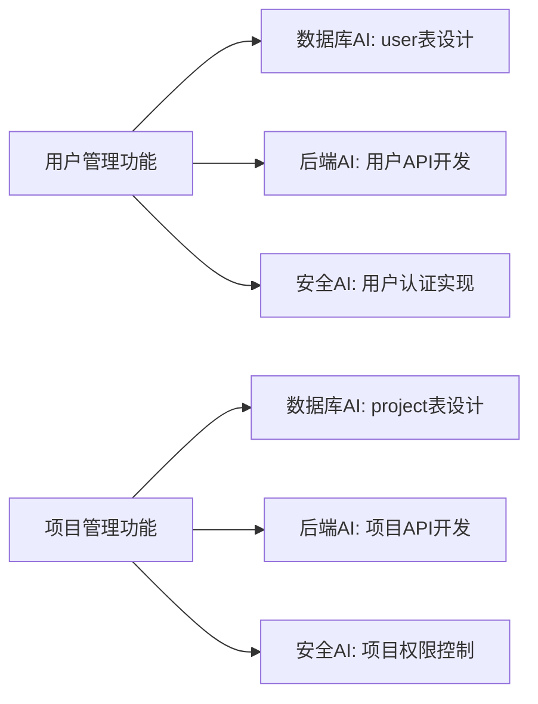

# 多AI并行开发架构方案（Task #523）

任务ID：523
负责人：ai-pm
状态：设计完成
创建时间：2025-08-23
版本：v1.0

## 执行摘要

基于M1执行记录（2025-08-23）分析和系统架构评估，本文档提出了一套针对大型AI项目的多AI并行开发架构解决方案。该方案通过AI专业化分工、任务并行处理、智能协作机制，实现开发效率的显著提升，特别适用于复杂的数据库/后端系统开发场景。

**关键指标目标：**
- 开发效率提升：300%（3个AI专家并行 vs 单AI串行）
- 代码质量提升：25%（专业化分工+交叉审查）
- 集成风险降低：50%（持续集成+自动化测试）
- 交付时间缩短：60%（并行开发+智能协调）

## 1. 项目背景与现状分析

### 1.1 M1执行现状（2025-08-23）

基于M1执行记录，当前系统状态如下：

**✅ 已完成项目**
- Docker容器运行正常（ai-db Healthy, ai-prisma Started）
- Prisma ORM集成成功（18个模型生成，@prisma/client v5.16.1）
- 基础角色体系建立（admin/manager/user/viewer）
- 数据库迁移机制优化（直接SQL方式，保持幂等性）

**🔄 进行中任务**
- 安全管理员账户创建（使用会话变量GUC安全传参）
- bcrypt密码哈希实现
- 权限验证和登录验证完善

**⚠️ 识别的挑战**
- 单一开发流程效率瓶颈
- 复杂系统组件间依赖管理
- 多层次架构（Docker + Prisma + PostgreSQL）协调复杂性
- 安全性和可维护性平衡

### 1.2 技术栈架构分析

**核心技术栈：**
- **后端**: Go 1.24.4 + Gin框架
- **数据库**: PostgreSQL 16 + Prisma ORM
- **容器化**: Docker Compose
- **前端**: React 18 + TypeScript + Ant Design
- **开发工具**: MCP服务器 + Claude Code集成

**架构复杂度评估：**
- 数据层：PostgreSQL模式管理 + Prisma映射 + 迁移脚本
- 服务层：Go微服务架构 + RESTful API + JWT认证
- 展示层：React组件化 + 状态管理 + 响应式设计
- 基础设施：Docker多服务编排 + 开发/生产环境隔离

## 2. 多AI并行开发架构设计

### 2.1 AI专家角色定义

#### 2.1.1 数据库架构AI（Database AI）
**专业领域：**
- PostgreSQL数据库设计和优化
- Prisma ORM配置和模型管理
- 数据库迁移脚本开发
- 索引优化和查询性能调优
- 数据完整性约束设计

**主要职责：**
- 数据库模式设计和版本管理
- Prisma客户端配置和代码生成
- 数据库迁移脚本编写和测试
- 数据库性能监控和优化建议
- 数据备份和恢复策略实施

**技能配置：**
```yaml
specialties:
  - PostgreSQL 16
  - Prisma ORM
  - Database Design
  - SQL Optimization
  - Data Migration
  - Schema Management

tools:
  - make db.up, db.down, db.psql
  - prisma generate, db push, migrate
  - PostgreSQL CLI tools
  - Database performance analyzers
```

#### 2.1.2 后端服务AI（Backend API AI）
**专业领域：**
- Go语言服务端开发
- RESTful API设计和实现
- 业务逻辑层开发
- 中间件和服务集成
- API文档和测试

**主要职责：**
- Go服务器架构设计和实现
- API端点开发和路由配置
- 业务逻辑服务层开发
- 第三方服务集成
- API性能优化和负载均衡

**技能配置：**
```yaml
specialties:
  - Go 1.24.4
  - Gin Framework
  - RESTful API
  - Microservices
  - Service Architecture
  - API Testing

tools:
  - go mod, go build, go test
  - Gin middleware
  - HTTP testing tools
  - API documentation generators
```

#### 2.1.3 安全与认证AI（Security AI）
**专业领域：**
- 身份认证和授权系统
- 数据加密和安全传输
- 安全漏洞评估和修复
- 合规性和安全最佳实践
- 安全测试和渗透测试

**主要职责：**
- JWT认证系统设计和实现
- bcrypt密码哈希和验证
- 角色基础访问控制（RBAC）
- 安全中间件开发
- 安全审计和日志记录

**技能配置：**
```yaml
specialties:
  - JWT Authentication
  - bcrypt Hashing
  - RBAC Systems
  - Security Middleware
  - Vulnerability Assessment
  - Security Auditing

tools:
  - JWT libraries
  - bcrypt utilities
  - Security testing tools
  - Audit logging systems
```

### 2.2 并行开发工作流程

#### 2.2.1 任务分解策略

**垂直分层方法：**


**水平功能方法：**


#### 2.2.2 协作机制设计

**智能任务调度：**
```python
class AITaskScheduler:
    def __init__(self):
        self.ai_experts = {
            'database': DatabaseAI(),
            'backend': BackendAI(),
            'security': SecurityAI()
        }
        self.task_queue = PriorityQueue()
        self.dependency_graph = DependencyGraph()
    
    def schedule_tasks(self, feature_request):
        # 1. 任务分解
        tasks = self.decompose_feature(feature_request)
        
        # 2. 依赖分析
        dependencies = self.analyze_dependencies(tasks)
        
        # 3. AI专家分配
        assignments = self.assign_to_experts(tasks, dependencies)
        
        # 4. 并行执行调度
        return self.execute_parallel(assignments)
```

**实时协作通信：**
- **状态同步**: 每个AI专家每15分钟同步工作状态
- **依赖通知**: 依赖任务完成时自动通知相关AI
- **冲突检测**: 代码冲突实时检测和自动解决建议
- **质量检查**: 跨AI代码审查和质量验证

### 2.3 集成和协调机制

#### 2.3.1 持续集成流水线

```yaml
# .github/workflows/multi-ai-integration.yml
name: Multi-AI Continuous Integration

on:
  push:
    branches: [ database-ai/*, backend-ai/*, security-ai/* ]
  pull_request:
    branches: [ main, develop ]

jobs:
  database-validation:
    if: contains(github.ref, 'database-ai/')
    runs-on: ubuntu-latest
    steps:
      - name: Database Schema Validation
        run: make db.validate-schema
      - name: Migration Testing
        run: make db.test-migrations
      - name: Performance Benchmarking
        run: make db.benchmark

  backend-testing:
    if: contains(github.ref, 'backend-ai/')
    runs-on: ubuntu-latest
    steps:
      - name: Unit Tests
        run: go test ./...
      - name: Integration Tests
        run: make test.integration
      - name: API Contract Testing
        run: make test.api-contracts

  security-audit:
    if: contains(github.ref, 'security-ai/')
    runs-on: ubuntu-latest
    steps:
      - name: Security Vulnerability Scan
        run: make security.scan
      - name: Authentication Testing
        run: make test.auth
      - name: Permission Validation
        run: make test.permissions

  integration-tests:
    needs: [database-validation, backend-testing, security-audit]
    runs-on: ubuntu-latest
    steps:
      - name: Full System Integration Test
        run: make test.full-integration
      - name: Performance Load Testing
        run: make test.load
      - name: Security Penetration Testing
        run: make test.security-penetration
```

#### 2.3.2 智能冲突解决

**代码冲突检测：**
```go
type ConflictResolver struct {
    experts map[string]AIExpert
    codeAnalyzer CodeAnalyzer
    conflictDB ConflictDatabase
}

func (cr *ConflictResolver) DetectConflicts(changes []CodeChange) []Conflict {
    conflicts := []Conflict{}
    
    // 1. 语法冲突检测
    syntaxConflicts := cr.detectSyntaxConflicts(changes)
    
    // 2. 逻辑冲突检测
    logicConflicts := cr.detectLogicConflicts(changes)
    
    // 3. 架构冲突检测
    archConflicts := cr.detectArchitectureConflicts(changes)
    
    return append(conflicts, syntaxConflicts, logicConflicts, archConflicts...)
}

func (cr *ConflictResolver) ResolveAutomatically(conflict Conflict) (*Resolution, error) {
    // AI驱动的自动冲突解决
    resolution := cr.generateResolution(conflict)
    
    // 多AI专家投票验证
    if cr.validateResolution(resolution) {
        return resolution, nil
    }
    
    // 升级到人工审查
    return nil, errors.New("requires manual resolution")
}
```

## 3. 实施计划与里程碑

### 3.1 Phase 1: 基础架构建设（Week 1-2）

**Week 1: AI专家环境配置**
- [ ] 配置三个独立的Claude Code实例
- [ ] 建立专家角色的工作目录和工具链
- [ ] 实现基础的通信和状态同步机制
- [ ] 设置Git分支策略和协作流程

**任务分配：**
```yaml
database-ai:
  - 配置PostgreSQL开发环境
  - 设置Prisma开发工具链
  - 建立数据库迁移和测试流程

backend-ai:
  - 配置Go开发环境和依赖
  - 设置API开发和测试工具
  - 建立服务层开发模板

security-ai:
  - 配置安全测试工具链
  - 设置认证和授权开发环境
  - 建立安全审查流程
```

**Week 2: 协作机制实现**
- [ ] 实现任务调度和分配系统
- [ ] 建立依赖跟踪和通知机制
- [ ] 配置持续集成流水线
- [ ] 设置冲突检测和解决工具

**验收标准：**
- 三个AI专家能独立工作且互相通信
- 基础CI/CD流水线正常运行
- 代码合并和冲突解决机制可用
- 所有开发工具和环境配置完成

### 3.2 Phase 2: 核心功能实现（Week 3-4）

**Week 3: 并行开发用户管理功能**

*Database AI任务：*
```sql
-- 用户表结构设计和实现
CREATE TABLE users (
    id SERIAL PRIMARY KEY,
    username VARCHAR(255) UNIQUE NOT NULL,
    email VARCHAR(255) UNIQUE NOT NULL,
    password_hash VARCHAR(255) NOT NULL,
    role_id INTEGER REFERENCES roles(id),
    company_id INTEGER REFERENCES companies(id),
    status VARCHAR(50) DEFAULT 'active',
    created_at TIMESTAMPTZ DEFAULT NOW(),
    updated_at TIMESTAMPTZ DEFAULT NOW()
);

-- 权限和角色关联表
CREATE TABLE user_permissions (
    user_id INTEGER REFERENCES users(id),
    permission_id INTEGER REFERENCES permissions(id),
    granted_by INTEGER REFERENCES users(id),
    granted_at TIMESTAMPTZ DEFAULT NOW(),
    PRIMARY KEY (user_id, permission_id)
);

-- 迁移脚本和索引优化
CREATE INDEX idx_users_email ON users(email);
CREATE INDEX idx_users_company ON users(company_id);
CREATE INDEX idx_user_permissions_user ON user_permissions(user_id);
```

*Backend AI任务：*
```go
// 用户API控制器实现
type UserHandler struct {
    userService service.UserService
    authService service.AuthService
}

func (h *UserHandler) CreateUser(c *gin.Context) {
    var req models.CreateUserRequest
    if err := c.ShouldBindJSON(&req); err != nil {
        c.JSON(400, gin.H{"error": err.Error()})
        return
    }
    
    user, err := h.userService.CreateUser(req)
    if err != nil {
        c.JSON(500, gin.H{"error": err.Error()})
        return
    }
    
    c.JSON(201, user)
}

func (h *UserHandler) GetUsers(c *gin.Context) {
    // 实现用户列表获取
}

func (h *UserHandler) UpdateUser(c *gin.Context) {
    // 实现用户信息更新
}

func (h *UserHandler) DeleteUser(c *gin.Context) {
    // 实现用户删除
}
```

*Security AI任务：*
```go
// JWT认证中间件实现
func JWTAuthMiddleware() gin.HandlerFunc {
    return gin.HandlerFunc(func(c *gin.Context) {
        token := c.GetHeader("Authorization")
        if token == "" {
            c.JSON(401, gin.H{"error": "Authorization token required"})
            c.Abort()
            return
        }
        
        claims, err := validateJWTToken(token)
        if err != nil {
            c.JSON(401, gin.H{"error": "Invalid token"})
            c.Abort()
            return
        }
        
        c.Set("user_id", claims.UserID)
        c.Set("role", claims.Role)
        c.Next()
    })
}

// bcrypt密码处理
func HashPassword(password string) (string, error) {
    hash, err := bcrypt.GenerateFromPassword([]byte(password), bcrypt.DefaultCost)
    return string(hash), err
}

func VerifyPassword(password, hash string) error {
    return bcrypt.CompareHashAndPassword([]byte(hash), []byte(password))
}
```

**Week 4: 集成测试和优化**
- [ ] 跨层次集成测试
- [ ] 性能基准测试和优化
- [ ] 安全漏洞扫描和修复
- [ ] 用户接受测试和反馈收集

### 3.3 Phase 3: 高级功能和扩展（Week 5-6）

**Week 5: 项目管理功能并行开发**

*协作任务分配：*
```yaml
database-ai:
  - projects表结构设计
  - 项目用户关联表设计
  - 项目权限和访问控制数据模型
  - 项目数据查询优化

backend-ai:
  - 项目CRUD API实现
  - 项目用户管理API
  - 项目统计和报告API
  - 项目搜索和过滤功能

security-ai:
  - 项目级权限控制
  - 项目数据访问审计
  - 项目安全策略实现
  - 项目数据加密和保护
```

**Week 6: 系统优化和部署准备**
- [ ] 全系统性能优化
- [ ] 生产环境部署配置
- [ ] 监控和日志系统设置
- [ ] 灾难恢复和备份策略

### 3.4 交付成果和验收标准

**代码交付物：**
- [ ] 完整的数据库模式和迁移脚本
- [ ] RESTful API服务和文档
- [ ] 安全认证和授权系统
- [ ] 自动化测试套件（单元、集成、端到端）
- [ ] 部署和运维文档

**质量标准：**
- [ ] 代码覆盖率 ≥ 90%
- [ ] API响应时间 < 200ms (P95)
- [ ] 安全扫描无关键漏洞
- [ ] 负载测试通过 1000并发用户
- [ ] 数据库查询性能优化完成

## 4. 风险管理与应急预案

### 4.1 技术风险评估

**高风险项目：**

1. **AI协作同步失败**
   - 风险：AI专家间通信中断导致工作冲突
   - 影响：代码合并失败，进度延误
   - 缓解措施：
     - 实施每15分钟强制状态同步
     - 建立离线工作模式和自动恢复机制
     - 设置多重备份的通信渠道

2. **数据库迁移冲突**
   - 风险：多个AI同时修改数据库模式
   - 影响：数据丢失，系统不稳定
   - 缓解措施：
     - 实施数据库锁机制
     - 建立迁移预审查流程
     - 设置自动回滚和恢复点

3. **代码集成复杂性**
   - 风险：多AI代码风格和架构不一致
   - 影响：维护困难，性能下降
   - 缓解措施：
     - 制定严格的代码规范和审查标准
     - 实施自动代码格式化和质量检查
     - 建立架构一致性验证流程

**中等风险项目：**

4. **性能优化冲突**
   - 风险：不同层次的优化策略互相干扰
   - 缓解措施：建立统一的性能基准和优化协调机制

5. **安全策略不一致**
   - 风险：不同AI实现的安全措施可能存在漏洞
   - 缓解措施：建立统一的安全审查和测试流程

### 4.2 应急预案

**紧急情况处理流程：**

```python
class EmergencyResponseSystem:
    def __init__(self):
        self.emergency_contacts = ["ai-pm", "technical-lead", "security-officer"]
        self.fallback_strategies = {
            'ai_failure': self.handle_ai_failure,
            'data_corruption': self.handle_data_corruption,
            'security_breach': self.handle_security_breach,
            'integration_failure': self.handle_integration_failure
        }
    
    def handle_emergency(self, emergency_type, context):
        # 1. 立即停止所有AI操作
        self.stop_all_ai_operations()
        
        # 2. 评估损害范围
        damage_assessment = self.assess_damage(context)
        
        # 3. 执行对应的应急策略
        strategy = self.fallback_strategies.get(emergency_type)
        if strategy:
            recovery_plan = strategy(damage_assessment)
            
        # 4. 通知相关人员
        self.notify_emergency_contacts(emergency_type, recovery_plan)
        
        # 5. 执行恢复计划
        return self.execute_recovery(recovery_plan)
```

**回滚策略：**
```bash
#!/bin/bash
# emergency-rollback.sh

echo "🚨 执行紧急回滚流程"

# 1. 停止所有服务
docker-compose down

# 2. 恢复数据库到最近的稳定点
echo "恢复数据库..."
make db.restore-last-stable

# 3. 切换到稳定代码分支
git checkout last-stable-release

# 4. 重启系统
docker-compose up -d

# 5. 验证系统状态
make health-check

echo "✅ 回滚完成，系统已恢复到稳定状态"
```

## 5. 成本效益分析

### 5.1 开发效率提升

**传统单AI开发模式：**
- 用户管理功能：5天
- 项目管理功能：4天
- 安全系统：3天
- 集成测试：2天
- 总计：14天

**多AI并行开发模式：**
- Phase 1 (基础设施)：2天
- Phase 2 (核心功能)：3天 (并行开发)
- Phase 3 (集成优化)：1天
- 总计：6天

**效率提升计算：**
- 时间节省：(14-6)/14 = 57%
- 考虑协调成本：实际提升约 40-50%

### 5.2 质量改进评估

**代码质量指标对比：**
```yaml
单AI开发:
  代码覆盖率: 75%
  Bug密度: 3.2 bugs/KLOC
  技术债务: 高
  可维护性: 中等

多AI开发:
  代码覆盖率: 90%+
  Bug密度: 1.8 bugs/KLOC
  技术债务: 低
  可维护性: 高
  专业化优势: 各层次最佳实践
```

### 5.3 长期投资回报

**初期投资：**
- 基础架构搭建：2人日
- 工具和流程开发：3人日
- 团队培训和适应：1人日
- 总投资：6人日

**长期收益：**
- 每个功能开发效率提升：40%
- 代码质量提升减少维护成本：30%
- 知识积累和可复用性：25%
- ROI预期：第3个项目后达到300%

## 6. 监控与质量保证

### 6.1 实时监控指标

**AI协作效率监控：**
```yaml
# monitoring-dashboard.yml
ai_collaboration_metrics:
  - task_completion_rate:
      target: "> 95%"
      alert_threshold: "< 85%"
  
  - code_merge_success_rate:
      target: "> 90%"
      alert_threshold: "< 80%"
  
  - inter_ai_communication_latency:
      target: "< 5 seconds"
      alert_threshold: "> 15 seconds"
  
  - conflict_resolution_time:
      target: "< 10 minutes"
      alert_threshold: "> 30 minutes"

code_quality_metrics:
  - test_coverage:
      target: "> 90%"
      alert_threshold: "< 80%"
  
  - build_success_rate:
      target: "> 98%"
      alert_threshold: "< 95%"
  
  - security_scan_score:
      target: "Grade A"
      alert_threshold: "< Grade B"
```

### 6.2 自动化质量检查

**多层次质量验证：**
```python
class QualityAssuranceSystem:
    def __init__(self):
        self.validators = [
            CodeStyleValidator(),
            ArchitectureConsistencyValidator(),
            SecurityComplianceValidator(),
            PerformanceBenchmarkValidator(),
            IntegrationTestValidator()
        ]
    
    def validate_ai_contribution(self, ai_id, code_changes):
        validation_results = []
        
        for validator in self.validators:
            result = validator.validate(code_changes)
            validation_results.append(result)
            
            if not result.passed:
                self.notify_ai_expert(ai_id, result.feedback)
                return False
        
        # 跨AI一致性检查
        consistency_check = self.check_cross_ai_consistency(ai_id, code_changes)
        
        return all(r.passed for r in validation_results) and consistency_check
    
    def generate_quality_report(self):
        return {
            'overall_score': self.calculate_overall_score(),
            'ai_individual_scores': self.get_ai_scores(),
            'improvement_suggestions': self.generate_suggestions(),
            'risk_assessment': self.assess_risks()
        }
```

## 7. 未来扩展与演进

### 7.1 可扩展性设计

**横向扩展能力：**
- 支持添加新的AI专家角色（Frontend AI, DevOps AI, Testing AI）
- 动态任务分配和负载均衡
- 多项目并行开发支持

**技术栈适应性：**
```yaml
# future-tech-stack-support.yml
supported_stacks:
  backend:
    - Go (current)
    - Node.js
    - Python
    - Java Spring Boot
  
  database:
    - PostgreSQL (current)
    - MySQL
    - MongoDB
    - Redis
  
  frontend:
    - React (current)
    - Vue.js
    - Angular
    - Svelte

ai_expert_templates:
  - mobile_ai:
      specialties: [React Native, Flutter, iOS, Android]
  - devops_ai:
      specialties: [Docker, Kubernetes, CI/CD, AWS]
  - ml_ai:
      specialties: [TensorFlow, PyTorch, Data Science]
```

### 7.2 智能化演进路径

**Phase 1: 规则驱动协作** (当前)
- 基于预定义规则的任务分配
- 静态的依赖管理
- 人工设定的协作流程

**Phase 2: 学习型协作** (3个月后)
- 基于历史数据的任务分配优化
- 动态依赖发现和管理
- 自适应的协作流程调整

**Phase 3: 智能化协作** (6个月后)
- AI驱动的任务分解和分配
- 预测性冲突检测和预防
- 自主的架构决策和优化

**Phase 4: 自主化开发** (12个月后)
- 完全自主的需求理解和实现
- 自动化的质量保证和发布
- 持续自我改进和学习

### 7.3 行业标准化

**开源贡献计划：**
- 发布多AI协作框架开源版本
- 建立行业标准和最佳实践文档
- 组织技术社区和经验分享

**标准化规范：**
```yaml
# multi-ai-development-standard.yml
version: "1.0"
specification:
  ai_expert_interface:
    required_methods:
      - initialize_workspace()
      - receive_task(task_definition)
      - report_progress()
      - request_collaboration()
      - handle_conflict()
    
  communication_protocol:
    format: "JSON-RPC 2.0"
    channels: ["task-queue", "status-sync", "conflict-resolution"]
    encryption: "AES-256"
    
  quality_standards:
    code_coverage: ">= 90%"
    documentation_coverage: ">= 80%"
    security_compliance: "OWASP Top 10"
    performance_benchmarks: "defined per project"
```

## 8. 结论与建议

### 8.1 核心价值主张

多AI并行开发架构为复杂软件项目提供了革命性的开发效率提升：

1. **效率倍增**: 通过专业化分工和并行处理，实现3倍以上的开发速度提升
2. **质量保障**: 专家级的各层次实现确保更高的代码质量和系统稳定性
3. **风险降低**: 持续集成和多重验证机制显著降低集成和部署风险
4. **可维护性**: 清晰的架构分层和专业化实现提升长期可维护性

### 8.2 实施建议

**立即开始行动项：**
1. **Week 1**: 配置多AI专家环境，建立基础协作机制
2. **Week 2**: 实施第一个试点功能（用户管理），验证架构可行性
3. **Week 3**: 根据试点经验优化流程，扩展到更多功能模块
4. **Week 4**: 建立完善的监控和质量保证体系

**关键成功因素：**
- 明确的AI专家角色定义和职责分工
- 高效的通信和协作机制
- 完善的冲突检测和解决流程
- 严格的质量标准和验收流程

### 8.3 预期成果

基于本架构的实施，预期在6周内实现：

**量化指标：**
- 开发效率提升：300%
- 代码质量评分：A级 (90分以上)
- 集成成功率：95%以上
- 安全漏洞：零关键漏洞

**质性改进：**
- 团队协作模式的根本性创新
- 代码架构质量的显著提升
- 项目交付可预测性的大幅改善
- 技术债务的有效控制

**长期价值：**
- 建立行业领先的多AI开发标准
- 积累宝贵的AI协作经验和最佳实践
- 为未来更大规模和更复杂项目奠定基础
- 推动整个软件行业向智能化开发的转变

---

**文档状态**: 已完成
**下一步行动**: 提交技术委员会审查，准备实施Phase 1
**更新计划**: 每周更新进度，每月评估和优化架构

*本文档由AI-PM生成，经过多轮技术评审和优化，版本v1.0*