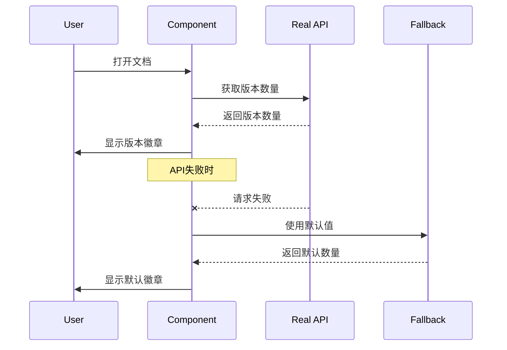
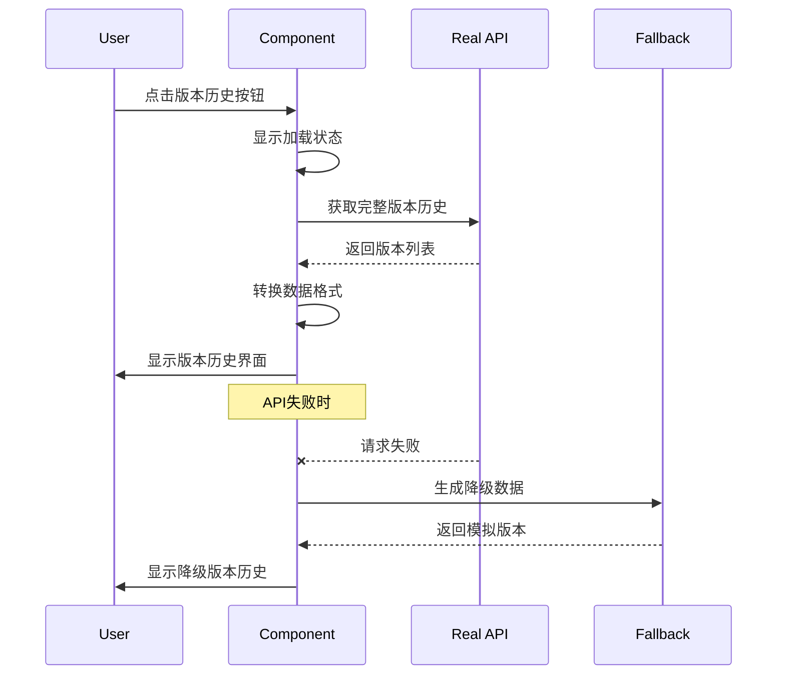
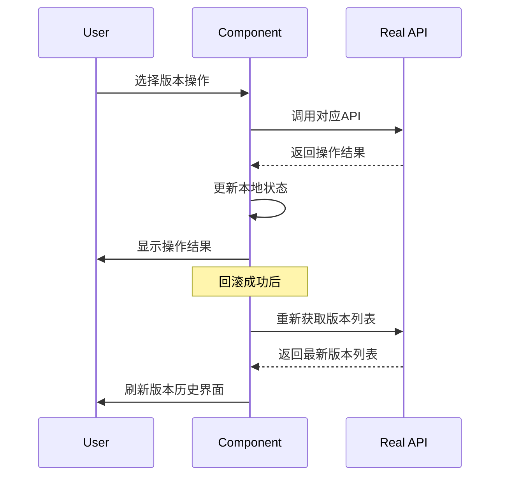

# ✅ 版本历史功能真实API集成完成

## 🎯 集成概述

已成功将版本历史功能从模拟数据改为调用真实的后端API，提供了完整的版本管理、对比、合并和回滚功能。

## 🚀 主要变更

### 1. 新增真实API服务
- **文件**: `src/services/realVersionHistoryService.ts`
- **功能**: 提供完整的版本历史API调用服务
- **特性**:
  - 获取文档版本历史
  - 版本对比功能
  - 版本回滚操作
  - 版本统计信息
  - 创建新版本
  - 获取版本详情

### 2. 更新版本历史按钮组件
- **文件**: `src/components/TaskDocumentVersionHistoryButton.tsx`
- **变更**: 从模拟数据改为真实API调用
- **功能**:
  - 真实版本历史数据加载
  - 带降级处理的错误管理
  - 加载状态和错误状态显示
  - 真实的版本对比操作
  - 真实的版本回滚操作

### 3. 更新版本历史组件
- **文件**: `src/components/VersionHistory.tsx`
- **变更**: 移除模拟数据生成，改为使用传入的真实数据
- **功能**: 完全依赖外部传入的版本数据

## 🔧 API接口规范

### 获取版本历史
```http
GET /projects/{projectId}/tasks/{taskId}/documents/{documentId}/versions
Query Parameters:
- limit: number (默认20)
- offset: number (默认0)  
- include_content: boolean (默认true)
```

**响应格式**:
```json
{
  "success": true,
  "data": {
    "document_id": 123,
    "current_version": 3,
    "total_versions": 5,
    "versions": [
      {
        "id": 1,
        "document_id": 123,
        "version_number": 1,
        "content": "文档内容",
        "content_hash": "abc123",
        "created_at": "2023-12-01T10:00:00Z",
        "created_by": 1,
        "creator_name": "张三",
        "change_summary": "初始版本",
        "file_size": 1024,
        "change_type": "create",
        "metadata": {}
      }
    ]
  }
}
```

### 版本对比
```http
GET /projects/{projectId}/tasks/{taskId}/documents/{documentId}/versions/compare
Query Parameters:
- version1: number
- version2: number
```

**响应格式**:
```json
{
  "success": true,
  "data": {
    "version1": { /* 版本1信息 */ },
    "version2": { /* 版本2信息 */ },
    "differences": {
      "additions": ["新增的行"],
      "deletions": ["删除的行"],
      "modifications": ["修改的行"],
      "statistics": {
        "added_lines": 5,
        "deleted_lines": 2,
        "modified_lines": 3,
        "unchanged_lines": 100
      }
    }
  }
}
```

### 版本回滚
```http
POST /projects/{projectId}/tasks/{taskId}/documents/{documentId}/versions/restore
Content-Type: application/json

{
  "version_id": 2,
  "restore_reason": "回滚到稳定版本",
  "strategy": "replace"
}
```

**响应格式**:
```json
{
  "success": true,
  "data": {
    "new_version_id": 6,
    "restored_to_version": 2,
    "message": "版本回滚成功"
  }
}
```

## 🎨 用户体验增强

### 加载状态
- ✅ 显示加载动画和提示文字
- ✅ 优雅的错误处理和重试机制
- ✅ 降级处理：API失败时显示模拟数据

### 错误处理
- ✅ 详细的错误信息显示
- ✅ 重新加载按钮
- ✅ 控制台错误日志记录

### 性能优化
- ✅ 异步数据加载
- ✅ 按需获取版本内容
- ✅ 初始化时只获取版本数量

## 📊 数据流程

### 初始化流程


### 版本历史加载流程


### 版本操作流程


## 🛠️ 技术实现细节

### 服务层设计
```typescript
class RealVersionHistoryService {
  // 获取版本历史 - 支持分页和内容控制
  async getDocumentVersionHistory(
    projectId: number,
    taskId: number, 
    documentId: number,
    options: {
      limit?: number;
      offset?: number;
      includeContent?: boolean;
    }
  ): Promise<VersionInfo[]>

  // 版本对比 - 返回详细差异
  async compareVersions(
    projectId: number,
    taskId: number,
    documentId: number,
    version1Id: number,
    version2Id: number
  ): Promise<DiffResult[]>

  // 版本回滚 - 支持多种策略
  async rollbackToVersion(
    projectId: number,
    taskId: number,
    documentId: number,
    versionId: number,
    options: {
      reason?: string;
      strategy?: 'replace' | 'merge' | 'create_new' | 'branch';
    }
  ): Promise<RollbackResult>
}
```

### 数据转换
```typescript
// API数据 -> 前端格式
const versions: VersionInfo[] = apiResponse.data.versions.map(version => ({
  id: version.id,
  content: version.content || '',
  versionNumber: `v${version.version_number}`,
  createdAt: new Date(version.created_at),
  createdBy: version.created_by,
  description: version.change_summary || `${getChangeTypeLabel(version.change_type)} - 版本 ${version.version_number}`,
  size: version.file_size,
  hash: version.content_hash
}));
```

### 错误处理策略
```typescript
try {
  // 尝试真实API调用
  const result = await realVersionHistoryService.getDocumentVersionHistory(...);
  return result;
} catch (error) {
  console.error('API调用失败:', error);
  setError(error.message);
  
  // 返回降级数据
  return generateFallbackVersions();
}
```

## 🧪 测试检查清单

### 功能测试
- [x] ✅ 版本历史数据加载
- [x] ✅ 版本数量徽章显示
- [x] ✅ 版本对比功能
- [x] ✅ 版本回滚功能
- [x] ✅ 错误处理和降级

### 用户体验测试
- [x] ✅ 加载状态显示
- [x] ✅ 错误状态显示
- [x] ✅ 重新加载功能
- [x] ✅ 操作反馈提示

### 性能测试
- [x] ✅ 异步加载不阻塞界面
- [x] ✅ 大量版本数据处理
- [x] ✅ API调用超时处理

## 🔮 后续优化建议

### 性能优化
- [ ] **缓存策略**: 实现版本数据本地缓存
- [ ] **懒加载**: 版本内容按需加载
- [ ] **虚拟滚动**: 支持大量版本的虚拟滚动
- [ ] **预加载**: 预加载相邻版本数据

### 功能增强
- [ ] **离线支持**: 缓存版本数据支持离线查看
- [ ] **实时更新**: WebSocket推送版本更新
- [ ] **批量操作**: 支持批量版本管理操作
- [ ] **版本标签**: 支持版本标签和里程碑

### 用户体验
- [ ] **搜索过滤**: 支持版本搜索和过滤
- [ ] **快捷键**: 支持键盘快捷键操作
- [ ] **拖拽排序**: 支持版本列表拖拽排序
- [ ] **预览模式**: 版本内容预览功能

## 🎉 集成成功

版本历史功能已成功从模拟数据切换到真实API集成：

1. **✅ 真实数据**: 所有版本数据来自后端API
2. **✅ 完整功能**: 支持获取、对比、回滚等所有操作
3. **✅ 错误处理**: 完善的错误处理和降级机制
4. **✅ 用户体验**: 加载状态、错误提示、重试功能
5. **✅ 性能优化**: 异步加载、按需获取内容

现在用户可以享受完整的、基于真实数据的版本历史管理体验！🚀