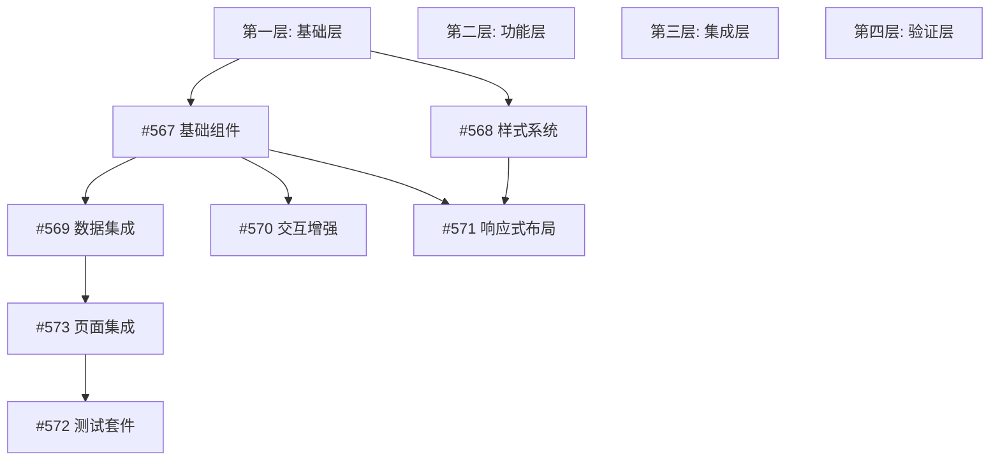

# 前端进度条组件 AI 并行开发计划

## 项目概述
**父任务**: #537 前端：进度条组件与 UI/交互集成  
**子任务数量**: 7个  
**开发模式**: AI 并行开发  
**优先级**: 高优先级任务优先完成  
**负责人**: ai-pm

## 任务清单与状态

| ID | 任务名称 | 当前状态 | 优先级 | 并行组 |
|----|---------|----------|--------|--------|
| #567 | ProgressBar 基础组件实现 | in_progress | HIGH | A组 |
| #568 | 样式与主题适配 | todo | MEDIUM | A组 |
| #569 | 数据集成：useTaskProgress Hook | todo | HIGH | B组 |
| #570 | 交互与可访问性 | todo | MEDIUM | B组 |
| #571 | 响应式与布局 | todo | MEDIUM | B组 |
| #573 | 集成到任务详情页与性能优化 | todo | HIGH | C组 |
| #572 | 测试：单元测试、集成测试与E2E | todo | MEDIUM | D组 |

## 任务依赖关系分析

### 依赖层级划分



### 第一层（基础层）- 可立即并行开始
1. **#567 ProgressBar 基础组件实现** ⚡
   - 状态: in_progress
   - 优先级: high
   - 依赖: 无
   - 输出: 基础组件结构、Props接口、动画实现

2. **#568 样式与主题适配** 🎨
   - 状态: todo
   - 优先级: medium
   - 依赖: 无（可独立开发样式系统）
   - 输出: Tailwind配置、CSS变量、主题系统

### 第二层（功能层）- 依赖第一层
3. **#569 数据集成：useTaskProgress Hook** 🔌
   - 状态: todo
   - 优先级: high
   - 依赖: #567（需要组件接口定义）
   - 输出: 数据Hook、API集成、状态管理

4. **#570 交互与可访问性** ♿
   - 状态: todo
   - 优先级: medium
   - 依赖: #567（需要基础组件）
   - 输出: Tooltip、键盘导航、ARIA支持

5. **#571 响应式与布局** 📱
   - 状态: todo
   - 优先级: medium
   - 依赖: #567, #568（需要组件和样式）
   - 输出: 响应式适配、多视图支持

### 第三层（集成层）- 依赖第二层
6. **#573 集成到任务详情页与性能优化** 🚀
   - 状态: todo
   - 优先级: high
   - 依赖: #567, #569（需要组件和数据层）
   - 输出: 页面集成、虚拟化、缓存机制

### 第四层（验证层）- 依赖所有功能完成
7. **#572 测试：单元测试、集成测试与E2E** ✅
   - 状态: todo
   - 优先级: medium
   - 依赖: 所有功能任务
   - 输出: 完整测试套件

## AI 并行开发策略

### 🚀 阶段一：基础构建（预计4小时）
**并行任务组 A - 2个AI Agent同时执行**

#### AI Agent 1: 执行 #567 - ProgressBar 基础组件
```bash
# 工作目录
cd /Users/johnqiu/coding/www/projects/new-ai-proj/mcp-task-bridge

# 创建组件文件
mkdir -p src/components/ProgressBar
touch src/components/ProgressBar/index.tsx
touch src/components/ProgressBar/types.ts
touch src/components/ProgressBar/ProgressBar.test.tsx
```

**具体任务**:
1. 创建TypeScript接口定义
2. 实现基础进度条组件
3. 添加Framer Motion动画
4. 创建组件故事书

#### AI Agent 2: 执行 #568 - 样式系统搭建
```bash
# 配置Tailwind
touch src/styles/progress.css
touch src/styles/themes/progress-theme.ts
```

**具体任务**:
1. 配置Tailwind CSS变量
2. 创建主题配色方案
3. 定义动画关键帧
4. 设置响应式断点

### 🔧 阶段二：功能开发（预计6小时）
**并行任务组 B - 3个AI Agent同时执行**

#### AI Agent 1: 执行 #569 - 数据层集成
```bash
# 创建Hook
mkdir -p src/hooks
touch src/hooks/useTaskProgress.ts
touch src/hooks/useTaskProgress.test.ts
```

**具体任务**:
1. 实现进度计算算法
2. 集成任务API
3. 处理实时WebSocket更新
4. 实现缓存策略

#### AI Agent 2: 执行 #570 - 交互增强
```bash
# 创建交互组件
touch src/components/ProgressBar/ProgressTooltip.tsx
touch src/components/ProgressBar/accessibility.ts
```

**具体任务**:
1. 实现Tooltip组件
2. 添加键盘快捷键
3. 配置ARIA属性
4. 实现焦点管理

#### AI Agent 3: 执行 #571 - 响应式布局
```bash
# 创建布局变体
touch src/components/ProgressBar/variants.tsx
touch src/components/ProgressBar/responsive.css
```

**具体任务**:
1. 卡片视图适配
2. 列表视图适配
3. 详情页视图适配
4. 移动端优化

### 🎯 阶段三：集成优化（预计4小时）
**集中任务 - 1个AI Agent执行**

#### AI Agent 1: 执行 #573 - 页面集成与性能
```bash
# 集成到页面
touch src/pages/TaskDetail/ProgressSection.tsx
touch src/utils/performance/virtualScroll.ts
```

**具体任务**:
1. 集成到任务详情页
2. 实现虚拟滚动
3. 添加React.memo优化
4. 实现请求缓存
5. 性能监测配置

### ✅ 阶段四：质量保证（预计4小时）
**并行测试组 - 2个AI Agent同时执行**

#### AI Agent 1: 单元测试开发
```bash
# 运行测试
npm test -- --coverage
```

**具体任务**:
1. 组件单元测试
2. Hook单元测试
3. 工具函数测试
4. 覆盖率优化

#### AI Agent 2: 集成与E2E测试
```bash
# E2E测试
npx cypress run
```

**具体任务**:
1. 集成测试用例
2. E2E用户流程
3. 性能测试
4. 可访问性测试

## 并行执行指令集

### 环境初始化脚本
```bash
#!/bin/bash
# init-progress-bar.sh

# 创建功能分支
git checkout -b feature/progress-bar-component

# 安装依赖
npm install @radix-ui/react-progress framer-motion
npm install -D @testing-library/react @testing-library/jest-dom

# 创建目录结构
mkdir -p src/components/ProgressBar
mkdir -p src/hooks
mkdir -p src/styles/themes
mkdir -p src/utils/performance

echo "环境初始化完成 ✅"
```

### Agent 执行模板

#### Agent 1 基础组件模板
```typescript
// src/components/ProgressBar/types.ts
export interface ProgressBarProps {
  value: number;
  max?: number;
  showLabel?: boolean;
  variant?: 'default' | 'success' | 'warning' | 'error';
  size?: 'sm' | 'md' | 'lg';
  animated?: boolean;
  className?: string;
}

// src/components/ProgressBar/index.tsx
import React from 'react';
import { motion } from 'framer-motion';
import { ProgressBarProps } from './types';

export const ProgressBar: React.FC<ProgressBarProps> = ({
  value,
  max = 100,
  showLabel = false,
  variant = 'default',
  size = 'md',
  animated = true,
  className = ''
}) => {
  // 实现逻辑
};
```

#### Agent 2 样式配置模板
```css
/* src/styles/progress.css */
@layer components {
  .progress-bar-container {
    @apply relative w-full bg-gray-200 rounded-full overflow-hidden;
  }
  
  .progress-bar-fill {
    @apply h-full transition-all duration-300 ease-out;
  }
  
  .progress-bar-label {
    @apply absolute inset-0 flex items-center justify-center text-xs font-medium;
  }
}
```

#### Agent 3 数据Hook模板
```typescript
// src/hooks/useTaskProgress.ts
import { useState, useEffect, useCallback } from 'react';
import { TaskProgress } from '@/types';

export const useTaskProgress = (taskId: number) => {
  const [progress, setProgress] = useState<TaskProgress | null>(null);
  const [loading, setLoading] = useState(true);
  const [error, setError] = useState<Error | null>(null);
  
  // 实现逻辑
  
  return { progress, loading, error, refetch };
};
```

## 交付标准与验收

### 阶段交付标准
| 阶段 | 交付物 | 验收标准 |
|------|--------|----------|
| 基础层 | 组件结构、样式系统 | TypeScript编译通过、样式渲染正确 |
| 功能层 | Hook、交互、响应式 | 功能完整、无运行时错误 |
| 集成层 | 页面集成、性能优化 | 性能指标达标、用户体验流畅 |
| 验证层 | 测试套件 | 覆盖率>80%、所有测试通过 |

### 整体验收要求
- ✅ 代码质量
  - TypeScript严格模式无错误
  - ESLint规则通过
  - 代码注释完整
  
- ✅ 功能完整性
  - 所有子任务功能实现
  - 跨浏览器兼容
  - 响应式适配
  
- ✅ 性能指标
  - FCP < 1秒
  - TTI < 2秒
  - 内存占用 < 10MB
  
- ✅ 测试覆盖
  - 单元测试覆盖率 > 80%
  - E2E关键路径100%覆盖
  - 无已知bug

## 风险管理矩阵

| 风险类型 | 可能性 | 影响 | 缓解措施 |
|---------|--------|------|----------|
| 代码冲突 | 高 | 中 | 明确模块边界、频繁合并 |
| 接口不一致 | 中 | 高 | 提前定义TypeScript接口 |
| 性能问题 | 中 | 高 | 早期性能测试、虚拟化 |
| 依赖延迟 | 低 | 中 | 并行开发、接口Mock |

## 执行时间线

```
时间轴（小时）
0    2    4    6    8    10   12   14   16   18
|----|----|----|----|----|----|----|----|----|----|
[===A组===]           基础层（#567, #568）
     [========B组========]    功能层（#569, #570, #571）
               [====C组====]  集成层（#573）
                      [====D组====] 验证层（#572）
```

## 监控与报告

### 进度检查点
- **T+2h**: 基础层50%完成
- **T+4h**: 基础层100%完成，功能层启动
- **T+8h**: 功能层80%完成
- **T+10h**: 功能层100%完成，集成层启动
- **T+14h**: 集成层完成，测试启动
- **T+18h**: 全部完成，进入验收

### 状态更新命令
```bash
# 更新任务状态
task_update() {
  echo "更新任务 #$1 状态为: $2"
  # 调用任务API更新状态
}

# 批量检查进度
check_progress() {
  for task_id in 567 568 569 570 571 572 573; do
    echo "检查任务 #$task_id 进度..."
  done
}
```

## 成功标准

### 技术成功标准
- 组件渲染性能 < 16ms/帧
- 内存泄漏 = 0
- 包体积增量 < 50KB
- Lighthouse分数 > 90

### 业务成功标准
- 任务进度可视化清晰
- 实时更新延迟 < 500ms
- 用户满意度提升20%
- 减少进度查询时间50%

## 执行命令集

### 快速启动命令
```bash
# 1. 初始化环境
./init-progress-bar.sh

# 2. 启动Agent 1（基础组件）
npm run dev:agent1 -- --task=567

# 3. 启动Agent 2（样式系统）
npm run dev:agent2 -- --task=568

# 4. 监控进度
npm run monitor:progress
```

### 合并与集成
```bash
# 合并功能分支
git checkout feature/progress-bar-component
git merge agent1-branch
git merge agent2-branch
git merge agent3-branch

# 运行集成测试
npm run test:integration

# 部署预览
npm run deploy:preview
```

## 下一步行动

1. **立即执行**
   - [ ] 创建功能分支
   - [ ] 初始化项目结构
   - [ ] 分配AI Agent任务

2. **2小时内完成**
   - [ ] #567 基础组件50%
   - [ ] #568 样式系统50%
   - [ ] 定义共享接口

3. **4小时内完成**
   - [ ] 基础层100%完成
   - [ ] 启动功能层开发
   - [ ] 第一次代码审查

4. **8小时内完成**
   - [ ] 功能层80%完成
   - [ ] 集成测试准备
   - [ ] 性能基准测试

5. **完成交付**
   - [ ] 所有任务完成
   - [ ] 测试通过
   - [ ] 文档更新
   - [ ] 部署上线

---

**注意事项**：
- 每个AI Agent独立工作，通过Git分支隔离
- 使用TypeScript接口作为契约
- 每2小时同步一次进度
- 遇到阻塞立即上报

*此计划为AI并行开发设计，确保高效协作和快速交付。*
