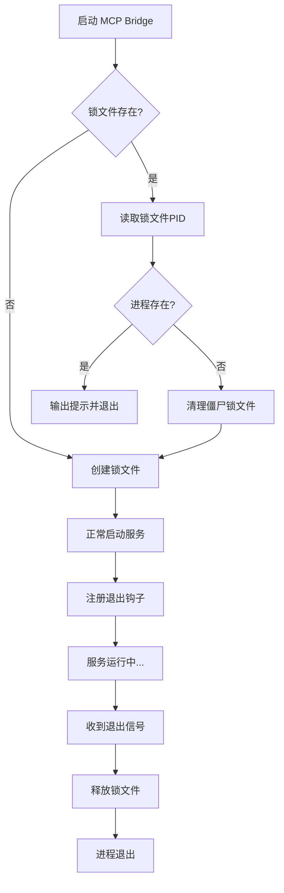

# MCP Bridge 进程锁机制

## 问题背景

在实际使用中发现，MCP bridge 可能会启动多个进程实例，导致：
- 端口冲突
- 状态不一致
- 资源浪费
- 认证令牌混乱

典型情况下会出现7+个进程同时运行：
```bash
$ ps aux | grep "node.*mcp-task-bridge"
johnqiu   57160  node ./mcp-task-bridge/dist/index.js
johnqiu   76233  node .../mcp-task-bridge/dist/index.js
... (7个进程)
```

## 解决方案

实现了基于文件锁的进程单例模式，确保同一时间只有一个 MCP bridge 实例运行。

### 核心机制

#### 1. **进程锁类 (ProcessLock)**
```typescript
class ProcessLock {
  private lockFile: string;  // 锁文件路径
  private pid: number;       // 当前进程PID

  // 获取锁
  acquire(): boolean

  // 释放锁
  release(): void
}
```

#### 2. **锁文件位置**
- 路径: `/tmp/mcp-task-bridge.lock`
- 内容: 当前进程的 PID

#### 3. **工作流程**



### 关键特性

#### 1. **僵尸锁检测**
```typescript
try {
  process.kill(existingPid, 0); // 信号0只检查进程是否存在
  return false; // 进程在运行，拒绝启动
} catch (e) {
  // 进程不存在，清理僵尸锁
  unlinkSync(this.lockFile);
}
```

#### 2. **自动清理**
```typescript
// 注册多个退出钩子确保锁被释放
process.on('exit', releaseLock);
process.on('SIGINT', releaseLock);
process.on('SIGTERM', releaseLock);
```

#### 3. **安全验证**
```typescript
// 只有创建锁的进程才能释放锁
if (lockPid === this.pid) {
  unlinkSync(this.lockFile);
}
```

## 使用方法

### 正常启动
```bash
node dist/index.js
# [LOCK] 进程锁已获取 (PID: 12345)
# [MCP] Task MCP Server 已启动
```

### 重复启动（被拒绝）
```bash
node dist/index.js
# [LOCK] 检测到已有实例运行 (PID: 12345)
# [MCP] 已有实例正在运行，退出...
```

### 僵尸锁清理
```bash
# 如果之前的进程异常退出留下锁文件
node dist/index.js
# [LOCK] 清理僵尸锁文件 (PID: 12345 已不存在)
# [LOCK] 进程锁已获取 (PID: 67890)
```

## 测试

运行测试脚本验证功能：
```bash
./test-process-lock.sh
```

测试场景：
1. ✅ 第一个实例成功启动并创建锁
2. ✅ 第二个实例被正确拒绝
3. ✅ 第一个实例退出后锁被清理
4. ✅ 新实例可以成功启动

## 日志示例

### 成功获取锁
```
[LOCK] 进程锁已获取 (PID: 23730)
[MCP] Task MCP Server 已启动
[MCP] 连接到: http://localhost:8080/api/v1
```

### 检测到已有实例
```
[LOCK] 检测到已有实例运行 (PID: 23730)
[MCP] 已有实例正在运行，退出...
```

### 清理僵尸锁
```
[LOCK] 清理僵尸锁文件 (PID: 12345 已不存在)
[LOCK] 进程锁已获取 (PID: 67890)
```

### 释放锁
```
[MCP] Received SIGINT, shutting down gracefully...
[LOCK] 进程锁已释放 (PID: 23730)
```

## 优势

1. **防止多实例冲突**: 确保同一时间只有一个 MCP bridge 运行
2. **自动僵尸检测**: 智能清理异常退出遗留的锁文件
3. **优雅关闭**: 所有退出场景都会正确释放锁
4. **零配置**: 自动管理，无需额外配置
5. **跨平台**: 基于 Node.js 内置 API，支持所有平台

## 故障排除

### 手动清理锁文件
如果进程异常且锁未清理：
```bash
rm /tmp/mcp-task-bridge.lock
```

### 查看当前锁状态
```bash
cat /tmp/mcp-task-bridge.lock  # 显示持有锁的PID
ps -p $(cat /tmp/mcp-task-bridge.lock)  # 检查进程是否运行
```

### 强制重启所有实例
```bash
# 杀掉所有实例
pkill -9 -f "node.*mcp-task-bridge"

# 清理锁文件
rm /tmp/mcp-task-bridge.lock

# 重新启动
node dist/index.js
```

## 技术细节

- **锁文件路径**: 使用 `os.tmpdir()` 获取系统临时目录
- **PID 验证**: 使用 `process.kill(pid, 0)` 非侵入式检查进程存在性
- **原子操作**: 文件读写操作保证原子性
- **事件驱动**: 使用 Node.js 进程事件确保清理

## 相关文件

- `index.ts`: 主要实现
- `test-process-lock.sh`: 测试脚本
- `PROCESS_LOCK.md`: 本文档

## 更新历史

- 2025-10-02: 初始实现，解决多实例运行问题
