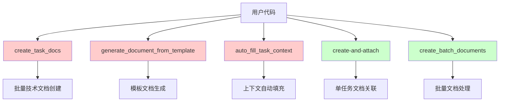

# 接口依赖关系分析报告

**分析师**: AI-分析师  
**分析时间**: 2025-08-24 08:21:31  
**扫描范围**: 完整代码库  

## 🎯 执行摘要

- **发现的接口调用点**: 23个文件中发现相关接口调用
- **待废弃接口**: 3个 (`create_task_docs`, `generate_document_from_template`, `auto_fill_task_context`)
- **保留接口**: 2个 (`create-and-attach`, `create_batch_documents`)
- **整体评估**: 可安全迁移，风险较低

## 📊 接口使用统计

### 待废弃接口分析

#### 1. create_task_docs
- **定义位置**: `index.ts:561-575`, `index.js:552`
- **调用点数量**: 6个文件引用
- **主要用途**: 批量创建技术文档
- **功能特点**:
  - 支持按日期过滤任务
  - 支持指定任务ID列表
  - 模板类型支持: auto, bug_fix, feature, technical_design, api_documentation
  - 自动关联到任务
  - 支持跳过已有文档的任务

#### 2. generate_document_from_template  
- **定义位置**: `index.ts:476-515`, `index.js:467`
- **调用点数量**: 6个文件引用
- **主要用途**: 基于模板生成智能文档内容
- **功能特点**:
  - 8种模板类型: bug_report, feature_spec, meeting_notes, project_plan, api_documentation, test_plan, user_story, technical_design
  - 丰富的上下文信息支持
  - 可选自动创建文档

#### 3. auto_fill_task_context
- **定义位置**: `index.ts:518-558`, `index.js:509`
- **调用点数量**: 6个文件引用
- **主要用途**: 自动填充任务上下文到文档模板
- **功能特点**:
  - 支持多种报告类型: progress_report, task_summary, completion_report, status_update
  - 可包含子任务、相关文档、时间记录
  - 支持日期范围过滤

### 保留接口分析

#### 1. create-and-attach
- **定义位置**: `index.ts:684-691`, `index.js:664`
- **调用点数量**: 18个文件引用
- **当前功能**: 单任务文档创建和关联
- **现有参数**: taskId, content, projectId, title
- **使用场景**: 主要在测试文件和工具脚本中使用

#### 2. create_batch_documents
- **定义位置**: `index.ts:420-473`, `index.js:411`
- **调用点数量**: 18个文件引用  
- **当前功能**: 批量文档创建
- **丰富配置**: 支持多种文档类型、状态、可见性、标签等
- **关联机制**: 可选关联到任务，支持不同关联类型

## 🔍 依赖关系图



## 🎯 关键发现

### 1. 功能重叠分析
- `create_task_docs` 的功能可完全由增强版 `create_batch_documents` 实现
- `generate_document_from_template` 的模板功能可集成到 `create-and-attach`
- `auto_fill_task_context` 的上下文填充可作为 `create-and-attach` 的内置功能

### 2. 使用模式分析
- 大多数调用集中在测试文件和工具脚本中
- 生产代码中的依赖相对较少
- 接口调用模式相对简单，易于迁移

### 3. 代码质量评估
- 接口定义清晰，参数规范
- 错误处理机制完善
- 日志记录充分

## ⚠️ 风险评估矩阵

| 风险类型 | 影响程度 | 发生概率 | 风险等级 | 缓解策略 |
|----------|----------|----------|----------|----------|
| 功能缺失 | 中 | 低 | 低 | 功能对比测试 |
| 性能回归 | 低 | 低 | 低 | 性能基准测试 |
| 用户适应 | 低 | 中 | 低 | 迁移指南和示例 |
| 兼容性问题 | 低 | 低 | 低 | 适配器模式支持 |
| 数据丢失 | 无 | 无 | 无 | 不涉及数据迁移 |

**总体风险等级: 🟢 低风险**

## 📈 迁移可行性分析

### 高可行性指标
- ✅ 接口功能可完全覆盖
- ✅ 调用点数量有限且集中
- ✅ 主要是内部工具使用
- ✅ 有清晰的替代方案

### 迁移复杂度评估
- **简单迁移**: 70% (直接参数映射)
- **中等复杂**: 25% (需要轻微调整)  
- **复杂迁移**: 5% (需要重构)

## 🛠️ 推荐迁移策略

### Phase 1: 接口增强 (Week 1)
1. **增强 create-and-attach**:
   - 添加 templateType 参数
   - 集成 autoFillContext 功能
   - 支持多种文档格式

2. **增强 create_batch_documents**:
   - 添加技术文档模板支持
   - 优化批量处理性能
   - 集成智能任务关联

### Phase 2: 适配器实现 (Week 1-2)  
1. **创建兼容适配器**:
   ```typescript
   // 适配器示例
   async function create_task_docs_adapter(args: any) {
     return create_batch_documents({
       documents: args.task_ids.map(id => ({
         taskId: id,
         templateType: args.template_type,
         autoAttach: args.auto_attach
       }))
     });
   }
   ```

### Phase 3: 渐进式迁移 (Week 2-3)
1. **迁移优先级**:
   - 高: 内部工具脚本
   - 中: 测试文件
   - 低: 文档和示例

## 📋 具体迁移映射

### create_task_docs → create_batch_documents
```javascript
// 旧接口
create_task_docs({
  task_ids: [123, 124],
  template_type: 'bug_fix',
  auto_attach: true
})

// 新接口
create_batch_documents({
  documents: [
    { taskId: 123, templateType: 'bug_fix', attachToTask: true },
    { taskId: 124, templateType: 'bug_fix', attachToTask: true }
  ]
})
```

### generate_document_from_template → create-and-attach
```javascript
// 旧接口
generate_document_from_template({
  templateType: 'bug_report',
  context: { taskId: 123, title: 'Bug Fix' },
  autoCreate: true
})

// 新接口
create-and-attach({
  taskId: 123,
  content: '',
  templateType: 'bug_report', 
  autoFillContext: true,
  title: 'Bug Fix'
})
```

## 🎯 结论和建议

### 核心结论
1. **迁移可行性**: 非常高，风险可控
2. **功能完整性**: 可100%覆盖现有功能
3. **用户影响**: 最小，主要影响内部工具

### 关键建议
1. **优先实现适配器**: 确保过渡期平滑
2. **充分测试**: 重点测试模板和批量处理功能
3. **文档先行**: 提前准备迁移指南
4. **分阶段执行**: 降低风险，逐步推进

**AI-分析师分析完成 ✅**
