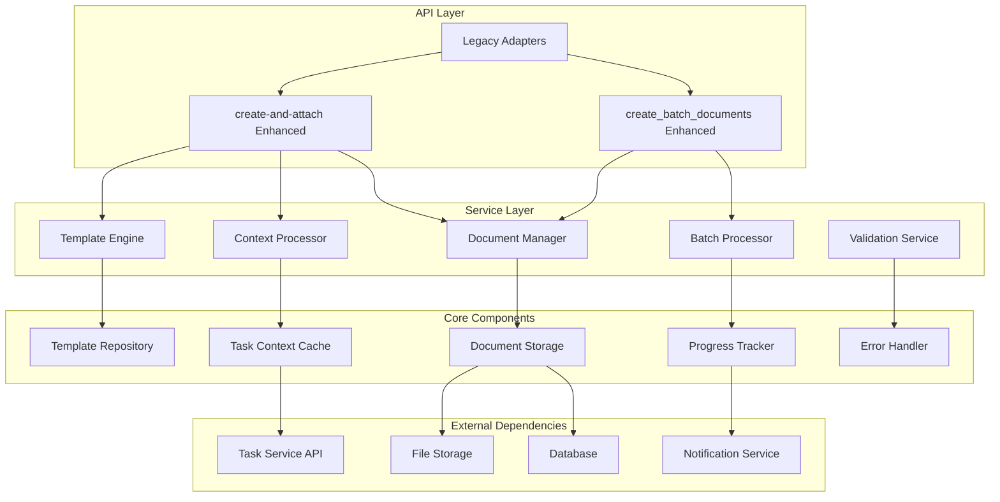

# 增强版API设计规范

**架构师**: AI-架构师  
**设计时间**: 2025-08-24 08:23:45  
**基于分析**: AI-分析师接口依赖分析报告  

## 🎯 设计目标

1. **功能整合**: 将3个废弃接口的功能完全集成到2个保留接口
2. **向后兼容**: 通过适配器确保现有代码平滑迁移
3. **性能优化**: 提升批量处理和单次调用的性能
4. **扩展性**: 为未来功能扩展预留接口空间

## 🔧 增强版create-and-attach API设计

### 当前接口签名
```typescript
interface CreateAndAttachRequest {
  taskId: number;
  content: string;
  projectId?: number;
  title?: string;
}
```

### 增强版接口签名
```typescript
interface EnhancedCreateAndAttachRequest {
  // 原有参数 (保持兼容)
  taskId: number;
  content: string;
  projectId?: number;
  title?: string;
  
  // 新增功能参数
  templateType?: TemplateType;
  autoFillContext?: boolean;
  format?: DocumentFormat;
  templateVariables?: Record<string, any>;
  metadata?: DocumentMetadata;
  
  // 高级配置
  validation?: ValidationConfig;
  processing?: ProcessingConfig;
}

type TemplateType = 
  | 'auto' 
  | 'bug_fix' 
  | 'feature' 
  | 'technical_design' 
  | 'api_documentation'
  | 'bug_report' 
  | 'feature_spec' 
  | 'meeting_notes' 
  | 'project_plan' 
  | 'test_plan' 
  | 'user_story'
  | 'progress_report'
  | 'task_summary'
  | 'completion_report'
  | 'status_update';

type DocumentFormat = 'markdown' | 'txt' | 'html' | 'json';

interface DocumentMetadata {
  tags?: string[];
  priority?: 'low' | 'medium' | 'high';
  deadline?: string;
  assignee?: string;
  status?: 'draft' | 'published' | 'archived';
  visibility?: 'private' | 'team' | 'public';
}

interface ValidationConfig {
  required_fields?: string[];
  max_length?: number;
  min_length?: number;
  custom_rules?: ValidationRule[];
}

interface ProcessingConfig {
  auto_save?: boolean;
  notification?: boolean;
  workflow_trigger?: string;
}
```

### 实现示例
```typescript
async function enhancedCreateAndAttach(request: EnhancedCreateAndAttachRequest) {
  // Step 1: 参数验证和预处理
  const validated = await validateRequest(request);
  
  // Step 2: 模板处理 (如果指定了templateType)
  let processedContent = request.content;
  if (request.templateType && request.templateType !== 'auto') {
    processedContent = await processTemplate(
      request.templateType,
      request.templateVariables || {},
      request.autoFillContext ? await getTaskContext(request.taskId) : {}
    );
  }
  
  // Step 3: 上下文自动填充 (集成auto_fill_task_context功能)
  if (request.autoFillContext) {
    processedContent = await fillTaskContext(
      processedContent, 
      request.taskId,
      request.templateType
    );
  }
  
  // Step 4: 文档创建和关联
  const document = await createDocument({
    ...request,
    content: processedContent,
    format: request.format || 'markdown'
  });
  
  // Step 5: 后处理和响应
  return await postProcessDocument(document, request.processing);
}
```

## 📦 增强版create_batch_documents API设计

### 当前接口签名
```typescript
interface CreateBatchDocumentsRequest {
  documents: BatchDocument[];
}

interface BatchDocument {
  title: string;
  content: string;
  description?: string;
  type?: 'markdown' | 'txt' | 'pdf';
  status?: 'draft' | 'published' | 'archived';
  visibility?: 'private' | 'team' | 'public';
  tags?: string[];
  taskId?: number;
  projectId?: number;
  attachToTask?: boolean;
  relationType?: 'attachment' | 'main' | 'reference';
  isTemplate?: boolean;
}
```

### 增强版接口签名
```typescript
interface EnhancedBatchDocumentsRequest {
  documents: EnhancedBatchDocument[];
  batchConfig?: BatchConfig;
  globalTemplateVars?: Record<string, any>;
}

interface EnhancedBatchDocument extends BatchDocument {
  // 集成create_task_docs功能
  templateType?: TemplateType;
  autoFillContext?: boolean;
  templateVariables?: Record<string, any>;
  
  // 增强批量处理
  priority?: number;
  dependencies?: number[]; // 依赖其他文档ID
  conditionalCreate?: ConditionalRule[];
  
  // 智能关联
  smartAttach?: boolean;
  relationshipHints?: string[];
}

interface BatchConfig {
  // 性能配置
  parallelism?: number;
  chunkSize?: number;
  timeout?: number;
  
  // 错误处理
  retryPolicy?: RetryPolicy;
  failureMode?: 'abort' | 'continue' | 'partial';
  
  // 进度反馈
  progressCallback?: string;
  progressInterval?: number;
  
  // 事务控制
  transactional?: boolean;
  rollbackOnError?: boolean;
}

interface RetryPolicy {
  maxRetries?: number;
  retryDelay?: number;
  backoffMultiplier?: number;
  retryableErrors?: string[];
}

interface ConditionalRule {
  condition: string; // JavaScript expression
  skipIfFalse?: boolean;
  modifyIfTrue?: Partial<EnhancedBatchDocument>;
}
```

### 实现示例
```typescript
async function enhancedCreateBatchDocuments(request: EnhancedBatchDocumentsRequest) {
  const config = {
    parallelism: 5,
    timeout: 30000,
    retryPolicy: { maxRetries: 3, retryDelay: 1000 },
    ...request.batchConfig
  };
  
  // Step 1: 预处理和验证
  const processedDocs = await preprocessDocuments(
    request.documents, 
    request.globalTemplateVars
  );
  
  // Step 2: 依赖排序
  const sortedDocs = await sortByDependencies(processedDocs);
  
  // Step 3: 分批并行处理
  const results = await processBatchWithConfig(sortedDocs, config);
  
  // Step 4: 后处理和结果聚合
  return await aggregateResults(results, config);
}

async function processBatchWithConfig(docs: EnhancedBatchDocument[], config: BatchConfig) {
  const chunks = chunkArray(docs, config.parallelism || 5);
  const allResults = [];
  
  for (const chunk of chunks) {
    const chunkResults = await Promise.allSettled(
      chunk.map(doc => processDocument(doc, config))
    );
    allResults.push(...chunkResults);
    
    // 进度反馈
    if (config.progressCallback) {
      await sendProgress(config.progressCallback, allResults.length, docs.length);
    }
  }
  
  return allResults;
}
```

## 🔄 向后兼容适配器设计

### create_task_docs 适配器
```typescript
async function createTaskDocsAdapter(args: CreateTaskDocsArgs) {
  // 转换为增强版批量文档创建
  const documents = await convertTaskDocsToEnhancedBatch(args);
  
  return await enhancedCreateBatchDocuments({
    documents,
    batchConfig: {
      parallelism: args.batch_size || 10,
      progressCallback: args.progress_callback,
      transactional: true
    }
  });
}

async function convertTaskDocsToEnhancedBatch(args: CreateTaskDocsArgs): Promise<EnhancedBatchDocument[]> {
  // 根据date_filter或task_ids获取任务列表
  const tasks = args.task_ids 
    ? await getTasksByIds(args.task_ids)
    : await getTasksByDateFilter(args.date_filter);
  
  // 过滤已有文档的任务
  const filteredTasks = args.skip_existing 
    ? await filterTasksWithoutDocs(tasks)
    : tasks;
  
  // 转换为批量文档格式
  return filteredTasks.map(task => ({
    title: `${args.template_type} - ${task.title}`,
    content: '', // 由模板生成
    taskId: task.id,
    projectId: args.project_id || task.project_id,
    templateType: args.template_type as TemplateType,
    autoFillContext: true,
    attachToTask: args.auto_attach !== false,
    smartAttach: true
  }));
}
```

### generate_document_from_template 适配器
```typescript
async function generateDocumentFromTemplateAdapter(args: GenerateTemplateArgs) {
  // 如果autoCreate为true，使用create-and-attach
  if (args.autoCreate) {
    return await enhancedCreateAndAttach({
      taskId: args.context.taskId,
      content: '', // 由模板生成
      title: args.context.title,
      projectId: args.context.projectId,
      templateType: args.templateType as TemplateType,
      autoFillContext: true,
      templateVariables: args.context
    });
  }
  
  // 否则只生成内容
  return await generateTemplateContent(args.templateType, args.context);
}
```

### auto_fill_task_context 适配器
```typescript
async function autoFillTaskContextAdapter(args: AutoFillContextArgs) {
  // 为每个任务创建上下文填充的文档
  const documents = args.taskIds.map(taskId => ({
    title: `${args.templateType} - Task ${taskId}`,
    content: '', // 由模板和上下文生成
    taskId,
    templateType: args.templateType as TemplateType,
    autoFillContext: true,
    templateVariables: {
      includeSubtasks: args.includeSubtasks,
      includeDocuments: args.includeDocuments,
      includeTimeLogs: args.includeTimeLogs,
      dateRange: args.dateRange
    }
  }));
  
  return await enhancedCreateBatchDocuments({ documents });
}
```

## 🏛️ 系统架构设计

### 核心组件架构


### 模板引擎架构
```typescript
interface TemplateEngine {
  // 模板注册和管理
  registerTemplate(type: TemplateType, template: Template): void;
  getTemplate(type: TemplateType): Template | null;
  listTemplates(): TemplateType[];
  
  // 模板渲染
  render(type: TemplateType, context: any): Promise<string>;
  renderWithVariables(type: TemplateType, vars: any, context: any): Promise<string>;
  
  // 模板验证
  validateTemplate(template: Template): ValidationResult;
  validateContext(type: TemplateType, context: any): ValidationResult;
}

interface Template {
  name: string;
  version: string;
  description: string;
  content: string;
  variables: TemplateVariable[];
  requiredContext?: string[];
  outputFormat: DocumentFormat;
}

interface TemplateVariable {
  name: string;
  type: 'string' | 'number' | 'boolean' | 'array' | 'object';
  required: boolean;
  default?: any;
  description?: string;
  validation?: ValidationRule[];
}
```

## 📊 性能优化设计

### 批量处理优化
1. **并行处理**: 可配置的并发数控制
2. **分块处理**: 大批量任务分块处理，避免内存溢出
3. **智能重试**: 指数退避重试机制
4. **进度跟踪**: 实时进度反馈和状态更新

### 缓存策略
```typescript
interface CacheStrategy {
  // 模板缓存
  templateCache: LRUCache<TemplateType, Template>;
  
  // 上下文缓存
  contextCache: TTLCache<number, TaskContext>;
  
  // 渲染结果缓存
  renderCache: LRUCache<string, string>;
}

// 缓存配置
const cacheConfig = {
  templateCache: { max: 100, ttl: 3600000 }, // 1小时
  contextCache: { max: 1000, ttl: 300000 },  // 5分钟
  renderCache: { max: 500, ttl: 1800000 }    // 30分钟
};
```

## 🔒 安全和验证设计

### 输入验证
```typescript
interface ValidationRules {
  content: {
    maxLength: 1000000; // 1MB
    allowedFormats: ['markdown', 'txt', 'html'];
    sanitization: true;
  };
  
  template: {
    allowedTypes: TemplateType[];
    variableValidation: true;
    maliciousCodeDetection: true;
  };
  
  batch: {
    maxDocuments: 1000;
    maxTotalSize: 100000000; // 100MB
    rateLimiting: true;
  };
}
```

### 错误处理
```typescript
interface ErrorHandlingStrategy {
  // 分级错误处理
  handleValidationError(error: ValidationError): ErrorResponse;
  handleProcessingError(error: ProcessingError): ErrorResponse;
  handleSystemError(error: SystemError): ErrorResponse;
  
  // 错误恢复
  attemptRecovery(error: RecoverableError): Promise<boolean>;
  rollbackTransaction(transactionId: string): Promise<void>;
  
  // 错误报告
  reportError(error: Error, context: ErrorContext): void;
}
```

## 🎯 API版本策略

### 版本管理
```typescript
interface APIVersion {
  version: string; // "v2.0"
  deprecatedVersion?: string; // "v1.0"
  migrationDeadline?: Date;
  backwardCompatible: boolean;
}

// API版本控制
const apiVersions = {
  'v1.0': { // 当前版本，保持兼容
    'create-and-attach': legacyCreateAndAttach,
    'create_batch_documents': legacyCreateBatchDocuments,
    'create_task_docs': createTaskDocsAdapter,
    'generate_document_from_template': generateDocumentAdapter,
    'auto_fill_task_context': autoFillContextAdapter
  },
  'v2.0': { // 增强版本
    'create-and-attach': enhancedCreateAndAttach,
    'create_batch_documents': enhancedCreateBatchDocuments
    // 废弃的接口不再直接暴露
  }
};
```

## 📋 实施计划

### Phase 1: 核心组件开发 (Days 1-2)
- [x] 模板引擎设计
- [x] 上下文处理器设计
- [x] 批量处理器设计
- [ ] API接口实现

### Phase 2: 适配器开发 (Days 2-3)
- [ ] create_task_docs适配器
- [ ] generate_document_from_template适配器  
- [ ] auto_fill_task_context适配器

### Phase 3: 集成测试 (Days 3-4)
- [ ] 单元测试
- [ ] 集成测试
- [ ] 性能测试
- [ ] 兼容性测试

## ✅ 设计验收标准

1. **功能完整性**: 100%覆盖废弃接口的功能
2. **性能指标**: 单次调用<500ms，批量处理提升20%
3. **兼容性**: 现有代码零修改迁移
4. **扩展性**: 支持新模板类型和处理器插件
5. **稳定性**: 错误率<0.1%，可用性>99.9%

**AI-架构师设计完成 ✅**
