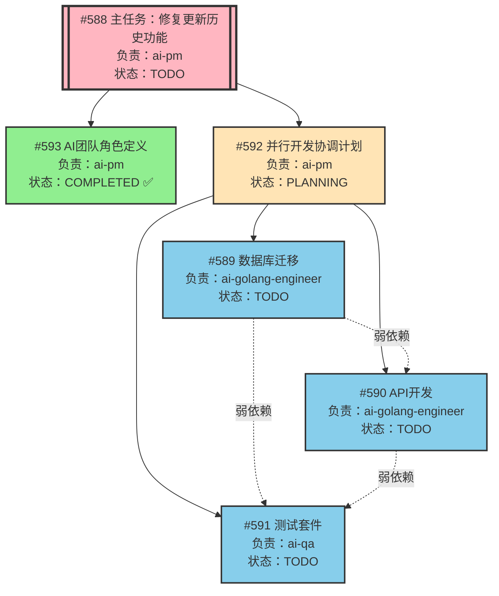
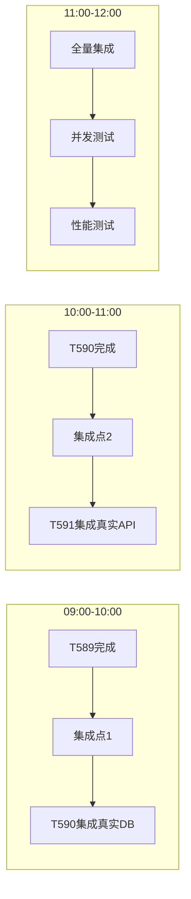

# 任务依赖关系与并行开发方案

## 任务依赖关系图



## 任务依赖矩阵

| 任务ID | 任务名称 | 前置依赖 | 后续任务 | 可并行任务 | 依赖类型 |
|--------|---------|----------|----------|------------|----------|
| #588 | 主任务 | 无 | #592, #593 | - | 父任务 |
| #593 | AI团队定义 | #588 | #592 | - | 强依赖（已完成） |
| #592 | 协调计划 | #588, #593 | #589, #590, #591 | - | 强依赖 |
| #589 | 数据库迁移 | #592 | - | #590, #591 | 独立执行 |
| #590 | API开发 | #592 | - | #589, #591 | 弱依赖#589 |
| #591 | 测试套件 | #592 | - | #589, #590 | 弱依赖#589,#590 |

## 并行开发时间线

```mermaid
gantt
    title 任务执行甘特图
    dateFormat HH:mm
    axisFormat %H:%M
    
    section 准备阶段
    #593 AI团队定义    :done, t593, 00:00, 30m
    #592 协调计划       :active, t592, 00:30, 1h
    
    section 并行开发Day1
    #589 数据库迁移设计 :t589a, 01:30, 3h
    #590 API接口设计    :t590a, 01:30, 3h
    #591 测试框架搭建   :t591a, 01:30, 3h
    
    #589 迁移脚本实现   :t589b, 04:30, 3h
    #590 Mock API实现   :t590b, 04:30, 3h
    #591 单元测试编写   :t591b, 04:30, 3h
    
    section 并行开发Day2
    #589 部署验证       :t589c, 07:30, 2h
    #590 真实DB集成     :t590c, 09:30, 3h
    #591 集成测试       :t591c, 09:30, 3h
    
    section 集成阶段
    全量集成测试        :t_int, 12:30, 2h
    性能优化           :t_opt, 14:30, 1h
    验收               :milestone, 15:30, 30m
```



## 并行开发方案

### Phase 0: 准备阶段（已完成）
- ✅ #593 AI团队角色定义（已完成）
- 🔄 #592 并行开发协调计划（进行中）

### Phase 1: 并行启动（Day 1 上午）
三个任务同时开始，各自独立进行：

#### Track A: 数据库层（#589）
- **执行者**: ai-golang-engineer
- **时间**: 3小时
- **输出**: 
  - 迁移脚本 SQL
  - Go migrate 工具集成
  - 部署到测试环境

#### Track B: API层（#590）
- **执行者**: ai-golang-engineer（另一实例）
- **时间**: 3小时
- **输出**:
  - Mock Repository 实现
  - Service 层完整实现
  - HTTP Handler

#### Track C: 测试层（#591）
- **执行者**: ai-qa
- **时间**: 3小时
- **输出**:
  - 测试框架搭建
  - 单元测试模板
  - 测试数据生成器

### Phase 2: 独立实现（Day 1 下午）
继续并行开发，使用Mock解耦：

```yaml
并行执行策略:
  T589:
    使用: 独立Postgres容器
    不依赖: 其他任务
    输出: 已部署的数据库架构
    
  T590:
    使用: MockTaskVersionRepository
    不依赖: T589的真实数据库
    输出: 可运行的API服务
    
  T591:
    使用: sqlmock, 测试数据生成器
    不依赖: T589, T590的真实实现
    输出: 完整测试套件
```

### Phase 3: 渐进集成（Day 2 上午）



### Phase 4: 验收阶段（Day 2 下午）
- 13:00-14:00: 全量回归测试
- 14:00-15:00: 性能优化
- 15:00-15:30: 最终验收

## 关键并行点

### 1. 完全并行（无依赖）
```
T589 ←→ T590 ←→ T591
各自独立开发，通过接口契约协调
```

### 2. Mock解耦策略
```go
// T590 使用 Mock，不等待 T589
if useRealDB {
    repo = NewTaskVersionRepository(db)
} else {
    repo = NewMockTaskVersionRepository()
}

// T591 使用 sqlmock，不等待 T589/T590
db, mock, _ := sqlmock.New()
// 设置期望行为进行测试
```

### 3. 渐进式集成
```
Step 1: T589 完成 → 提供真实DB
Step 2: T590 切换到真实DB → 提供真实API
Step 3: T591 切换到真实环境 → 执行集成测试
```

## 风险缓解措施

| 风险点 | 缓解措施 | 负责人 |
|-------|---------|--------|
| 接口不匹配 | 预定义接口契约文件 | ai-pm |
| 数据库延迟 | Mock优先开发 | ai-golang-engineer |
| 集成冲突 | 每4小时同步一次 | 全员 |
| 性能不达标 | 预留Day2下午优化 | ai-golang-engineer |

## 并行执行命令

```bash
# Terminal 1: 数据库迁移
ai-golang-engineer execute --task=589 --mode=parallel

# Terminal 2: API开发
ai-golang-engineer execute --task=590 --mode=parallel --use-mock

# Terminal 3: 测试开发
ai-qa execute --task=591 --mode=parallel --use-mock

# Terminal 4: 监控进度
ai-pm monitor --tasks=589,590,591 --interval=30m
```

## 成功标准

### 里程碑检查点
- [ ] M1 (4h): 所有Mock实现完成
- [ ] M2 (8h): 独立功能测试通过
- [ ] M3 (12h): 集成测试通过
- [ ] M4 (14h): 性能测试达标
- [ ] M5 (16h): 完整交付

### KPI指标
- 并行度: ≥ 80%
- 阻塞时间: < 10%
- 返工率: < 5%
- 测试覆盖率: > 80%
- 性能指标: 1000版本查询 < 100ms
