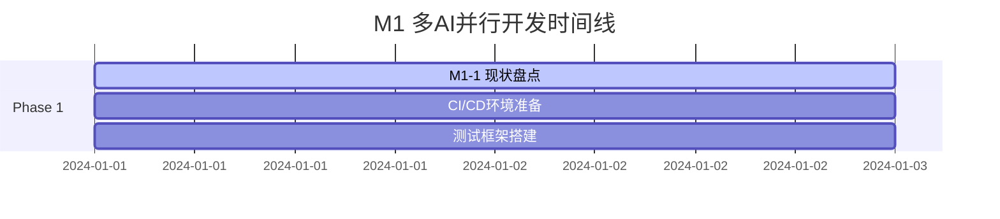
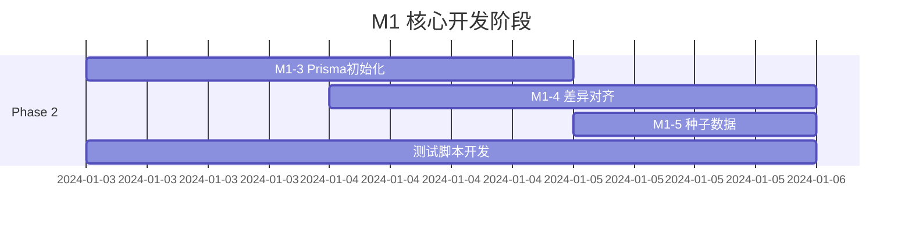
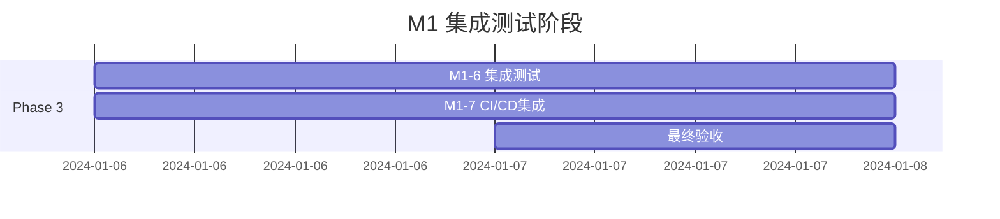

# 多AI并行开发方案：M1数据模型与迁移脚本

## 1. 项目概览

**主任务**：M1：数据模型与迁移脚本（Prisma 初始化与对现有表的对齐）
**任务ID**：523
**状态**：待执行
**优先级**：高
**子任务数量**：6个

## 2. 并行开发架构设计

### 2.1 AI角色分工

#### 🤖 AI-架构师 (Architecture AI)
**职责**：
- 整体架构设计与决策
- 数据模型规范制定
- 技术选型与标准化
- 跨模块依赖关系梳理

**负责子任务**：
- M1-1：现状盘点与对齐准则
- M1-3：Prisma 初始化与基线迁移（架构部分）

#### 🤖 AI-数据库专家 (Database AI)
**职责**：
- 数据库设计与优化
- 迁移脚本编写
- 数据完整性验证
- 性能优化建议

**负责子任务**：
- M1-3：Prisma 初始化与基线迁移（实现部分）
- M1-4：差异对齐与增量迁移
- M1-5：种子数据与生成脚本（可选）

#### 🤖 AI-测试工程师 (Testing AI)
**职责**：
- 测试策略设计
- 自动化测试脚本
- 验收标准制定
- 质量保证

**负责子任务**：
- M1-6：测试与验收（空库/旧库/集成）

#### 🤖 AI-DevOps工程师 (DevOps AI)
**职责**：
- CI/CD流水线设计
- Docker容器化
- Jenkins配置
- 部署自动化

**负责子任务**：
- M1-7：CI/CD 集成（Jenkins Docker agent）

## 3. 并行开发时间线

### Phase 1：基础准备阶段（第1-2天）

**并行执行任务**：



**AI-架构师**：
- 执行现状盘点与对齐准则分析
- 制定数据模型设计规范
- 定义接口标准和命名约定

**AI-DevOps工程师**：
- 准备Jenkins Docker环境
- 配置基础CI/CD框架
- 设置代码仓库和分支策略

**AI-测试工程师**：
- 搭建测试环境框架
- 准备测试数据集
- 设计测试用例模板

### Phase 2：核心开发阶段（第3-5天）



**AI-数据库专家**：
- 实现Prisma初始化脚本
- 开发差异对齐算法
- 创建种子数据生成器

**AI-测试工程师**：
- 并行开发测试脚本
- 实现自动化验证流程
- 准备多环境测试场景

### Phase 3：集成测试阶段（第6-7天）



## 4. 协作机制

### 4.1 通信协议

**每日同步会议**：
- 时间：每天上午9:00
- 参与者：所有AI角色
- 内容：进度同步、问题讨论、依赖关系确认

**实时协作渠道**：
- 代码审查：通过Git Pull Request
- 问题讨论：通过项目Issue跟踪
- 文档共享：通过共享文档系统

### 4.2 质量控制

**Code Review流程**：
```
开发者提交 → 同行评审 → 架构师审批 → 合并主分支
```

**测试门槛**：
- 单元测试覆盖率 ≥ 80%
- 集成测试通过率 = 100%
- 性能测试符合预期

## 5. 技术栈与工具

### 5.1 开发环境

**数据库**：
- PostgreSQL（生产环境，遵循规则4）
- Docker PostgreSQL（开发环境，遵循规则1）

**框架与工具**：
- Prisma ORM
- Node.js/TypeScript
- Jest（测试框架）
- Docker
- Jenkins（Docker-based agent，遵循规则2）

### 5.2 分支策略

```
master
├── develop
│   ├── feature/m1-1-assessment
│   ├── feature/m1-3-prisma-init
│   ├── feature/m1-4-migration
│   ├── feature/m1-5-seed-data
│   ├── feature/m1-6-testing
│   └── feature/m1-7-cicd
```

## 6. 风险管控

### 6.1 技术风险

**风险点1：数据库兼容性**
- 影响：高
- 缓解措施：提前进行兼容性测试，准备回滚方案

**风险点2：迁移数据丢失**
- 影响：高
- 缓解措施：完整备份策略，分阶段迁移验证

**风险点3：性能瓶颈**
- 影响：中
- 缓解措施：性能基准测试，索引优化

### 6.2 协作风险

**风险点1：AI间通信延迟**
- 影响：中
- 缓解措施：建立异步通信机制，定义清晰接口

**风险点2：依赖关系冲突**
- 影响：中
- 缓解措施：依赖关系图可视化，提前识别阻塞点

## 7. 成功指标

### 7.1 技术指标

- ✅ Prisma初始化成功率：100%
- ✅ 数据迁移完整性：100%
- ✅ 测试覆盖率：≥80%
- ✅ 性能基准达标：响应时间<200ms

### 7.2 效率指标

- ✅ 并行开发效率提升：≥50%
- ✅ 代码冲突率：<5%
- ✅ 返工率：<10%
- ✅ 按时交付率：100%

## 8. 交付物清单

### 8.1 代码交付物

- [ ] Prisma schema文件
- [ ] 数据库迁移脚本
- [ ] 种子数据生成器
- [ ] 测试套件（单元测试+集成测试）
- [ ] CI/CD配置文件

### 8.2 文档交付物

- [ ] 数据模型设计文档
- [ ] 迁移操作手册
- [ ] 测试报告
- [ ] 部署指南
- [ ] 故障排查手册

## 9. 后续优化建议

### 9.1 性能优化

- 数据库索引优化
- 查询性能调优
- 连接池配置优化

### 9.2 扩展性考虑

- 支持多数据库类型
- 分布式数据库支持
- 微服务架构适配

## 10. 总结

本多AI并行开发方案通过角色分工、时间并行、质量控制等机制，预期能够：

1. **提升开发效率**：并行开发减少50%的总开发时间
2. **保证代码质量**：多重审查机制确保高质量交付
3. **降低协作风险**：清晰的接口定义和通信协议
4. **符合规范要求**：遵循用户的技术栈偏好和环境规则

按照此方案执行，M1里程碑预期能够在7天内高质量完成，为后续开发阶段奠定坚实基础。

---

## 附录：任务分配详情

### AI-架构师工作详单

**M1-1：现状盘点与对齐准则**
1. 分析现有数据库结构
2. 识别数据表关系和约束
3. 制定命名规范和设计原则
4. 创建数据模型规范文档

**M1-3：Prisma 初始化（架构部分）**
1. 设计Prisma schema结构
2. 定义模型关系映射
3. 制定迁移策略方案
4. 审查技术实现方案

### AI-数据库专家工作详单

**M1-3：Prisma 初始化（实现部分）**
1. 编写Prisma schema定义
2. 创建初始迁移脚本
3. 实现数据类型映射
4. 验证schema完整性

**M1-4：差异对齐与增量迁移**
1. 对比现有库与新schema差异
2. 生成增量迁移脚本
3. 处理数据转换逻辑
4. 实现回滚机制

**M1-5：种子数据与生成脚本**
1. 设计测试数据模板
2. 编写数据生成器
3. 创建种子数据脚本
4. 验证数据完整性

### AI-测试工程师工作详单

**M1-6：测试与验收**
1. 设计测试策略和用例
2. 实现单元测试套件
3. 开发集成测试脚本
4. 执行多环境验证测试
5. 生成测试报告

### AI-DevOps工程师工作详单

**M1-7：CI/CD 集成**
1. 配置Jenkins Docker环境
2. 设置自动化构建流程
3. 集成测试执行管道
4. 配置部署自动化脚本
5. 监控和告警设置
