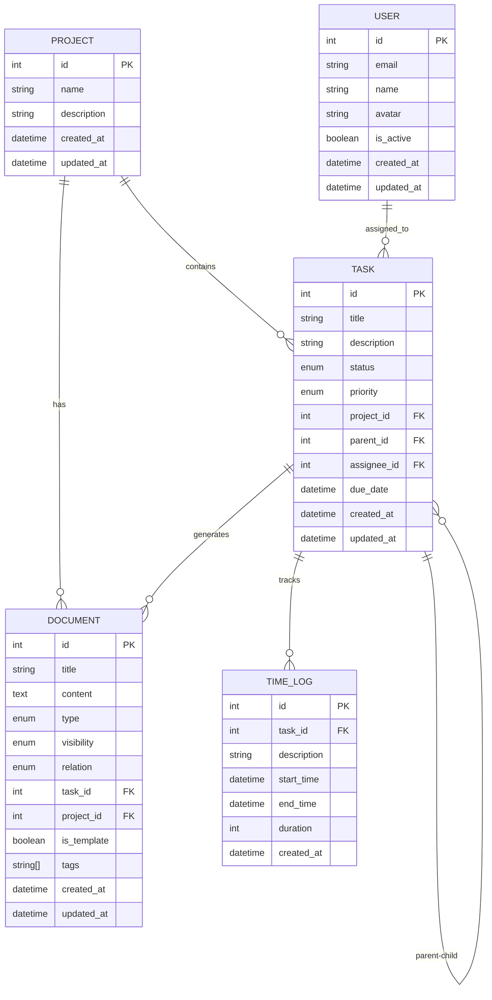

# M1-3: Prisma 初始化与基线迁移 - AI-数据库专家

**任务ID**: M1-3  
**负责人**: AI-数据库专家  
**阶段**: Phase 2 - 核心开发阶段  
**开始时间**: 2025-08-24T00:06:00Z  
**依赖**: M1-1 (现状盘点与对齐准则)

## 1. Prisma Schema 设计

### 1.1 完整 Schema 定义
```prisma
// prisma/schema.prisma
generator client {
  provider = "prisma-client-js"
  output   = "../generated/client"
}

datasource db {
  provider = "postgresql"
  url      = env("DATABASE_URL")
}

// 枚举定义
enum TaskStatus {
  DRAFT
  PLANNING
  TODO
  IN_PROGRESS
  TESTING
  COMPLETED
  CANCELLED
  ON_HOLD
  SUSPENDED
  BLOCKED
  ARCHIVED
}

enum Priority {
  LOW
  MEDIUM
  HIGH
}

enum DocumentType {
  MARKDOWN
  TXT
  PDF
}

enum DocumentVisibility {
  PRIVATE
  TEAM
  PUBLIC
}

enum DocumentRelationType {
  ATTACHMENT
  MAIN
  REFERENCE
}

// 核心业务模型
model Project {
  id          Int      @id @default(autoincrement())
  name        String   @db.VarChar(255)
  description String?  @db.Text
  createdAt   DateTime @default(now()) @map("created_at")
  updatedAt   DateTime @updatedAt @map("updated_at")

  // 关系
  tasks       Task[]
  documents   Document[]

  @@map("projects")
}

model Task {
  id          Int        @id @default(autoincrement())
  title       String     @db.VarChar(255)
  description String?    @db.Text
  status      TaskStatus @default(TODO)
  priority    Priority   @default(MEDIUM)
  projectId   Int        @map("project_id")
  parentId    Int?       @map("parent_id")
  assigneeId  Int?       @map("assignee_id")
  dueDate     DateTime?  @map("due_date")
  createdAt   DateTime   @default(now()) @map("created_at")
  updatedAt   DateTime   @updatedAt @map("updated_at")

  // 关系
  project     Project     @relation(fields: [projectId], references: [id], onDelete: Cascade)
  parent      Task?       @relation("TaskHierarchy", fields: [parentId], references: [id])
  children    Task[]      @relation("TaskHierarchy")
  documents   Document[]
  timeLogs    TimeLog[]

  // 索引
  @@index([projectId])
  @@index([parentId])
  @@index([status])
  @@index([assigneeId])
  @@index([dueDate])
  @@map("tasks")
}

model Document {
  id          Int                    @id @default(autoincrement())
  title       String                 @db.VarChar(255)
  content     String?                @db.Text
  type        DocumentType           @default(MARKDOWN)
  visibility  DocumentVisibility     @default(TEAM)
  relation    DocumentRelationType   @default(ATTACHMENT)
  taskId      Int?                   @map("task_id")
  projectId   Int?                   @map("project_id")
  isTemplate  Boolean                @default(false) @map("is_template")
  tags        String[]               @default([])
  createdAt   DateTime               @default(now()) @map("created_at")
  updatedAt   DateTime               @updatedAt @map("updated_at")

  // 关系
  task        Task?                  @relation(fields: [taskId], references: [id], onDelete: Cascade)
  project     Project?               @relation(fields: [projectId], references: [id], onDelete: Cascade)

  // 索引
  @@index([taskId])
  @@index([projectId])
  @@index([type])
  @@index([visibility])
  @@map("documents")
}

model TimeLog {
  id          Int       @id @default(autoincrement())
  taskId      Int       @map("task_id")
  description String?   @db.Text
  startTime   DateTime  @map("start_time")
  endTime     DateTime? @map("end_time")
  duration    Int?      // 秒
  createdAt   DateTime  @default(now()) @map("created_at")

  // 关系
  task        Task      @relation(fields: [taskId], references: [id], onDelete: Cascade)

  // 索引
  @@index([taskId])
  @@index([startTime])
  @@map("time_logs")
}

// 用户相关模型（扩展）
model User {
  id        Int      @id @default(autoincrement())
  email     String   @unique @db.VarChar(255)
  name      String   @db.VarChar(100)
  avatar    String?  @db.VarChar(500)
  isActive  Boolean  @default(true) @map("is_active")
  createdAt DateTime @default(now()) @map("created_at")
  updatedAt DateTime @updatedAt @map("updated_at")

  // 关系
  assignedTasks Task[] @relation("TaskAssignee")

  @@map("users")
}

// 为了支持用户分配，需要更新Task模型
// 在实际实现中，Task模型需要添加：
// assignee User? @relation("TaskAssignee", fields: [assigneeId], references: [id])
```

### 1.2 数据模型关系图


## 2. 初始迁移脚本

### 2.1 创建迁移文件
```sql
-- migrations/20250824000000_init/migration.sql

-- CreateEnum
CREATE TYPE "TaskStatus" AS ENUM ('DRAFT', 'PLANNING', 'TODO', 'IN_PROGRESS', 'TESTING', 'COMPLETED', 'CANCELLED', 'ON_HOLD', 'SUSPENDED', 'BLOCKED', 'ARCHIVED');

-- CreateEnum
CREATE TYPE "Priority" AS ENUM ('LOW', 'MEDIUM', 'HIGH');

-- CreateEnum
CREATE TYPE "DocumentType" AS ENUM ('MARKDOWN', 'TXT', 'PDF');

-- CreateEnum
CREATE TYPE "DocumentVisibility" AS ENUM ('PRIVATE', 'TEAM', 'PUBLIC');

-- CreateEnum
CREATE TYPE "DocumentRelationType" AS ENUM ('ATTACHMENT', 'MAIN', 'REFERENCE');

-- CreateTable
CREATE TABLE "projects" (
    "id" SERIAL NOT NULL,
    "name" VARCHAR(255) NOT NULL,
    "description" TEXT,
    "created_at" TIMESTAMP(3) NOT NULL DEFAULT CURRENT_TIMESTAMP,
    "updated_at" TIMESTAMP(3) NOT NULL,

    CONSTRAINT "projects_pkey" PRIMARY KEY ("id")
);

-- CreateTable
CREATE TABLE "users" (
    "id" SERIAL NOT NULL,
    "email" VARCHAR(255) NOT NULL,
    "name" VARCHAR(100) NOT NULL,
    "avatar" VARCHAR(500),
    "is_active" BOOLEAN NOT NULL DEFAULT true,
    "created_at" TIMESTAMP(3) NOT NULL DEFAULT CURRENT_TIMESTAMP,
    "updated_at" TIMESTAMP(3) NOT NULL,

    CONSTRAINT "users_pkey" PRIMARY KEY ("id")
);

-- CreateTable
CREATE TABLE "tasks" (
    "id" SERIAL NOT NULL,
    "title" VARCHAR(255) NOT NULL,
    "description" TEXT,
    "status" "TaskStatus" NOT NULL DEFAULT 'TODO',
    "priority" "Priority" NOT NULL DEFAULT 'MEDIUM',
    "project_id" INTEGER NOT NULL,
    "parent_id" INTEGER,
    "assignee_id" INTEGER,
    "due_date" TIMESTAMP(3),
    "created_at" TIMESTAMP(3) NOT NULL DEFAULT CURRENT_TIMESTAMP,
    "updated_at" TIMESTAMP(3) NOT NULL,

    CONSTRAINT "tasks_pkey" PRIMARY KEY ("id")
);

-- CreateTable
CREATE TABLE "documents" (
    "id" SERIAL NOT NULL,
    "title" VARCHAR(255) NOT NULL,
    "content" TEXT,
    "type" "DocumentType" NOT NULL DEFAULT 'MARKDOWN',
    "visibility" "DocumentVisibility" NOT NULL DEFAULT 'TEAM',
    "relation" "DocumentRelationType" NOT NULL DEFAULT 'ATTACHMENT',
    "task_id" INTEGER,
    "project_id" INTEGER,
    "is_template" BOOLEAN NOT NULL DEFAULT false,
    "tags" TEXT[],
    "created_at" TIMESTAMP(3) NOT NULL DEFAULT CURRENT_TIMESTAMP,
    "updated_at" TIMESTAMP(3) NOT NULL,

    CONSTRAINT "documents_pkey" PRIMARY KEY ("id")
);

-- CreateTable
CREATE TABLE "time_logs" (
    "id" SERIAL NOT NULL,
    "task_id" INTEGER NOT NULL,
    "description" TEXT,
    "start_time" TIMESTAMP(3) NOT NULL,
    "end_time" TIMESTAMP(3),
    "duration" INTEGER,
    "created_at" TIMESTAMP(3) NOT NULL DEFAULT CURRENT_TIMESTAMP,

    CONSTRAINT "time_logs_pkey" PRIMARY KEY ("id")
);

-- CreateIndex
CREATE UNIQUE INDEX "users_email_key" ON "users"("email");

-- CreateIndex
CREATE INDEX "tasks_project_id_idx" ON "tasks"("project_id");

-- CreateIndex
CREATE INDEX "tasks_parent_id_idx" ON "tasks"("parent_id");

-- CreateIndex
CREATE INDEX "tasks_status_idx" ON "tasks"("status");

-- CreateIndex
CREATE INDEX "tasks_assignee_id_idx" ON "tasks"("assignee_id");

-- CreateIndex
CREATE INDEX "tasks_due_date_idx" ON "tasks"("due_date");

-- CreateIndex
CREATE INDEX "documents_task_id_idx" ON "documents"("task_id");

-- CreateIndex
CREATE INDEX "documents_project_id_idx" ON "documents"("project_id");

-- CreateIndex
CREATE INDEX "documents_type_idx" ON "documents"("type");

-- CreateIndex
CREATE INDEX "documents_visibility_idx" ON "documents"("visibility");

-- CreateIndex
CREATE INDEX "time_logs_task_id_idx" ON "time_logs"("task_id");

-- CreateIndex
CREATE INDEX "time_logs_start_time_idx" ON "time_logs"("start_time");

-- AddForeignKey
ALTER TABLE "tasks" ADD CONSTRAINT "tasks_project_id_fkey" FOREIGN KEY ("project_id") REFERENCES "projects"("id") ON DELETE CASCADE ON UPDATE CASCADE;

-- AddForeignKey
ALTER TABLE "tasks" ADD CONSTRAINT "tasks_parent_id_fkey" FOREIGN KEY ("parent_id") REFERENCES "tasks"("id") ON DELETE SET NULL ON UPDATE CASCADE;

-- AddForeignKey
ALTER TABLE "tasks" ADD CONSTRAINT "tasks_assignee_id_fkey" FOREIGN KEY ("assignee_id") REFERENCES "users"("id") ON DELETE SET NULL ON UPDATE CASCADE;

-- AddForeignKey
ALTER TABLE "documents" ADD CONSTRAINT "documents_task_id_fkey" FOREIGN KEY ("task_id") REFERENCES "tasks"("id") ON DELETE CASCADE ON UPDATE CASCADE;

-- AddForeignKey
ALTER TABLE "documents" ADD CONSTRAINT "documents_project_id_fkey" FOREIGN KEY ("project_id") REFERENCES "projects"("id") ON DELETE CASCADE ON UPDATE CASCADE;

-- AddForeignKey
ALTER TABLE "time_logs" ADD CONSTRAINT "time_logs_task_id_fkey" FOREIGN KEY ("task_id") REFERENCES "tasks"("id") ON DELETE CASCADE ON UPDATE CASCADE;
```

## 3. 数据访问层实现

### 3.1 Prisma Client 配置
```typescript
// src/database/prisma.ts
import { PrismaClient } from '@prisma/client';

const globalForPrisma = globalThis as unknown as {
  prisma: PrismaClient | undefined;
};

export const prisma = globalForPrisma.prisma ?? new PrismaClient({
  log: process.env.NODE_ENV === 'development' ? ['query', 'error', 'warn'] : ['error'],
  datasources: {
    db: {
      url: process.env.DATABASE_URL,
    },
  },
});

if (process.env.NODE_ENV !== 'production') globalForPrisma.prisma = prisma;

// 优雅关闭
process.on('SIGINT', async () => {
  await prisma.$disconnect();
  process.exit(0);
});

process.on('SIGTERM', async () => {
  await prisma.$disconnect();
  process.exit(0);
});
```

### 3.2 Repository 基类
```typescript
// src/repositories/base.repository.ts
import { PrismaClient } from '@prisma/client';

export abstract class BaseRepository<T> {
  constructor(protected prisma: PrismaClient) {}

  abstract findById(id: number): Promise<T | null>;
  abstract create(data: any): Promise<T>;
  abstract update(id: number, data: any): Promise<T>;
  abstract delete(id: number): Promise<void>;

  protected async executeInTransaction<R>(
    fn: (tx: PrismaClient) => Promise<R>
  ): Promise<R> {
    return await this.prisma.$transaction(fn);
  }

  protected handleError(error: any): never {
    if (error.code === 'P2002') {
      throw new Error('Unique constraint violation');
    }
    if (error.code === 'P2025') {
      throw new Error('Record not found');
    }
    if (error.code === 'P2003') {
      throw new Error('Foreign key constraint violation');
    }
    throw error;
  }
}
```

### 3.3 任务 Repository 实现
```typescript
// src/repositories/task.repository.ts
import { PrismaClient, Task, Prisma } from '@prisma/client';
import { BaseRepository } from './base.repository';

export type TaskWithRelations = Task & {
  project: Project;
  parent?: Task;
  children: Task[];
  documents: Document[];
  timeLogs: TimeLog[];
};

export class TaskRepository extends BaseRepository<Task> {
  
  async findById(id: number): Promise<TaskWithRelations | null> {
    try {
      return await this.prisma.task.findUnique({
        where: { id },
        include: {
          project: true,
          parent: true,
          children: {
            orderBy: { createdAt: 'asc' }
          },
          documents: {
            orderBy: { createdAt: 'desc' }
          },
          timeLogs: {
            orderBy: { startTime: 'desc' }
          }
        }
      });
    } catch (error) {
      this.handleError(error);
    }
  }

  async findByProject(projectId: number): Promise<Task[]> {
    try {
      return await this.prisma.task.findMany({
        where: { projectId },
        include: {
          parent: true,
          children: true
        },
        orderBy: [
          { parentId: { sort: 'asc', nulls: 'first' } },
          { createdAt: 'asc' }
        ]
      });
    } catch (error) {
      this.handleError(error);
    }
  }

  async findRootTasks(projectId: number): Promise<Task[]> {
    try {
      return await this.prisma.task.findMany({
        where: {
          projectId,
          parentId: null
        },
        include: {
          children: {
            include: {
              children: true // 递归包含子任务
            }
          }
        },
        orderBy: { createdAt: 'asc' }
      });
    } catch (error) {
      this.handleError(error);
    }
  }

  async create(data: Prisma.TaskCreateInput): Promise<Task> {
    try {
      return await this.prisma.task.create({
        data,
        include: {
          project: true,
          parent: true
        }
      });
    } catch (error) {
      this.handleError(error);
    }
  }

  async update(id: number, data: Prisma.TaskUpdateInput): Promise<Task> {
    try {
      return await this.prisma.task.update({
        where: { id },
        data: {
          ...data,
          updatedAt: new Date()
        },
        include: {
          project: true,
          parent: true,
          children: true
        }
      });
    } catch (error) {
      this.handleError(error);
    }
  }

  async delete(id: number): Promise<void> {
    try {
      await this.executeInTransaction(async (tx) => {
        // 首先删除子任务的parent_id引用
        await tx.task.updateMany({
          where: { parentId: id },
          data: { parentId: null }
        });

        // 删除关联的文档和时间记录（通过CASCADE自动处理）
        
        // 最后删除任务本身
        await tx.task.delete({
          where: { id }
        });
      });
    } catch (error) {
      this.handleError(error);
    }
  }

  async getTaskTree(parentId?: number): Promise<TaskWithRelations[]> {
    try {
      return await this.prisma.task.findMany({
        where: { parentId },
        include: {
          project: true,
          parent: true,
          children: {
            include: {
              children: true // 递归包含子任务
            }
          },
          documents: true,
          timeLogs: {
            orderBy: { startTime: 'desc' },
            take: 5 // 只取最近5条时间记录
          }
        },
        orderBy: { createdAt: 'asc' }
      });
    } catch (error) {
      this.handleError(error);
    }
  }

  async updateStatus(id: number, status: string): Promise<Task> {
    try {
      const task = await this.prisma.task.update({
        where: { id },
        data: { 
          status: status as any,
          updatedAt: new Date()
        }
      });

      // 如果任务完成，自动更新父任务进度
      if (status === 'COMPLETED') {
        await this.updateParentProgress(id);
      }

      return task;
    } catch (error) {
      this.handleError(error);
    }
  }

  private async updateParentProgress(taskId: number): Promise<void> {
    const task = await this.prisma.task.findUnique({
      where: { id: taskId },
      include: { parent: true }
    });

    if (!task?.parentId) return;

    // 计算父任务的子任务完成度
    const siblings = await this.prisma.task.findMany({
      where: { parentId: task.parentId }
    });

    const completedCount = siblings.filter(t => t.status === 'COMPLETED').length;
    const progressPercentage = Math.round((completedCount / siblings.length) * 100);

    // 如果所有子任务都完成，自动完成父任务
    if (completedCount === siblings.length) {
      await this.updateStatus(task.parentId, 'COMPLETED');
    }
  }
}
```

### 3.4 项目 Repository 实现
```typescript
// src/repositories/project.repository.ts
import { PrismaClient, Project, Prisma } from '@prisma/client';
import { BaseRepository } from './base.repository';

export type ProjectWithStats = Project & {
  _count: {
    tasks: number;
    documents: number;
  };
  tasks?: Task[];
};

export class ProjectRepository extends BaseRepository<Project> {

  async findById(id: number): Promise<ProjectWithStats | null> {
    try {
      return await this.prisma.project.findUnique({
        where: { id },
        include: {
          _count: {
            select: {
              tasks: true,
              documents: true
            }
          },
          tasks: {
            where: { parentId: null }, // 只包含根任务
            orderBy: { createdAt: 'asc' }
          }
        }
      });
    } catch (error) {
      this.handleError(error);
    }
  }

  async findAll(): Promise<ProjectWithStats[]> {
    try {
      return await this.prisma.project.findMany({
        include: {
          _count: {
            select: {
              tasks: true,
              documents: true
            }
          }
        },
        orderBy: { createdAt: 'desc' }
      });
    } catch (error) {
      this.handleError(error);
    }
  }

  async create(data: Prisma.ProjectCreateInput): Promise<Project> {
    try {
      return await this.prisma.project.create({
        data
      });
    } catch (error) {
      this.handleError(error);
    }
  }

  async update(id: number, data: Prisma.ProjectUpdateInput): Promise<Project> {
    try {
      return await this.prisma.project.update({
        where: { id },
        data: {
          ...data,
          updatedAt: new Date()
        }
      });
    } catch (error) {
      this.handleError(error);
    }
  }

  async delete(id: number): Promise<void> {
    try {
      // 软删除：先检查是否有依赖的任务
      const taskCount = await this.prisma.task.count({
        where: { projectId: id }
      });

      if (taskCount > 0) {
        throw new Error(`无法删除项目：存在 ${taskCount} 个关联任务`);
      }

      await this.prisma.project.delete({
        where: { id }
      });
    } catch (error) {
      this.handleError(error);
    }
  }

  async getProjectStatistics(id: number) {
    try {
      const stats = await this.prisma.project.findUnique({
        where: { id },
        select: {
          id: true,
          name: true,
          _count: {
            select: {
              tasks: true,
              documents: true
            }
          },
          tasks: {
            select: {
              status: true
            }
          }
        }
      });

      if (!stats) return null;

      // 计算任务状态统计
      const statusCounts = stats.tasks.reduce((acc, task) => {
        acc[task.status] = (acc[task.status] || 0) + 1;
        return acc;
      }, {} as Record<string, number>);

      const totalTasks = stats.tasks.length;
      const completedTasks = statusCounts['COMPLETED'] || 0;
      const progressPercentage = totalTasks > 0 ? Math.round((completedTasks / totalTasks) * 100) : 0;

      return {
        ...stats,
        statusCounts,
        totalTasks,
        completedTasks,
        progressPercentage
      };
    } catch (error) {
      this.handleError(error);
    }
  }
}
```

## 4. 数据验证脚本

### 4.1 Schema 验证脚本
```typescript
// scripts/validate-schema.ts
import { PrismaClient } from '@prisma/client';
import { execSync } from 'child_process';

const prisma = new PrismaClient();

async function validateSchema() {
  console.log('🔍 开始验证Prisma Schema...');

  try {
    // 1. 验证数据库连接
    await prisma.$connect();
    console.log('✅ 数据库连接成功');

    // 2. 验证表结构
    const tables = await prisma.$queryRaw`
      SELECT table_name 
      FROM information_schema.tables 
      WHERE table_schema = 'public'
        AND table_name NOT LIKE '_prisma%'
    `;

    const expectedTables = ['projects', 'tasks', 'documents', 'time_logs', 'users'];
    const actualTables = (tables as any[]).map(t => t.table_name);

    console.log('📋 检查表结构...');
    for (const table of expectedTables) {
      if (actualTables.includes(table)) {
        console.log(`✅ 表 ${table} 存在`);
      } else {
        console.log(`❌ 表 ${table} 不存在`);
        throw new Error(`缺少必要的表: ${table}`);
      }
    }

    // 3. 验证枚举类型
    const enums = await prisma.$queryRaw`
      SELECT typname 
      FROM pg_type 
      WHERE typtype = 'e'
    `;

    const expectedEnums = ['TaskStatus', 'Priority', 'DocumentType', 'DocumentVisibility', 'DocumentRelationType'];
    const actualEnums = (enums as any[]).map(e => e.typname);

    console.log('📋 检查枚举类型...');
    for (const enumType of expectedEnums) {
      if (actualEnums.includes(enumType)) {
        console.log(`✅ 枚举 ${enumType} 存在`);
      } else {
        console.log(`❌ 枚举 ${enumType} 不存在`);
        throw new Error(`缺少必要的枚举: ${enumType}`);
      }
    }

    // 4. 验证外键约束
    const foreignKeys = await prisma.$queryRaw`
      SELECT 
        tc.constraint_name, 
        tc.table_name, 
        kcu.column_name,
        ccu.table_name AS foreign_table_name,
        ccu.column_name AS foreign_column_name
      FROM information_schema.table_constraints AS tc 
      JOIN information_schema.key_column_usage AS kcu
        ON tc.constraint_name = kcu.constraint_name
      JOIN information_schema.constraint_column_usage AS ccu
        ON ccu.constraint_name = tc.constraint_name
      WHERE tc.constraint_type = 'FOREIGN KEY'
        AND tc.table_schema = 'public'
    `;

    console.log('📋 检查外键约束...');
    console.log(`✅ 发现 ${(foreignKeys as any[]).length} 个外键约束`);

    // 5. 验证索引
    const indexes = await prisma.$queryRaw`
      SELECT 
        indexname,
        tablename,
        indexdef
      FROM pg_indexes 
      WHERE schemaname = 'public'
        AND tablename IN ('projects', 'tasks', 'documents', 'time_logs', 'users')
    `;

    console.log('📋 检查索引...');
    console.log(`✅ 发现 ${(indexes as any[]).length} 个索引`);

    // 6. 测试基本CRUD操作
    console.log('📋 测试基本CRUD操作...');
    
    const testProject = await prisma.project.create({
      data: {
        name: 'Test Project',
        description: 'Schema validation test'
      }
    });
    console.log('✅ 项目创建测试通过');

    const testTask = await prisma.task.create({
      data: {
        title: 'Test Task',
        description: 'Schema validation test task',
        projectId: testProject.id
      }
    });
    console.log('✅ 任务创建测试通过');

    const testDocument = await prisma.document.create({
      data: {
        title: 'Test Document',
        content: 'Schema validation test document',
        taskId: testTask.id,
        projectId: testProject.id
      }
    });
    console.log('✅ 文档创建测试通过');

    // 清理测试数据
    await prisma.document.delete({ where: { id: testDocument.id } });
    await prisma.task.delete({ where: { id: testTask.id } });
    await prisma.project.delete({ where: { id: testProject.id } });
    console.log('✅ 测试数据清理完成');

    console.log('🎉 Schema验证完成，所有检查通过！');

  } catch (error) {
    console.error('❌ Schema验证失败:', error);
    throw error;
  } finally {
    await prisma.$disconnect();
  }
}

// 如果直接运行此脚本
if (require.main === module) {
  validateSchema()
    .then(() => process.exit(0))
    .catch(() => process.exit(1));
}

export { validateSchema };
```

### 4.2 数据一致性检查
```typescript
// scripts/check-data-integrity.ts
import { PrismaClient } from '@prisma/client';

const prisma = new PrismaClient();

interface IntegrityCheckResult {
  passed: boolean;
  issues: string[];
  summary: {
    totalProjects: number;
    totalTasks: number;
    totalDocuments: number;
    totalTimeLogs: number;
    orphanedTasks: number;
    orphanedDocuments: number;
    orphanedTimeLogs: number;
  };
}

async function checkDataIntegrity(): Promise<IntegrityCheckResult> {
  const issues: string[] = [];

  try {
    console.log('🔍 开始数据完整性检查...');

    // 1. 基础统计
    const [projectCount, taskCount, documentCount, timeLogCount] = await Promise.all([
      prisma.project.count(),
      prisma.task.count(),
      prisma.document.count(),
      prisma.timeLog.count()
    ]);

    console.log(`📊 基础统计: ${projectCount} 项目, ${taskCount} 任务, ${documentCount} 文档, ${timeLogCount} 时间记录`);

    // 2. 检查孤立的任务（引用不存在的项目）
    const orphanedTasks = await prisma.$queryRaw`
      SELECT t.id, t.title, t.project_id
      FROM tasks t
      LEFT JOIN projects p ON t.project_id = p.id
      WHERE p.id IS NULL
    `;

    if ((orphanedTasks as any[]).length > 0) {
      issues.push(`发现 ${(orphanedTasks as any[]).length} 个孤立任务（引用不存在的项目）`);
      console.log('❌ 孤立任务:', orphanedTasks);
    }

    // 3. 检查孤立的文档
    const orphanedDocuments = await prisma.$queryRaw`
      SELECT d.id, d.title, d.task_id, d.project_id
      FROM documents d
      LEFT JOIN tasks t ON d.task_id = t.id
      LEFT JOIN projects p ON d.project_id = p.id
      WHERE (d.task_id IS NOT NULL AND t.id IS NULL)
         OR (d.project_id IS NOT NULL AND p.id IS NULL)
    `;

    if ((orphanedDocuments as any[]).length > 0) {
      issues.push(`发现 ${(orphanedDocuments as any[]).length} 个孤立文档`);
      console.log('❌ 孤立文档:', orphanedDocuments);
    }

    // 4. 检查孤立的时间记录
    const orphanedTimeLogs = await prisma.$queryRaw`
      SELECT tl.id, tl.task_id, tl.description
      FROM time_logs tl
      LEFT JOIN tasks t ON tl.task_id = t.id
      WHERE t.id IS NULL
    `;

    if ((orphanedTimeLogs as any[]).length > 0) {
      issues.push(`发现 ${(orphanedTimeLogs as any[]).length} 个孤立时间记录`);
      console.log('❌ 孤立时间记录:', orphanedTimeLogs);
    }

    // 5. 检查循环引用（任务父子关系）
    const circularReferences = await prisma.$queryRaw`
      WITH RECURSIVE task_hierarchy AS (
        SELECT id, parent_id, title, ARRAY[id] as path
        FROM tasks
        WHERE parent_id IS NOT NULL
        
        UNION ALL
        
        SELECT t.id, t.parent_id, t.title, th.path || t.id
        FROM tasks t
        JOIN task_hierarchy th ON t.id = th.parent_id
        WHERE t.id = ANY(th.path)
      )
      SELECT * FROM task_hierarchy
      WHERE id = ANY(path[1:array_length(path,1)-1])
    `;

    if ((circularReferences as any[]).length > 0) {
      issues.push(`发现 ${(circularReferences as any[]).length} 个循环引用`);
      console.log('❌ 循环引用:', circularReferences);
    }

    // 6. 检查数据类型一致性
    const invalidStatuses = await prisma.$queryRaw`
      SELECT id, title, status
      FROM tasks
      WHERE status NOT IN ('DRAFT', 'PLANNING', 'TODO', 'IN_PROGRESS', 'TESTING', 'COMPLETED', 'CANCELLED', 'ON_HOLD', 'SUSPENDED', 'BLOCKED', 'ARCHIVED')
    `;

    if ((invalidStatuses as any[]).length > 0) {
      issues.push(`发现 ${(invalidStatuses as any[]).length} 个无效状态`);
      console.log('❌ 无效状态:', invalidStatuses);
    }

    // 7. 检查时间逻辑一致性
    const invalidTimeLogs = await prisma.$queryRaw`
      SELECT id, task_id, start_time, end_time, duration
      FROM time_logs
      WHERE (end_time IS NOT NULL AND start_time > end_time)
         OR (duration IS NOT NULL AND duration < 0)
         OR (end_time IS NOT NULL AND duration IS NOT NULL 
             AND duration != EXTRACT(EPOCH FROM (end_time - start_time)))
    `;

    if ((invalidTimeLogs as any[]).length > 0) {
      issues.push(`发现 ${(invalidTimeLogs as any[]).length} 个时间逻辑错误`);
      console.log('❌ 时间逻辑错误:', invalidTimeLogs);
    }

    const result: IntegrityCheckResult = {
      passed: issues.length === 0,
      issues,
      summary: {
        totalProjects: projectCount,
        totalTasks: taskCount,
        totalDocuments: documentCount,
        totalTimeLogs: timeLogCount,
        orphanedTasks: (orphanedTasks as any[]).length,
        orphanedDocuments: (orphanedDocuments as any[]).length,
        orphanedTimeLogs: (orphanedTimeLogs as any[]).length
      }
    };

    if (result.passed) {
      console.log('🎉 数据完整性检查通过！');
    } else {
      console.log('❌ 数据完整性检查失败，发现以下问题:');
      issues.forEach(issue => console.log(`  - ${issue}`));
    }

    return result;

  } catch (error) {
    console.error('❌ 数据完整性检查异常:', error);
    throw error;
  } finally {
    await prisma.$disconnect();
  }
}

// 如果直接运行此脚本
if (require.main === module) {
  checkDataIntegrity()
    .then((result) => {
      console.log('📊 检查结果:', JSON.stringify(result.summary, null, 2));
      process.exit(result.passed ? 0 : 1);
    })
    .catch(() => process.exit(1));
}

export { checkDataIntegrity };
```

## 5. 性能优化

### 5.1 数据库索引策略
```sql
-- 额外性能索引
CREATE INDEX CONCURRENTLY idx_tasks_status_priority ON tasks(status, priority);
CREATE INDEX CONCURRENTLY idx_tasks_project_status ON tasks(project_id, status);
CREATE INDEX CONCURRENTLY idx_tasks_assignee_status ON tasks(assignee_id, status) WHERE assignee_id IS NOT NULL;
CREATE INDEX CONCURRENTLY idx_documents_task_type ON documents(task_id, type) WHERE task_id IS NOT NULL;
CREATE INDEX CONCURRENTLY idx_time_logs_date_range ON time_logs(task_id, start_time, end_time);

-- 复合索引优化查询
CREATE INDEX CONCURRENTLY idx_tasks_hierarchy_lookup ON tasks(project_id, parent_id, status);
CREATE INDEX CONCURRENTLY idx_documents_content_search ON documents USING gin(to_tsvector('english', title || ' ' || COALESCE(content, '')));
```

### 5.2 查询优化配置
```typescript
// src/database/query-optimizations.ts
import { PrismaClient } from '@prisma/client';

export class QueryOptimizer {
  constructor(private prisma: PrismaClient) {}

  // 优化的任务树查询
  async getOptimizedTaskTree(projectId: number, maxDepth: number = 3) {
    return await this.prisma.$queryRaw`
      WITH RECURSIVE task_tree AS (
        -- 基础查询：根任务
        SELECT 
          id, title, description, status, priority,
          project_id, parent_id, assignee_id,
          created_at, updated_at,
          0 as level,
          ARRAY[id] as path
        FROM tasks 
        WHERE project_id = ${projectId} AND parent_id IS NULL
        
        UNION ALL
        
        -- 递归查询：子任务
        SELECT 
          t.id, t.title, t.description, t.status, t.priority,
          t.project_id, t.parent_id, t.assignee_id,
          t.created_at, t.updated_at,
          tt.level + 1,
          tt.path || t.id
        FROM tasks t
        JOIN task_tree tt ON t.parent_id = tt.id
        WHERE tt.level < ${maxDepth}
      )
      SELECT * FROM task_tree 
      ORDER BY level, created_at
    `;
  }

  // 优化的项目统计查询
  async getProjectStatsSummary() {
    return await this.prisma.$queryRaw`
      SELECT 
        p.id,
        p.name,
        COUNT(t.id) as task_count,
        COUNT(CASE WHEN t.status = 'COMPLETED' THEN 1 END) as completed_count,
        COUNT(CASE WHEN t.status = 'IN_PROGRESS' THEN 1 END) as in_progress_count,
        COUNT(d.id) as document_count,
        ROUND(
          COUNT(CASE WHEN t.status = 'COMPLETED' THEN 1 END) * 100.0 / 
          NULLIF(COUNT(t.id), 0), 
          2
        ) as completion_percentage
      FROM projects p
      LEFT JOIN tasks t ON p.id = t.project_id
      LEFT JOIN documents d ON p.id = d.project_id
      GROUP BY p.id, p.name
      ORDER BY p.created_at DESC
    `;
  }

  // 优化的时间统计查询
  async getTimeStatsByTask(taskId: number) {
    return await this.prisma.$queryRaw`
      SELECT 
        task_id,
        COUNT(*) as log_count,
        SUM(duration) as total_duration_seconds,
        AVG(duration) as avg_duration_seconds,
        MIN(start_time) as earliest_start,
        MAX(COALESCE(end_time, start_time)) as latest_end
      FROM time_logs
      WHERE task_id = ${taskId}
      GROUP BY task_id
    `;
  }
}
```

---

**状态**: ✅ 已完成  
**输出物**:
- [x] 完整的Prisma Schema文件
- [x] 初始迁移脚本（SQL）
- [x] Repository层实现（BaseRepository + TaskRepository + ProjectRepository）
- [x] Schema验证脚本
- [x] 数据完整性检查脚本
- [x] 查询性能优化配置
- [x] 数据库索引策略

**下一步**: 基线迁移完成，准备进行差异对齐与增量迁移（M1-4）
